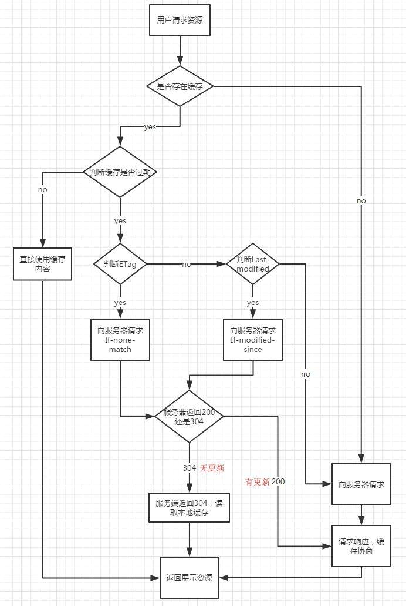

# 浏览器缓存机制 <!-- omit in toc -->

> Author: tinfengyee
> Date: 2022-11-01 17:14:49
> LastEditTime: 2022-11-01 17:21:42
> Description: NO Desc

## 小结：

基本的网络请求就是三个步骤：请求，处理，响应。后端缓存主要集中于“处理”步骤，而前端缓存则可以在剩下的两步：“请求”和“响应”中进行。在“请求”步骤中，浏览器也可以通过存储结果的方式直接使用资源，直接省去了发送请求；而“响应”步骤需要浏览器和服务器共同配合，通过减少响应内容来缩短传输时间。

按照失效策略分类，分为强制缓存(也叫强缓存)和协商缓存(也叫对比缓存)

- 强制缓存。当客户端请求后，会先访问浏览器浏览器缓存，如果存在缓存直接返回结果，而不用请求服务器了。控制强制缓存策略的两个字段是 `Cache-control` 和 `Expires`。

  - `Expires`：是 HTTP 1.0 的字段，表示缓存到期时间，是一个绝对的时间 (当前时间+缓存时间)。

  - `Cache-control` ：是 HTTP/1.1 中增加的一个字段，该字段表示资源缓存的最大有效时间，是相对时间。值可以取`max-age`，`no-store`，`no-cache`等。

  - >  `Cache-control` 的优先级高于 `Expires`。

- 协商缓存。当强制缓存失效(超过规定时间)时，就需要使用对比缓存，由服务器决定缓存内容是否失效。流程上说，浏览器先请求缓存数据库，返回一个缓存标识。之后浏览器拿这个标识和服务器通讯。如果缓存未失效，则返回 HTTP 状态码 304 表示继续使用，于是客户端继续使用缓存。

  > 对比缓存在请求数上和没有缓存是一致的，但如果是 304 的话，返回的仅仅是一个状态码而已，并没有实际的文件内容，因此 __在响应体体积上的节省是它的优化点__。对比缓存是可以和强制缓存一起使用的，作为在强制缓存失效后的一种后备方案。实际项目中他们也的确经常一同出现。

  控制强制缓存策略的 2 组字段(不是两个)是 `Last-Modified` /`If-Modified-Since`  和 `Etag` / `If-None-Match`。

  -  `Last-Modified` /`If-Modified-Since`：服务器通过 `Last-Modified` 字段告知客户端，资源最后一次被修改的时间。下一次请求相同资源时时，浏览器从自己的缓存中找出“不确定是否过期的”缓存。因此在请求头中将上次的 `Last-Modified` 的值写入到请求头的 `If-Modified-Since` 字段。服务器会将 `If-Modified-Since` 的值与 `Last-Modified` 字段进行对比。如果相等，则表示未修改，响应 304。

  - `Etag` / `If-None-Match`：`Etag` 存储的是文件的特殊标识(一般都是 hash 生成的)，服务器存储着文件的 `Etag` 字段。之后的流程和 `Last-Modified` 一致。

  - >  `Etag` 的优先级高于 `Last-Modified`

更详细查看 [一文读懂前端缓存] 和 [彻底理解浏览器的缓存机制]

(图片来自 https://mp.weixin.qq.com/s/rUbGSeIthEh0Fj-60j7Nzg)

## 参考链接

[彻底理解浏览器的缓存机制](https://heyingye.github.io/2018/04/16/%E5%BD%BB%E5%BA%95%E7%90%86%E8%A7%A3%E6%B5%8F%E8%A7%88%E5%99%A8%E7%9A%84%E7%BC%93%E5%AD%98%E6%9C%BA%E5%88%B6/)

[一文读懂前端缓存](https://juejin.cn/post/6844903747357769742)

[HTTP缓存机制](https://quincychen.cn/http-cache/)

[一文搞懂浏览器缓存机制](https://mp.weixin.qq.com/s/rUbGSeIthEh0Fj-60j7Nzg)