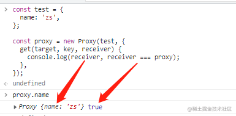
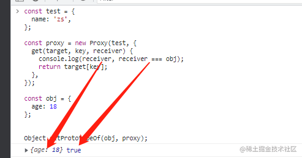

# 为什么Proxy一定要配合Reflect使用？ <!-- omit in toc -->

> Author: tinfengyee
> Date: 2022-12-03 19:18:47
> LastEditTime: 2022-12-03 19:18:54
> Description: NO Desc

## Proxy & Reflect

由于在 `Vue2` 中使用 `Object.defineProperty` 带来的缺陷，导致在 `Vue2` 中不得不提供了一些额外的方法（如：`Vue.set、Vue.delete()`）解决问题，而在 `Vue3` 中使用了 `Proxy` 的方式来实现 **数据劫持**，而上述的问题在 `Proxy` 中都可以得到解决。

### Proxy

[**`Proxy`**](https://link.juejin.cn?target=https%3A%2F%2Fdeveloper.mozilla.org%2Fzh-CN%2Fdocs%2FWeb%2FJavaScript%2FReference%2FGlobal_Objects%2FProxy) 主要用于创建一个 **对象的代理**，从而实现基本操作的拦截和自定义（如属性查找、赋值、枚举、函数调用等），本质上是通过拦截对象 **内部方法** 的执行实现代理，而对象本身根据规范定义的不同又会区分为 **常规对象** 和 **异质对象**（这不是重点，可自行了解）。

- **`new Proxy(target, handler)`** 是针对整个对象进行的代理，不是某个属性

- 代理对象属性拥有 

  读取、修改、删除、新增、是否存在属性

   等操作相应的捕捉器，

  - [`get()`](https://link.juejin.cn?target=https%3A%2F%2Fdeveloper.mozilla.org%2Fzh-CN%2Fdocs%2FWeb%2FJavaScript%2FReference%2FGlobal_Objects%2FProxy%2FProxy%2Fget) 属性 **读取** 操作的捕捉器
  - [`set()`](https://link.juejin.cn?target=https%3A%2F%2Fdeveloper.mozilla.org%2Fzh-CN%2Fdocs%2FWeb%2FJavaScript%2FReference%2FGlobal_Objects%2FProxy%2FProxy%2Fset) 属性 **设置** 操作的捕捉器
  - [`deleteProperty()`](https://link.juejin.cn?target=https%3A%2F%2Fdeveloper.mozilla.org%2Fzh-CN%2Fdocs%2FWeb%2FJavaScript%2FReference%2FGlobal_Objects%2FProxy%2FProxy%2FdeleteProperty) 是 [`delete`](https://link.juejin.cn?target=https%3A%2F%2Fdeveloper.mozilla.org%2Fzh-CN%2Fdocs%2FWeb%2FJavaScript%2FReference%2FOperators%2Fdelete) 操作符的捕捉器
  - [`ownKeys()`](https://link.juejin.cn?target=https%3A%2F%2Fdeveloper.mozilla.org%2Fzh-CN%2Fdocs%2FWeb%2FJavaScript%2FReference%2FGlobal_Objects%2FProxy%2FProxy%2FownKeys) 是 [`Object.getOwnPropertyNames`](https://link.juejin.cn?target=https%3A%2F%2Fdeveloper.mozilla.org%2Fzh-CN%2Fdocs%2FWeb%2FJavaScript%2FReference%2FGlobal_Objects%2FObject%2FgetOwnPropertyNames) 方法和 [`Object.getOwnPropertySymbols`](https://link.juejin.cn?target=https%3A%2F%2Fdeveloper.mozilla.org%2Fzh-CN%2Fdocs%2FWeb%2FJavaScript%2FReference%2FGlobal_Objects%2FObject%2FgetOwnPropertySymbols) 方法的捕捉器
  - [`has()`](https://link.juejin.cn?target=https%3A%2F%2Fdeveloper.mozilla.org%2Fzh-CN%2Fdocs%2FWeb%2FJavaScript%2FReference%2FGlobal_Objects%2FProxy%2FProxy%2Fhas) 是 [`in`](https://link.juejin.cn?target=https%3A%2F%2Fdeveloper.mozilla.org%2Fzh-CN%2Fdocs%2FWeb%2FJavaScript%2FReference%2FOperators%2Fin) 操作符的捕捉器

### Reflect

[**`Reflect`**](https://link.juejin.cn?target=https%3A%2F%2Fdeveloper.mozilla.org%2Fzh-CN%2Fdocs%2FWeb%2FJavaScript%2FReference%2FGlobal_Objects%2FReflect) 是一个内置的对象，它提供拦截 `JavaScript` 操作的方法，这些方法与 [**`Proxy handlers`**](https://link.juejin.cn?target=https%3A%2F%2Fdeveloper.mozilla.org%2Fen-US%2Fdocs%2FWeb%2FJavaScript%2FReference%2FGlobal_Objects%2FProxy%2FProxy) 提供的的方法是一一对应的，且 `Reflect` 不是一个函数对象，即不能进行实例化，其所有属性和方法都是静态的。

- [`Reflect.get(target, propertyKey[, receiver\])`](https://link.juejin.cn?target=https%3A%2F%2Fdeveloper.mozilla.org%2Fzh-CN%2Fdocs%2FWeb%2FJavaScript%2FReference%2FGlobal_Objects%2FReflect%2Fget) 获取对象身上某个属性的值，类似于 `target[name]`
- [`Reflect.set(target, propertyKey, value[, receiver\])`](https://link.juejin.cn?target=https%3A%2F%2Fdeveloper.mozilla.org%2Fzh-CN%2Fdocs%2FWeb%2FJavaScript%2FReference%2FGlobal_Objects%2FReflect%2Fset) 将值分配给属性的函数。返回一个[`Boolean`](https://link.juejin.cn?target=https%3A%2F%2Fdeveloper.mozilla.org%2Fzh-CN%2Fdocs%2FWeb%2FJavaScript%2FReference%2FGlobal_Objects%2FBoolean)，如果更新成功，则返回`true`
- [`Reflect.deleteProperty(target, propertyKey)`](https://link.juejin.cn?target=https%3A%2F%2Fdeveloper.mozilla.org%2Fzh-CN%2Fdocs%2FWeb%2FJavaScript%2FReference%2FGlobal_Objects%2FReflect%2FdeleteProperty) 作为函数的[`delete`](https://link.juejin.cn?target=https%3A%2F%2Fdeveloper.mozilla.org%2Fzh-CN%2Fdocs%2FWeb%2FJavaScript%2FReference%2FOperators%2Fdelete)操作符，相当于执行 `delete target[name]`
- [`Reflect.ownKeys(target)`](https://link.juejin.cn?target=https%3A%2F%2Fdeveloper.mozilla.org%2Fzh-CN%2Fdocs%2FWeb%2FJavaScript%2FReference%2FGlobal_Objects%2FReflect%2FownKeys) 返回一个包含所有自身属性（不包含继承属性）的数组。(类似于 [`Object.keys()`](https://link.juejin.cn?target=https%3A%2F%2Fdeveloper.mozilla.org%2Fzh-CN%2Fdocs%2FWeb%2FJavaScript%2FReference%2FGlobal_Objects%2FObject%2Fkeys), 但不会受`enumerable` 影响)
- [`Reflect.has(target, propertyKey)`](https://link.juejin.cn?target=https%3A%2F%2Fdeveloper.mozilla.org%2Fzh-CN%2Fdocs%2FWeb%2FJavaScript%2FReference%2FGlobal_Objects%2FReflect%2Fhas) 判断一个对象是否存在某个属性，和 [`in` 运算符](https://link.juejin.cn?target=https%3A%2F%2Fdeveloper.mozilla.org%2Fzh-CN%2Fdocs%2FWeb%2FJavaScript%2FReference%2FOperators%2Fin) 的功能完全相同

## Proxy 为什么需要 Reflect 呢？

在 **`Proxy`** 的 **`get(target, key, receiver)、set(target, key, newVal, receiver)`** 的捕获器中都能接到前面所列举的参数：

- **`target`** 指的是 **原始数据对象**
- **`key`** 指的是当前操作的 **属性名**
- **`newVal`** 指的是当前操作接收到的 **最新值**
- **`receiver`** 指向的是当前操作 **正确的上下文**

怎么理解 `Proxy handler` 中 `receiver` 指向的是当前操作正确上的下文呢？

正常情况下，**`receiver`** 指向的是 **当前的代理对象**

特殊情况下，**`receiver`** 指向的是 **引发当前操作的对象**

- 通过 `Object.setPrototypeOf()` 方法将代理对象 `proxy` 设置为普通对象 `obj` 的原型
- 通过 `obj.name` 访问其不存在的 `name` 属性，由于原型链的存在，最终会访问到 `proxy.name` 上，即触发 `get` 捕获器

在 **`Reflect`** 的方法中通常只需要传递 `target、key、newVal` 等，但为了能够处理上述提到的特殊情况，一般也需要传递 `receiver` 参数，因为 **Reflect 方法中传递的 receiver 参数代表执行原始操作时的 `this` 指向**，比如：`Reflect.get(target, key , receiver)`、`Reflect.set(target, key, newVal, receiver)`。

**总结**：**`Reflect`** 是为了在执行对应的拦截操作的方法时能 **传递正确的 `this` 上下文**。

## 参考资料

- [ ] [Proxy 为什么需要 Reflect 呢？](https://juejin.cn/post/7147461004954173471#heading-10)

- [ ] [为什么Proxy一定要配合Reflect使用？](https://juejin.cn/post/7080916820353351688)

- [ ] [Getter/Setter 属性访问/操作符的”屏蔽“作用](Getter/Setter 属性访问/操作符的”屏蔽“作用)