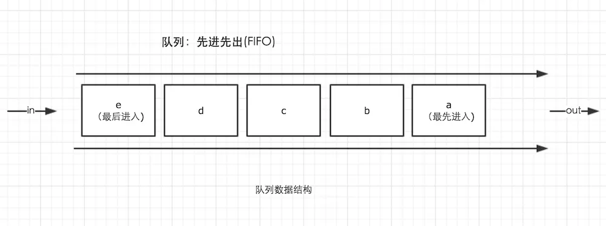

# js内存机制 <!-- omit in toc -->

> Author: tinfengyee
> Date: 2022-11-02 12:57:47
> LastEditTime: 2022-11-02 12:59:11
> Description: NO Desc

## 内存空间结构

栈、堆、队列

###  栈数据结构

栈的结构就是后进先出**（LIFO）**，可以理解为处于盒子中最顶层的乒乓球5，它一定是最后被放进去，但可以最先被使用。而我们想要使用底层的乒乓球1，就必须将上面的4个乒乓球取出来，让乒乓球1处于盒子顶层。


### 堆数据结构

堆数据结构是一种树状结构。它的存取数据的方式与书架和书非常相似。我们只需要知道书的名字就可以直接取出书了，并不需要把上面的书取出来。JSON格式的数据中，我们存储的`key-value`可以是无序的，因为顺序的不同并不影响我们的使用，我们只需要关心书的名字。

### 队列

队列是一种先进先出（**FIFO**）的数据结构，这是事件循环（Event Loop）的基础结构。



## 变量的存放

首先我们应该知道内存中有栈和堆，那么变量应该存放在哪里呢，**堆**？**栈**？

- 1、基本类型 --> 保存在**栈**内存中（不包含闭包中的变量），因为这些类型在内存中分别占有固定大小的空间，通过按值来访问。基本类型一共有7种：Undefined、Null、Boolean、Number 、String、Symbol和BigInt(es2020新增)。
- 2、引用类型 --> 保存在**堆**内存中，因为这种值的大小不固定，因此不能把它们保存到栈内存中，但内存地址大小的固定的，因此保存在堆内存中，在栈内存中存放的只是该对象的访问地址。当查询引用类型的变量时， 先从**栈中读取内存地址**， 然后再通过地址**找到堆中的值**。对于这种，我们把它叫做按引用访问。


在计算机的数据结构中，栈比堆的运算速度快，Object是一个复杂的结构且可以扩展：数组可扩充，对象可添加属性，都可以增删改查。将他们放在堆中是为了不影响栈的效率。而是通过引用的方式查找到堆中的实际对象再进行操作。所以查找引用类型值的时候先去**栈**查找再去**堆**查找。

> 闭包中的变量并不保存中栈内存中，而是保存在`堆内存`中，这也就解释了函数之后之后为什么闭包还能引用到函数内的变量。

```js
function A() {
  let a = 1
  function B() {
      console.log(a)
  }
  return B
}
```

`闭包`的简单定义是：函数 A 返回了一个函数 B，并且函数 B 中使用了函数 A 的变量，函数 B 就被称为闭包。

函数 A 弹出调用栈后，函数 A 中的变量这时候是存储在堆上的，所以函数B依旧能引用到函数A中的变量。现在的 JS 引擎可以通过逃逸分析辨别出哪些变量需要存储在堆上，哪些需要存储在栈上。

## 内存回收

JavaScript有自动垃圾收集机制，垃圾收集器会每隔一段时间就执行一次释放操作，找出那些不再继续使用的值，然后释放其占用的内存。

- 局部变量和全局变量的销毁

  - **局部变量**：局部作用域中，当函数执行完毕，局部变量也就没有存在的必要了，因此垃圾收集器很容易做出判断并回收。
  - **全局变量**：全局变量什么时候需要自动释放内存空间则很难判断，所以在开发中尽量**避免**使用全局变量。

- 以Google的V8引擎为例，V8引擎中所有的JS对象都是通过

  堆

  来进行内存分配的

  - **初始分配**：当声明变量并赋值时，V8引擎就会在堆内存中分配给这个变量。
  - **继续申请**：当已申请的内存不足以存储这个变量时，V8引擎就会继续申请内存，直到堆的大小达到了V8引擎的内存上限为止。

- V8引擎对堆内存中的JS对象进行

  分代管理

  - **新生代**：存活周期较短的JS对象，如临时变量、字符串等。
  - **老生代**：经过多次垃圾回收仍然存活，存活周期较长的对象，如主控制器、服务器对象等。

## 垃圾回收算法

对垃圾回收算法来说，核心思想就是如何判断内存已经不再使用，常用垃圾回收算法有下面两种。

- 引用计数（现代浏览器不再使用）
- 标记清除（常用）

### 引用计数

引用计数算法定义“内存不再使用”的标准很简单，就是看一个对象是否有指向它的**引用**。如果没有其他对象指向它了，说明该对象已经不再需要了。

```js
// 创建一个对象person，他有两个指向属性age和name的引用
var person = {
    age: 12,
    name: 'aaaa'
};

person.name = null; // 虽然name设置为null，但因为person对象还有指向name的引用，因此name不会回收

var p = person; 
person = 1;         //原来的person对象被赋值为1，但因为有新引用p指向原person对象，因此它不会被回收

p = null;           //原person对象已经没有引用，很快会被回收
```

引用计数有一个致命的问题，那就是**循环引用**

如果两个对象相互引用，尽管他们已不再使用，但是垃圾回收器不会进行回收，最终可能会导致内存泄露。

```js
function cycle() {
    var o1 = {};
    var o2 = {};
    o1.a = o2;
    o2.a = o1; 

    return "cycle reference!"
}

cycle();
```

`cycle`函数执行完成之后，对象`o1`和`o2`实际上已经不再需要了，但根据引用计数的原则，他们之间的相互引用依然存在，因此这部分内存不会被回收。所以现代浏览器**不再使用**这个算法。

### 标记清除（常用）

标记清除算法将“不再使用的对象”定义为“**无法到达的对象**”。即从根部（在JS中就是全局对象）出发定时扫描内存中的对象，凡是能从根部到达的对象，**保留**。那些从根部出发无法触及到的对象被标记为**不再使用**，稍后进行回收。

无法触及的对象包含了没有引用的对象这个概念，但反之未必成立。

所以上面的例子就可以正确被垃圾回收处理了。

**标记清除 （Mark-and-sweep） **，算法由以下几步组成：

- 1、垃圾回收器创建了一个“**roots**”列表。roots 通常是代码中全局变量的引用。JavaScript 中，“window” 对象是一个全局变量，被当作 root 。window 对象总是存在，因此垃圾回收器可以检查它和它的所有子对象是否存在（即不是垃圾）；
- 2、所有的 roots 被检查和标记为激活（即不是垃圾）。所有的子对象也被递归地检查。从 root 开始的所有对象如果是可达的，它就不被当作垃圾。
- 3、所有未被标记的内存会被当做垃圾，收集器现在可以释放内存，归还给操作系统了。

现代的垃圾回收器改良了算法，但是本质是相同的：可达内存被标记，其余的被当作垃圾回收。

## 四种常见的JS内存泄漏

### 1、意外的全局变量

未定义的变量会在全局对象创建一个新变量，如下。

```js
function foo(arg) {
    bar = "this is a hidden global variable";
}
```

函数 `foo` 内部忘记使用 `var` ，实际上JS会把bar挂载到全局对象上，意外创建一个全局变量。

```js
function foo(arg) {
    window.bar = "this is an explicit global variable";
}
```

另一个意外的全局变量可能由 `this` 创建。

```js
function foo() {
    this.variable = "potential accidental global";
}

// Foo 调用自己，this 指向了全局对象（window）
// 而不是 undefined
foo();
```

**解决方法**：

在 JavaScript 文件头部加上 `'use strict'`，使用严格模式避免意外的全局变量，此时**上例中的this指向`undefined`**。如果必须使用全局变量存储大量数据时，确保用完以后把它设置为 null 或者重新定义。

### 2、被遗忘的计时器或回调函数

计时器`setInterval`代码很常见

```js
var someResource = getData();
setInterval(function() {
    var node = document.getElementById('Node');
    if(node) {
        // 处理 node 和 someResource
        node.innerHTML = JSON.stringify(someResource));
    }
}, 1000);
```

上面的例子表明，在节点node或者数据不再需要时，定时器依旧指向这些数据。所以哪怕当node节点被移除后，interval 仍旧存活并且垃圾回收器没办法回收，它的依赖也没办法被回收，除非终止定时器。

```js
var element = document.getElementById('button');
function onClick(event) {
    element.innerHTML = 'text';
}

element.addEventListener('click', onClick);
```

对于上面观察者的例子，一旦它们不再需要（或者关联的对象变成不可达），明确地移除它们非常重要。老的 IE 6 是无法处理循环引用的。因为老版本的 IE 是无法检测 DOM 节点与 JavaScript 代码之间的循环引用，会导致内存泄漏。

**但是**，现代的浏览器（包括 IE 和 Microsoft Edge）使用了更先进的垃圾回收算法（标记清除），已经可以正确检测和处理循环引用了。即回收节点内存时，不必非要调用 `removeEventListener` 了。

### 3、脱离 DOM 的引用

如果把DOM 存成字典（JSON 键值对）或者数组，此时，同样的 DOM 元素存在两个引用：一个在 DOM 树中，另一个在字典中。那么将来需要把两个引用都清除。

```js
var elements = {
    button: document.getElementById('button'),
    image: document.getElementById('image'),
    text: document.getElementById('text')
};
function doStuff() {
    image.src = 'http://some.url/image';
    button.click();
    console.log(text.innerHTML);
    // 更多逻辑
}
function removeButton() {
    // 按钮是 body 的后代元素
    document.body.removeChild(document.getElementById('button'));
    // 此时，仍旧存在一个全局的 #button 的引用
    // elements 字典。button 元素仍旧在内存中，不能被 GC 回收。
}
```

如果代码中保存了表格某一个 `<td>` 的引用。将来决定删除整个表格的时候，直觉认为 GC 会回收除了已保存的 `<td>` 以外的其它节点。实际情况并非如此：此 `<td>` 是表格的子节点，子元素与父元素是引用关系。由于代码**保留了 `<td>` 的引用**，导致整个表格仍待在内存中。所以保存 DOM 元素引用的时候，要小心谨慎。

### 4、闭包

闭包的关键是匿名函数可以访问父级作用域的变量。

```js
var theThing = null;
var replaceThing = function () {
  var originalThing = theThing;
  var unused = function () {
    if (originalThing)
      console.log("hi");
  };
    
  theThing = {
    longStr: new Array(1000000).join('*'),
    someMethod: function () {
      console.log(someMessage);
    }
  };
};

setInterval(replaceThing, 1000);
```

每次调用 `replaceThing` ，`theThing` 得到一个包含一个大数组和一个新闭包（`someMethod`）的新对象。同时，变量 `unused` 是一个引用 `originalThing` 的闭包（先前的 `replaceThing` 又调用了 `theThing` ）。`someMethod` 可以通过 `theThing` 使用，`someMethod` 与 `unused` 分享闭包作用域，尽管 `unused` 从未使用，它引用的 `originalThing` 迫使它保留在内存中（防止被回收）。

**解决方法**：

在 `replaceThing` 的最后添加 `originalThing = null` 。

## 思考题

### 问题1

```js
var a = {n: 1};
var b = a;
a.x = a = {n: 2};

a.x 	// 这时 a.x 的值是多少  --> undefined
b.x 	// 这时 b.x 的值是多少  --> {n: 2}
```

答案已经写上面了，这道题的关键在于

- 1、优先级。`.`的优先级高于`=`，所以先执行`a.x`，堆内存中的`{n: 1}`就会变成`{n: 1, x: undefined}`，改变之后相应的`b.x`也变化了，因为指向的是同一个对象。
- 2、赋值操作是`从右到左`，所以先执行`a = {n: 2}`，`a`的引用就被改变了，然后这个返回值又赋值给了`a.x`，**需要注意**的是这时候`a.x`是第一步中的`{n: 1, x: undefined}`那个对象，其实就是`b.x`，相当于`b.x = {n: 2}`

### 问题2

>  从内存来看 null 和 undefined 本质的区别是什么？

**解答**：

给一个全局变量赋值为null，相当于将这个变量的指针对象以及值清空，如果是给对象的属性 赋值为null，或者局部变量赋值为null,相当于给这个属性分配了一块空的内存，然后值为null， JS会回收全局变量为null的对象。

给一个全局变量赋值为undefined，相当于将这个对象的值清空，但是这个对象依旧存在,如果是给对象的属性赋值 为undefined，说明这个值为空值

**扩展下**：

声明了一个变量，但未对其初始化时，这个变量的值就是undefined，它是 JavaScript 基本类型 之一。

```js
var data;
console.log(data === undefined); //true
```

对于尚未声明过的变量，只能执行一项操作，即使用typeof操作符检测其数据类型，使用其他的操作都会报错。

```js
//data变量未定义
console.log(typeof data); // "undefined"
console.log(data === undefined); //报错
```

值 `null` 特指对象的值未设置，它是 JavaScript 基本类型 之一。

值 `null` 是一个字面量，它不像[`undefined`](https://developer.mozilla.org/en-US/docs/Web/JavaScript/Reference/Global_Objects/undefined) 是全局对象的一个属性。`null` 是表示缺少的标识，指示变量未指向任何对象。

```js
// foo不存在，它从来没有被定义过或者是初始化过：
foo;
"ReferenceError: foo is not defined"

// foo现在已经是知存在的，但是它没有类型或者是值：
var foo = null; 
console.log(foo);	// null
```

### 问题3

>  ES6语法中的 const 声明一个只读的常量，那为什么下面可以修改const的值？

```js
const foo = {};

// 为 foo 添加一个属性，可以成功
foo.prop = 123;
foo.prop // 123

// 将 foo 指向另一个对象，就会报错
foo = {}; // TypeError: "foo" is read-only
```

**解答**：

`const`实际上保证的，并不是变量的值不得改动，而是变量指向的那个内存地址所保存的数据不得改动。对于简单类型的数据（数值、字符串、布尔值），值就保存在变量指向的那个内存地址，因此等同于常量。但对于复合类型的数据（主要是对象和数组），变量指向的内存地址，保存的只是一个指向实际数据的指针，`const`只能保证这个指针是固定的（即总是指向另一个固定的地址），至于它指向的数据结构是不是可变的，就完全不能控制了。因此，将一个对象声明为常量必须非常小心。

### 问题4

>  哪些情况下容易产生内存泄漏？

意外的全局变、被遗忘的定时器或者回调函数、脱离DOM的引用、闭包

## 参考

[JavaScript深入之带你走进内存机制](https://muyiy.cn/blog/1/1.4.html)
