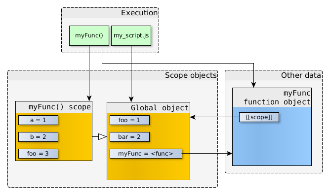

# 深入浅出图解作用域链和闭包 <!-- omit in toc -->

> Author: tinfengyee
> Date: 2022-11-02 19:18:51
> LastEditTime: 2022-11-02 19:19:00
> Description: NO Desc

## 作用域链

Javascript中有一个执行上下文(execution context)的概念，它定义了变量或函数有权访问的其它数据，决定了他们各自的行为。每个执行环境都有一个与之关联的变量对象，环境中定义的所有变量和函数都保存在这个对象中。

**作用域链**：当访问一个变量时，解释器会首先在当前作用域查找标示符，如果没有找到，就去父作用域找，直到找到该变量的标示符或者不在父作用域中，这就是作用域链。

作用域链和原型继承查找时的区别：如果去查找一个普通对象的属性，但是在当前对象和其原型中都找不到时，会返回undefined；但查找的属性在作用域链中不存在的话就会抛出**ReferenceError**。

作用域链的顶端是全局对象，在全局环境中定义的变量就会绑定到全局对象中。

###  作用域链的作用

每个函数都有自己的执行上下文环境，当代码在这个环境中执行时，会创建变量对象的作用域链，作用域链是一个对象列表或对象链，它**保证了变量对象的有序访问**。

作用域链的开始是当前代码执行环境的变量对象，常被称之为“活跃对象”（**AO**），变量的查找会从第一个链的对象开始，如果对象中包含变量属性，那么就停止查找，如果没有就会继续向上级作用域链查找，直到找到全局对象中

### 全局环境

#### 无嵌套的函数

```js
// my_script.js
"use strict";

var foo = 1;
var bar = 2;

function myFunc() {
  
  var a = 1;
  var b = 2;
  var foo = 3;
  console.log("inside myFunc");
  
}

console.log("outside");
myFunc();
```

**定义时**：当myFunc被定义的时候，myFunc的标识符（identifier）就被加到了全局对象中，这个标识符所引用的是一个函数对象（myFunc function object）。

内部属性[[scope]]指向当前的作用域对象，也就是函数的标识符被创建的时候，我们所能够直接访问的那个作用域对象（即全局对象）。


myFunc所引用的函数对象，其本身不仅仅含有函数的代码，并且还含有指向其被创建的时候的作用域对象。

**调用时**：当myFunc函数被调用的时候，一个新的作用域对象被创建了。新的作用域对象中包含myFunc函数所定义的本地变量，以及其参数（arguments）。这个新的作用域对象的父作用域对象就是在运行myFunc时能直接访问的那个作用域对象（即全局对象）。



#### 有嵌套的函数

当函数返回没有被引用的时候，就会被垃圾回收器回收。但是对于闭包，即使外部函数返回了，函数对象仍会引用它被**创建时**的作用域对象。

```js
"use strict";
function createCounter(initial) {
  var counter = initial;
  
  function increment(value) {
    counter += value;
  }
  
  function get() {
    return counter;
  }
  
  return {
    increment: increment,
    get: get
  };
}

var myCounter = createCounter(100);
console.log(myCounter.get());   // 返回 100

myCounter.increment(5);
console.log(myCounter.get());   // 返回 105
```

当调用 createCounter(100) 时，内嵌函数increment和get都有指向createCounter(100) scope的引用。**假设**createCounter(100)没有任何返回值，那么createCounter(100) scope不再被引用，于是就可以被垃圾回收。


但是createCounter(100)实际上是有返回值的，并且返回值被存储在了myCounter中，所以对象之间的引用关系如下图：


即使createCounter(100)已经返回，但是其作用域仍在，并且只能被内联函数访问。可以通过调用myCounter.increment() 或 myCounter.get()来直接访问createCounter(100)的作用域。

当myCounter.increment() 或 myCounter.get()被调用时，新的作用域对象会被创建，并且该作用域对象的父作用域对象会是当前可以直接访问的作用域对象。

调用`get()`时，当执行到`return counter`时，在get()所在的作用域并没有找到对应的标示符，就会沿着作用域链往上找，直到找到变量`counter`，然后返回该变量。


单独调用increment(5)时，参数value保存在当前的作用域对象。当函数要访问counter时，没有找到，于是沿着作用域链向上查找，在createCounter(100)的作用域找到了对应的标示符，increment()就会修改counter的值。除此之外，没有其他方式来修改这个变量。闭包的强大也在于此，能够存贮私有数据。


创建两个函数：`myCounter1`和`myCounter2`

```js
//my_script.js
"use strict";
function createCounter(initial) {
  /* ... see the code from previous example ... */
}

//-- create counter objects
var myCounter1 = createCounter(100);
var myCounter2 = createCounter(200);
```

关系图如下 

myCounter1.increment和myCounter2.increment的函数对象拥有着一样的代码以及一样的属性值（name，length等等），但是它们的[[scope]]指向的是不一样的作用域对象。

## 闭包

红宝书(p178)上对于闭包的定义：`闭包是指有权访问另外一个函数作用域中的变量的函数` 关键在于下面两点：

- 是一个函数
- 能访问另外一个函数作用域中的变量

MDN 对闭包的定义为：**闭包是指那些能够访问自由变量的函数**。

其中**自由变量**，指在函数中使用的，但既不是函数参数`arguments`也不是函数的局部变量的变量，其实就是另外一个函数作用域中的变量。

```js
function getOuter(){
  var date = '1127';
  function getDate(str){
    console.log(str + date);  //访问外部的date
  }
  return getDate('今天是：'); //"今天是：1127"
}
getOuter();
```

其中`date`既不是参数`arguments`，也不是局部变量，所以`date`是自由变量。

总结起来就是下面两点：

- 1、是一个函数（比如，内部函数从父函数中返回）
- 2、能访问上级函数作用域中的变量（哪怕上级函数上下文已经销毁）

>  对于闭包有下面三个特性：

- 1、闭包可以访问当前函数以外的变量

- 2、即使外部函数已经返回，闭包仍能访问外部函数定义的变量

- 3、闭包可以更新外部变量的值

> 闭包不应该说是指某个函数吧，波神你根据chrome的显示，说是外层函数，而高级程序设计恰好相反，说闭包是内部函数。闭包更准确的说是一项技术或者一个特性，函数作用域中的变量在函数执行完成之后就会被垃圾回收，一般情况下访问一个函数作用域中的变量，正常是无法访问的，只能通过特殊的技术或者特性来实现，就是在函数作用域中创建内部函数来实现，这样就不会使得函数执行完成变量被回收，这种技术或者特性应该被称为“闭包” -[对闭包的理解.md]

###  闭包好处和坏处

好处：

1. 缓存。将变量隐藏起来不被 GC 回收。
2. 模块化/封装私有变量。
3. 实现柯里化。利用闭包特性完成柯里化。

坏处：

1. 内存消耗。闭包产生的变量无法被销毁。
2. 性能问题。由于闭包内部变量优先级高于外部变量，所以需要多查找作用域链的一个层次，一定程度影响查找速度。

封装私有变量例子

```javascript
function createClosure(){
    var name = "jack";
    return {
        setStr:function(){
            name = "rose";
        },
        getStr:function(){
            return name + ":hello";
        }
    }
}
var builder = new createClosure();
builder.setStr();
console.log(builder.getStr()); //rose:hello
```

模块化

```javascript
(function () {
  var a = 10;
  var b = 20;

  function add(num1, num2) {
    var num1 = !!num1 ? num1 : a;
    var num2 = !!num2 ? num2 : b;

    return num1 + num2;
  }

  window.add = add;
})();

add(10, 20);
```

在上面的例子中，我使用函数自执行的方式，创建了一个模块。add是模块对外暴露的一个公共方法。而变量a，b被作为私有变量。在面向对象的开发中，我们常常需要考虑是将变量作为私有变量，还是放在构造函数中的this中，因此理解闭包，以及原型链是一个非常重要的事情。

### 闭包和作用域的关系

**闭包可以理解成一种机制，这种机制可以使得在内层函数执行上下文的作用域链**（作用域链可以理解成是函数执行上下文的变量对象组成的数组）上插入了一个变量对象，该对象的属性就是内层函数中引用到外层函数上下文变量对象上的属性。

首先来一个简单的例子。

```js
var scope = "global scope";
function checkscope(){
    var scope = "local scope";
    function f(){
        return scope;
    }
    return f;
}

var foo = checkscope(); // foo指向函数f
foo();					// 调用函数f()
```

简要的执行过程如下：

1. 进入全局代码，创建全局执行上下文，全局执行上下文**压入执行上下文栈**
2. 全局执行**上下文初始化**
3. 执行 checkscope 函数，创建 checkscope 函数执行上下文，checkscope 执行上下文被压入执行上下文栈
4. checkscope 执行**上下文初始化**，创建变量对象、作用域链、this等
5. checkscope 函数执行完毕，checkscope 执行上下文从执行上下文栈中弹出
6. 执行 f 函数，创建 f 函数执行上下文，f 执行上下文被压入执行上下文栈
7. f 执行**上下文初始化**，创建变量对象、作用域链、this等
8. f 函数执行完毕，f 函数上下文从执行上下文栈中弹出


那么**问题**来了， 函数f 执行的时候，checkscope 函数上下文已经被销毁了，那函数f是如何获取到scope变量的呢？

函数f 执行上下文维护了一个作用域链，会指向指向`checkscope`作用域，作用域链是一个数组，结构如下。

```js
fContext = {
    Scope: [AO, checkscopeContext.AO, globalContext.VO],
}
```

所以指向关系是当前作用域 --> `checkscope`作用域--> 全局作用域，即使 checkscopeContext 被销毁了，但是 JavaScript 依然会让 checkscopeContext.AO（活动对象） 活在内存中，f 函数依然可以通过 f 函数的作用域链找到它，这就是闭包实现的**关键**。

## 思考题

### 题目1

```js
var data = [];

for (var i = 0; i < 3; i++) {
  data[i] = function () {
    console.log(i);
  };
}

data[0]();
data[1]();
data[2]();
```

如果知道闭包的，答案就很明显了，都是3

循环结束后，全局执行上下文的VO是

```js
globalContext = {
    VO: {
        data: [...],
        i: 3
    }
}
```

执行 data[0] 函数的时候，data[0] 函数的作用域链为：

```js
data[0]Context = {
    Scope: [AO, globalContext.VO]
}
```

由于其自身没有i变量，就会向上查找，所有从全局上下文查找到i为3，data[1] 和 data[2] 是一样的。

**解决办法1**

改成闭包，方法就是`data[i]`返回一个函数，并访问变量`i`

```js
var data = [];

for (var i = 0; i < 3; i++) {
  data[i] = (function (num) {
      return function(){ // 这里是一个闭包
          console.log(num);
      }
  })(i);
}

data[0]();	// 0
data[1]();	// 1
data[2]();	// 2
```

循环结束后的全局执行上下文没有变化。

执行 data[0] 函数的时候，data[0] 函数的作用域链发生了改变：

```text
data[0]Context = {
    Scope: [AO, 匿名函数Context.AO, globalContext.VO]
}
```

匿名函数执行上下文的AO为：

```js
匿名函数Context = {
    AO: {
        arguments: {
            0: 0,
            length: 1
        },
        i: 0
    }
}
```

因为闭包执行上下文中贮存了变量`i`，所以根据作用域链会在`globalContext.VO`中查找到变量`i`,并输出0。

**解决办法2**

立即执行函数

```js
for (var i = 0; i < 3; i++) {
    (function(num) {
        setTimeout(function() {
            console.log(num);
        }, 1000);
    })(i);
}
// 0
// 1
// 2
```

**解决办法3**

```js
var data = [];

for (let i = 0; i < 3; i++) {
  data[i] = function () {
    console.log(i);
  };
}

data[0]();
data[1]();
data[2]();
```

解释下**原理**：

```js
var data = [];// 创建一个数组data;

// 进入第一次循环
{ 
	let i = 0; // 注意：因为使用let使得for循环为块级作用域
	           // 此次 let i = 0 在这个块级作用域中，而不是在全局环境中
    data[0] = function() {
    	console.log(i);
	};
}
```

循环时，`let`声明`i`,所以整个块是块级作用域，那么data[0]这个函数就成了一个闭包。这里用｛｝表达并不符合语法，只是希望通过它来说明let存在时，这个for循环块是块级作用域，而不是全局作用域。

上面的块级作用域，就像函数作用域一样，函数执行完毕，其中的变量会被销毁，但是因为这个代码块中存在一个闭包，闭包的作用域链中引用着块级作用域，所以在闭包被调用之前，这个块级作用域内部的变量不会被销毁。

```js
// 进入第二次循环
{ 
	let i = 1; // 因为 let i = 1 和上面的 let i = 0     
	           // 在不同的作用域中，所以不会相互影响
	data[1] = function(){
         console.log(i);
	}; 
}
```

当执行`data[1]()`时，进入下面的执行环境。

```js
{ 
     let i = 1; 
     data[1] = function(){
          console.log(i);
     }; 
}
```

在上面这个执行环境中，它会首先寻找该执行环境中是否存在`i`，没有找到，就沿着作用域链继续向上到了其所在的块作用域执行环境，找到了`i = 1`,于是输出了`1`。

### 题目2

代码1：

```js
var scope = "global scope";
function checkscope(){
    var scope = "local scope";
    function f(){
        return scope;
    }
    return f;
}

checkscope()();                  
```

代码2：

```js
var scope = "global scope";
function checkscope(){
    var scope = "local scope";
    function f(){
        return scope;
    }
    return f;
}

var foo = checkscope(); 
foo();    
```

上面的两个代码中，`checkscope()`执行完成后，闭包`f`所引用的自由变量`scope`会被垃圾回收吗？为什么？

**解答**：

`checkscope()`执行完成后，代码1中自由变量特定时间之后**回收**，代码2中自由变量**不回收**。

首先要说明的是，现在主流浏览器的垃圾回收算法是**标记清除**，标记清除并非是标记执行栈的进出，而是**从根开始遍历**，也是一个找引用关系的过程，但是因为从根开始，相互引用的情况不会被计入。所以当垃圾回收开始时，从**Root**（全局对象）开始寻找这个对象的引用是否可达，如果引用链断裂，那么这个对象就会回收。

闭包中的作用域链中 parentContext.vo 是对象，被放在**堆**中，**栈**中的变量会随着执行环境进出而销毁，**堆**中需要垃圾回收，闭包内的自由变量会被分配到堆上，所以当外部方法执行完毕后，对其的引用并没有丢。

每次进入函数执行时，会重新创建可执行环境和活动对象，但函数的`[[Scope]]`是函数定义时就已经定义好的（**词法作用域规则**），不可更改。

- 对于代码1：

`checkscope()`执行时,将`checkscope`对象指针压入栈中，其执行环境变量如下

```js
checkscopeContext:{
    AO:{
        arguments:
        scope:
        f:
    },
    this,
    [[Scope]]:[AO, globalContext.VO]
}
```

执行完毕后**出栈**，该对象没有绑定给谁，从**Root**开始查找无法可达，此活动对象一段时间后会被回收

- 对于代码2：

`checkscope()`执行后，返回的是`f`对象，其执行环境变量如下

```js
fContext:{
    AO:{
        arguments:
    },
    this,
    [[Scope]]:[AO, checkscopeContext.AO, globalContext.VO]
}
```

此对象赋值给`var foo = checkscope();`，将`foo`压入栈中，`foo`指向堆中的`f`活动对象,对于`Root`来说可达，不会被回收。

如果一定要自由变量`scope`回收，那么该怎么办？？？

很简单，`foo = null;`，把引用断开就可以了。
