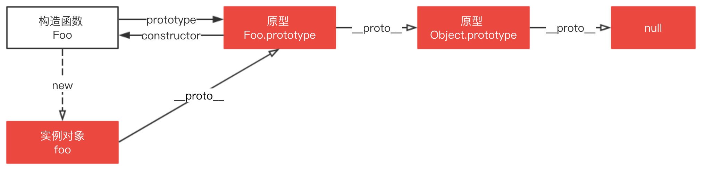
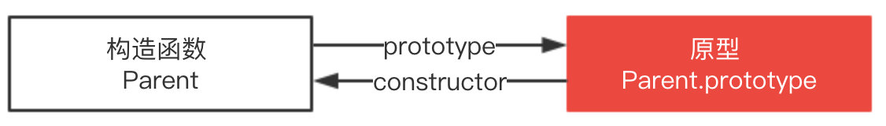

# 原型Prototype <!-- omit in toc -->

> Author: tinfengyee
> Date: 2022-11-05 16:24:03
> LastEditTime: 2022-11-05 18:20:43
> Description: NO Desc

JavaScript 是一种基于原型的语言。每个对象拥有一个原型对象，对象以其原型为模板，从原型继承方法和属性，这些属性和方法定义在对象的构造器函数的 prototype 属性上，而非对象实例本身。(共享属性/方法，节省内存空间)

## `constructor`、`prototype` 和 `__proto__`

原型对象 `prototype` 是构造函数的属性，`__proto__` 是每个实例上都有的属性，这两个并不一样，但 `foo.__proto__` 和 `Foo.prototype` 指向同一个对象。

> `__proto__` 属性，这是一个**访问器属性**（即 getter 函数和 setter 函数），通过它可以访问到对象的内部 `[[Prototype]]` (一个对象或 `null` )。

## 原型链

每个对象拥有一个原型对象，通过 `__proto__` 指针指向上一个原型 ，并从中继承方法和属性，同时原型对象也可能拥有原型，这样一层一层，最终指向 `null`。这种关系被称为**原型链 (prototype chain)**，通过原型链一个对象会拥有定义在其他对象中的属性和方法。

原型链的运行机制

