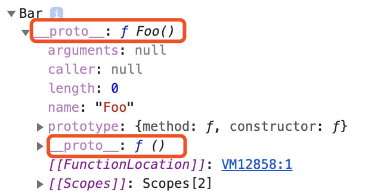
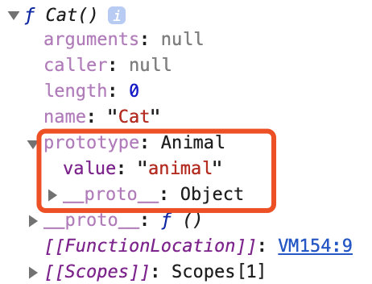
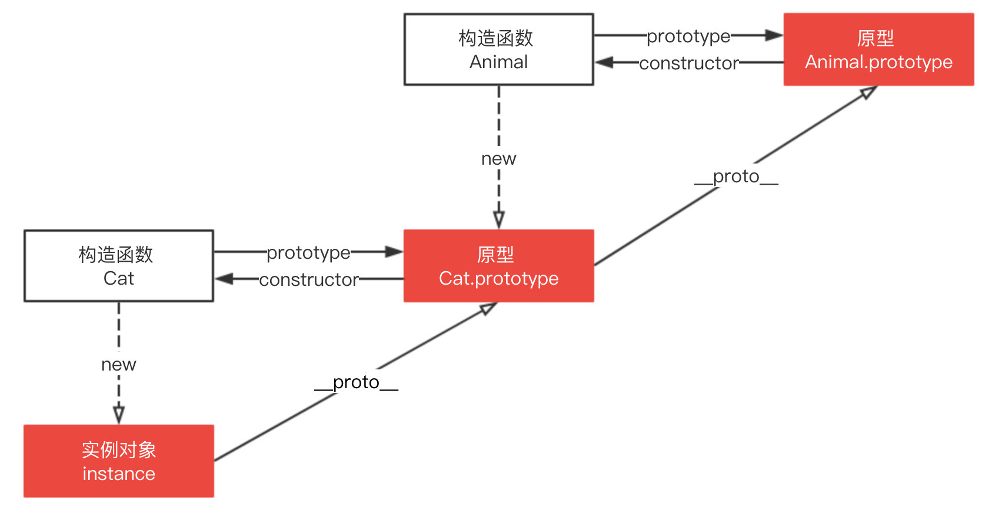

# 图解原型链及其继承优缺点 <!-- omit in toc -->

> Author: tinfengyee
> Date: 2022-11-05 16:19:24
> LastEditTime: 2022-11-22 14:44:07
> Description: NO Desc
> Link:https://muyiy.cn/blog/5/5.2.html

## 思维导图


## 原型链


篇文章中我们介绍了原型链的概念，即每个对象拥有一个原型对象，通过 `__proto__` 指针指向上一个原型 ，并从中**继承方法和属性**，同时原型对象也可能拥有原型，这样一层一层，最终指向 `null`，这种关系被称为**原型链**(prototype chain)。

根据规范不建议直接使用 `__proto__`，推荐使用 `Object.getPrototypeOf()`，不过为了行文方便逻辑清晰，下面都以 `__proto__` 代替。

注意上面的说法，原型上的方法和属性被 **继承** 到新对象中，并不是被复制到新对象，我们看下面这个例子。

```js
function Foo(name) {
	this.name = name;
}
Foo.prototype.getName = function() {
  	return this.name;
}
Foo.prototype.length = 3;
let foo = new Foo('muyiy'); // 相当于 foo.__proto__ = Foo.prototype
console.dir(foo);
```


原型上的属性和方法定义在 `prototype` 对象上，而非对象实例本身。当访问一个对象的属性 / 方法时，它不仅仅在该对象上查找，还会查找该对象的原型，以及该对象的原型的原型，一层一层向上查找，直到找到一个名字匹配的属性 / 方法或到达原型链的末尾（`null`）。

比如调用 `foo.valueOf()` 会发生什么？

- 首先检查 `foo` 对象是否具有可用的 `valueOf()` 方法。
- 如果没有，则检查 `foo` 对象的原型对象（即 `Foo.prototype`）是否具有可用的 `valueof()` 方法。
- 如果没有，则检查 `Foo.prototype` 所指向的对象的原型对象（即 `Object.prototype`）是否具有可用的 `valueOf()` 方法。这里有这个方法，于是该方法被调用。


### `prototype` 和 `__proto__`

上篇文章介绍了 `prototype` 和 `__proto__` 的区别，其中原型对象 `prototype` 是构造函数的属性，`__proto__` 是每个实例上都有的属性，这两个并不一样，但 `foo.__proto__` 和 `Foo.prototype` 指向同一个对象。

这次我们再深入一点，原型链的构建是依赖于 `prototype` 还是 `__proto__` 呢？


`Foo.prototype` 中的 `prototype` 并没有构建成一条原型链，其只是指向原型链中的某一处。原型链的构建依赖于 `__proto__`，如上图通过 `foo.__proto__` 指向 `Foo.prototype`，`foo.__proto__.__proto__` 指向 `Bichon.prototype`，如此一层一层最终链接到 `null`。

function，我身上有着 prototype 的 reference，只要随时调用 foo = new Foo()，我就会将 `foo.__proto__` 指向到我的 prototype 对象。

不要使用 `Bar.prototype = Foo`，因为这不会执行 `Foo` 的原型，而是指向函数 `Foo`。 因此原型链将会回溯到 `Function.prototype` 而不是 `Foo.prototype`，因此 `method` 方法将不会在 Bar 的原型链上。

```js
function Foo() {
  	return 'foo';
}
Foo.prototype.method = function() {
  	return 'method';
}
function Bar() {
  	return 'bar';
}
Bar.prototype = Foo; // Bar.prototype 指向到函数
let bar = new Bar();
console.dir(bar);

bar.method(); // Uncaught TypeError: bar.method is not a function
```



###  instanceof 原理及实现

`instanceof` 运算符用来检测 `constructor.prototype` 是否存在于参数 `object` 的原型链上。

instanceof 原理就是一层一层查找 `__proto__`，如果和 `constructor.prototype` 相等则返回 true，如果一直没有查找成功则返回 false。

知道了原理后我们来实现 instanceof，代码如下。

```js
function instance_of(L, R) {//L 表示左表达式，R 表示右表达式
   var O = R.prototype;// 取 R 的显示原型
   L = L.__proto__;// 取 L 的隐式原型
   while (true) { 
       // Object.prototype.__proto__ === null
       if (L === null) 
         return false; 
       if (O === L)// 这里重点：当 O 严格等于 L 时，返回 true 
         return true; 
       L = L.__proto__; 
   } 
}

// 测试
function C(){} 
function D(){} 

var o = new C();

instance_of(o, C); // true
instance_of(o, D); // false

//-----
function instance(obj, Fn) {
  // obj = obj.__proto__
  obj = Object.getPrototypeOf(obj);
  var prototype = Fn.prototype;
  while (obj !== null) {
    if (obj === prototype) {
      return true;
    }
    // obj = obj.__proto__
    obj = Object.getPrototypeOf(obj)
  }
  return false;
}
```

## 原型链继承

原型链继承的本质是**重写原型对象，代之以一个新类型的实例**。如下代码，新原型 `Cat` 不仅有 `new Animal()` **实例**上的全部属性和方法，并且由于指向了 `Animal` 原型，所以还继承了`Animal` **原型**上的属性和方法。

```js
function Animal() {
    this.value = 'animal';
}

Animal.prototype.run = function() {
    return this.value + ' is runing';
}

function Cat() {}

// 这里是关键，创建 Animal 的实例，并将该实例赋值给 Cat.prototype
// 相当于 Cat.prototype.__proto__ = Animal.prototype
Cat.prototype = new Animal(); 

var instance = new Cat();
instance.value = 'cat'; // 创建 instance 的自身属性 value
console.log(instance.run()); // cat is runing
```

原型链继承方案有以下缺点：

- 1、多个实例对引用类型的操作会被篡改
- 2、子类型的原型上的 constructor 属性被重写了
- 3、给子类型原型添加属性和方法必须在替换原型之后
- 4、创建子类型实例时无法向父类型的构造函数传参

### 问题 1

原型链继承方案中，原型实际上会变成另一个类型的实例，如下代码，`Cat.prototype` 变成了 `Animal` 的一个实例，所以 `Animal` 的实例属性 `names` 就变成了 `Cat.prototype` 的属性。

而原型属性上的引用类型值会被所有实例共享，所以多个实例对引用类型的操作会被篡改。如下代码，改变了 `instance1.names` 后影响了 `instance2`。

```js
// 木易杨
function Animal(){
  this.names = ["cat", "dog"];
}
function Cat(){}

Cat.prototype = new Animal();

var instance1 = new Cat();
instance1.names.push("tiger");
console.log(instance1.names); // ["cat", "dog", "tiger"]

var instance2 = new Cat(); 
console.log(instance2.names); // ["cat", "dog", "tiger"]
```

### 问题 2

子类型原型上的 constructor 属性被重写了，执行 `Cat.prototype = new Animal()` 后原型被覆盖，`Cat.prototype` 上丢失了 constructor 属性， `Cat.prototype` 指向了 `Animal.prototype`，而 `Animal.prototype.constructor` 指向了 `Animal`，所以 `Cat.prototype.constructor` 指向了 `Animal`。

```js
Cat.prototype = new Animal(); 
Cat.prototype.constructor === Animal
// true
```



解决办法就是重写 `Cat.prototype.constructor` 属性，指向自己的构造函数 `Cat`。

```js
function Animal() {
    this.value = 'animal';
}

Animal.prototype.run = function() {
    return this.value + ' is runing';
}

function Cat() {}
Cat.prototype = new Animal(); 

// 新增，重写 Cat.prototype 的 constructor 属性，指向自己的构造函数 Cat
Cat.prototype.constructor = Cat; 
```



### 问题 3

给子类型原型添加属性和方法必须在替换原型之后，原因在第二点已经解释过了，因为子类型的原型会被覆盖。

```js
function Animal() {
    this.value = 'animal';
}

Animal.prototype.run = function() {
    return this.value + ' is runing';
}

function Cat() {}
Cat.prototype = new Animal(); 
Cat.prototype.constructor = Cat; 

// 新增
Cat.prototype.getValue = function() {
  return this.value;
}

var instance = new Cat();
instance.value = 'cat'; 
console.log(instance.getValue()); // cat
```

### 属性遮蔽

改造上面的代码，在 `Cat.prototype` 上添加 `run` 方法，但是 `Animal.prototype` 上也有一个 `run` 方法，不过它不会被访问到，这种情况称为属性遮蔽 (property shadowing)。

```js
function Animal() {
    this.value = 'animal';
}

Animal.prototype.run = function() {
    return this.value + ' is runing';
}

function Cat() {}
Cat.prototype = new Animal(); 
Cat.prototype.constructor = Cat; 

// 新增
Cat.prototype.run = function() {
  return 'cat cat cat';
}

var instance = new Cat();
instance.value = 'cat'; 
console.log(instance.run()); // cat cat cat
```

```js
// 接上
console.log(instance.__proto__.__proto__.run()); // undefined is runing
```

## 其他继承方案

原型链继承方案有很多问题，实践中很少会单独使用，日常工作中使用 ES6 Class extends（模拟原型）继承方案即可，更多更详细的继承方案可以阅读我之前写的一篇文章，欢迎拍砖。

点击阅读：[JavaScript 常用八种继承方案](https://github.com/yygmind/blog/issues/7)

