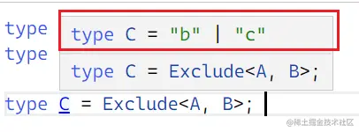
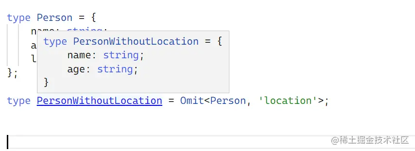
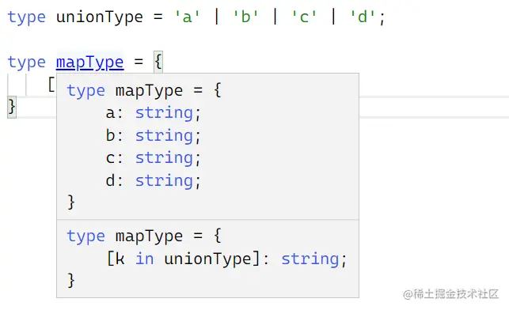
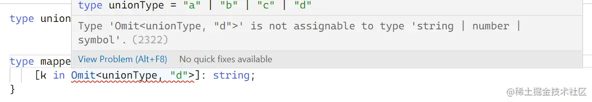
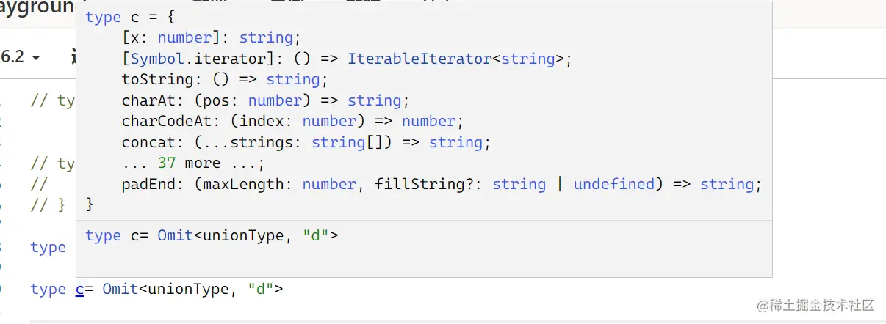
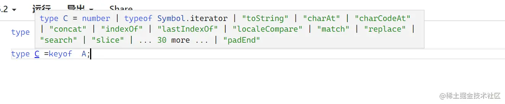

在[typescript2.8](https://link.juejin.cn?target=https%3A%2F%2Fwww.typescriptlang.org%2Fdocs%2Fhandbook%2Frelease-notes%2Ftypescript-2-8.html)中开始支持Exclude,他的用法是从联合类型UnionType中排除一个类型ExcludedMembers

```
Exclude<UnionType, ExcludedMembers>
```

> PS: 这里官方文档给出的用法是在联合类型中

在官方文档中是这样定义Exclude的`type Exclude<T, U> = T extends U ? never : T;`

从定义来看，判断T是否继承U，如果是返回never否则返回T，但是这样说其实也不正确，返回的并不是完整的T，并且这个Exclude也不是你想像中的。

> PS：never 类型表示的是那些永不存在的值的类型
>
> 例如：函数是会抛出异常的函数，因此永远不会正常返回值，所以可以定义该函数的返回值为 never；
>
> 例如：函数是一个 while(true){} 的函数，因此会陷入永久循环，也不会正常返回值，所以可以定义该函数的返回值为 never。

例如下面这个例子：

```ini
type A = 'a' | 'b' | 'c';
type B = 'a' | 'd';


type C = Exclude<A, B>; 
复制代码
```

你以为的Exclude可能是这样的：

```typescript
type c ='a' | 'b' | 'c'; extends 'a' | 'd'; ? never : 'a' | 'b' | 'c';

复制代码
```

其实是这样子的：

```typescript
type c =
   ('a' extends 'a' | 'd'  ? never : 'a')
  | ("b" extends 'a' | 'd'  ? never : 'b')
  | ("c" extends 'a' | 'd'  ? never : 'c')
复制代码
```

这里C的类型是`'b' | 'c';`相当于A不在B中的类型！所以叫排除B。



例如下面这个例子

在[typescript3.5](https://link.juejin.cn?target=https%3A%2F%2Fwww.typescriptlang.org%2Fdocs%2Fhandbook%2Frelease-notes%2Ftypescript-3-5.html)中支持了Omit。他的用法是从类型Type中排除一组键（字符串文字或字符串文字的联合）

```
Omit<Type, Keys>
type Person = {
    name: string;
    age: string;
    location: string;
};

type PersonWithoutLocation = Omit<Person, 'location'>;
复制代码
```

通过运行官方文档的例子，我们可以发现Omit的作用是：以一个定义好的类型位基础，踢出指定的属性，重新生成一个类型！

例如上面的`PersonWithoutLocation`排除了location属性，最后得到的结果就是

```js
{
   	name: string;
    age: string;
 }
复制代码
```



一开始我以为，Omit可以用在联合类型中排除属性，但是后来试了好像不太行啊！

例如我有这样一个联合文字类型：

```ts
type unionType = 'a' | 'b' | 'c' | 'd';
复制代码
```

我想创建这样一个类型：

```css
type mapType = {
  a: string;
  b: string;
  c: string;
  d: string;
}
复制代码
```

使用unionType,完全可行！

```ini
type mapType = {
    [k in unionType]: string;
}
复制代码
```



但是mapType突然不需要d了,使用Omit。

```ini
type mappedTypeWithOmit = {
    [k in Omit<something, "def">]: string;
}
复制代码
```

但是TS直接报错了！报错说Omit的结果无法分配给string类型



如果我们单独的看：

```ini
type unionType = 'a' | 'b' | 'c' | 'd';

type c= Omit<unionType, "d">
复制代码
```

最终得到的c是一个字符串数组类型啊



我看了一下Omit的定义：

```scala
type Omit<T, K extends keyof any> = Pick<T, Exclude<keyof T, K>>;
复制代码
```

请注意Exclude<keyof T, K>>中keyof，这里的`keyof` 取 `interface` 的键！也就是说你的T是一个interface。所以我觉得Omit是无法用在联合类型上的。

keyo如果用来取联合类型的话,会得到下面的结果。



```ini
type A='a' | 'b' | 'c' | 'd'

type C =keyof  A;
```


作者：半夏的故事
链接：https://juejin.cn/post/7091311285995831304
来源：稀土掘金
著作权归作者所有。商业转载请联系作者获得授权，非商业转载请注明出处。