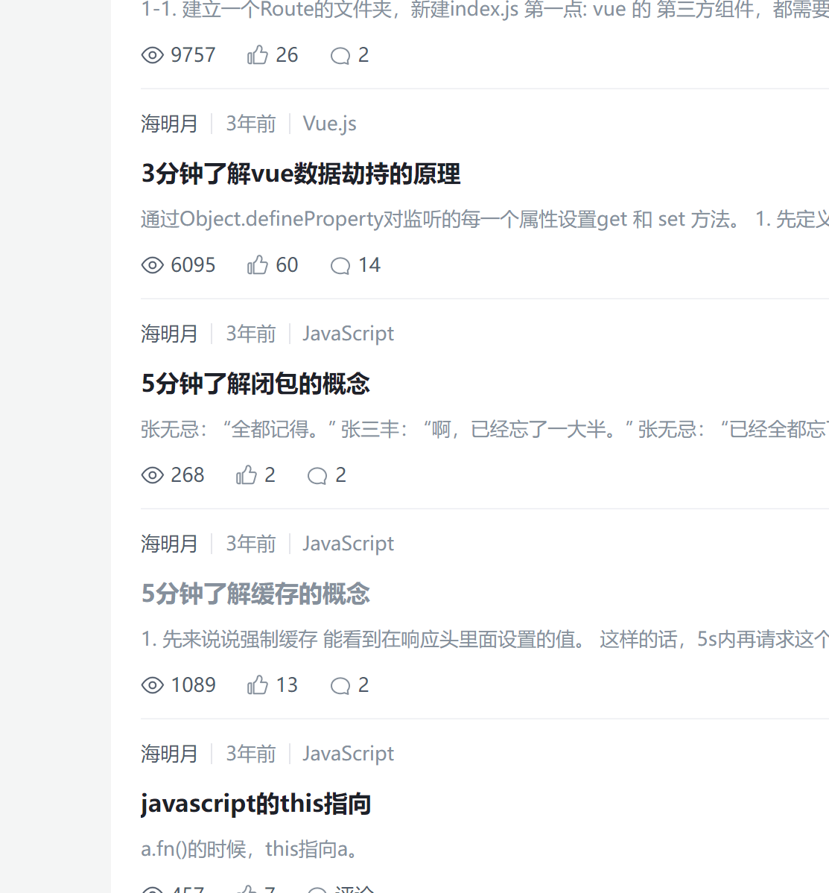

vuejs-interview-questions

vue 300 问

https://github.com/sudheerj/vuejs-interview-questions

简单的回答vue key/diff/nextTick

https://blog.csdn.net/qq_59474517?type=blog

# [历时一个月，2.6W字！50+Vue经典面试题源码级详解，你值得收藏！](https://juejin.cn/post/7097067108663558151)

必看-三十七个常见Vue面试题，背就完事了。

[3分钟了解vue数据劫持的原理](https://juejin.cn/post/6844903833995313165)

https://juejin.cn/post/7043074656047202334

30 道 Vue 面试题，内含详细讲解（涵盖入门到精通，自测 Vue 掌握程度）
https://juejin.cn/post/6844903918753808398

https://github.com/LiangJunrong/document-library/tree/master/%E7%B3%BB%E5%88%97-%E9%9D%A2%E8%AF%95%E8%B5%84%E6%96%99/Vue

vue高频面试题（面试路上踩过的坑）
http://m.bubuko.com/infodetail-3321966.html

https://www.cnblogs.com/chenwenhao/p/11258895.html

面试必备的13道可以举一反三的Vue面试题

https://juejin.cn/post/6844903903968903175

Vue 高频面试题总结05 内附答案
https://blog.csdn.net/weixin_64840384/article/details/123927522

必看
Vue 高频面试题总结
https://blog.csdn.net/weixin_64840384?type=blog

 Vue 框架踩过最大的坑

Vue踩坑记录 #31
 https://github.com/FrankKai/FrankKai.github.io/issues/31

路由变化页面数据不刷新问题
 https://www.jianshu.com/p/a0ee62659201