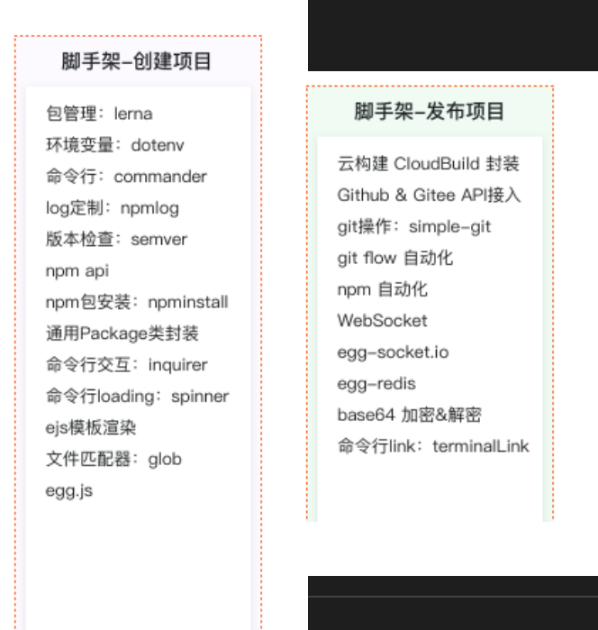

# 工程 <!-- omit in toc -->

> Author: tinfengyee
> Date: 2023-01-13 15:24:49
> LastEditTime: 2023-01-13 15:25:27
> Description: NO Desc

# 前言

# 参考资料

[npm-api](https://docs.npmjs.com/cli/v9/commands/npm)

[从 0 构建自己的脚手架/CLI知识体系（万字）](https://juejin.cn/post/6966119324478079007)[推荐]

[手把手教你写一个脚手架](https://juejin.cn/post/6932610749906812935) [推荐]

[rainbowdiary](https://juejin.cn/user/3491704662403623/posts?sort=newest)

[前端脚手架之原理和搭建基础](https://juejin.cn/post/7004018717164044301)

[项目脚手架的开发](https://juejin.cn/post/7026616225119617054)

案例：

[vue-cli](https://github.com/vuejs/vue-cli)

# 用到的库

## 文档

[dumi](https://d.umijs.org/guide)

# pnpm

[关于现代包管理器的深度思考——为什么现在我更推荐 pnpm 而不是 npm/yarn?](https://juejin.cn/post/6932046455733485575)

从 npm3 开始，包括 yarn，都着手来通过`扁平化依赖`的方式来解决这个问题。相信大家都有这样的体验，我明明就装个 `express`，为什么 `node_modules`里面多了这么多东西？

所有的依赖都被拍平到`node_modules`目录下，不再有很深层次的嵌套关系。这样在安装新的包时，根据 node require 机制，会不停往上级的`node_modules`当中去找，如果找到相同版本的包就不会重新安装，解决了大量包重复安装的问题，而且依赖层级也不会太深。

之前的问题是解决了，但仔细想想这种`扁平化`的处理方式，它真的就是无懈可击吗？并不是。它照样存在诸多问题，梳理一下:

- 1. 依赖结构的**不确定性**。
- 1. 扁平化算法本身的**复杂性**很高，耗时较长。
- 1. 项目中仍然可以**非法访问**没有声明过依赖的包

## Lerna 多项目/包管理工具

[Lerna: npm多包管理工具](https://juejin.cn/post/7019312549145362468)

[基于 Lerna 管理 packages 的 Monorepo 项目最佳实践](https://cloud.tencent.com/developer/article/1480677)

随着前端工程的日益复杂，越来越多的项目开始使用 monorepo。之前对于多个项目的管理，我们一般都是使用多个 git 仓库，但 monorepo 的宗旨就是用一个 git 仓库来管理多个子项目，所有的子项目都存放在根目录的`packages`目录下，那么一个子项目就代表一个`package`。如果你之前没接触过 monorepo 的概念，建议仔细看看[这篇文章](https://link.juejin.cn/?target=https%3A%2F%2Fwww.perforce.com%2Fblog%2Fvcs%2Fwhat-monorepo)以及开源的 monorepo 管理工具[lerna](https://link.juejin.cn/?target=https%3A%2F%2Fgithub.com%2Flerna%2Flerna%23readme)，项目目录结构可以参考一下 [babel 仓库](https://link.juejin.cn/?target=https%3A%2F%2Fgithub.com%2Fbabel%2Fbabel)。

pnpm 与 npm/yarn 另外一个很大的不同就是支持了 monorepo，体现在各个子命令的功能上，比如在根目录下 `pnpm add A -r`, 那么所有的 package 中都会被添加 A 这个依赖，当然也支持 `--filter`字段来对 package 进行过滤。

## semVer

[SemVer:棘手的部分](https://devpress.csdn.net/opensource/62f41ff47e6682346618807b.html)

## husky/lint-stage

[用 husky 和 lint-staged 构建代码检查工作流](https://cloud.tencent.com/developer/article/1967591)
