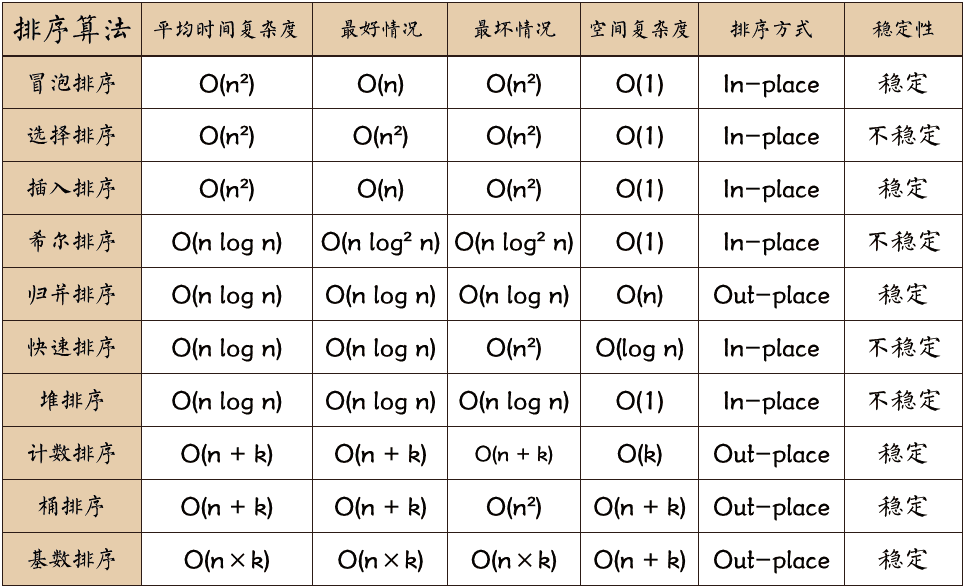

# 排序 <!-- omit in toc -->

> Author: tinfengyee
> Date: 2022-12-10 00:39:09
> LastEditTime: 2022-12-12 21:01:43
> Description: NO Desc

## 前言

排序算法可以分为内部排序和外部排序，内部排序是数据记录在内存中进行排序，而外部排序是因排序的数据很大，一次不能容纳全部的排序记录，在排序过程中需要访问外存。常见的内部排序算法有：**插入排序、希尔排序、选择排序、冒泡排序、归并排序、快速排序、堆排序、基数排序**等。

(常考的冒泡、选择、插入、归并(合并)、快排)用一张图概括：

**关于时间复杂度**：

1. 平方阶 (O(n2)) 排序 各类简单排序：直接插入、直接选择和冒泡排序。
2. 线性对数阶 (O(nlog2n)) 排序 快速排序、堆排序和归并排序；
3. O(n1+§)) 排序，§ 是介于 0 和 1 之间的常数。 希尔排序
4. 线性阶 (O(n)) 排序 基数排序，此外还有桶、箱排序。

**关于稳定性**：

稳定的排序算法：冒泡排序、插入排序、归并排序和基数排序。

不是稳定的排序算法：选择排序、快速排序、希尔排序、堆排序。

**名词解释**：

**n**：数据规模

**k**：“桶”的个数

**In-place**：占用常数内存，不占用额外内存

**Out-place**：占用额外内存

**稳定性**：排序后 2 个相等键值的顺序和排序之前它们的顺序相同

## 参考资料

- [x] [十大经典排序算法](https://github.com/hustcc/JS-Sorting-Algorithm)

- [x] [排序算法js版本](https://schacker.github.io/2018/03/22/%E6%8E%92%E5%BA%8F%E7%AE%97%E6%B3%95js%E7%89%88%E6%9C%AC/)

- [x] [awesome-coding-js](https://www.conardli.top/)

- [x] [awesome-coding-js'github](https://github.com/ConardLi/awesome-coding-js)
