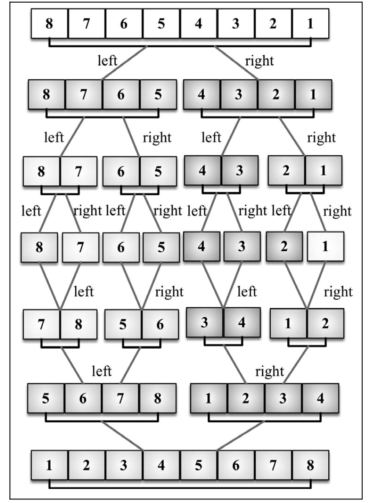

# 归并排序 <!-- omit in toc -->

> Author: tinfengyee
> Date: 2022-12-12 20:28:10
> LastEditTime: 2022-12-12 20:52:54
> Description: NO Desc

## 前言

利用`归并`的思想实现的排序方法，归并排序是第一个可以实际使用的排序算法。前三个排序算法性能不好，但归并排序性能不错，其复杂度为 O(nlog(n))。

## 步骤

该算法是采用分治法（`Divide and Conquer`）的一个非常典型的应用。（分治法将问题分成一些小的问题然后递归求解，而治的阶段则将分的阶段得到的各答案"修补"在一起，即分而治之)。

- 将已有序的子序列合并，得到完全有序的序列
- 即先使每个子序列有序，再使子序列段间有序
- 若将两个有序表合并成一个有序表，称为二路归并

分割：

- 将数组从中点进行分割，分为左、右两个数组
- 递归分割左、右数组，直到数组长度小于`2`

归并：

如果需要合并，那么左右两数组已经有序了。

创建一个临时存储数组`temp`，比较两数组第一个元素，将较小的元素加入临时数组

若左右数组有一个为空，那么此时另一个数组一定大于 `temp` 中的所有元素，直接将其所有元素加入`temp`



## 解法

```js
const { swap, randomArr } = require("./utils");

let arr = randomArr(5, 1, 10);

function mergeSort(arr) {
  if (arr.length < 2) return arr;
  const mid = Math.floor(arr.length / 2);

  const left = mergeSort(arr.slice(0, mid));
  const right = mergeSort(arr.slice(mid, arr.length));
  return merge(left, right);
}
// merge 是对数组的排序合并
function merge(left, right) {
  const result = [];
  let i = 0;
  let j = 0;
  while (i < left.length && j < right.length) {
    result.push(left[i] < right[j] ? left[i++] : right[j++]);
  }
  return result.concat(i < left.length ? left.slice(i) : right.slice(j));
}

// function merge(left, right) {
//   const temp = [];
//   while(left.length && right.length) {
//       if (left[0] < right[0]) {
//           temp.push(left.shift());
//       } else {
//           temp.push(right.shift());
//       }
//   }
//   while(left.length) {
//       temp.push(left.shift());
//   }
//   while(right.length) {
//       temp.push(right.shift());
//   }
//   return temp;
// }

console.log(mergeSort(arr));

```