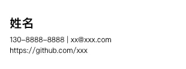

# 教你如何写初/高级前端简历

https://maimai.cn/article/detail?fid=1468108853&efid=YEjV8BmFr83Yf5pOh-bY5w

## 1. 前言

> 本文仅是针对初高级技术岗位哈。

参与了部门的实习生招聘工作，收到了很多同学的简历。发现有一些同学的简历写得不是很好看。 但是，仔细聊了聊之后发现，这些同学其实技术是很厉害的，只是不知道该如何写在简历上，不知道如何“包装”自己。

在这过程中，也给一些同学的简历提了一些建议，结合自己写简历的经验，在这里写一篇文章聊一聊，如有不足之处还望指出和补充。

本文的主要内容：

- 为什么要认真写简历
- 在写简历的时候，我们需要关心什么
- 如何更好的把自己展现在简历上
- 在写简历的时候以及简历写好之后，还需要准备什么
- ...

造起来 ~

### 1.1 简历的重要性

简历有多重要，我们来看看生活中的一个场景。

想想，你和女神第一次约会，是不是会穿上一身帅气西装，将头发梳成大人模样，不停照镜子今天的自己是不是最帅的。

找工作也是一样的道理，简历就是你的「门面」，是你的「敲门砖」。即使你的技术很牛逼，面试准备的很充分，简历如果写的不好，也有可能连面试的机会都没有。

HR 一天可能需要处理几百份甚至上千份简历，停留在一份简历上的时间可能不会超过 「30」 秒，有的简历甚至撑不过 「10」 秒就被 Pass 了，感兴趣的简历才会多花点时间看看。

很多人在抱怨自己投了无数份简历，在某招聘软件上沟通了无数的人，却没有收到面试，这时候你可能就需要想想自己的简历是否有认真准备。

并且，简历是伴随你的整个面试过程，是所有面试官了解你的唯一途径。

所以，简历真的很重要。

### 1.2 内推的重要性

这是个题外话。

来，我们再看看生活中的场景，比如你相亲的时候，介绍人是不是都会说很多对放的优点（别看我，我是听别人说的），经过介绍，你对对方的印象是不是就会好点？马上安排！

同样的道理，找工作可以找目标公司员工内推。内推人会先帮你过一下简历，和你聊一聊，然后给你提一些建议，最后把你的简历给老板，并且给一些正面评价！

所以，内推也真的很重要。

> 招人招人，阿里巴巴国际化部门 - AE技术部，前端/Java... 等各种技术岗位，P6/P7，目前还能上21届春招实习生的车，有意私聊。

## 2. 简历的内容

我对于简历的理解是这样的，简历不用很复杂，它是一份「简单的简历」，作用是让阅读简历的人能够快速、准确地捕捉到「有用信息」。

你只要讲清楚你是谁、你在哪儿、你在干什么就可以了。

不对不对，应该是这三点：

1. 你是谁
2. 你做了什么
3. 你哪方面比较牛逼

我觉得只要能优雅地展示出这三点，就够了。

### 2.1 个人信息

「个人信息三要素」：姓名、电话、邮箱。

这是信息是 HR 以及面试官能联系到你的途径，如果因为电话和邮箱联系不上而失去面试机会，真的是太亏了。

如果方便的话，简历上也可以留个微信，毕竟万一出现电话联系不上的情况，面试官还能加你微信找到你。

最近有碰到很多在国外的同学，需要特别注意的三点：

- 询问内推人，是否支持英文简历
- 询问内推人，是否支持国外电话，并且区号要写完整
- 由于时差，你在简历上最好留一个北京时间的方便联系时间段，减少沟通成本

遇到很多同学和我反馈，由于时差没接到面试官电话，然后需要通过我找面试官沟通约时间，这个沟通成本还是比较大的。

除了三要素之外，如果你有自己的 GitHub 或者博客，并且觉得还挺不错的，也可以写上来。但是，如果是一个没有 repo，没有 commit 等的 GitHub，还是不用写上来啦。

其它的一些个人信息：政治面貌、年龄、工作年限、是否单身等信息，其实没必要写在简历上啦。

对了，还有照片，如果真的对自己的长相很自信，并且真的想放照片（拦都拦不住的那种），那就放一个正经的证件照吧，可别拍了个自拍就往简历上放啊。

- 姓名
- 年龄
- 工作年限
- 学历
- 联系方式：手机+邮箱
- 个人网站、博客地址、github（加分项，但是请确保它是个加分项，别弄巧成拙）

### 2.2 教育经历

将学校、专业、入学时间/毕业时间等写清楚就好了。

教育经历对实习生/应届生来说是重点，社招就算非重点了。

「实习生/应届生」

每一段学历都要写完整。如果你觉得自己的学历是优势，或者绩点突出，可以加粗一下。

还需要注意一下毕业时间，一定是写准确，减少不必要的麻烦。

「社招」：写最高学历即可。

### 2.3 实习/工作经历

如实将自己的工作经历写清楚就好了。HR 和面试官比较关心的一般来说是以下几点：

- 公司名称：全程简称都写一下比较好
- 职位名称
- 在职时间：关心的是你工作是否稳定，有没有频繁跳槽
- 主要工作：简述一下你在公司做了什么事，具体在项目经历体现

「实习生/应届生」

如果有实习经历，一定要认真写，这是加分项，如果有大厂实习经历，真的香。

「社招」

「如实」填写自己最近 2 ~ 3 段工作经历就好了。

顺便提一句，对于一般人来说，还是不要频繁跳槽比较好。频繁跳槽会让人觉得在每段工作中没有足够的思考和沉淀。

### 2.4 项目经历

「项目经历」对于开发来说是一份简历「最重要」的部分！ 「项目经历」对于开发来说是一份简历「最重要」的部分！ 「项目经历」对于开发来说是一份简历「最重要」的部分！

既然是最重要的，选择困难症选手可能就犯难了，怎么样的项目应该被宠幸，写在简历上呢？

「1. 自己做的」

这点不用多说，一定得是自己做的项目，别看着别人项目牛逼，就拿来吹，面试和背调环节都可能穿帮的。

「2. 很熟悉的」

对于这个项目，你必须在业务和技术实现上都了如指掌：

- 业务上：这个项目的业务背景是什么，在业务上有什么比较牛逼的地方，推动了业务如何运行等等
- 技术实现上：这个项目的整体技术实现思路是怎样的，项目中用了什么比较牛逼的技术，解决了什么比较困难的问题等等

千万千万不能有这个想法：项目中有一个很牛逼的东西，但是不是你写的，你也完全不了解，但是就想写进项目里。

「3. 有亮点的」

> 好看的皮囊千篇一律，有趣的灵魂万里挑一

面试官比较在意的还是这个项目表面上看不到并且很有趣的东西。业务，技术都可。

- 这个项目做了什么牛逼的事情
- 你在项目里做了什么牛逼的事情
- 用了什么牛逼的技术解决了什么困难的问题
- ...

有的同学说，好像没有做过什么有亮点的项目，那简历上该如何写？

教你两招，写遇到比较难解决问题的项目和有产出的项目。

「4. 遇到比较难解决问题的」

在项目开发过程一定是会遇到一些问题的，如果不会，说明你在舒适区很久了，需要找点有挑战的事情做一下了。

找一个这样的项目，思考以下几点：

- 遇到了什么问题：页面性能问题
- 在这过程中你是如何排查问题的：如何排查页面性能问题的
- 是如何定位问题的：通过火焰图发现某段长列表加载性能有问题
- 最终是如何解决这个问题的：通过虚拟列表来解决长列表问题

「5. 有产出的」

有一种项目，面试官还是很喜欢的，就是「有产出」的项目，可以从以下几点来考虑：

- 思考：发现团队使用的开发模板比较混乱，代码书写也不规范
- 设计：设计一个统一的脚手架工具，并且设计代码规范
- 解决：开发 CLI 工具，并且通过 ESLint/Prettier 解决代码规范问题
- 推动：通过宣讲等方式推动工具成为团队基础产品

「总结：项目经历一定是面试官比较关心的部分，面试中一定会细问的，所以不要啰嗦，挑牛逼的、有意思的东西写，并且自己能讲明白的。」

### 2.5 专业技能

专业技能就是你掌握的技术栈。

很多人专业技能是这样写的，并且占了简历的一半内容：

- 精通 js/html/css
- 熟悉 es6
- 精通 vue
- 熟悉 ant-design 来写页面
- 熟悉 webpack 和 bable
- ...

这里有几个问题，也是写专业技能的时候「最忌讳」的：

1. 技术名词注意书写正确，`bable` 是啥，一看就不熟悉啊
2. 技术名词注意大小写，`JavaScript` / `HTML` / `CSS` / `Vue.js` 等等
3. 写着熟悉 xxx，精通 xxx，真的熟悉、精通吗

如果是我，我会这样用 “了解/熟悉/精通” 来描述我掌握的技术栈。

「了解」

- 会使用/用过
- 了解其思想
- 没有深入了解过
- 简单阅读过该技术的文档或者相关文章，知道这么一个东西

「熟悉」

- 有大量实践
- 有深入了解过原理，甚至阅读过源码
- 遇到复杂问题能够快速想出解决方案
- 他人提出问题时，可以快速想到答案或者思路

「精通」

- 深入理解原理
- 大量复杂场景实践经验
- 大量相关源码经验
- 可以指导他人

我有收到这样的实习生简历，专业技能里至少有 10 个以上的熟悉，3 个以上的精通。但是看他的项目经历，其实还是比较简单的，目测应该是不知道如何描述自己的技术栈。

「个人建议，专业技能这里不用写太多，只要写上自己的项目经历里未提到的一些想让面试官了解的技术栈即可。」

比如可能工作中是业务开发比较多，工程化涉及的比较少，但是你个人在工程化这块有所涉猎，研究的比较多，就可以把工程化写上，引导面试官来提问。

如果面试官感兴趣，会挑几个技术栈问你几个问题，如果答的也很棒，必须是妥妥的加分项。

当然，在这里写的技术栈都必须是你了解或者掌握的，否则被随便问两个问题就不会了，就变成减分项了。

「总结：专业技能请慎重对待，有可能是你的加分项，也有可能是你的减分项。」

### 2.6 其他

展现自己的时候到了，尽可能的展现自己吧。

- 社区：GitHub Star 10k，掘金 Lv6...
- 英语能力：雅思托福 CET，听说读写样样精通...
- 兴趣爱好：摄影/健身/旅游...
- 沟通：既能推动产品优化，又能推掉产品需求...

怎么牛逼怎么来，怎么简单怎么写。

## 3. 样式/排版

上面说道，简历就是为了让面试官准确、快速地捕捉有用信息。

所以，简历一定要「简单」。

### 3.1 样式

- 「一页足矣」：10 ~ 30秒的时间，可能你的第二页简历永远不会被看到
- 「留白原则」：留白是中国艺术作品创作中常用的一种手法，在简历里也适用，每一行文字、每个模块之间都需要有一些间隔，使全篇更为协调和突出重点
- 「标准字体」：宋体即可，别用那些花里胡哨的字体
- 「简历模板」：弱视觉效果，黑白蓝灰四色即可，简单高效。但也别太简约啊，别用表格

### 3.2 模块排序

关于简历上各个模块的排序，个人建议：

1. 个人信息
2. 实习/工作经历
3. 项目经历
4. 专业技能
5. 其他

「教育经历」这个模块，如果是实习生/应届生，应该将他放在「个人信」息和「实习/工作经历」之间，如果是社招，我觉得应该放在「其他」之前就好了，毕竟「工作经历」和「项目经历」才是重点。

## 4. 结束语

总结一下：

- 简历一定要投入百分百的精力认真写
- 简历一定要真实
- 写完简历并不代表就不看简历了，对简历内容一定要非常非常熟悉

其他暂时想不到了，我也不是 HR，所以上述内容仅是个人建议，作者本人写简历的时候也是这样写的。如果有不足之处或者观点不一致的地方，欢迎指出和讨论 ~