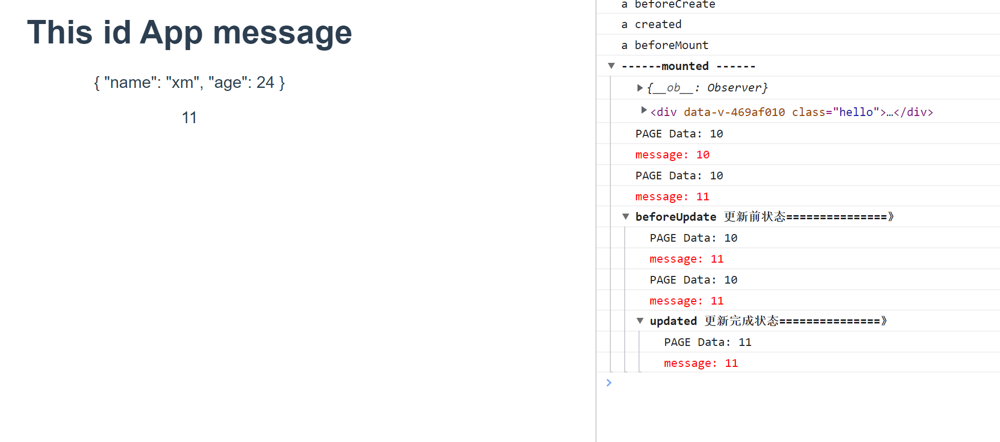
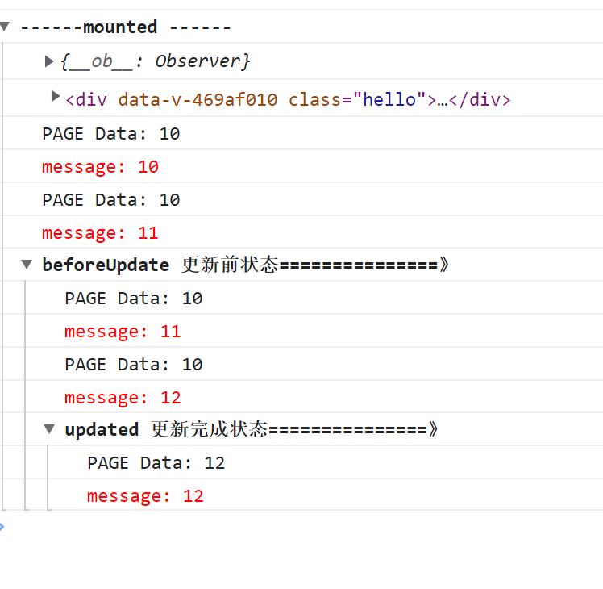
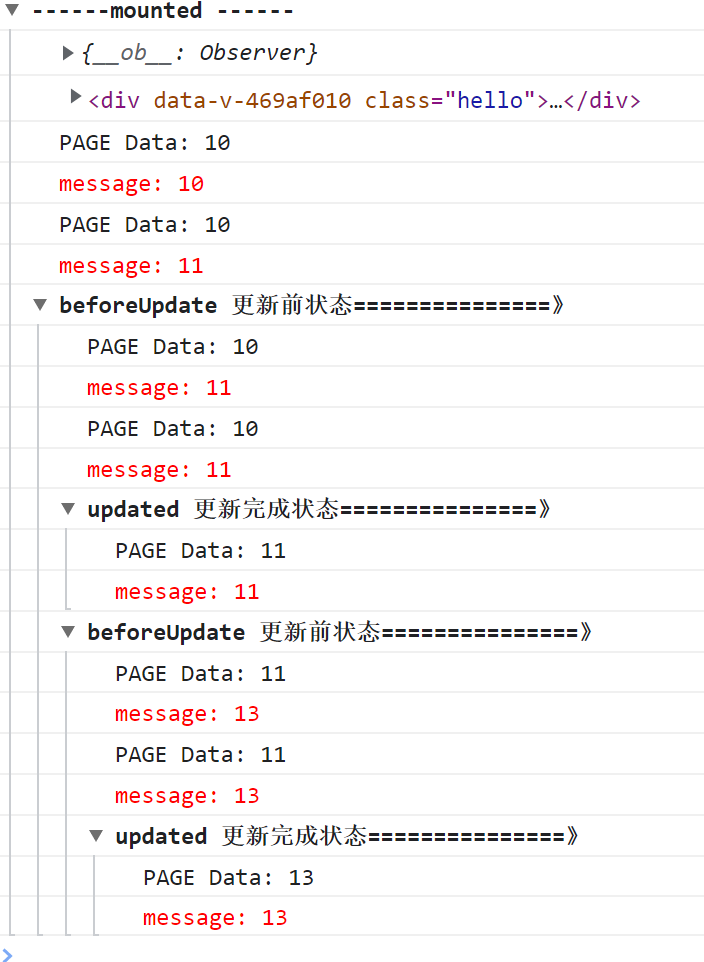
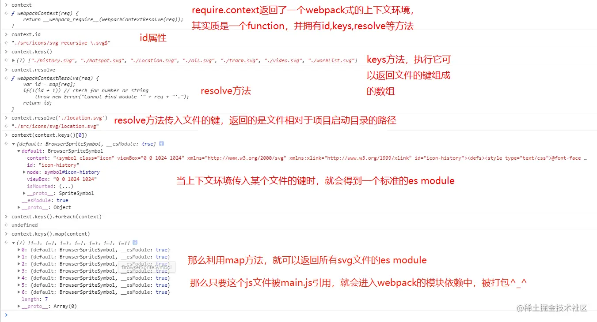

## 工具，生命周期函数

```
  beforeCreate(){console.log('beforeCreate')},
  created(){console.log('created')},
  beforeMount(){console.log('beforeMount')},
  mounted(){console.log('mounted')},
  beforeUpdate(){console.log('beforeUpdate')},
  updated(){console.log('updated')},
  destroyed(){console.log('destroyed')},
  beforeDestroy(){console.log('beforeDestroy')},
  activated(){console.log('activated')},
  deactivated(){console.log('deactivated')},
```

## mounted/beforeUpdate/updated 分析

代码

```js
<p>{{message}}</p>

mounted() {
    console.group("------mounted ------");
    console.log(this.$data);
    console.log(this.$el);
    console.log("PAGE Data: " + this.$el.children[2].innerText);
    console.log("%c%s", "color:red", "message: " + this.message);
    this.message += 1; // 修改数据 【情况二增加代码】
    console.log("PAGE Data: " + this.$el.children[2].innerText);
    console.log("%c%s", "color:red", "message: " + this.message);
  },
  beforeUpdate() {
    console.group("beforeUpdate 更新前状态===============》");
    console.log("PAGE Data: " + this.$el.children[2].innerText);
    console.log("%c%s", "color:red", "message: " + this.message);
    // this.message++; // 修改数据 【情况三增加代码】
    console.log("PAGE Data: " + this.$el.children[2].innerText);
    console.log("%c%s", "color:red", "message: " + this.message);
  },
  updated() {
    console.group("updated 更新完成状态===============》");
    console.log("PAGE Data: " + this.$el.children[2].innerText);
    console.log("%c%s", "color:red", "message: " + this.message);
    this.message = 13; // 修改数据 【情况四增加代码】
    console.groupEnd();
  },
```

### 情况一：

没有把 `<p>{{message}}</p>`挂载到页面 不会触发 `beforeUpdate`，因为 `beforeUpdate`针对视图层的数据发生改变才会触发。

### 情况二：

情况二新增自加代码，触发`beforeUpdate`，可以看到`beforeUpdate`时页面数据还是旧的，直到更新完成




### 情况三：

情况三在`beforeUpdate`增加代码，可以看到`beforeUpdate`不会再次触发，并且视图数据依然是旧的。



### 情况四：

情况四增加代码，可以看到在`Update`修改会再次触发`beforeUpdate`。

注意：如果把情况四代码修改成 `this.message++`会造成反复循环，造成页面卡死。



参考

[Vue 正确理解mounted、beforeUpdate、updated三个钩子函数的关系](https://blog.csdn.net/wq_ocean_/article/details/108918689)

## [用 `key` 管理可复用的元素](https://v2.cn.vuejs.org/v2/guide/conditional.html#用-key-管理可复用的元素)

Vue 会尽可能高效地渲染元素，通常会复用已有元素而不是从头开始渲染。这么做除了使 Vue 变得非常快之外，还有其它一些好处。例如，如果你允许用户在不同的登录方式之间切换：

```
<template v-if="loginType === 'username'">
  <label>Username</label>
  <input placeholder="Enter your username">
</template>
<template v-else>
  <label>Email</label>
  <input placeholder="Enter your email address">
</template>
```

那么在上面的代码中切换 `loginType` 将不会清除用户已经输入的内容。因为两个模板使用了相同的元素，`<input>` 不会被替换掉——仅仅是替换了它的 `placeholder`。

[就地更新](https://v2.cn.vuejs.org/v2/guide/list.html#%E7%BB%B4%E6%8A%A4%E7%8A%B6%E6%80%81)

当 Vue 正在更新使用 `v-for` 渲染的元素列表时，它默认使用“就地更新”的策略。如果数据项的顺序被改变，Vue 将不会移动 DOM 元素来匹配数据项的顺序，而是就地更新每个元素，并且确保它们在每个索引位置正确渲染。这个类似 Vue 1.x 的 `track-by="$index"`。

这个默认的模式是高效的，但是**只适用于不依赖子组件状态或临时 DOM 状态 (例如：表单输入值) 的列表渲染输出**。

为了给 Vue 一个提示，以便它能跟踪每个节点的身份，从而重用和重新排序现有元素，你需要为每项提供一个唯一 `key` attribute：

```
<div v-for="item in items" v-bind:key="item.id">
  <!-- 内容 -->
</div>
```

建议尽可能在使用 `v-for` 时提供 `key` attribute，除非遍历输出的 DOM 内容非常简单，或者是刻意依赖默认行为以获取性能上的提升。

因为它是 Vue 识别节点的一个通用机制，`key` 并不仅与 `v-for` 特别关联。后面我们将在指南中看到，它还具有其它用途。

不要使用对象或数组之类的非基本类型值作为 `v-for` 的 `key`。请用字符串或数值类型的值。

更多 `key` attribute 的细节用法请移步至 [`key` 的 API 文档](https://cn.vuejs.org/v2/api/#key)。

- **预期**：`number | string | boolean (2.4.2 新增) | symbol (2.5.12 新增)`

  `key` 的特殊 attribute 主要用在 Vue 的虚拟 DOM 算法，在新旧 nodes 对比时辨识 VNodes。如果不使用 key，Vue 会使用一种最大限度减少动态元素并且尽可能的尝试就地修改/复用相同类型元素的算法。而使用 key 时，它会基于 key 的变化重新排列元素顺序，并且会移除 key 不存在的元素。

  有相同父元素的子元素必须有**独特的 key**。重复的 key 会造成渲染错误。

  最常见的用例是结合 `v-for`：

  ```
  <ul>
    <li v-for="item in items" :key="item.id">...</li>
  </ul>
  ```

  它也可以用于强制替换元素/组件而不是重复使用它。当你遇到如下场景时它可能会很有用：

  - 完整地触发组件的生命周期钩子
  - 触发过渡

  例如：

  ```
  <transition>
    <span :key="text">{{ text }}</span>
  </transition>
  ```

  当 `text` 发生改变时，`<span>` 总是会被替换而不是被修改，因此会触发过渡。

## [`v-if` vs `v-show`](https://v2.cn.vuejs.org/v2/guide/conditional.html#v-if-vs-v-show)

`v-if` 是“真正”的条件渲染，因为它会确保在切换过程中条件块内的事件监听器和子组件适当地被销毁和重建。

`v-if` 也是**惰性的**：如果在初始渲染时条件为假，则什么也不做——直到条件第一次变为真时，才会开始渲染条件块。

相比之下，`v-show` 就简单得多——不管初始条件是什么，元素总是会被渲染，并且只是简单地基于 CSS 进行切换。

一般来说，`v-if` 有更高的切换开销，而 `v-show` 有更高的初始渲染开销。因此，如果需要非常频繁地切换，则使用 `v-show` 较好；如果在运行时条件很少改变，则使用 `v-if` 较好。

的·

## Vue **不能检测**数组和对象的变化。[深入响应式原理](https://v2.cn.vuejs.org/v2/guide/reactivity.html#检测变化的注意事项)中有相关的讨论。

## [`v-for` 与 `v-if` 一同使用](https://v2.cn.vuejs.org/v2/guide/list.html#v-for-与-v-if-一同使用)

当它们处于同一节点，`v-for` 的优先级比 `v-if` 更高，这意味着 `v-if` 将分别重复运行于每个 `v-for` 循环中。当你只想为*部分*项渲染节点时，这种优先级的机制会十分有用，如下：

上面的代码将只渲染未完成的 todo。

而如果你的目的是有条件地跳过循环的执行，那么可以将 `v-if` 置于外层元素 (或 [`) 上。如：

```
<ul v-if="todos.length">
  <li v-for="todo in todos">
    {{ todo }}
  </li>
</ul>
<p v-else>No todos left!</p>
```

## [解析 DOM 模板时的注意事项](https://v2.cn.vuejs.org/v2/guide/components.html#解析-DOM-模板时的注意事项)

```
  <ul>
    <li
      is="todo-item"
      v-for="(todo, index) in todos"
      v-bind:key="todo.id"
      v-bind:title="todo.title"
      v-on:remove="todos.splice(index, 1)"
    ></li>
  </ul>
```

注意[这里](https://v2.cn.vuejs.org/v2/guide/list.html#%E5%9C%A8%E7%BB%84%E4%BB%B6%E4%B8%8A%E4%BD%BF%E7%94%A8-v-for)的 `is="todo-item"` attribute。这种做法在使用 DOM 模板时是十分必要的，因为在 `<ul>` 元素内只有 `<li>` 元素会被看作有效内容。这样做实现的效果与 `<todo-item>` 相同，但是可以避开一些潜在的浏览器解析错误。查看 [DOM 模板解析说明](https://v2.cn.vuejs.org/v2/guide/components.html#解析-DOM-模板时的注意事项) 来了解更多信息。

## [基础组件的自动化全局注册](https://v2.cn.vuejs.org/v2/guide/components-registration.html#基础组件的自动化全局注册)

如果你恰好使用了 webpack (或在内部使用了 webpack 的 [Vue CLI 3+](https://github.com/vuejs/vue-cli))，那么就可以使用 `require.context` 只全局注册这些非常通用的基础组件。这里有一份可以让你在应用入口文件 (比如 `src/main.js`) 中全局导入基础组件的示例代码：

```
import Vue from 'vue'
import upperFirst from 'lodash/upperFirst'
import camelCase from 'lodash/camelCase'

const requireComponent = require.context(
  // 其组件目录的相对路径
  './components',
  // 是否查询其子目录
  false,
  // 匹配基础组件文件名的正则表达式
  /Base[A-Z]\w+\.(vue|js)$/
)

requireComponent.keys().forEach(fileName => {
  // 获取组件配置
  const componentConfig = requireComponent(fileName)

  // 获取组件的 PascalCase 命名
  const componentName = upperFirst(
    camelCase(
      // 获取和目录深度无关的文件名
      fileName
        .split('/')
        .pop()
        .replace(/\.\w+$/, '')
    )
  )

  // 全局注册组件
  Vue.component(
    componentName,
    // 如果这个组件选项是通过 `export default` 导出的，
    // 那么就会优先使用 `.default`，
    // 否则回退到使用模块的根。
    componentConfig.default || componentConfig
  )
})
```

记住**全局注册的行为必须在根 Vue 实例 (通过 `new Vue`) 创建之前发生**。[这里](https://github.com/chrisvfritz/vue-enterprise-boilerplate/blob/master/src/components/_globals.js)有一个真实项目情景下的示例。

[**一文说明白 webpack require.context的使用**](https://juejin.cn/post/7008093793433944100)



**ps:常用的使用场景：**

1. icon图标组件加载
2. 路由模块批量加载
3. 全局组件批量加载
4. store模块的加载

## [在组件上使用 `v-model`](https://v2.cn.vuejs.org/v2/guide/components.html#在组件上使用-v-model)

自定义事件也可以用于创建支持 `v-model` 的自定义输入组件。记住：

```
<input v-model="searchText">
```

等价于：

```
<input
  v-bind:value="searchText"
  v-on:input="searchText = $event.target.value"
>
```

当用在组件上时，`v-model` 则会这样：

```
<custom-input
  v-bind:value="searchText"
  v-on:input="searchText = $event"
></custom-input>
```

为了让它正常工作，这个组件内的 `<input>` 必须：

- 将其 `value` attribute 绑定到一个名叫 `value` 的 prop 上
- 在其 `input` 事件被触发时，将新的值通过自定义的 `input` 事件抛出

写成代码之后是这样的：

```
Vue.component('custom-input', {
  props: ['value'],
  template: `
    <input
      v-bind:value="value"
      v-on:input="$emit('input', $event.target.value)"
    >
  `
})
```

现在 `v-model` 就应该可以在这个组件上完美地工作起来了：

```
<custom-input v-model="searchText"></custom-input>
```

到目前为止，关于组件自定义事件你需要了解的大概就这些了，如果你阅读完本页内容并掌握了它的内容，我们会推荐你再回来把[自定义事件](https://v2.cn.vuejs.org/v2/guide/components-custom-events.html)读完。

## [自定义组件的 `v-model`](https://v2.cn.vuejs.org/v2/guide/components-custom-events.html#自定义组件的-v-model)

一个组件上的 `v-model` **默认会利用名为 `value` 的 prop 和名为 `input` 的事件**，但是像单选框、复选框等类型的输入控件可能会将 `value` attribute 用于[不同的目的](https://developer.mozilla.org/en-US/docs/Web/HTML/Element/input/checkbox#Value)。`model` 选项可以用来避免这样的冲突：

```
Vue.component('base-checkbox', {
  model: {
    prop: 'checked',
    event: 'change'
  },
  props: {
    checked: Boolean
  },
  template: `
    <input
      type="checkbox"
      v-bind:checked="checked"
      v-on:change="$emit('change', $event.target.checked)"
    >
  `
})
```

现在在这个组件上使用 `v-model` 的时候：

```
<base-checkbox v-model="lovingVue"></base-checkbox>
```

这里的 `lovingVue` 的值将会传入这个名为 `checked` 的 prop。同时当 `<base-checkbox>` 触发一个 `change` 事件并附带一个新的值的时候，这个 `lovingVue` 的 property 将会被更新。

注意你仍然需要在组件的 `props` 选项里声明 `checked` 这个 prop

## 动态组件 & 异步组件

## [动态组件](https://v2.cn.vuejs.org/v2/guide/components.html#动态组件)

有的时候，在不同组件之间进行动态切换是非常有用的，比如在一个多标签的界面里：

```
<!-- 组件会在 `currentTabComponent` 改变时改变 -->
<component v-bind:is="currentTabComponent"></component>
```

在上述示例中，`currentTabComponent` 可以包括

- 已注册组件的名字，或
- 一个组件的选项对象

你可以在[这里](https://codesandbox.io/s/github/vuejs/v2.vuejs.org/tree/master/src/v2/examples/vue-20-dynamic-components)查阅并体验完整的代码，或在[这个版本](https://codesandbox.io/s/github/vuejs/v2.vuejs.org/tree/master/src/v2/examples/vue-20-dynamic-components-with-binding)了解绑定组件选项对象，而不是已注册组件名的示例。

请留意，这个 attribute 可以用于常规 HTML 元素，但这些元素将被视为组件，这意味着所有的 attribute **都会作为 DOM attribute 被绑定**。对于像 `value` 这样的 property，若想让其如预期般工作，你需要使用 [`.prop` 修饰器](https://v2.cn.vuejs.org/v2/api/#v-bind)。

到目前为止，关于动态组件你需要了解的大概就这些了，如果你阅读完本页内容并掌握了它的内容，我们会推荐你再回来把[动态和异步组件](https://v2.cn.vuejs.org/v2/guide/components-dynamic-async.html)读完。

## 

## [在动态组件上使用 `keep-alive`](https://v2.cn.vuejs.org/v2/guide/components-dynamic-async.html#在动态组件上使用-keep-alive)

我们之前在一个多标签的界面中使用 `is` attribute 来切换不同的组件：

## [异步组件](https://v2.cn.vuejs.org/v2/guide/components-dynamic-async.html#异步组件)

在大型应用中，我们可能需要将应用分割成小一些的代码块，并且只在需要的时候才从服务器加载一个模块。为了简化，Vue 允许你以一个工厂函数的方式定义你的组件，这个工厂函数会异步解析你的组件定义。Vue 只有在这个组件需要被渲染的时候才会触发该工厂函数，且会把结果缓存起来供未来重渲染。例如：

```
Vue.component('async-example', function (resolve, reject) {
  setTimeout(function () {
    // 向 `resolve` 回调传递组件定义
    resolve({
      template: '<div>I am async!</div>'
    })
  }, 1000)
})
```

如你所见，这个工厂函数会收到一个 `resolve` 回调，这个回调函数会在你从服务器得到组件定义的时候被调用。你也可以调用 `reject(reason)` 来表示加载失败。这里的 `setTimeout` 是为了演示用的，如何获取组件取决于你自己。一个推荐的做法是将异步组件和 [webpack 的 code-splitting 功能](https://webpack.js.org/guides/code-splitting/)一起配合使用：

```
Vue.component('async-webpack-example', function (resolve) {
  // 这个特殊的 `require` 语法将会告诉 webpack
  // 自动将你的构建代码切割成多个包，这些包
  // 会通过 Ajax 请求加载
  require(['./my-async-component'], resolve)
})
```

你也可以在工厂函数中返回一个 `Promise`，所以把 webpack 2 和 ES2015 语法加在一起，我们可以这样使用动态导入：

```
Vue.component(
  'async-webpack-example',
  // 这个动态导入会返回一个 `Promise` 对象。
  () => import('./my-async-component')
)
```

当使用[局部注册](https://v2.cn.vuejs.org/v2/guide/components-registration.html#局部注册)的时候，你也可以直接提供一个返回 `Promise` 的函数：

```
new Vue({
  // ...
  components: {
    'my-component': () => import('./my-async-component')
  }
})
```

## [传入一个对象的所有 property](https://v2.cn.vuejs.org/v2/guide/components-props.html#传入一个对象的所有-property)

下面的模板：

```
<blog-post v-bind="post"></blog-post>
```

等价于：

```
<blog-post
  v-bind:id="post.id"
  v-bind:title="post.title"
></blog-post>
```

## [vue动态组件，不同的组件有不同的props，如何设置？](https://segmentfault.com/q/1010000010284133)

[关于vue动态组件，不确定属性props传值问题](https://blog.csdn.net/Cai_975520397/article/details/103649698)

用`v-bind`

```
// template部分
component(
    v-bind:is="someCondition",
    v-bind="curProps")

// script部分(ts)
private someCondition: boolean = true

get curComponent() {
  return this.someCondition
    /** 组件One */
    ? CompOne
    /** 组件Two */
    : CompTwo;
}

get curProps() {
  return this.someCondition
    ? {
      prop1: '我是组件One所需的第一个prop属性',
      prop2: '我是组件One所需的第二个prop属性',
    }
    : {
      prop3: '我是组件Two所需的第一个prop属性',
    };
}
```

## [禁用 Attribute 继承](https://v2.cn.vuejs.org/v2/guide/components-props.html#禁用-Attribute-继承) `inheriAttrs`/`$attrs`

如果你**不**希望组件的根元素继承 attribute，你可以在组件的选项中设置 `inheritAttrs: false`。例如：

```
Vue.component('my-component', {
  inheritAttrs: false,
  // ...
})
```

这尤其适合配合实例的 `$attrs` property 使用，该 property 包含了传递给一个组件的 attribute 名和 attribute 值，例如：

```
{
  required: true,
  placeholder: 'Enter your username'
}
```

有了 `inheritAttrs: false` 和 `$attrs`，你就可以手动决定这些 attribute 会被赋予哪个元素。在撰写[基础组件](https://v2.cn.vuejs.org/v2/style-guide/#基础组件名-强烈推荐)的时候是常会用到的：

```
Vue.component('base-input', {
  inheritAttrs: false,
  props: ['label', 'value'],
  template: `
    <label>
      {{ label }}
      <input
        v-bind="$attrs"
        v-bind:value="value"
        v-on:input="$emit('input', $event.target.value)"
      >
    </label>
  `
})
```

注意 `inheritAttrs: false` 选项**不会**影响 `style` 和 `class` 的绑定。

这个模式允许你在使用基础组件的时候更像是使用原始的 HTML 元素，而不会担心哪个元素是真正的根元素：

```
<base-input
  label="Username:"
  v-model="username"
  required
  placeholder="Enter your username"
></base-input>
```

说白话就是 `inheriAttrs`就是是否让传入的 `props`是否显示在根元素上。

```
inheriAttrs: true (default)
<divclass="hello active" name="potnam" id="potid" age="2">

inheriAttrs: false
<div data-v-469af010="" class="hello active">
```

## [将原生事件绑定到组件](https://v2.cn.vuejs.org/v2/guide/components-custom-events.html#将原生事件绑定到组件) `$listeners`

```
$attrs: （…）
$children: []
$createElement: ƒ (a, b, c, d)
$el: div
$listeners: Object
$options: {parent: VueComponent, _parentVnode: VNode, propsData: {…}, _parentListeners: {…}, _renderChildren: undefined, …}
$parent: VueComponent {_uid: 1, _isVue: true, __v_skip: true, _scope: EffectScope, $options: {…}, …}
$refs: {}
$root: Vue {_uid: 0, _isVue: true, __v_skip: true, _scope: EffectScope, $options: {…}, …}
$scopedSlots: {$stable: true, $key: undefined, $hasNormal: false}
$slots: {}
$vnode: VNode
value: （…）
$data: （…）
$isServer: （…）
$props: （…）
$ssrContext: undefined
```

你可能有很多次想要在一个组件的根元素上直接监听一个原生事件。这时，你可以使用 `v-on` 的 `.native` 修饰符：

```
<base-input v-on:focus.native="onFocus"></base-input>
```

在有的时候这是很有用的，不过在你尝试监听一个类似 `<input>` 的非常特定的元素时，这并不是个好主意。比如上述 `<base-input>` 组件可能做了如下重构，所以根元素实际上是一个 `<label>` 元素：

```
<label>
  {{ label }}
  <input
    v-bind="$attrs"
    v-bind:value="value"
    v-on:input="$emit('input', $event.target.value)"
  >
</label>
```

这时，父级的 `.native` 监听器将静默失败。它不会产生任何报错，但是 `onFocus` 处理函数不会如你预期地被调用。

为了解决这个问题，Vue 提供了一个 `$listeners` property，它是一个对象，里面包含了作用在这个组件上的所有监听器。例如：

```
{
  focus: function (event) { /* ... */ }
  input: function (value) { /* ... */ },
}
```

有了这个 `$listeners` property，你就可以配合 `v-on="$listeners"` 将所有的事件监听器指向这个组件的某个特定的子元素。对于类似 `<input>` 的你希望它也可以配合 `v-model` 工作的组件来说，为这些监听器创建一个类似下述 `inputListeners` 的计算属性通常是非常有用的：

```
Vue.component('base-input', {
  inheritAttrs: false,
  props: ['label', 'value'],
  computed: {
    inputListeners: function () {
      var vm = this
      // `Object.assign` 将所有的对象合并为一个新对象
      return Object.assign({},
        // 我们从父级添加所有的监听器
        this.$listeners,
        // 然后我们添加自定义监听器，
        // 或覆写一些监听器的行为
        {
          // 这里确保组件配合 `v-model` 的工作
          input: function (event) {
            vm.$emit('input', event.target.value)
          }
        }
      )
    }
  },
  template: `
    <label>
      {{ label }}
      <input
        v-bind="$attrs"
        v-bind:value="value"
        v-on="inputListeners"
      >
    </label>
  `
})
```

现在 `<base-input>` 组件是一个**完全透明的包裹器**了，也就是说它可以完全像一个普通的 `<input>` 元素一样使用了：所有跟它相同的 attribute 和监听器都可以工作，不必再使用 `.native` 监听器。

## [`.sync` 修饰符](https://v2.cn.vuejs.org/v2/guide/components-custom-events.html#sync-修饰符)

> 2.3.0+ 新增

在有些情况下，我们可能需要对一个 prop 进行“双向绑定”。不幸的是，真正的双向绑定会带来维护上的问题，因为子组件可以变更父组件，且在父组件和子组件两侧都没有明显的变更来源。

这也是为什么我们推荐以 `update:myPropName` 的模式触发事件取而代之。举个例子，在一个包含 `title` prop 的假设的组件中，我们可以用以下方法表达对其赋新值的意图：

```
this.$emit('update:title', newTitle)
```

然后父组件可以监听那个事件并根据需要更新一个本地的数据 property。例如：

```
<text-document
  v-bind:title="doc.title"
  v-on:update:title="doc.title = $event"
></text-document>
```

为了方便起见，我们为这种模式提供一个缩写，即 `.sync` 修饰符：

```
<text-document v-bind:title.sync="doc.title"></text-document>
```

注意带有 `.sync` 修饰符的 `v-bind` **不能**和表达式一起使用 (例如 `v-bind:title.sync=”doc.title + ‘!’”` 是无效的)。取而代之的是，你只能提供你想要绑定的 property 名，类似 `v-model`。

当我们用一个对象同时设置多个 prop 的时候，也可以将这个 `.sync` 修饰符和 `v-bind` 配合使用：

```
<text-document v-bind.sync="doc"></text-document>
```

这样会把 `doc` 对象中的每一个 property (如 `title`) 都作为一个独立的 prop 传进去，然后各自添加用于更新的 `v-on` 监听器。

将 `v-bind.sync` 用在一个字面量的对象上，例如 `v-bind.sync=”{ title: doc.title }”`，是无法正常工作的，因为在解析一个像这样的复杂表达式的时候，有很多边缘情况需要考虑。

## 插槽(具名slot，作用域slot)

### 具名插槽

对于这样的情况，`<slot>` 元素有一个特殊的 attribute：`name`。这个 attribute 可以用来定义额外的插槽：

```
<div class="container">
  <header>
    <slot name="header"></slot>
  </header>
  <main>
    <slot></slot>
  </main>
  <footer>
    <slot name="footer"></slot>
  </footer>
</div>
```

一个不带 `name` 的 `<slot>` 出口会带有隐含的名字“default”。

在向具名插槽提供内容的时候，我们可以在一个 `<template>` 元素上使用 `v-slot` 指令，并以 `v-slot` 的参数的形式提供其名称：

```
<base-layout>
  <template v-slot:header>
    <h1>Here might be a page title</h1>
  </template>

  <template v-slot:default>
    <p>A paragraph for the main content.</p>
    <p>And another one.</p>
  </template>

  <template v-slot:footer>
    <p>Here's some contact info</p>
  </template>
</base-layout>
```

注意 **`v-slot` 只能添加在 `<template>` 上** (只有[一种例外情况](https://v2.cn.vuejs.org/v2/guide/components-slots.html#独占默认插槽的缩写语法))，这一点和已经废弃的 [`slot` attribute](https://v2.cn.vuejs.org/v2/guide/components-slots.html#废弃了的语法) 不同。

### 作用域插槽

有时让插槽内容能够访问子组件中才有的数据是很有用的。例如，设想一个带有如下模板的 `<current-user>` 组件：

```
<span>
  <slot>{{ user.lastName }}</slot>
</span>
```

我们可能想换掉备用内容，用名而非姓来显示。如下：

```
<current-user>
  {{ user.firstName }}
</current-user>
```

然而上述代码不会正常工作，因为只有 `<current-user>` 组件可以访问到 `user`，而我们提供的内容是在父级渲染的。

为了让 `user` 在父级的插槽内容中可用，我们可以将 `user` 作为 `<slot>` 元素的一个 attribute 绑定上去：

```
<span>
  <slot v-bind:user="user">
    {{ user.lastName }}
  </slot>
</span>
```

绑定在 `<slot>` 元素上的 attribute 被称为**插槽 prop**。现在在父级作用域中，我们可以使用带值的 `v-slot` 来定义我们提供的插槽 prop 的名字：

```
<current-user>
  <template v-slot:default="slotProps">
    {{ slotProps.user.firstName }}
  </template>
</current-user>
```

在这个例子中，我们选择将包含所有插槽 prop 的对象命名为 `slotProps`，但你也可以使用任意你喜欢的名字。

这种写法还可以更简单。就像假定未指明的内容对应默认插槽一样，不带参数的 `v-slot` 被假定对应默认插槽：

```
<current-user v-slot="slotProps">
  {{ slotProps.user.firstName }}
</current-user>
```

注意默认插槽的缩写语法**不能**和具名插槽混用，因为它会导致作用域不明确：

```
<!-- 无效，会导致警告 -->
<current-user v-slot="slotProps">
  {{ slotProps.user.firstName }}
  <template v-slot:other="otherSlotProps">
    slotProps is NOT available here
  </template>
</current-user>
```

只要出现多个插槽，请始终为*所有的*插槽使用完整的基于 `<template>` 的语法：

```
<current-user>
  <template v-slot:default="slotProps">
    {{ slotProps.user.firstName }}
  </template>

  <template v-slot:other="otherSlotProps">
    ...
  </template>
</current-user>
```

[解构插槽 Prop](https://v2.cn.vuejs.org/v2/guide/components-slots.html#解构插槽-Prop)

作用域插槽的内部工作原理是将你的插槽内容包裹在一个拥有单个参数的函数里：

```
function (slotProps) {
  // 插槽内容
}
```

这意味着 `v-slot` 的值实际上可以是任何能够作为函数定义中的参数的 JavaScript 表达式。所以在支持的环境下 ([单文件组件](https://v2.cn.vuejs.org/v2/guide/single-file-components.html)或[现代浏览器](https://developer.mozilla.org/zh-CN/docs/Web/JavaScript/Reference/Operators/Destructuring_assignment#浏览器兼容))，你也可以使用 [ES2015 解构](https://developer.mozilla.org/zh-CN/docs/Web/JavaScript/Reference/Operators/Destructuring_assignment#解构对象)来传入具体的插槽 prop，如下：

```
<current-user v-slot="{ user }">
  {{ user.firstName }}
</current-user>
```

这样可以使模板更简洁，尤其是在该插槽提供了多个 prop 的时候。它同样开启了 prop 重命名等其它可能，例如将 `user` 重命名为 `person`：

```
<current-user v-slot="{ user: person }">
  {{ person.firstName }}
</current-user>
```

你甚至可以定义后备内容，用于插槽 prop 是 undefined 的情形：

```
<current-user v-slot="{ user = { firstName: 'Guest' } }">
  {{ user.firstName }}
</current-user>
```

跟 `v-on` 和 `v-bind` 一样，`v-slot` 也有缩写，

即把参数之前的所有内容 (`v-slot:`) 替换为字符 `#`。例如 `v-slot:header` 可以被重写为 `#header`：

```
<base-layout>
  <template #header>
    <h1>Here might be a page title</h1>
  </template>

  <p>A paragraph for the main content.</p>
  <p>And another one.</p>

  <template #footer>
    <p>Here's some contact info</p>
  </template>
</base-layout>
```

然而，和其它指令一样，该缩写只在其有参数的时候才可用。这意味着以下语法是无效的：

```
<!-- 这样会触发一个警告 -->
<current-user #="{ user }">
  {{ user.firstName }}
</current-user>
```

如果你希望使用缩写的话，你必须始终以明确插槽名取而代之：

```
<current-user #default="{ user }">
  {{ user.firstName }}
</current-user>
```

### [其它示例](https://v2.cn.vuejs.org/v2/guide/components-slots.html#其它示例)

**插槽 prop 允许我们将插槽转换为可复用的模板，这些模板可以基于输入的 prop 渲染出不同的内容。**这在设计封装数据逻辑同时允许父级组件自定义部分布局的可复用组件时是最有用的。

例如，我们要实现一个 `<todo-list>` 组件，它是一个列表且包含布局和过滤逻辑：

```
<ul>
  <li
    v-for="todo in filteredTodos"
    v-bind:key="todo.id"
  >
    {{ todo.text }}
  </li>
</ul>
```

我们可以将每个 todo 作为父级组件的插槽，以此通过父级组件对其进行控制，然后将 `todo` 作为一个插槽 prop 进行绑定：

```
<ul>
  <li
    v-for="todo in filteredTodos"
    v-bind:key="todo.id"
  >
    <!--
    我们为每个 todo 准备了一个插槽，
    将 `todo` 对象作为一个插槽的 prop 传入。
    -->
    <slot name="todo" v-bind:todo="todo">
      <!-- 后备内容 -->
      {{ todo.text }}
    </slot>
  </li>
</ul>
```

现在当我们使用 `<todo-list>` 组件的时候，我们可以选择为 todo 定义一个不一样的 `<template>` 作为替代方案，并且可以从子组件获取数据：

```
<todo-list v-bind:todos="todos">
  <template v-slot:todo="{ todo }">
    <span v-if="todo.isComplete">✓</span>
    {{ todo.text }}
  </template>
</todo-list>
```

这只是作用域插槽用武之地的冰山一角。想了解更多现实生活中的作用域插槽的用法，我们推荐浏览诸如 [Vue Virtual Scroller](https://github.com/Akryum/vue-virtual-scroller)、[Vue Promised](https://github.com/posva/vue-promised) 和 [Portal Vue](https://github.com/LinusBorg/portal-vue) 等库。

## [访问子组件实例或子元素](https://v2.cn.vuejs.org/v2/guide/components-edge-cases.html#访问子组件实例或子元素) `ref`

尽管存在 prop 和事件，有的时候你仍可能需要在 JavaScript 里直接访问一个子组件。为了达到这个目的，你可以通过 `ref` 这个 attribute 为子组件赋予一个 ID 引用。例如：

```
<base-input ref="usernameInput"></base-input>
```

现在在你已经定义了这个 `ref` 的组件里，你可以使用：

```
this.$refs.usernameInput
```

来访问这个 `<base-input>` 实例，以便不时之需。比如程序化地从一个父级组件聚焦这个输入框。在刚才那个例子中，该 `<base-input>` 组件也可以使用一个类似的 `ref` 提供对内部这个指定元素的访问，例如：

```
<input ref="input">
```

甚至可以通过其父级组件定义方法：

```
methods: {
  // 用来从父级组件聚焦输入框
  focus: function () {
    this.$refs.input.focus()
  }
}
```

这样就允许父级组件通过下面的代码聚焦 `<base-input>` 里的输入框：

```
this.$refs.usernameInput.focus()
```

当 `ref` 和 `v-for` 一起使用的时候，你得到的 ref 将会是一个包含了对应数据源的这些子组件的数组。

`$refs` 只会在组件**渲染完成之后生效**，并且它们不是响应式的。这仅作为一个用于直接操作子组件的“逃生舱”——你应该避免在模板或计算属性中访问 `$refs`。

## [依赖注入](https://v2.cn.vuejs.org/v2/guide/components-edge-cases.html#依赖注入)`provide``inject`

`provide` 选项允许我们指定我们想要**提供**给后代组件的数据/方法。在这个例子中，就是 `<google-map>` 内部的 `getMap` 方法：

```
provide: function () {
  return {
    getMap: this.getMap
  }
}
```

然后在任何后代组件里，我们都可以使用 `inject` 选项来接收指定的我们想要添加在这个实例上的 property：

```
inject: ['getMap']
```

你可以在[这里](https://codesandbox.io/s/github/vuejs/v2.vuejs.org/tree/master/src/v2/examples/vue-20-dependency-injection)看到完整的示例。相比 `$parent` 来说，这个用法可以让我们在*任意*后代组件中访问 `getMap`，而不需要暴露整个 `<google-map>` 实例。这允许我们更好的持续研发该组件，而不需要担心我们可能会改变/移除一些子组件依赖的东西。同时这些组件之间的接口是始终明确定义的，就和 `props` 一样。

实际上，你可以把依赖注入看作一部分“大范围有效的 prop”，除了：

- 祖先组件不需要知道哪些后代组件使用它提供的 property
- 后代组件不需要知道被注入的 property 来自哪里

然而，依赖注入还是有负面影响的。它将你应用程序中的组件与它们当前的组织方式耦合起来，使重构变得更加困难。同时所提供的 property 是非响应式的。这是出于设计的考虑，因为使用它们来创建一个中心化规模化的数据跟[使用 `$root`](https://v2.cn.vuejs.org/v2/guide/components-edge-cases.html#访问根实例)做这件事都是不够好的。如果你想要共享的这个 property 是你的应用特有的，而不是通用化的，或者如果你想在祖先组件中更新所提供的数据，那么这意味着你可能需要换用一个像 [Vuex](https://github.com/vuejs/vuex) 这样真正的状态管理方案了。

你可以在 [API 参考文档](https://cn.vuejs.org/v2/api/#provide-inject)学习更多关于依赖注入的知识。

## [程序化的事件侦听器](https://v2.cn.vuejs.org/v2/guide/components-edge-cases.html#程序化的事件侦听器)`$on/$emit/$once/$Off`

>  注意：Vue3 废弃了这个API
>
> [`$on`,`$off`并`$once`删除实例方法](https://v3-migration.vuejs.org/breaking-changes/events-api.html)。组件实例不再实现事件发射器接口。

现在，你已经知道了 `$emit` 的用法，它可以被 `v-on` 侦听，但是 Vue 实例同时在其事件接口中提供了其它的方法。我们可以：

- 通过 `$on(eventName, eventHandler)` 侦听一个事件
- 通过 `$once(eventName, eventHandler)` 一次性侦听一个事件
- 通过 `$off(eventName, eventHandler)` 停止侦听一个事件

你通常不会用到这些，但是当你需要在一个组件实例上手动侦听事件时，它们是派得上用场的。它们也可以用于代码组织工具。例如，你可能经常看到这种集成一个第三方库的模式：

```
// 一次性将这个日期选择器附加到一个输入框上
// 它会被挂载到 DOM 上。
mounted: function () {
  // Pikaday 是一个第三方日期选择器的库
  this.picker = new Pikaday({
    field: this.$refs.input,
    format: 'YYYY-MM-DD'
  })
},
// 在组件被销毁之前，
// 也销毁这个日期选择器。
beforeDestroy: function () {
  this.picker.destroy()
}
```

这里有两个潜在的问题：

- 它需要在这个组件实例中保存这个 `picker`，如果可以的话最好只有生命周期钩子可以访问到它。这并不算严重的问题，但是它可以被视为杂物。
- 我们的建立代码独立于我们的清理代码，这使得我们比较难于程序化地清理我们建立的所有东西。

你应该通过一个程序化的侦听器解决这两个问题：

```
mounted: function () {
  var picker = new Pikaday({
    field: this.$refs.input,
    format: 'YYYY-MM-DD'
  })

  this.$once('hook:beforeDestroy', function () {
    picker.destroy()
  })
}
```

使用了这个策略，我甚至可以让多个输入框元素同时使用不同的 Pikaday，每个新的实例都程序化地在后期清理它自己：

```
mounted: function () {
  this.attachDatepicker('startDateInput')
  this.attachDatepicker('endDateInput')
},
methods: {
  attachDatepicker: function (refName) {
    var picker = new Pikaday({
      field: this.$refs[refName],
      format: 'YYYY-MM-DD'
    })

    this.$once('hook:beforeDestroy', function () {
      picker.destroy()
    })
  }
}
```

查阅[这个示例](https://codesandbox.io/s/github/vuejs/v2.vuejs.org/tree/master/src/v2/examples/vue-20-programmatic-event-listeners)可以了解到完整的代码。注意，即便如此，如果你发现自己不得不在单个组件里做很多建立和清理的工作，最好的方式通常还是创建更多的模块化组件。在这个例子中，我们推荐创建一个可复用的 `<input-datepicker>` 组件。

想了解更多程序化侦听器的内容，请查阅[实例方法 / 事件](https://cn.vuejs.org/v2/api/#实例方法-事件)相关的 API。

注意 Vue 的事件系统不同于浏览器的 [EventTarget API](https://developer.mozilla.org/zh-CN/docs/Web/API/EventTarget)。尽管它们工作起来是相似的，但是 `$emit`、`$on`, 和 `$off` 并不是 `dispatchEvent`、`addEventListener` 和 `removeEventListener` 的别名。

## [组件之间的循环引用](https://v2.cn.vuejs.org/v2/guide/components-edge-cases.html#组件之间的循环引用)

假设你需要构建一个文件目录树，像访达或资源管理器那样的。你可能有一个 `<tree-folder>` 组件，模板是这样的：

```
<p>
  <span>{{ folder.name }}</span>
  <tree-folder-contents :children="folder.children"/>
</p>
```

还有一个 `<tree-folder-contents>` 组件，模板是这样的：

```
<ul>
  <li v-for="child in children">
    <tree-folder v-if="child.children" :folder="child"/>
    <span v-else>{{ child.name }}</span>
  </li>
</ul>
```

当你仔细观察的时候，你会发现这些组件在渲染树中互为对方的后代*和*祖先——一个悖论！

我们先把两个组件称为 A 和 B。模块系统发现它需要 A，但是首先 A 依赖 B，但是 B 又依赖 A，但是 A 又依赖 B，如此往复。这变成了一个循环，不知道如何不经过其中一个组件而完全解析出另一个组件。为了解决这个问题，我们需要给模块系统一个点，在那里“A *反正*是需要 B 的，但是我们不需要先解析 B。”

在我们的例子中，把 `<tree-folder>` 组件设为了那个点。我们知道那个产生悖论的子组件是 `<tree-folder-contents>` 组件，所以我们会等到生命周期钩子 `beforeCreate` 时去注册它：

```
beforeCreate: function () {
  this.$options.components.TreeFolderContents = require('./tree-folder-contents.vue').default
}
```

或者，在本地注册组件的时候，你可以使用 webpack 的异步 `import`：

```
components: {
  TreeFolderContents: () => import('./tree-folder-contents.vue')
}
```

这样问题就解决了！

## [控制更新](https://v2.cn.vuejs.org/v2/guide/components-edge-cases.html#控制更新)/[强制更新](https://v2.cn.vuejs.org/v2/guide/components-edge-cases.html#强制更新)

如果你发现你自己需要在 Vue 中做一次强制更新，99.9% 的情况，是你在某个地方做错了事。

你可能还没有留意到[数组](https://cn.vuejs.org/v2/guide/list.html#注意事项)或[对象](https://cn.vuejs.org/v2/guide/list.html#对象变更检测注意事项)的变更检测注意事项，或者你可能依赖了一个未被 Vue 的响应式系统追踪的状态。

然而，如果你已经做到了上述的事项仍然发现在极少数的情况下需要手动强制更新，那么你可以通过 [`$forceUpdate`](https://v2.cn.vuejs.org/v2/api/#vm-forceUpdate) 来做这件事。

> 迫使 Vue 实例重新渲染。注意它仅仅影响实例本身和插入插槽内容的子组件，而不是所有子组件。

- - https://v2.cn.vuejs.org/v2/guide/reactivity.html#异步更新队列)

## [通过 `v-once` 创建低开销的静态组件](https://v2.cn.vuejs.org/v2/guide/components-edge-cases.html#通过-v-once-创建低开销的静态组件)

渲染普通的 HTML 元素在 Vue 中是非常快速的，但有的时候你可能有一个组件，这个组件包含了**大量**静态内容。在这种情况下，你可以在根元素上添加 `v-once` attribute 以确保这些内容只计算一次然后缓存起来，就像这样：

```
Vue.component('terms-of-service', {
  template: `
    <div v-once>
      <h1>Terms of Service</h1>
      ... a lot of static content ...
    </div>
  `
})
```

再说一次，试着不要过度使用这个模式。当你需要渲染大量静态内容时，极少数的情况下它会给你带来便利，除非你非常留意渲染变慢了，不然它完全是没有必要的——再加上它在后期会带来很多困惑。例如，设想另一个开发者并不熟悉 `v-once` 或漏看了它在模板中，他们可能会花很多个小时去找出模板为什么无法正确更新。

# 可复用性 & 组合

## 混入`mixin`

键值对同名的取组件的，生命周期钩子函数先执行混入再执行组件的

```
// 定义一个混入对象
var myMixin = {
  created: function () {
    this.hello()
  },
  methods: {
    hello: function () {
      console.log('hello from mixin!')
    }
  }
}

// 定义一个使用混入对象的组件
var Component = Vue.extend({
  mixins: [myMixin]
})
```

请谨慎使用全局混入，因为它会影响每个单独创建的 Vue 实例 (包括第三方组件)。大多数情况下，只应当应用于自定义选项，就像上面示例一样。推荐将其作为[插件](https://v2.cn.vuejs.org/v2/guide/plugins.html)发布，以避免重复应用混入。

## [自定义指令](https://v2.cn.vuejs.org/v2/guide/custom-directive.html)

```
// 注册一个全局自定义指令 `v-focus`
Vue.directive('focus', {
  // 当被绑定的元素插入到 DOM 中时……
  inserted: function (el) {
    // 聚焦元素
    el.focus()
  }
})
```

如果想注册局部指令，组件中也接受一个 `directives` 的选项：

```
directives: {
  focus: {
    // 指令的定义
    inserted: function (el) {
      el.focus()
    }
  }
}
```

然后你可以在模板中任何元素上使用新的 `v-focus` property，如下：

```
<input v-focus>
```

一个指令定义对象可以提供如下几个钩子函数 (均为可选)：

- `bind`：只调用一次，指令第一次绑定到元素时调用。在这里可以进行一次性的初始化设置。
- `inserted`：被绑定元素插入父节点时调用 (仅保证父节点存在，但不一定已被插入文档中)。
- `update`：所在组件的 VNode 更新时调用，**但是可能发生在其子 VNode 更新之前**。指令的值可能发生了改变，也可能没有。但是你可以通过比较更新前后的值来忽略不必要的模板更新 (详细的钩子函数参数见下)。

我们会在[稍后](https://v2.cn.vuejs.org/v2/guide/render-function.html#虚拟-DOM)讨论[渲染函数](https://v2.cn.vuejs.org/v2/guide/render-function.html)时介绍更多 VNodes 的细节。

- `componentUpdated`：指令所在组件的 VNode **及其子 VNode** 全部更新后调用。
- `unbind`：只调用一次，指令与元素解绑时调用。

接下来我们来看一下钩子函数的参数 (即 `el`、`binding`、`vnode` 和 `oldVnode`)。


指令钩子函数会被传入以下参数：

- `el`：指令所绑定的元素，可以用来直接操作 DOM。

- ```
  binding
  ```

  ：一个对象，包含以下 property：

  - `name`：指令名，不包括 `v-` 前缀。
  - `value`：指令的绑定值，例如：`v-my-directive="1 + 1"` 中，绑定值为 `2`。
  - `oldValue`：指令绑定的前一个值，仅在 `update` 和 `componentUpdated` 钩子中可用。无论值是否改变都可用。
  - `expression`：字符串形式的指令表达式。例如 `v-my-directive="1 + 1"` 中，表达式为 `"1 + 1"`。
  - `arg`：传给指令的参数，可选。例如 `v-my-directive:foo` 中，参数为 `"foo"`。
  - `modifiers`：一个包含修饰符的对象。例如：`v-my-directive.foo.bar` 中，修饰符对象为 `{ foo: true, bar: true }`。

- `vnode`：Vue 编译生成的虚拟节点。移步 [VNode API](https://v2.cn.vuejs.org/v2/api/#VNode-接口) 来了解更多详情。

- `oldVnode`：上一个虚拟节点，仅在 `update` 和 `componentUpdated` 钩子中可用。

除了 `el` 之外，其它参数都应该是只读的，切勿进行修改。如果需要在钩子之间共享数据，建议通过元素的 [`dataset`](https://developer.mozilla.org/zh-CN/docs/Web/API/HTMLElement/dataset) 来进行。

指令的参数可以是动态的。例如，在 `v-mydirective:[argument]="value"` 中，`argument` 参数可以根据组件实例数据进行更新！这使得自定义指令可以在应用中被灵活使用。

## 渲染函数 & JSX

### 渲染函数

注意`scopedSlots`是个函数，

用`this.$scopedSlots.default()` 替换 `this.$slots.default`

> 1. 所有的 `$slots` 现在都会作为函数暴露在 `$scopedSlots` 中。如果你在使用渲染函数，不论当前插槽是否带有作用域，我们都推荐始终通过 `$scopedSlots` 访问它们。这不仅仅使得在未来添加作用域变得简单，也可以让你最终轻松迁移到所有插槽都是函数的 Vue 3。

```
    <anchored-heading :level="2">
      <div class="div1">div1</div>
      text-node
      <div class="div2">div2</div>
      <template v-slot:header="{user}"> header{{ user.name }} </template>
    </anchored-heading>
```

组件

```
Vue.component('anchored-heading', {
  render: function (createElement) {
    // 创建 kebab-case 风格的 ID
    console.log(this.$slots.default); //  [VNode, VNode, VNode]
    console.log(this.$scopedSlots.default()); //  [VNode, VNode, VNode]
    var headingId = getChildrenTextContent(this.$slots.default)
      .toLowerCase()
      .replace(/\W+/g, '-')
      .replace(/(^-|-$)/g, '');
    return createElement('h' + this.level, [
      createElement(
        'a',
        {
          attrs: {
            name: headingId,
            href: '#' + headingId,
          },
        },
        this.$scopedSlots.default()
      ),
    ]);
  },
  props: {
    level: {
      type: Number,
      required: true,
    },
  },
});
```

### [JSX](https://v2.cn.vuejs.org/v2/guide/render-function.html#JSX)

https://github.com/vuejs/jsx-vue2

写组件的时候还是使用组件实例，如访问slots

```
  render() {
    return (
      <div>
        {this.$scopedSlots.default()}
      </div>
    );
  },
```

调用的时候

```vue
render() {
  return (
    <MyComponent>
      <header slot="header">header</header>
      <footer slot="footer">footer</footer>
    </MyComponent>
  )
}
```

简单贴下使用例子

```vue
Vue.component('child-com', {
  props: {
    lv: Number,
  },
  data(){
    return{
      list:[1,2,3,4],
      user: {
        name: 'xm',
        age: 26
      }
    }
  },
  methods: {
    test() {
      console.log(this.user);
    }
  },
  render() {
    const Tag = 'h' + this.lv;{/* 动态标签 */}
    return (
      <div>
        {this.list.map(e => <div>{e}</div>)}{/* 循环 */}
        <Tag class={{default: true}} vOn:click={this.test}>{this.$scopedSlots.default()}</Tag>{/* 监听事件 */}
        <Tag class={[this.lv === 1 ? 'header-slot': 'header-two']}>{/* 三目运算符定义class */}
          {this.$scopedSlots?.header&&this.$scopedSlots.header({ ...this.user})}{/* 作用域插槽传参 */}
        </Tag>
      </div>
    );
  },
  
  
});
Vue.component('anchored-heading', {
  render() {
    const scopedSlots = {
      default: () => <div class="haa">default</div>,
      header: props => <div class="header">{props.name}-{props.age}</div>
    };
    return <child-com lv={1} scopedSlots={scopedSlots}>22</child-com>;
  },
  props: {
    level: {
      type: Number,
      required: true,
    },
  },
});
```

另外参考

[在vue中使用jsx语法](https://www.cnblogs.com/jiangxiaobo/p/14193051.html)

### [函数式组件](https://v2.cn.vuejs.org/v2/guide/render-function.html#函数式组件)

之前创建的锚点标题组件是比较简单，没有管理任何状态，也没有监听任何传递给它的状态，也没有生命周期方法。实际上，它只是一个接受一些 prop 的函数。在这样的场景下，我们可以将组件标记为 `functional`，这意味它无状态 (没有[响应式数据](https://v2.cn.vuejs.org/v2/api/#选项-数据))，也没有实例 (没有 `this` 上下文)。一个**函数式组件**就像这样：

```
Vue.component('my-component', {
  functional: true,
  // Props 是可选的
  props: {
    // ...
  },
  // 为了弥补缺少的实例
  // 提供第二个参数作为上下文
  render: function (createElement, context) {
    // ...
  }
})
```

## 插件

插件通常用来为 Vue 添加全局功能。插件的功能范围没有严格的限制——一般有下面几种：

1. 添加全局方法或者 property。如：[vue-custom-element](https://github.com/karol-f/vue-custom-element)
2. 添加全局资源：指令/过滤器/过渡等。如 [vue-touch](https://github.com/vuejs/vue-touch)
3. 通过全局混入来添加一些组件选项。如 [vue-router](https://github.com/vuejs/vue-router)
4. 添加 Vue 实例方法，通过把它们添加到 `Vue.prototype` 上实现。
5. 一个库，提供自己的 API，同时提供上面提到的一个或多个功能。如 [vue-router](https://github.com/vuejs/vue-router)


通过全局方法 `Vue.use()` 使用插件。它需要在你调用 `new Vue()` 启动应用之前完成：

```
// 调用 `MyPlugin.install(Vue)`
Vue.use(MyPlugin, { someOption: true })
```

### [开发插件](https://v2.cn.vuejs.org/v2/guide/plugins.html#开发插件)

Vue.js 的插件应该暴露一个 `install` 方法。这个方法的第一个参数是 `Vue` 构造器，第二个参数是一个可选的选项对象：

```
MyPlugin.install = function (Vue, options) {
  // 1. 添加全局方法或 property
  Vue.myGlobalMethod = function () {
    // 逻辑...
  }

  // 2. 添加全局资源
  Vue.directive('my-directive', {
    bind (el, binding, vnode, oldVnode) {
      // 逻辑...
    }
    ...
  })

  // 3. 注入组件选项
  Vue.mixin({
    created: function () {
      // 逻辑...
    }
    ...
  })

  // 4. 添加实例方法
  Vue.prototype.$myMethod = function (methodOptions) {
    // 逻辑...
  }
}
```

## 过滤器

Vue.js 允许你自定义过滤器，可被用于一些常见的文本格式化。过滤器可以用在两个地方：**双花括号插值和 `v-bind` 表达式** (后者从 2.1.0+ 开始支持)。过滤器应该被添加在 JavaScript 表达式的尾部，由“管道”符号指示：

```
<!-- 在双花括号中 -->
{{ message | capitalize }}

<!-- 在 `v-bind` 中 -->
<div v-bind:id="rawId | formatId"></div>
```

你可以在一个组件的选项中定义本地的过滤器：

```
filters: {
  capitalize: function (value) {
    if (!value) return ''
    value = value.toString()
    return value.charAt(0).toUpperCase() + value.slice(1)
  }
}
```

过滤器是 JavaScript 函数，因此可以接收参数：

```
{{ message | filterA('arg1', arg2) }}
```

这里，`filterA` 被定义为接收三个参数的过滤器函数。其中 `message` 的值作为第一个参数，普通字符串 `'arg1'` 作为第二个参数，表达式 `arg2` 的值作为第三个参数。

### [Vue3弃用了该API](https://v3-migration.vuejs.org/breaking-changes/filters.html)

迁移策略[#](https://v3-migration.vuejs.org/breaking-changes/filters.html#migration-strategy)

我们建议不要使用过滤器，而是用计算的属性或方法替换它们。


全局过滤器[#](https://v3-migration.vuejs.org/breaking-changes/filters.html#global-filters)

如果您使用的是全局注册的过滤器，然后在整个应用程序中使用，那么将它们替换为每个单独组件中的计算属性或方法可能并不方便。

相反，您可以通过[globalProperties](https://vuejs.org/api/application.html#app-config-globalproperties)使您的全局过滤器可用于所有组件：

js

```
// main.jsconst app = createApp(App)app.config.globalProperties.$filters = {  currencyUSD(value) {    return '$' + value  }}
```

`$filters`然后您可以使用此对象修复所有模板，如下所示：

html

```
<template>  <h1>Bank Account Balance</h1>  <p>{{ $filters.currencyUSD(accountBalance) }}</p></template>
```

请注意，使用这种方法，您只能使用方法，而不是计算属性，因为后者只有在单个组件的上下文中定义时才有意义。

## 单文件组件

### [Vue Loader](https://vue-loader.vuejs.org/zh/)

## [TypeScript 支持](https://v2.cn.vuejs.org/v2/guide/typescript.html)

# 路由

## [从零开始简单的路由](https://v2.cn.vuejs.org/v2/guide/routing.html#从零开始简单的路由)

如果你只需要非常简单的路由而不想引入一个功能完整的路由库，可以像这样动态渲染一个页面级的组件：

```
const NotFound = { template: '<p>Page not found</p>' }
const Home = { template: '<p>home page</p>' }
const About = { template: '<p>about page</p>' }

const routes = {
  '/': Home,
  '/about': About
}

new Vue({
  el: '#app',
  data: {
    currentRoute: window.location.pathname
  },
  computed: {
    ViewComponent () {
      return routes[this.currentRoute] || NotFound
    }
  },
  render (h) { return h(this.ViewComponent) }
})
```

结合 HTML5 History API，你可以建立一个麻雀虽小但是五脏俱全的客户端路由器。可以直接看[实例应用](https://github.com/chrisvfritz/vue-2.0-simple-routing-example)。

# 状态管理

由于状态零散地分布在许多组件和组件之间的交互中，大型应用复杂度也经常逐渐增长。为了解决这个问题，Vue 提供 [vuex](https://github.com/vuejs/vuex)：我们有受到 Elm 启发的状态管理库。vuex 甚至集成到 [vue-devtools](https://github.com/vuejs/vue-devtools)，无需配置即可进行[时光旅行调试 (time travel debugging)](https://raw.githubusercontent.com/vuejs/v2.vuejs.org/master/src/images/devtools-timetravel.gif)。

## [简单状态管理起步使用](https://v2.cn.vuejs.org/v2/guide/state-management.html#简单状态管理起步使用)

经常被忽略的是，Vue 应用中原始 `data` 对象的实际来源——当访问数据对象时，一个 Vue 实例只是简单的代理访问。所以，如果你有一处需要被多个实例间共享的状态，可以简单地通过维护一份数据来实现共享：

```
var sourceOfTruth = {}

var vmA = new Vue({
  data: sourceOfTruth
})

var vmB = new Vue({
  data: sourceOfTruth
})
```

现在当 `sourceOfTruth` 发生变更，`vmA` 和 `vmB` 都将自动地更新它们的视图。子组件们的每个实例也会通过 `this.$root.$data` 去访问。现在我们有了唯一的数据来源，但是，调试将会变为噩梦。任何时间，我们应用中的任何部分，在任何数据改变后，都不会留下变更过的记录。

为了解决这个问题，我们采用一个简单的 **store 模式**：

```
var store = {
  debug: true,
  state: {
    message: 'Hello!'
  },
  setMessageAction (newValue) {
    if (this.debug) console.log('setMessageAction triggered with', newValue)
    this.state.message = newValue
  },
  clearMessageAction () {
    if (this.debug) console.log('clearMessageAction triggered')
    this.state.message = ''
  }
}
```

需要注意，所有 store 中 state 的变更，都放置在 store 自身的 action 中去管理。这种集中式状态管理能够被更容易地理解哪种类型的变更将会发生，以及它们是如何被触发。当错误出现时，我们现在也会有一个 log 记录 bug 之前发生了什么。

此外，每个实例/组件仍然可以拥有和管理自己的私有状态：

```
var vmA = new Vue({
  data: {
    privateState: {},
    sharedState: store.state
  }
})

var vmB = new Vue({
  data: {
    privateState: {},
    sharedState: store.state
  }
})
```


重要的是，注意你不应该在 action 中 替换原始的状态对象 - 组件和 store 需要引用同一个共享对象，变更才能够被观察到。

接着我们继续延伸约定，组件不允许直接变更属于 store 实例的 state，而应执行 action 来分发 (dispatch) 事件通知 store 去改变，我们最终达成了 [Flux](https://facebook.github.io/flux/) 架构。这样约定的好处是，我们能够记录所有 store 中发生的 state 变更，同时实现能做到记录变更、保存状态快照、历史回滚/时光旅行的先进的调试工具。

说了一圈其实又回到了 [Vuex](https://github.com/vuejs/vuex)，如果你已经读到这儿，或许可以去尝试一下！

# 服务端渲染

## [SSR 完全指南](https://v2.cn.vuejs.org/v2/guide/ssr.html#SSR-完全指南)

在 2.3 发布后我们发布了一份完整的构建 Vue 服务端渲染应用的指南。这份指南非常深入，适合已经熟悉 Vue、webpack 和 Node.js 开发的开发者阅读。请移步 [v2.ssr.vuejs.org](https://v2.ssr.vuejs.org/zh/)。

## [Nuxt.js](https://v2.cn.vuejs.org/v2/guide/ssr.html#Nuxt-js)

从头搭建一个服务端渲染的应用是相当复杂的。幸运的是，我们有一个优秀的社区项目 [Nuxt.js](https://nuxtjs.org/) 让这一切变得非常简单。Nuxt 是一个基于 Vue 生态的更高层的框架，为开发服务端渲染的 Vue 应用提供了极其便利的开发体验。更酷的是，你甚至可以用它来做为静态站生成器。推荐尝试。

# 深入响应式原理

现在是时候深入一下了！Vue 最独特的特性之一，是其非侵入性的响应式系统。数据模型仅仅是普通的 JavaScript 对象。而当你修改它们时，视图会进行更新。这使得状态管理非常简单直接，不过理解其工作原理同样重要，这样你可以避开一些常见的问题。在这个章节，我们将研究一下 Vue 响应式系统的底层的细节。

## [如何追踪变化](https://v2.cn.vuejs.org/v2/guide/reactivity.html#如何追踪变化)

[在 Vue Mastery 观看视频讲解](https://www.vuemastery.com/courses/advanced-components/build-a-reactivity-system)

当你把一个普通的 JavaScript 对象传入 Vue 实例作为 `data` 选项，Vue 将遍历此对象所有的 property，并使用 [`Object.defineProperty`](https://developer.mozilla.org/zh-CN/docs/Web/JavaScript/Reference/Global_Objects/Object/defineProperty) 把这些 property 全部转为 [getter/setter](https://developer.mozilla.org/zh-CN/docs/Web/JavaScript/Guide/Working_with_Objects#定义_getters_与_setters)。`Object.defineProperty` 是 ES5 中一个无法 shim 的特性，这也就是 Vue 不支持 IE8 以及更低版本浏览器的原因。

这些 getter/setter 对用户来说是不可见的，但是在内部它们让 Vue 能够追踪依赖，在 property 被访问和修改时通知变更。这里需要注意的是不同浏览器在控制台打印数据对象时对 getter/setter 的格式化并不同，所以建议安装 [vue-devtools](https://github.com/vuejs/vue-devtools) 来获取对检查数据更加友好的用户界面。

每个组件实例都对应一个 **watcher** 实例，它会在组件渲染的过程中把“接触”过的数据 property 记录为依赖。之后当依赖项的 setter 触发时，会通知 watcher，从而使它关联的组件重新渲染。


## [检测变化的注意事项](https://v2.cn.vuejs.org/v2/guide/reactivity.html#检测变化的注意事项)

由于 JavaScript 的限制，Vue **不能检测**数组和对象的变化。尽管如此我们还是有一些办法来回避这些限制并保证它们的响应性。

### [对于对象](https://v2.cn.vuejs.org/v2/guide/reactivity.html#对于对象)

Vue 无法检测 property 的添加或移除。由于 Vue 会在初始化实例时对 property 执行 getter/setter 转化，所以 property 必须在 `data` 对象上存在才能让 Vue 将它转换为响应式的。例如：

```
var vm = new Vue({
  data:{
    a:1
  }
})

// `vm.a` 是响应式的

vm.b = 2
// `vm.b` 是非响应式的
```

对于已经创建的实例，Vue 不允许动态添加根级别的响应式 property。但是，可以使用 `Vue.set(object, propertyName, value)` 方法向嵌套对象添加响应式 property。例如，对于：

```
Vue.set(vm.someObject, 'b', 2)
```

您还可以使用 `vm.$set` 实例方法，这也是全局 `Vue.set` 方法的别名：

```
this.$set(this.someObject,'b',2)
```

有时你可能需要为已有对象赋值多个新 property，比如使用 `Object.assign()` 或 `_.extend()`。但是，这样添加到对象上的新 property 不会触发更新。在这种情况下，你应该用原对象与要混合进去的对象的 property 一起创建一个新的对象。

```
// 代替 `Object.assign(this.someObject, { a: 1, b: 2 })`
this.someObject = Object.assign({}, this.someObject, { a: 1, b: 2 })
```

### [对于数组](https://v2.cn.vuejs.org/v2/guide/reactivity.html#对于数组)

Vue 不能检测以下数组的变动：

1. 当你利用索引直接设置一个数组项时，例如：`vm.items[indexOfItem] = newValue`
2. 当你修改数组的长度时，例如：`vm.items.length = newLength`

举个例子：

```
var vm = new Vue({
  data: {
    items: ['a', 'b', 'c']
  }
})
vm.items[1] = 'x' // 不是响应性的
vm.items.length = 2 // 不是响应性的
```

为了解决第一类问题，以下两种方式都可以实现和 `vm.items[indexOfItem] = newValue` 相同的效果，同时也将在响应式系统内触发状态更新：

```
// Vue.set
Vue.set(vm.items, indexOfItem, newValue)
// Array.prototype.splice
vm.items.splice(indexOfItem, 1, newValue)
```

你也可以使用 [`vm.$set`](https://cn.vuejs.org/v2/api/#vm-set) 实例方法，该方法是全局方法 `Vue.set` 的一个别名：

```
vm.$set(vm.items, indexOfItem, newValue)
```

为了解决第二类问题，你可以使用 `splice`：

```
vm.items.splice(newLength)
```

## [声明响应式 property](https://v2.cn.vuejs.org/v2/guide/reactivity.html#声明响应式-property)

由于 Vue 不允许动态添加根级响应式 property，所以你必须在初始化实例前声明所有根级响应式 property，哪怕只是一个空值：

```
var vm = new Vue({
  data: {
    // 声明 message 为一个空值字符串
    message: ''
  },
  template: '<div>{{ message }}</div>'
})
// 之后设置 `message`
vm.message = 'Hello!'
```

如果你未在 `data` 选项中声明 `message`，Vue 将警告你渲染函数正在试图访问不存在的 property。

这样的限制在背后是有其技术原因的，它消除了在依赖项跟踪系统中的一类边界情况，也使 Vue 实例能更好地配合类型检查系统工作。但与此同时在代码可维护性方面也有一点重要的考虑：`data` 对象就像组件状态的结构 (schema)。提前声明所有的响应式 property，可以让组件代码在未来修改或给其他开发人员阅读时更易于理解。

## [异步更新队列](https://v2.cn.vuejs.org/v2/guide/reactivity.html#异步更新队列)*

可能你还没有注意到，Vue 在更新 DOM 时是**异步**执行的。只要侦听到数据变化，Vue 将开启一个队列，并缓冲在同一事件循环中发生的所有数据变更。如果同一个 watcher 被多次触发，只会被推入到队列中一次。这种在缓冲时去除重复数据对于避免不必要的计算和 DOM 操作是非常重要的。然后，在下一个的事件循环“tick”中，Vue 刷新队列并执行实际 (已去重的) 工作。Vue 在内部对异步队列尝试使用原生的 `Promise.then`、`MutationObserver` 和 `setImmediate`，如果执行环境不支持，则会采用 `setTimeout(fn, 0)` 代替。

例如，当你设置 `vm.someData = 'new value'`，该组件不会立即重新渲染。当刷新队列时，组件会在下一个事件循环“tick”中更新。多数情况我们不需要关心这个过程，但是如果你想基于更新后的 DOM 状态来做点什么，这就可能会有些棘手。虽然 Vue.js 通常鼓励开发人员使用“数据驱动”的方式思考，避免直接接触 DOM，但是有时我们必须要这么做。为了在数据变化之后等待 Vue 完成更新 DOM，可以在数据变化之后立即使用 `Vue.nextTick(callback)`。这样回调函数将在 DOM 更新完成后被调用。例如：

```
<div id="example">{{message}}</div>
var vm = new Vue({
  el: '#example',
  data: {
    message: '123'
  }
})
vm.message = 'new message' // 更改数据
vm.$el.textContent === 'new message' // false
Vue.nextTick(function () {
  vm.$el.textContent === 'new message' // true
})
```

在组件内使用 `vm.$nextTick()` 实例方法特别方便，因为它不需要全局 `Vue`，并且回调函数中的 `this` 将自动绑定到当前的 Vue 实例上：

```
Vue.component('example', {
  template: '<span>{{ message }}</span>',
  data: function () {
    return {
      message: '未更新'
    }
  },
  methods: {
    updateMessage: function () {
      this.message = '已更新'
      console.log(this.$el.textContent) // => '未更新'
      this.$nextTick(function () {
        console.log(this.$el.textContent) // => '已更新'
      })
    }
  }
})
```

因为 `$nextTick()` 返回一个 `Promise` 对象，所以你可以使用新的 [ES2017 async/await](https://developer.mozilla.org/zh-CN/docs/Web/JavaScript/Reference/Statements/async_function) 语法完成相同的事情：

```
methods: {
  updateMessage: async function () {
    this.message = '已更新'
    console.log(this.$el.textContent) // => '未更新'
    await this.$nextTick()
    console.log(this.$el.textContent) // => '已更新'
  }
}
```
