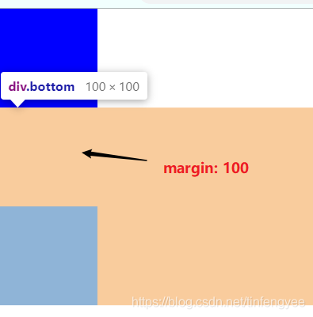
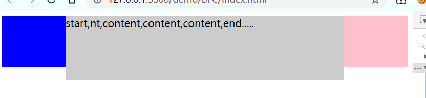
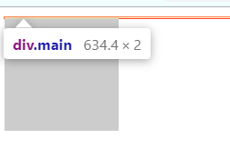
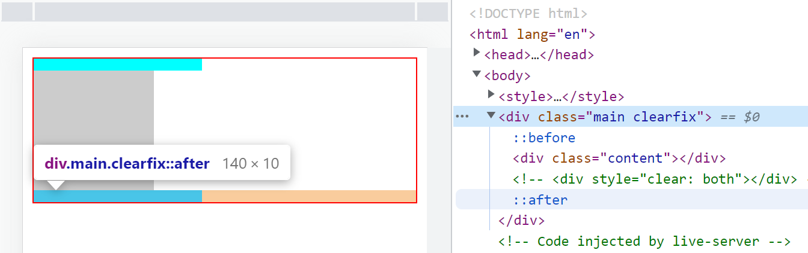

# BFC <!-- omit in toc -->

> Author: tinfengyee
> Date: 2022-11-25 23:02:34
> LastEditTime: 2022-12-06 17:34:29
> Description: NO Desc

## 1. Box：CSS 布局的基本单位

Box 是 CSS 布局的对象和基本单位，直观来说，一个页面有很多个 Box 组成的。元素的类型和 display 属性，决定了这个 box 的类型。不同的 box，会参与不同的 Formatting Context（一个决定如何渲染文档的容器），因此 box 内的元素会以不同的方式渲染。

常见盒子：

- block-level box：*display* 属性为 **block**，**list-item**，**table** 的元素，会生成 block-level box
- inline-level box：*display* 属性为 **inline**，**inline-block**，**inline-table** 的元素，会生成 inline-level box
- run-in box：css3 特有

## 2. Formatting Context

Formatting Context 是 W3C CSS2.1 规范中的一个概念。他是页面的一块渲染区域，并且有一套渲染规则，它决定了其子元素如何定位，以及和其他元素的关系和相互作用。最常见的 Formatting Context 有 **Block formatting context** 和 **Inline formatting contex**

## 3. BFC 特征

- Box 垂直方向的距离由 margin 决定。属于同一个 BFC 的两个相邻 Box 的 margin 会发生重叠（阻止 [外边距重叠](https://developer.mozilla.org/zh-CN/docs/Web/CSS/CSS_Box_Model/Mastering_margin_collapsing)）
- BFC 的区域不会与 float box 重叠（排除外部浮动）
- 计算 BFC 的高度时，浮动元素也参与计算（包含内部浮动）

## 4. 如何创建 BFC

[MDN CSS developer guide](https://developer.mozilla.org/zh-CN/docs/Web/Guide/CSS/Block_formatting_context) 给出创建BFC的方法常用的有以下几种：

- 根元素（`<html>`）
- 浮动元素（[`float`](https://developer.mozilla.org/zh-CN/docs/Web/CSS/float) 值不为 `none`）
- 绝对定位元素（[`position`](https://developer.mozilla.org/zh-CN/docs/Web/CSS/position) 值为 `absolute` 或 `fixed`）
- 行内块元素（[`display`](https://developer.mozilla.org/zh-CN/docs/Web/CSS/display) 值为 `inline-block`）
- 弹性元素（[`display`](https://developer.mozilla.org/zh-CN/docs/Web/CSS/display) 值为 `flex` 或 `inline-flex` 元素的直接子元素），如果它们本身既不是 [flex](https://developer.mozilla.org/zh-CN/docs/Glossary/Flex_Container)、[grid](https://developer.mozilla.org/zh-CN/docs/Glossary/Grid_Container) 也不是 [table](https://developer.mozilla.org/zh-CN/docs/Web/CSS/CSS_Table) 容器
- [`overflow`](https://developer.mozilla.org/zh-CN/docs/Web/CSS/overflow) 值不为 `visible`、`clip` 的块元素
- [`display`](https://developer.mozilla.org/zh-CN/docs/Web/CSS/display) 值为 `flow-root` 的元素
- 匿名表格单元格元素（[`display`](https://developer.mozilla.org/zh-CN/docs/Web/CSS/display) 值为 `table`、`table-row`、 `table-row-group`、`table-header-group`、`table-footer-group`（分别是 HTML table、tr、tbody、thead、tfoot 的默认值）或 `inline-table`）
- .....

## 5. BFC的应用场景

### 5.1. 解决块级元素垂直方向的边距重叠问题

由于块级元素垂直方向的边距会发生重叠，div间距并不是50px+100px，而是100px（较大的margin值）。

```html
    <style>
      .top {
        background-color: blue;
        width: 100px;
        height: 100px;
        margin-bottom: 50px;
      }
      .bottom {
        height: 100px;
        width: 100px;
        margin-top: 100px;
        background-color: #ccc;
        /* display: flex; */
        /* overflow: hidden; */
      }
    </style>
    <div class="main">
      <div class="top"></div>
      <div class="bottom"></div>
    </div>
```



原因是因为,它们属于同一个BFC(根元素),外边距是会重叠滴。所以只要将它们其中一个属于另一个BFC,就可以啦。

```html
<div class="main">
      <div class="top"></div>
      <div style="overflow: hidden;">
        <div class="bottom"></div>
      </div>
</div>
```


### 5.2. 解决元素浮动后发生重叠的问题(自适应布局)

#### 5.2.1. 右边自适应布局

如图，左边的元素浮动之后，由于脱离标准文档流叠在了右边的元素上，为了让两个元素不重叠，我们把右边的元素设置成BFC：

```html
<!DOCTYPE html>
<html lang="en">
  <head>
    <meta charset="UTF-8" />
    <meta name="viewport" content="width=device-width, initial-scale=1.0" />
    <title>Document</title>
    <style>
      .left {
        background-color: rgba(200, 255, 255, 0.75);
        width: 100px;
        height: 120px;
        float: left;
        /* 下面这两行是为了能拖动，与本题无关 */
        resize: both;
        /* required by resize:both */
        overflow: hidden;
      }
      .content {
        height: 100px;
        background-color: #ccc;
        /* display: flex; */
        /* display: table-cell; */
        overflow: hidden;
      }
    </style>
  </head>
  <body>
    <div class="main">
      <div class="left"></div>
      <div class="content">start,nt,content,content,content,end.....</div>
    </div>
  </body>
</html>
```

> 使用百分比宽度布局能实现一样的效果，与 `inline-block` 需要设置 `width: <percentage>` 不同的是，在示例中，我们不需要设置右侧 `div` 元素的宽度

#### 5.2.2. 中间自适应布局

同理，我们可以搞一个中间自适应布局，代码如下（注意left和right盒子的位置）

```html
  <body>
    <style>
      .left {
        background-color: blue;
        width: 100px;
        height: 80px;
        float: left;
      }
      .right {
        background-color: pink;
        width: 100px;
        height: 80px;
        float: right;
      }
      .content {
        height: 100px;
        background-color: #ccc;
        /* display: flex; */
        overflow: hidden;
      }
    </style>
    <div class="main">
      <div class="left"></div>
      <div class="right"></div>
      <div class="content">
        start,nt,content,content,content,end.....
      </div>
    </div>
  </body>
```

> 一般都使用 flex 布局了，这个其实不用太关注



### 5.3. 清除浮动

#### 5.3.1. `overflow: hidden` 清除浮动（计算BFC浮动元素高度）

```html
  <body>
    <style>
      .main {
        border: 1px solid red;
      }
      .content {
        height: 100px;
        width: 100px;
        background-color: #ccc;
        float: left;
      }
    </style>
    <div class="main">
      <div class="content"></div>
    </div>
  </body>
```



子元素浮动后，父元素失去了高度，为了清除浮动带来的这个影响可以将父元素设置成一个BFC：

```html
  <body>
    <style>
      .main {
        border: 1px solid red;
        /* display: flex; */
        overflow: auto;
        /* display: flow-root; */
      }
      .content {
        height: 100px;
        width: 100px;
        background-color: #ccc;
        float: left;
      }
    </style>
    <div class="main">
      <div class="content"></div>
    </div>
  </body>
```

**`display: flow-root`**：一个新的 `display` 属性的值，它可以创建无副作用的 BFC。在父级块中使用 `display: flow-root` 可以创建新的 BFC。

给 `<div>` 元素设置 `display: flow-root` 属性后，`<div>` 中的所有内容都会参与 BFC，浮动的内容不会从底部溢出。

你可以从 `flow-root` 这个值的名字上看出来，它创建一个新的用于流式布局的上下文，类似于浏览器的根（`html`）元素。

#### 5.3.2. `clear:both` 清除浮动

```html
<div class="main">
  <div class="content"></div>
  <div style="clear: both;"></div>
</div>
```

> 缺点： 添加许多无意义的标签，结构化较差。

#### 5.3.3. 利用伪元素和BFC清除浮动(常用)

用法：直接应用在父元素上就行。

```css
.clearfix::before, .clearfix::after {
  content: '';
  clear: both;
  display: block;
  /* 上面三行就能实现效果 */
  visibility: hidden;
  height: 0;
  /* font-size: 0; */
}
```

原理：

就是插入一个看不见的元素，然后使用 `clear:both;` 跟第二种方式没有本质区别，我觉得。



**使用双伪元素清除浮动**

这是bootstrap上使用的方法。

```css
.clearfix::before,
.clearfix::after {
  content: '';
  display: table;
  /* font-size: 0; */
}
.clearfix::after {
  clear: both;
}
.clearfix {
  *zoom: 1;
}
```

解析：

- :after伪类在元素末尾插入了一个包含空格的字符，并设置display为table

- display:table会创建一个匿名的table-cell，从而触发块级上下文（BFC），因为容器内float的元素也是BFC，由于BFC有不能互相重叠的特性，并且设置了clear: both，:after插入的元素会被挤到容器底部，从而将容器撑高。并且设置display:table后，content中的空格字符会被渲染为0*0的空白元素，不会占用页面空间。

- content包含一个空格，是为了解决Opera浏览器的BUG。当HTML中包含contenteditable属性时，如果content没有包含空格，会造成清除浮动元素的顶部、底部有一个空白（设置font-size：0也可以解决这个问题）。

- :after伪类的设置已经达到了清除浮动的目的，但还要设置:before伪类，原因如下
  - :before的设置也触发了一个BFC，由于BFC有内部布局不收外部影响的特性，因此:before的设置可以阻止margin-top的合并。(我试了没效果…）
  - 这样做，其一是为了和其他清除浮动的方式的效果保持一致；其二，是为了与ie6/7下设置zoom：1后的效果一致（即阻止margin-top合并的效果）。

- zoom: 1用于在ie6/7下触发haslayout和contain floats

## 6. 参考资料

- [x] [CSS块级格式化上下文（BFC）与清除浮动详解](https://blog.csdn.net/tinfengyee/article/details/105657898)

- [x] [块格式化上下文](https://developer.mozilla.org/zh-CN/docs/Web/Guide/CSS/Block_formatting_context)

- [x] [BFC](https://i-want-offer.github.io/FE-Essay/CSS/BFC.html#box-css-%E5%B8%83%E5%B1%80%E7%9A%84%E5%9F%BA%E6%9C%AC%E5%8D%95%E4%BD%8D)