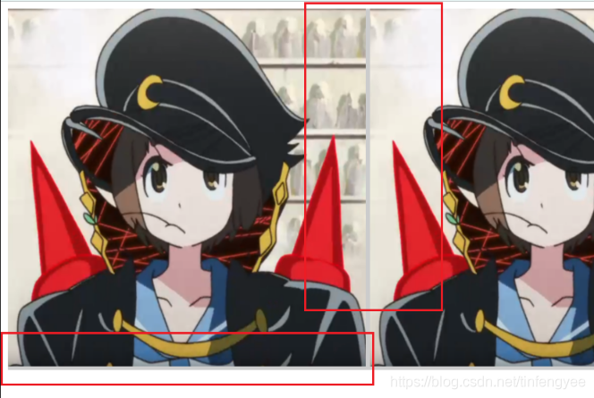
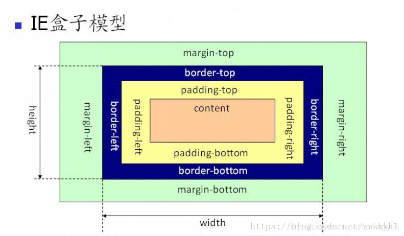

# CSS基础 <!-- omit in toc -->

> Author: tinfengyee
> Date: 2022-12-06 17:46:04
> LastEditTime: 2022-12-08 02:43:56
> Description: NO Desc

## 1. CSS 三大特性

### 1.1. CSS优先级（权重）

specificity用一个四位的数 字串(CSS2是三位)来表示，更像四个级别，值从左到右，左面的最大，一级大于一级，数位之间没有进制，级别之间不可超越。 

| 名称                                  | 权重     |
| ------------------------------------- | -------- |
| 继承或者 `*` 通配选择器 的贡献值      | 0,0,0,0  |
| 每个元素（标签）/伪元素选择器贡献值为 | 0,0,0,1  |
| 每个类，伪类贡献值为                  | 0,0,1,0  |
| 每个ID贡献值为                        | 0,1,0,0  |
| 每个行内样式贡献值                    | 1,0,0,0  |
| 每个!important贡献值  重要的          | ∞ 无穷大 |

权重是可以叠加的

比如的例子：

```
div ul  li   ------>      0,0,0,3

.nav ul li   ------>      0,0,1,2

a:hover      -----—>      0,0,1,1

.nav a       ------>      0,0,1,1   

#nav p       ----->       0,1,0,1
```

### 1.2. CSS层叠性

所谓层叠性是指多种CSS样式的叠加。

是浏览器处理冲突的一个能力,如果一个属性通过两个相同选择器设置到同一个元素上，那么这个时候一个属性就会将另一个属性层叠掉

比如先给某个标签指定了内部文字颜色为红色，接着又指定了颜色为蓝色，此时出现一个标签指定了相同样式不同值的情况，这就是样式冲突。  就近原则

一般情况下，如果出现样式冲突，则会按照CSS书写的顺序，以最后的样式为准。

1. 样式冲突，遵循的原则是就近原则。 那个样式离着结构近，就执行那个样式。
2. 样式不冲突，不会层叠

### 1.3. CSS继承性

所谓继承性是指书写CSS样式表时，子标签会继承父标签的某些样式，如文本颜色和字号。想要设置一个可继承的属性，只需将它应用于父元素即可。

简单的理解就是：  子承父业。

```
恰当地使用继承可以简化代码，降低CSS样式的复杂性。子元素可以继承父元素的样式（text-，font-，line-这些元素开头的都可以继承，以及color属性）
```

## 2. CSS 盒模型

所有 HTML 元素都可以视为一个盒子，该盒子包括：边距(margin)、边框(border)、填充(padding)和实际内容(content)。

两种模型：**标准模型（W3C模型）**和 **IE 盒模型**

**差异**：宽高计算方式不同。

- 标准盒子模型（W3C模型）: 属性`width`，`height`只包含内容`content`，不包含`border`和`padding`。
- 



 **IE 盒模型**：属性`width`，`height`包含`content`、`border`和`padding`，也就是计算`content+padding+border`。



如何设置两种模型？

```css
div {
  // 设置标准模型
  box-sizing: content-box; /* 默认 */
  // 设置IE模型
  box-sizing: border-box;
}
```

建议在页面初始化的时候，设置全局 CSS 属性 `box-sizing`，统一标准。

- `inherit` - 继承父元素的值
- `content-box` - 指定盒子为 W3C（标准盒子）
- `border-box` - 指定为 IE（怪异盒子）。

## 3. BFC和清除浮动

参考 [BFC.md](./BFC.md)

## 4. CSS 选择符有哪些？

```
（1）id选择器（#myid）
（2）类选择器（.myclassname）
（3）标签选择器（div,h1,p）
（4）后代选择器（h1p）
（5）相邻后代选择器（子）选择器（ul>li）
（6）兄弟选择器（li~a）
（7）相邻兄弟选择器（li+a）
（8）属性选择器（a[rel=“external”]）
（9）伪类选择器（a:hover,li:nth-child）
（10）伪元素选择器（::before、::after）
（11）通配符选择器（*）
```

## 5. inline和inline-block有什么区别？

我把`block`也加入其中，为了获得更好的比较。
(由于基线对齐，行内快元素会有下间隙）

| --                            | block                                                     | inline-block                               | inline                                                       |
| ----------------------------- | --------------------------------------------------------- | ------------------------------------------ | ------------------------------------------------------------ |
| 大小                          | 填充其父容器的宽度。                                      | 取决于内容。                               | 取决于内容。                                                 |
| 定位                          | 从新的一行开始，并且不允许旁边有 HTML 元素（除非是float） | 与其他内容一起流动，并允许旁边有其他元素。 | 与其他内容一起流动，并允许旁边有其他元素。                   |
| 能否设置width和height         | 能                                                        | 能                                         | 不能。 设置会被忽略。                                        |
| 可以使用vertical-align对齐    | 不可以                                                    | 可以                                       | 可以                                                         |
| 边距（margin）和填充（padding | 各个方向都存在                                            | 各个方向都存在                             | margin只有水平方向存在。垂直方向会被忽略。 尽管border和padding在content周围，但垂直方向上的空间取决于'line-height' |
| 浮动（float）                 | -                                                         | -                                          | 就像一个block元素，可以设置垂直边距和填充。                  |

##  6. CSS 单位

- `em`：定义字体大小时以父级的字体大小为基准；定义长度单位时以当前字体大小为基准（浏览器默认字体是16px）。
- `rem`：以根元素的字体大小为基准。
- `%`：以父级的宽度为基准。
- `vw/vh`：基于视口的宽度和高度。一般来说：`1vw = npx / 100`，即浏览器宽度为 `200px` 的时候，`1vw = 200px / 100`，即 `1vw = 2px`。

## 7. JS 如何设置盒模型的宽高

假设已经获取节点 dom

```js
// 只能获取内联样式设置的宽高
dom.style.width/height

// 获取渲染后即使运行的宽高，只支持IE
dom.currentStyle.width/height

// 获取渲染后即时运行的宽高，兼容性很好
dom.getComputedStyle.width/height

// 获取渲染后即使运行的宽高，兼容性很好，一般用来获取元素的绝对位置
dom.getBoundingClientRect().width/height
```

## 8. link 与 @import 的区别

- link 是从 html 引入的，@import 是从 css 引入的。`link` 是 `XHTML` 标签，除了加载 `CSS` 外，还可以定义 `RSS` 等其他事务。
- link 会在浏览器加载页面是同步加载 css；页面加载完成后再加载 @import 的 css
- @import 是 css2.1 加入的语法，只有 IE5+ 才可识别，link 无兼容问题
- `link` 支持使用 `Javascript` 控制 `DOM` 去改变样式；而 `@import` 不支持。
- 优先级 link > @import
- CSS 引入方式有：
  - 内联：`style` 属性（`style="color: red"`）
  - 内嵌：`style` 标签（`<style></style>`）
  - 外链：`link` 标签（`<link href="index.css">`
  - 导入：`@import`（`@import url('index.css')` 或者 `@import 'index.css'`）

## 9. 伪类和伪元素

**伪类**：伪类用于当已有元素处于某种状态时，为其添加对应的样式，这个状态是根据用户行为而动态变化的。

比如：hover，visited，link等等。

 **伪元素**：伪元素用于创建一些不在文档树中的元素，并为其添加样式。

比如：`::before` 来为一个元素前增加一些文本，并为这些文本增加样式。用户虽然可以看到这些文本，但是这些文本实际并不在文档树中。

**区别**：伪类的操作对象时文档树中已有的元素，而伪元素则创建一个文档树以外的元素。因此他们之间的区别在于：**有没有创建一个文档树之外的元素**。

CSS3 规范中要求使用双冒号`::`😃 表示伪元素，单冒号`:` 表示伪类

## 10. 浮动

- 浮动元素会从普通文档流中脱离，但浮动元素影响的不仅是自己，它会影响周围的元素对其进行环绕；
- 不管一个元素是行内元素还是块级元素，只要被设置了浮动，那浮动元素就会形成一个**块级框**，可以设置它的宽度和高度，因此浮动元素常常用于制作横向配列的菜单，可以设置大小并且横向排列。

> 一个块级元素如果没有设置高度，其高度是由子元素撑开的。如果对子元素设置了浮动，那么子元素就会脱离文档流，也就是说父元素没有内容可以撑开其高度，这样父级元素的高度就会被忽略，这就是所谓的高度塌陷。

浮动元素的展示在不同情况下会有不同的规则:

- 浮动元素在浮动的时候，其 margin 不会超过包含块的 padding
- 如果两个元素一个向左浮动，一个向右浮动，左浮动元素的 margin-right 不会和右元素的 margin-left 相邻
- 如果有多个浮动元素，浮动元素会按顺序排下来而不会发生重叠
- 如果有多个浮动元素，后面的元素高度不会超过前面的元素，并且不会超过包含块
- 如果有非浮动元素和浮动元素同时存在，并且非浮动元素在前，则浮动元素不会高于非浮动元素
- 浮动元素会尽可能地向顶端对齐、向左或向右对齐

## 11. 常见的元素隐藏方式？

+ `opacity:0`：本质上是将元素的透明度将为0，就看起来隐藏了，但能够响应元素绑定的监听事件。
+ `visibility:hidden`: 与上一个方法类似的效果，占据空间，但是不可以交互了
+ `display:none`: 这个是彻底隐藏了元素，元素从文档流中消失（渲染树不会包含该渲染对象），既不占据空间也不交互，也不影响布局
+ `overflow:hidden:` 这个只隐藏元素溢出的部分，但是占据空间且不可交互
+ `z-index:-9999`: 原理是将层级放到底部，这样就被覆盖了，看起来隐藏了
+ `transform: scale(0,0):` 平面变换，将元素缩放为0，但是依然占据空间，但不可交互
> 还有一些靠绝对定位把元素移到可视区域外，或者用clip-path进行裁剪的操作过于Hack，就不提了。

详细资料可以参考： [《CSS 隐藏元素的八种方法》](https://juejin.im/post/584b645a128fe10058a0d625#heading-2)

## 12. 去除inline-block元素间间距和图片下间隙的方法

行内块元素，会有如下情况


**解决方法**
1.容器设置`font-size: 0;`
2.设置`display: block;`
3.设置`vertical-align: middle;`

> 更详细的介绍请看:[去除inline-block元素间间距的N种方法](https://www.zhangxinxu.com/wordpress/2012/04/inline-block-space-remove-%E5%8E%BB%E9%99%A4%E9%97%B4%E8%B7%9D/)
```html
<body>
  <style>
    .main {
      background-color: #ccc;
      /* font-size: 0; */
    }
    img {
      /* display: block; */
      vertical-align: middle;
    }
  </style>
  <div class="main">
    
    
  </div>
</body>
```

## 13. 解释浏览器如何确定哪些元素与 CSS 选择器匹配。编写高效的 CSS 应该注意什么？

这部分与上面关于编写高效的 CSS 有关。浏览器**1.从最右边的选择器**（关键选择器）根据**关键选择器**，**2.浏览器从 DOM 中筛选出元素**，然后**3.向上遍历被选元素的父元素**，**4.判断是否匹配**。**选择器匹配语句链越短**，浏览器的匹配**速度越快**。

参考
+ [https://stackoverflow.com/questions/5797014/why-do-browsers-match-css-selectors-from-right-to-left](https://stackoverflow.com/questions/5797014/why-do-browsers-match-css-selectors-from-right-to-left)
+ [https://www.zhihu.com/question/24959507/answer/29672263](https://www.zhihu.com/question/24959507/answer/29672263)

## 14. 使用 CSS 预处理的优缺点分别是什么？

优点：

+ 提高 CSS 可维护性。
+ 易于编写嵌套选择器。
+ 引入变量，增添主题功能。可以在不同的项目中共享主题文件。
+ 通过混合（Mixins）生成重复的 CSS。
+ Splitting your code into multiple files. CSS files can be split up too but doing so will require a HTTP request to download each CSS file.
+ 将代码分割成多个文件。不进行预处理的 CSS，虽然也可以分割成多个文件，但需要建立多个 HTTP 请求加载这些文件。

缺点：

+ 需要预处理工具。
+ 重新编译的时间可能会很慢

> 不算啥缺点了，打包工具处理就完事了。。

## 15. 如何解决不同浏览器的样式兼容性问题？

+ 在确定问题原因和有问题的浏览器后，使用单独的样式表，仅供出现问题的浏览器加载。这种方法需要使用服务器端渲染。
+ 使用已经处理好此类问题的库，比如 Bootstrap。
+ 使用 autoprefixer 自动生成 CSS 属性前缀。
+ 使用 Reset CSS 或 Normalize.css。

## 16. 响应式设计？响应式设计的基本原理是什么？与自适应区别？

响应式网站设计（`Responsive Web design`）是一个网站能够兼容多个终端，而不是为每一个终端做一个特定的版本。

基本原理是通过媒体查询（`@media`）检测不同的设备屏幕尺寸做处理。

好处：对某些数据的修改就能自动更新视图，让开发者不需要操作 DOM，有更多的时间去思考完成业务逻辑。

缺点：`CSS`比较重。下面是博客网站对不同设备适配后的结果，分别是`iPhone5/SE`,`iphone6/7/8`,`ipad pro`,`dell台式宽屏(1440 X 900)`。

**响应式设计与自适应设计的区别**：

> **响应式**开发一套界面，通过检测视口分辨率，针对不同客户端在客户端做代码处理，来展现不同的布局和内容；
> **自适应**需要开发多套界面，通过检测视口分辨率，来判断当前访问的设备是pc端、平板、手机，从而请求服务层，返回不同的页面。

> 拓展阅读：
> [前端响应式布局原理与方案（详细版）](https://blog.csdn.net/tinfengyee/article/details/105681157)
> [深入理解CSS Media媒体查询](https://www.cnblogs.com/xiaohuochai/p/5848612.html)

## 17. 对媒体查询的理解？

一说到响应式设计，肯定离不开媒体查询media。

**是什么**

媒体查询由一个可选的媒体类型和零个或多个使用媒体功能的**限制了样式表范围**的**表达式**组成，例如**宽度**、**高度**、**设备像素比**和**颜色**。媒体查询，添加自CSS3，允许内容的呈现针对一个特定范围的输出设备而进行裁剪，而不必改变内容本身,非常适合web网页应对不同型号的设备而做出对应的**响应适配**。

**如何使用？**
媒体查询包含一个可选的媒体类型和，满足CSS3规范的条件下，包含零个或多个表达式，这些表达式描述了媒体特征，最终会被解析为true或false。如果媒体查询中指定的媒体类型匹配展示文档所使用的设备类型，并且所有的表达式的值都是true，那么该媒体查询的结果为true.那么媒体查询内的样式将会生效。
```html
<!-- link元素中的CSS媒体查询 -->
<link rel="stylesheet" media="(max-width: 800px)" href="example.css" />

<!-- 样式表中的CSS媒体查询 -->
<style>
@media (max-width: 600px) {
  .facet_sidebar {
    display: none;
  }
}
</style>
```
主要属性
```
width | min-width | max-width
height | min-height | max-height
device-width | min-device-width | max-device-width
device-height | min-device-height | max-device-height
aspect-ratio | min-aspect-ratio | max-aspect-ratio
device-aspect-ratio | min-device-aspect-ratio | max-device-aspect-ratio
color | min-color | max-color
color-index | min-color-index | max-color-index
monochrome | min-monochrome | max-monochrome
resolution | min-resolution | max-resolution
scan | grid
```
逻辑操作符
操作符not、and、or、only和逗号(,)可以用来构建复杂的媒体查询
> 拓展阅读：
> [前端响应式布局原理与方案（详细版）](https://blog.csdn.net/tinfengyee/article/details/105681157)
> [深入理解CSS Media媒体查询](https://www.cnblogs.com/xiaohuochai/p/5848612.html)

## 18. CSS 页面布局

现在一般使用 flex 进行布局，还可以通过 `calc(100vh - 100px);` 等属性设置。

拓展阅读：

[CSS布局系列](https://blog.csdn.net/tinfengyee/article/details/105705284)
[前端响应式布局原理与方案（详细版）](https://blog.csdn.net/tinfengyee/article/details/105681157)

## 19. 过渡与动画的区别是什么

+ transition
可以在一定的时间内实现元素的**状态过渡**为最终状态，用于模拟以一种过渡动画效果，但是功能有限，只能用于制作简单的动画效果而动画属性
+ animation
可以制作类似Flash动画，通过**关键帧控制动画**的每一步，控制更为精确，从而可以制作更为复杂的动画。

## 20. 关于CSS的动画与过渡问题

[深入理解CSS过渡transition](https://www.cnblogs.com/xiaohuochai/p/5347930.html)

```css
transition-property: 过渡属性(默认值为all)
transition-duration: 过渡持续时间(默认值为0s)
transiton-timing-function: 过渡函数(默认值为ease函数)
transition-delay: 过渡延迟时间(默认值为0s)
```
[深入理解CSS动画animation](https://www.cnblogs.com/xiaohuochai/p/5391663.html)

```css
@keyframes test{
    0%{background-color: lightblue;}
    30%{background-color: lightgreen;}
    60%{background-color: lightgray;}
    100%{background-color: black;}
}

animation-name: 动画名称(默认值为none)
animation-duration: 持续时间(默认值为0)
animation-timing-function: 时间函数(默认值为ease)
animation-delay: 延迟时间(默认值为0)
animation-iteration-count: 循环次数(默认值为1)
animation-direction: 动画方向(默认值为normal)
animation-play-state: 播放状态(默认值为running)
animation-fill-mode: 填充模式(默认值为none)
```

## 21. 已知父级盒子的宽高，子级img宽高未知，想让img铺满父级盒子且图片不能变形

需要用到css的`object-fit`属性
```css
div {
    width: 200px;
    height: 200px;
}
img {
    object-fit: cover;
    width: 100%;
    height: 100%;
}
```
查看 [MDN](https://developer.mozilla.org/zh-CN/docs/Web/CSS/object-fit)

## 22. iframe的作用

frame是用来在网页中插入第三方页面，早期的页面使用iframe主要是用于导航栏这种很多页面都相同的部分，这样在切换页面的时候避免重复下载。

优点

0. 一般用来展示内容，如教程右边的手机
1. 便于修改，模拟分离，像一些信息管理系统会用到。
2. iframe能够原封不动的把嵌入的网页展现出来。
3. 如果遇到加载缓慢的第三方内容如图标和广告，这些问题可以由iframe来解决
4. 如果有多个网页引用iframe，那么你只需要修改iframe的内容，就可以实现调用的每一个页面内容的更改，方便快捷。
5. 网页如果为了统一风格，头部和版本都是一样的，就可以写成一个页面，用iframe来嵌套，可以增加代码的可重用。
+ 但现在基本不推荐使用。除非特殊需要，一般不推荐使用。

缺点
6. iframe的创建比一般的DOM元素慢了1-2个数量级
7. iframe标签会**阻塞页面**的的加载，如果页面的onload事件不能及时触发，会让用户觉得网页加载很慢，用户体验不好，在Safari和Chrome中可以通过js动态设置iframe的src属性来避免阻塞。
8. iframe对于**SEO不友好**，替换方案一般就是动态语言的Incude机制和ajax动态填充内容等。

## 23. 你有没有使用过视网膜分辨率的图形？当中使用什么技术？

**使用二倍图**、**svg**

我倾向于使用更高分辨率的图形（显示尺寸的两倍）来处理视网膜显示。更好的方法是使用媒体查询，像`@media only screen and (min-device-pixel-ratio: 2) { ... }`，然后改变`background-image`。

对于图标类的图形，我会尽可能使用 svg 和图标字体，因为它们在任何分辨率下，都能被渲染得十分清晰。

还有一种方法是，在检查了window.devicePixelRatio的值后，利用 JavaScript 将``的src属性修改，用更高分辨率的版本进行替换。

https://www.sitepoint.com/css-techniques-for-retina-displays/

## 24. 对css sprites的理解

**是什么 ？**
雪碧图也叫CSS精灵， 是一CSS图像合成技术，开发人员往往将小图标合并在一起之后的图片称作雪碧图。

**如何操作？**
使用工具（PS之类的）**将多张图片打包成一张雪碧图**，并为其生成合适的 CSS。 每张图片都有相应的 CSS 类，该类定义了background-image、background-position和background-size属性。 使用图片时，将相应的类添加到你的元素中。

**好处：**
+ 减少加载多张图片的 HTTP 请求数（一张雪碧图只需要一个请求）
+ 提前加载资源
**不足：**
+ CSS Sprite维护成本较高，如果页面背景有少许改动，一般就要改这张合并的图片
+ 加载速度优势在http2开启后荡然无存，HTTP2多路复用，多张图片也可以重复利用一个连接通道搞定

## 25. 为什么有时候人们用translate来改变位置而不是定位？

translate()是transform的一个值。改变transform或opacity不会触发浏览器重新布局（reflow）或重绘（repaint），只会触发复合（compositions）。而改变绝对定位会触发重新布局，进而触发重绘和复合。transform使浏览器为元素创建一个 GPU 图层，但改变绝对定位会使用到 CPU。 因此translate()更高效，可以缩短平滑动画的绘制时间。

而translate改变位置时，元素依然会占据其原始空间，绝对定位就不会发生这种情况。

拓展阅读:[CSS3 3D transform变换-张鑫旭](https://www.zhangxinxu.com/wordpress/2012/09/css3-3d-transform-perspective-animate-transition/)

## 26. 对flex的理解？

web应用有不同设备尺寸和分辨率，这时需要响应式界面设计来满足复杂的布局需求，Flex弹性盒模型的优势在于开发人员只是声明布局应该具有的行为，而不需要给出具体的实现方式，浏览器负责完成实际布局，当布局涉及到**不定宽度**，**分布对齐**的场景时，就要优先考虑**弹性盒布局**
> 微信小程序用flex布局

具体用法移步阮一峰的[flex语法](http://www.ruanyifeng.com/blog/2015/07/flex-grammar.html)、[flex实战](http://www.ruanyifeng.com/blog/2015/07/flex-examples.html)，讲得非常通俗易懂，而且我们一两句话说不清楚。

## 27. CSS 多列等高如何实现？

（1）利用`padding-bottom|margin-bottom`正负值相抵，不会影响页面布局的特点。设置父容器设置超出隐藏（`overflow:
hidden`），这样父容器的高度就还是它里面的列没有设定padding-bottom时的高度，当它里面的任一列高度增加了，则父容器的高度被撑到里面最高那列的高度，其他比这列矮的列会用它们的padding-bottom补偿这部分高度差。(**这个在我文章圣杯布局有参考**,[原文](https://alistapart.com/article/holygrail/)这里）
（2）利用table-cell所有单元格高度都相等的特性，来实现多列等高。
（3）利用flex布局中项目align-items属性默认为stretch，如果项目未设置高度或设为auto，将占满整个容器的高度
的特性，来实现多列等高。

## 28. 文本超出部分显示省略号

单行
```css
overflow: hidden;
text-overflow: ellipsis;
white-space: nowrap;
```
多行
```css
display: -webkit-box;
-webkit-box-orient: vertical;
-webkit-line-clamp: 3; // 最多显示几行
overflow: hidden;
```
**white-space**
white-space设置或检索对象内文本显示方式。通常我们使用于强制一行显示内容 
normal : 默认处理方式
nowrap : 强制在同一行内显示所有文本，直到文本结束或者遭遇br标签对象才换行。可以处理中文

**text-overflow** : clip | ellipsis
设置或检索是否使用一个省略标记（...）标示对象内文本的溢出
```html
  <body>
    <style>
      .corner {
        background-color: #cccccc;
        width: 150px;
        overflow: hidden;
        text-overflow: ellipsis;
        white-space: nowrap;
      }
    </style>
    <div class="corner">
      <a>文本超出部分显示省略号</a>
    </div>
  </body>
```

## 29. 实现一个宽高自适应的正方形

```css
/*1.第一种方式是利用vw来实现*/
.square {
  width: 10%;
  height: 10vw;
  background: tomato;
}

/*2.第二种方式是利用元素的margin/padding百分比是相对父元素width的性质来实现*/
.square {
  width: 20%;
  height: 0;
  padding-top: 20%;
  background: orange;
}

/*3.第三种方式是利用子元素的margin-top的值来实现的*/
.square {
  width: 30%;
  overflow: hidden;
  background: yellow;
}

.square::after {
  content: "";
  display: block;
  margin-top: 100%;
}
```
一个自适应矩形，水平垂直居中，且宽高比为 2:1
```css
/*实现原理参考自适应正方形和水平居中方式*/
.box {
  position: absolute;
  top: 0;
  right: 0;
  left: 0;
  bottom: 0;
  margin: auto;

  width: 10%;
  height: 0;
  padding-top: 20%;
  background: tomato;
}
```

## 30. 画三角(普通+伪元素)

常用方法：

```html
<body>
  <style>
    .block {
      width: 0;
      height: 0;
      border: 30px solid transparent;
      border-left-color: green;
    }
  </style>
  <div class="block"></div>
</body>
```
伪元素方法

```html
  <body>
    <style>
      .corner {
        position: relative;
      }
      .corner::after {
        content: '';
        position: absolute;
        left: 0;
        top: 0;
        border: 10px solid transparent;
        border-right-color: #cccccc;
      }
    </style>
    <div class="corner"></div>
  </body>
```

## 31. 参考资料

- [x] [CSS面试相关问题整理](https://blog.csdn.net/tinfengyee/article/details/105641626)

- [x] [前端随笔 FE-Essay](https://i-want-offer.github.io/FE-Essay/)
- [x] [document-library](https://github.com/LiangJunrong/document-library)
