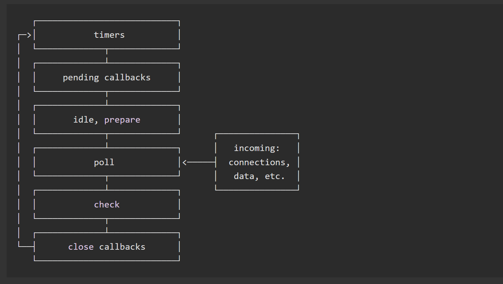

# 浏览器和Node事件循环 <!-- omit in toc -->

> Author: tinfengyee
> Date: 2022-11-25 16:51:43
> LastEditTime: 2022-11-25 22:54:34
> Description: NO Desc

## 1. 前言

1. 先说基本知识点：宏任务哪些，微任务哪些
2. 说说事件循环机制过程，边说边画
3. 说说 async / await 执行顺序注意，可以把 chrome 的优化，做法其实是违反了规范的，V8 团队的 PR 这些自信点说出来，会显得很好学，理解的很详细，很透彻
4. 把 node 的事件循环也说一下，重复 1、2、3点，并且着重说 node v11 前后事件循环的变动

##  2. 浏览器中的事件循环

JavaScript代码的执行过程中，除了依靠函数调用栈来搞定函数的执行顺序以外，还依靠任务队列（task queue）来搞定另外一些代码的执行。整个执行过程，我们称为事件循环过程。一个线程中，事件循环是唯一的，但是任务队列可以拥有多个。任务队列又分为 macro-task（宏任务）和 micro-task（微任务），在最新标准中，他们分别被称为 tasks 和 jobs。

**macro-task（宏任务）** 大概包括：

- script（整体代码）
- setTimeout
- setInterval
- setImmediate
- I / O
- UI render

**micro-task（微任务）** 大概包括：

- process.nextTick
- Promise.then
- async / await （等价于 Promise.then）
- MutationObserver（HTML5 新特性）

总体结论就是：

- 执行宏任务
- 然后执行宏任务产生的微任务
- 若微任务在执行过程中产生了新的微任务，则继续执行微任务
- 微任务执行完毕，再回到宏任务中进行下一轮循环

## 3. async / await 执行顺序

我们知道 `async` 会隐式返回一个 Promise 作为结果的函数，那么可以简单理解为：await 后面的函数在执行完毕后，await 会产生一个微任务（Promise.then 是微任务）。但是我们要注意微任务产生的时机，它是执行完 await 后，直接跳出 async 函数，执行其他代码（此处就是协程的运作，A暂停执行，控制权交给B）。其他代码执行完毕后，再回到 async 函数去执行剩下的代码，然后把 await 后面的代码注册到微任务队列中。例如：

```js
console.log('script start')

async function async1() {
	await async2()
	console.log('async1 end')
}

async function async2() {
	console.log('async2 end')
}
async1()

setTimeout(function() {
	console.log('setTimeout')
}, 0)

new Promise(resolve => {
	console.log('Promise')
	resolve()
}).then(function() {
	console.log('promise1')
}).then(function() {
	console.log('promise2')
})

console.log('script end')

// 旧版输出如下，但是请继续看完本文下面的注意那里，新版有改动
// script start => async2 end => Promise => script end => promise1 => promise2 => async1 end => setTimeout
```

分析这段代码：

1. 执行代码，输出 `script start`
2. 执行 `async1()`，调用了 `async2()`，然后输出 `async2 end`，此时会保留 async1 的上下文，然后跳出 async1
3. 遇到 setTimeout，产生一个宏任务
4. 执行 Promise，输出 Promise，遇到 then，产生第一个微任务，继续执行代码，输出 `script end`
5. 当前宏任务执行完毕，开始执行当前宏任务产生的微任务，输出 `promise1`，然后又遇到 then，产生一个新的微任务
6. 执行微任务，输出 `promise2`，此时微任务队列已清空，执行权交还给 async1
7. 执行 await 后的代码，输出 `async1 end`
8. 所有微任务队列均已执行完毕，开始执行下一个宏任务，打印 `setTimeout`

**注意**

新版的 chrome 并不是像上面那样的执行顺序，它优化了 await 的执行速度，await 变得更早执行了，输出变更为：

```
// script start => async2 end => Promise => script end => async1 end => promise1 => promise2 => setTimeout
```

但是这种做法其实违反了规范，但是规范也可以更改的，这是 V8 团队的一个 [PR (opens new window)](https://github.com/tc39/ecma262/pull/1250#issue-197979338)，目前新版打印已经修改。知乎上也有相关的 [讨论 (opens new window)](https://www.zhihu.com/question/268007969)。

我们可以分两种情况进行讨论

1. 如果 await 后面直接跟的为一个变量，比如 `await 1`。这种情况相当于直接把 await 后面的代码注册为一个微任务，可以简单理解为 `Promise.then(await 后面的代码)`，然后跳出函数去执行其他的代码。

2. 如果 await 后面跟的是一个异步函数的调用，比如上面的代码修改为：

   ```js
   console.log('script start')
   
   async function async1() {
       await async2()
       console.log('async1 end')
   }
   async function async2() {
       console.log('async2 end')
       return Promise.resolve().then(()=>{
           console.log('async2 end1')
       })
   }
   async1()
   
   setTimeout(function() {
       console.log('setTimeout')
   }, 0)
   
   new Promise(resolve => {
       console.log('Promise')
       resolve()
   }).then(function() {
       console.log('promise1')
   }).then(function() {
       console.log('promise2')
   })
   
   console.log('script end')
   ```

   输出为：

   ```js
   // script start => async2 end => Promise => script end => async2 end1 => promise1 => promise2 => async1 end => setTimeout
   ```

   此时 执行完 await 并不会把 await 后面的代码注册到微任务对立中，而是执行完 await 之后，直接跳出了函数，执行其他同步代码，直到其他代码执行完毕后，再回到这里将 await 后面的代码推倒微任务队列中执行。注意，此时微任务队列中是有之前注册的其他微任务，所以这种情况会先执行其他的微任务。可以理解为 await 后面的代码会在本轮循环的最后被执行。


## 4. node 中的事件循环

同样是使用 V8 引擎的 Node.js 也同样有事件循环。事件循环是 Node 处理非阻塞 I / O 操作的机制，Node 中实现事件循环依赖的是 libuv 引擎。由于 Node 11 之后，事件循环的一些原理发生了改变，这里就以新的标准去讲，最后再列上变化点让大家了解前因后果。

### 4.1. 宏任务和微任务

node 中也分为宏任务和微任务，其中，

macro-task（宏任务）包括：

- setTimeout
- setInterval
- setImmediate
- script（整体代码）
- I / O 操作

micro-task（微任务）包括：

- process.nextTick（与普通微任务有区别，在微任务队列执行之前执行）
- Promise.then 回调

### 4.2. node 事件循环整体理解



*注意：每个框被称为事件循环机制的一个阶段。*

- 定时器检测阶段（timers）：本阶段执行 timers 的回调，即 setTimeout、setInterval 里面的回调函数
- I / O 事件回调阶段（I / O callbacks）：执行延迟到下一个循环迭代的 I / O 回调，即上一轮循环中未被执行的一些 I / O 回调
- 闲置阶段（idle，prepare）：仅供内部使用
- 轮询阶段（poll）：检索新的 I / O 事件；执行与 I / O 相关的回调（几乎所有情况下，除了关闭的回调函数，那些计时器和 setImmediate 调度之外），其余情况 node 将在适当的时候在此阻塞
- 检查阶段（check）：setImmediate 回调函数将在此阶段执行
- 关闭事件回调阶段（close callback）：一些关闭的回调函数，如 `socket.on('close', ...)`

###  4.3. 三大重点阶段

日常开发中绝大部分异步任务都在 poll、check、timers 这三个阶段处理，所以需要重点了解这三个阶段

####  4.3.1. timers

timers 阶段会执行 setTimeout 和 setInterval 回调，并且是由 poll 阶段控制的。同样，在 Node 中定时器指定的时间也不是准确时间，只是尽快执行

#### 4.3.2. poll

如果当前已经存在定时器，而且有定期到时间了，拿出来执行，事件循环将会到 timers 阶段

如果没有定时器，回去看回调函数队列

- 如果 poll 队列不为空，会遍历回到队列并同步执行，直到队列为空或达到系统限制

- 如果 poll 队列为空，会有两件事发生

  - 如果 setImmediate 回调需要执行，poll 阶段将会停止并进入 check 阶段执行回调
  - 如果没有 setImmediate 回调需要执行，会等待回调被加入到队列中并立即执行回调，这里同样会有个超时时间设置，防止一直等待下去，一段时间后自动进入 check 阶段

#### 4.3.3. check

check 阶段，这是一个比较简单的阶段，直接执行 setImmediate 的回调

###  4.4. process.nextTick

`process.nextTick` 是独立于事件循环的任务队列

在每一个事件循环阶段完成后会去检查 nextTick 队列，如果里面有任务，会让这部分任务优先于微任务执行。

看一个例子：

```js
setImmediate(() => {
    console.log('timeout1')
    Promise.resolve().then(() => console.log('promise resolve'))
    process.nextTick(() => console.log('next tick1'))
});
setImmediate(() => {
    console.log('timeout2')
    process.nextTick(() => console.log('next tick2'))
});
setImmediate(() => console.log('timeout3'));
setImmediate(() => console.log('timeout4'));
```

- 在 node11 之前，因为每一个事件循环阶段完成后都会去检查 nextTick 队列，如果里面有任务，会让这部分任务优先于微任务执行，因此上述代码是先进入 check 阶段，执行所有 setImmediate，完成之后执行 nextTick 队列，最后执行微任务队列，因此输出为：

  ```js
  // timeout1 -> timeout2 -> timeout3 -> timeout4 -> next tick1 -> next tick2 -> promise resolve
  ```

- 在 node11 之后，`process.nextTick` 被视为是微任务的一种，因此上述代码是先进入 check 阶段，执行一个 setImmediate 宏任务，然后执行其微任务队列，在执行下一个宏任务及其微任务队列，因此输出为：

  ```js
  // timeout1 -> next tick1 -> promise resolve -> timeout2 -> next tick2 -> timeout3 -> timepout4
  ```

### 4.5. node 版本差异说明

这里主要说明 node11 前后的差异，因为 node11 之后一些特性向浏览器看齐，总的变化一句话来说就是：

**如果是 node11 版本一旦执行一个阶段里的一个宏任务（setTimeout、setInterval、setImmediate）就会立刻执行对应的微任务队列**

#### 4.5.1. timers 阶段执行时机的变化

```js
setTimeout(() => {
    console.log('timer1')
    Promise.resolve().then(function() {
        console.log('promise1')
    })
}, 0)
setTimeout(() => {
    console.log('timer2')
    Promise.resolve().then(function() {
        console.log('promise2')
    })
}, 0)
```

- 如果是 node11以后的版本一旦执行到一个阶段内的一个宏任务（setTimeout、setInterval 和 setImmediate）就会立刻执行微任务队列，这和浏览器的运行方式是一致的，最后输出为：

  ```js
  // timer1 -> promise1 -> timer2 -> promise2
  ```

- 如果是 node11 之前的版本，要看第一个定时器执行完，第二个定时器是否在完成队列中

  - 如果第二个定时器还未在完成队列中，最后的结果为

    ```js
    // timer1 -> promise1 -> timer2 -> promise2
    ```

  - 如果第二个定时器已经在完成队列中，最后结果为

    ```js
    // timer1 -> timer2 -> promise1 -> promise2
    ```

#### 4.5.2. check 阶段的执行时机变化

```js
setImmediate(() => console.log('immediate1'));
setImmediate(() => {
    console.log('immediate2')
    Promise.resolve().then(() => console.log('promise resolve'))
});
setImmediate(() => console.log('immediate3'));
setImmediate(() => console.log('immediate4'));
```

- 如果是 node11 后的版本，会输出

  ```js
  // immediate1 -> immediate2 -> promise resolve -> immediate3 -> immediate4
  ```

- 如果是 node11 前的版本，会输出

  ```js
  // immediate1 -> immediate2 -> immediate3 -> immediate4 -> promise resolve
  ```

#### 4.5.3. nextTick 队列执行时机的变化

```js
setImmediate(() => console.log('timeout1'));
setImmediate(() => {
    console.log('timeout2')
    process.nextTick(() => console.log('next tick'))
});
setImmediate(() => console.log('timeout3'));
setImmediate(() => console.log('timeout4'));
```

- 如果是 node11 后的版本，会输出

  ```js
  // timeout1 -> timeout2 -> next tick -> timeout3 -> timeout4
  ```

- 如果是 node11 前的版本，会输出

  ```js
  // timeout1 -> timeout2 -> timeout3 -> timeout4 -> next tick
  ```

### 4.6. `setImmediate()` 对比 `setTimeout()`

`setImmediate()` 和 `setTimeout()` 很类似，但是基于被调用的时机，他们也有不同表现。

- `setImmediate()` 设计为一旦在当前 **轮询** 阶段完成， 就执行脚本。
- `setTimeout()` 在最小阈值（ms 单位）过后运行脚本。

执行计时器的顺序将根据调用它们的上下文而异。如果二者都从主模块内调用，则时序将受进程性能的约束（这可能会受到计算机上其他正在运行应用程序的影响）。

例如，如果运行以下不在 I/O 周期（即主模块）内的脚本，则执行两个计时器的顺序是非确定性的，因为它受进程性能的约束：

```js
// timeout_vs_immediate.js
setTimeout(() => {
  console.log('timeout');
}, 0);

setImmediate(() => {
  console.log('immediate');
});
$ node timeout_vs_immediate.js
timeout
immediate

$ node timeout_vs_immediate.js
immediate
timeout
```

但是，如果你把这两个函数放入一个 I/O 循环内调用，setImmediate 总是被优先调用：【**poll阶段后接着setImmediate的check阶段**】

```js
// timeout_vs_immediate.js
const fs = require('fs');

fs.readFile(__filename, () => {
  setTimeout(() => {
    console.log('timeout');
  }, 0);
  setImmediate(() => {
    console.log('immediate');
  });
});
$ node timeout_vs_immediate.js
immediate
timeout

$ node timeout_vs_immediate.js
immediate
timeout
```

使用 `setImmediate()` 相对于`setTimeout()` 的主要优势是，如果`setImmediate()`是在 I/O 周期内被调度的，那它将会在其中任何的定时器之前执行，跟这里存在多少个定时器无关。

## 5. node 和 浏览器事件循环的主要区别

两者主要的区别在于浏览器中的微任务是在每个相应的宏任务中执行的，而 nodejs 中的微任务则是在不同阶段之间执行的。

```
Nodejs和浏览器的事件循环流程对比如下：

执行全局的 Script 代码（与浏览器无差）。
把微任务队列清空：注意，Node 清空微任务队列的手法比较特别。在浏览器中，我们只有一个微任务队列需要接受处理；但在 Node 中，有两类微任务队列：next-tick 队列和其它队列。其中这个 next-tick 队列，专门用来收敛 process.nextTick 派发的异步任务。在清空队列时，优先清空 next-tick 队列中的任务，随后才会清空其它微任务。
开始执行 macro-task（宏任务）。注意，Node 执行宏任务的方式与浏览器不同：在浏览器中，我们每次出队并执行一个宏任务；而在 Node 中，我们每次会尝试清空当前阶段对应宏任务队列里的所有任务（除非达到系统限制）。
步骤3开始，会进入 3 -> 2 -> 3 -> 2…的循环。
```

## 6. 参考

- [ ] [面试题：说说事件循环机制（满分答案）](https://i-want-offer.github.io/FE-Essay/JavaScript/%E4%BA%8B%E4%BB%B6%E5%BE%AA%E7%8E%AF.html#node-%E4%B8%AD%E7%9A%84%E4%BA%8B%E4%BB%B6%E5%BE%AA%E7%8E%AF)
- [ ] [Node.js 事件循环，定时器和 `process.nextTick()`](https://nodejs.org/zh-cn/docs/guides/event-loop-timers-and-nexttick/)
- [ ] [一张图带你搞懂Node事件循环](https://juejin.cn/post/7010308647792148511)
- [ ] [面试率超高的JS事件循环，看这篇就够了](https://www.51cto.com/article/720687.html)
- [ ] [Node.js 事件循环-比官方更全面](https://learnku.com/articles/38802)