# vue 初始化都做了什么事？ <!-- omit in toc -->

> Author: tinfengyee
> Date: 2022-11-30 01:29:28
> LastEditTime: 2022-11-30 01:29:30
> Description: NO Desc

## 前言

最近想要对 **Vue2** 源码进行学习，主要目的就是为了后面在学习 **Vue3** 源码时，可以有一个更好的对比和理解，所以这个系列暂时不会涉及到 **Vue3** 的内容，但是 **Vue3** 的核心模块和 **Vue2** 是一致的，只是在实现上改变了方式、进行了优化等。

## 准备工作

再开始阅读源码之前，有些事还是必须要做的，那就是拉取 [源仓库代码](https://link.juejin.cn/?target=https%3A%2F%2Fgithub.com%2Fvuejs%2Fvue) 或者直接下载 `ZIP` 格式文件，处理好之后就需要打开神器 `VScode`。

打开编辑器之后，你需要做的就是：

- 安装依赖 `install` ——  yarn 或者 npm
- 找到 `package.json` 文件并找到里面的 `scripts` 部分，然后往 `dev` 命令中加入 `--sourcemap` 配置参数，或者新建建一个 `dev:sourcemap` 命令，其内容就是比 `dev` 命令多了个 `--sourcemap` 配置，其实主要就是为了生成 `vue.js.map` 文件方便后面调试

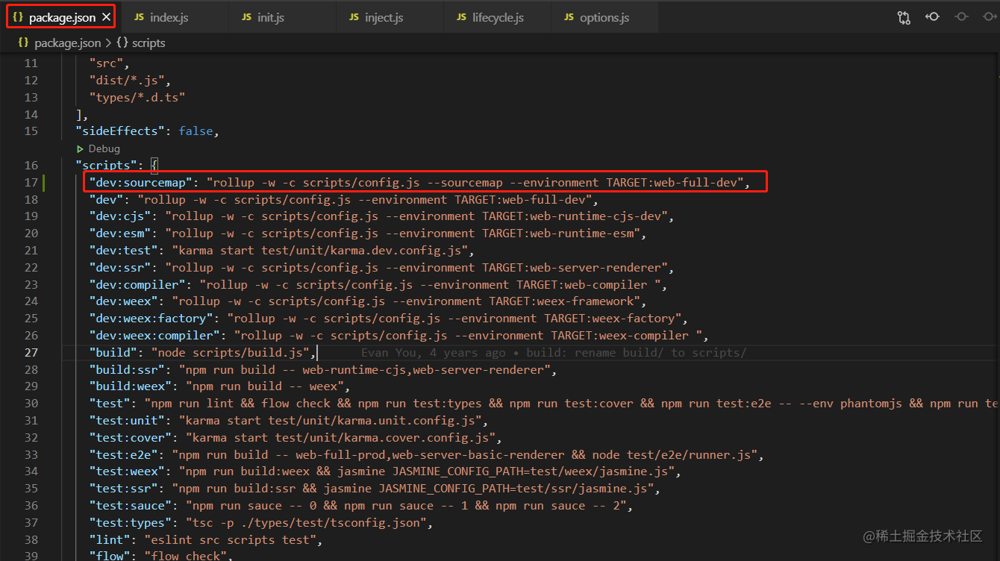

- 执行 `npm run dev:sourcemap` 命令，执行成功以后就会在 `dist` 目录下生成 `vue.js.map` 文件

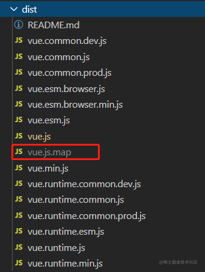

- 然后就可以在 `example` 目录下，写一些自己想要测试的例子，然后通过 `debug` 的形式找到对应内容在代码中的位置

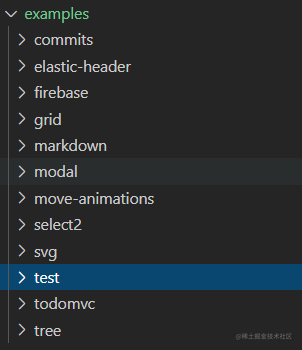

## 深入源码

### Vue 初始化的代码位置

既然要深入了解 Vue 初始化的内容，那么我们就得先找到 Vue 初始化是在哪里进行的，那么查找的方式有两种：

- **通过 package.json 文件来进行查找** —— 在 script 脚本命令配置中有 ` "dev": "rollup -w -c scripts/config.js --sourcemap --environment TARGET:web-full-dev"`，其中的 `scripts/config.js` 和 `TARGET:web-full-dev` 就为指明了文件里的具体配置，然后可以在逐层查找对应的入口文件
- **通过 debug 模式进行查找** —— 首先在 `example` 目录下新建一个目录，可以是任何名字，本文讨论的是初始化的内容，这里就将其命名为 `init`，在 `init` 目录下新建一个 `html` 文件，在里面引入 `dist` 目录下的 `vue.js`, 因为生成的 `map` 文件是 `vue.js.map`，否则 `debug` 时不方便查找对应的文件位置

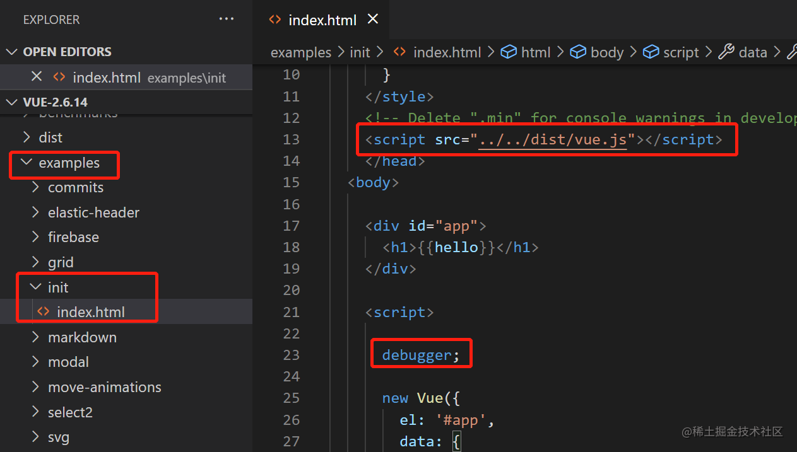

这里选择方式二，毕竟方式一通过 `rollup` 配置查找还是过于繁琐，于是通过 `debug` 可以快速确定 `Vue` 进行初始化的文件位置.

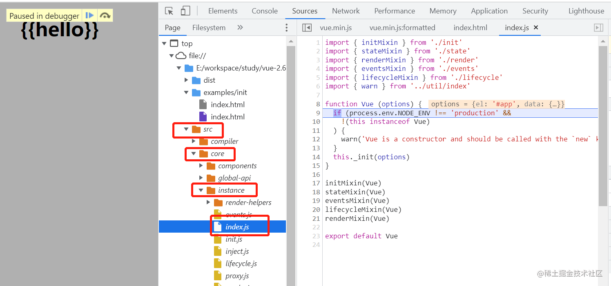

### this._init(options) 初始化

在 `src>core>instance>index.js` 文件中，可以清晰的看到，在我们进行 `new Vue()` 时，调用的其实就是 `this._init()` 方法，而这个方法又是在 `initMixin(Vue)` 中进行定义的

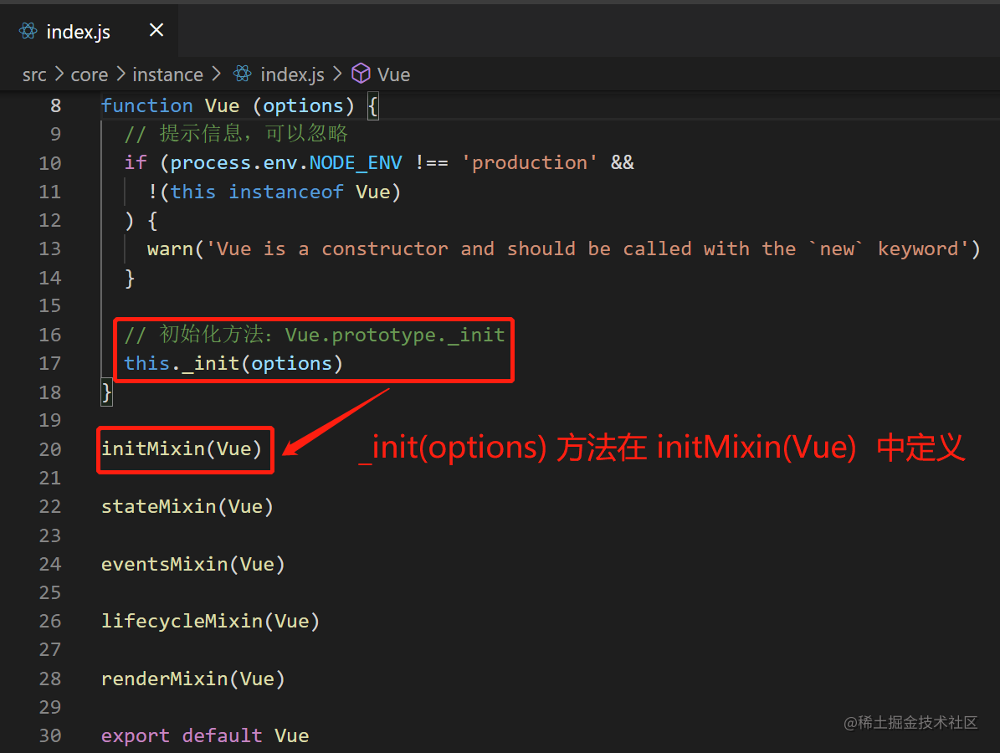

### initMixin(Vue) 方法

在 `src>core>instance>init.js` 文件中，可以看到在 `initMixin()` 方法中最核心的就是处理组件配置项的部分，这一部分又分为 **子组件** 和 **根组件** 的配置，又分别对应 `initInternalComponent()` 方法 和 `mergeOptions()`方法 + `resolveConstructorOptions()`方法.

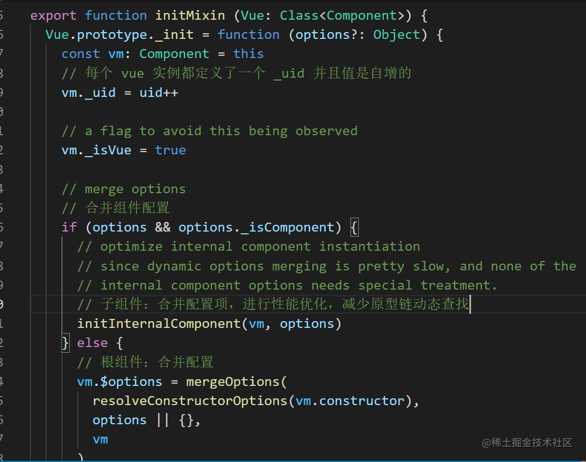

同时，在 Vue.prototype._init 函数中还存在下面的这些方法的调用，后面会依次对每个方法进行解读：

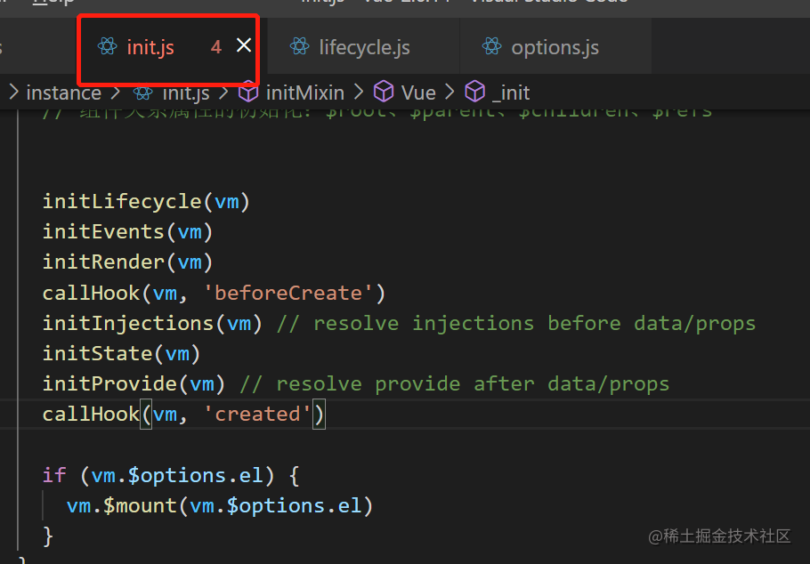

#### 子组件 —— initInternalComponent() 方法

这个方法做的事就是创建 `$options` 对象，然后对组件选项进行打平做性能优化，因为组件有很多的配置，其中也会存在各种嵌套的配置，在访问时免不了要通过原型链进行动态查找，会影响执行效率.

- 根据 `vm` 的构造函数创建新的配置对象，即平时访问的 `$options` 对象
- 把当前组件配置项打平然后赋值到 `$options` 对象，避免了原型链的动态查找
- 如果当前组件配置项中存在 `render` 选项，就把它添加到 `$options` 对象上

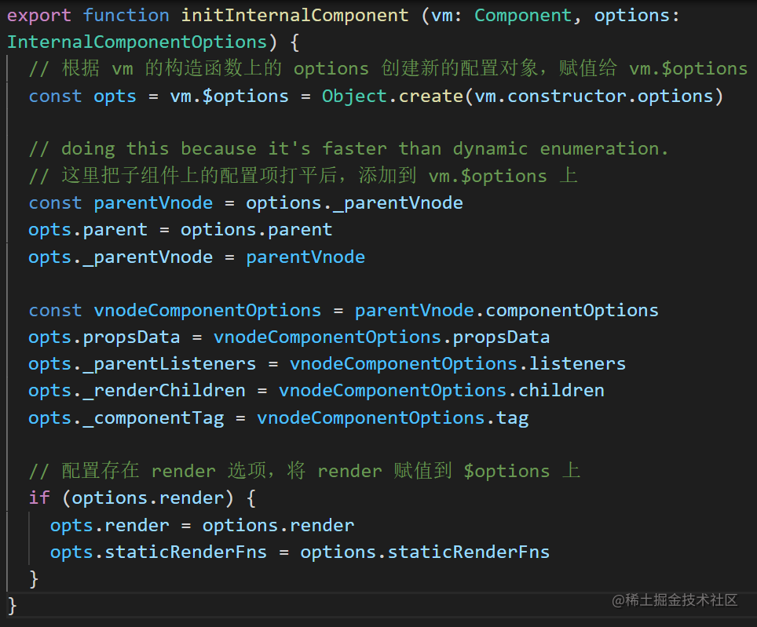

#### 根组件 —— resolveConstructorOptions() 方法

在 `src>core>instance>init.js` 文件中，`resolveConstructorOptions()` 方法其实最主要的事情就是从构造函数上解析配置对象，具体如下：

- 如果构造函数的 `super` 属性存在，证明还有基类，此时需要递归进行对配置选项解析
- 将构造函数的基类配置项进行缓存，然后比对当前配置项配置项进行对比，如果不一致，则表明基类的配置项已发生更改
- 找出被更改的配置项和 `extent` 选项进行合并，并赋值给 `$options`

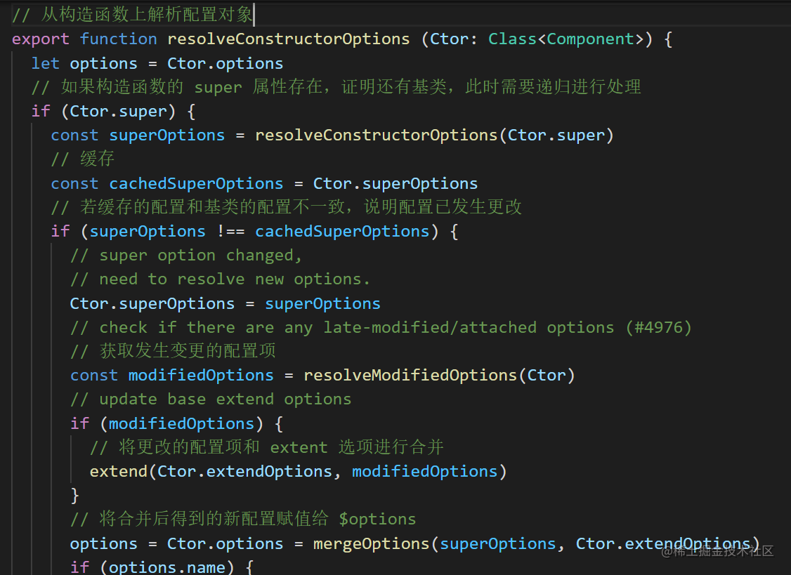

#### 根组件 —— mergeOptions() 方法

在 `src>core>instance>init.js` 文件中，`mergeOptions()` 方法主要做的事情就是：

- 对配置选项进行标准化
- 对传入的原始配置对象进行合并
- 返回新的配置对象 根组件合并配置项，就是将全局配置项合并到根组件局部配置项中，比如将全局注册的 `Vue.componet(options)` 全局配置合并到根组件 `new Vue(options)` 上得到类似：

```js
   new Vue({
     el: xxx,
     data: { xxx },
     componets:{
       localComponents,
       globalComponents,
     }
   })
```

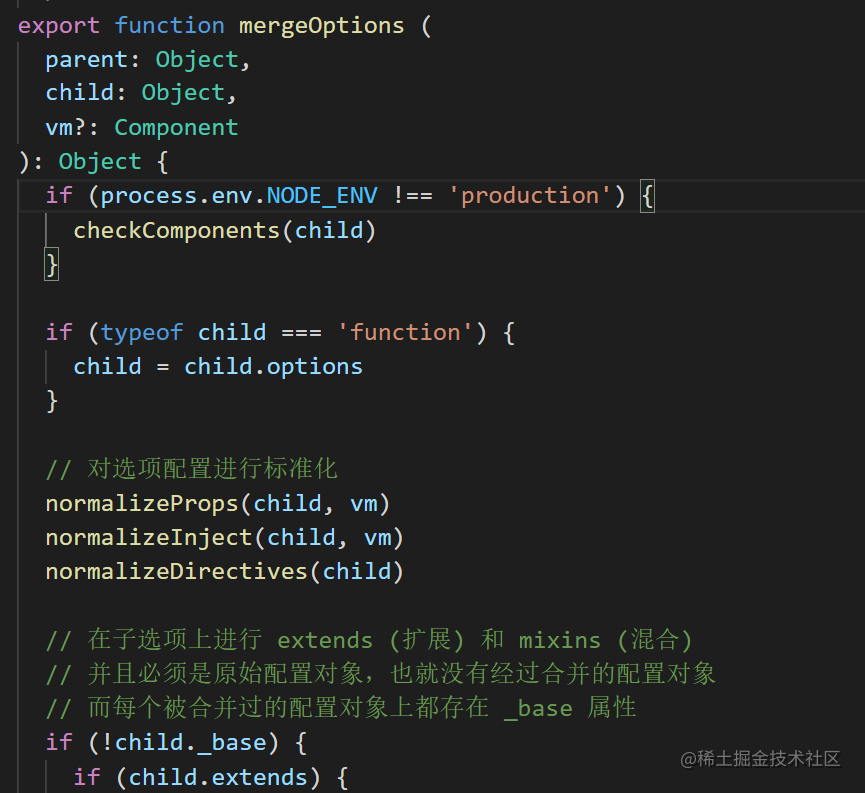

### initLifecycle() 方法

 在 `src>core>instance>init.js` 文件中， 调用 `initLifecycle()`方法，方法的具体定义位置为`src>core>instance>lifecycle.js`.

可能很多人会误以为该方法是初始化生命周期钩子函数的（因为其方法名），其实这个方法主要是对组件关系属性进行初始化，比如：`$root、$parent、$children、$refs` 等.

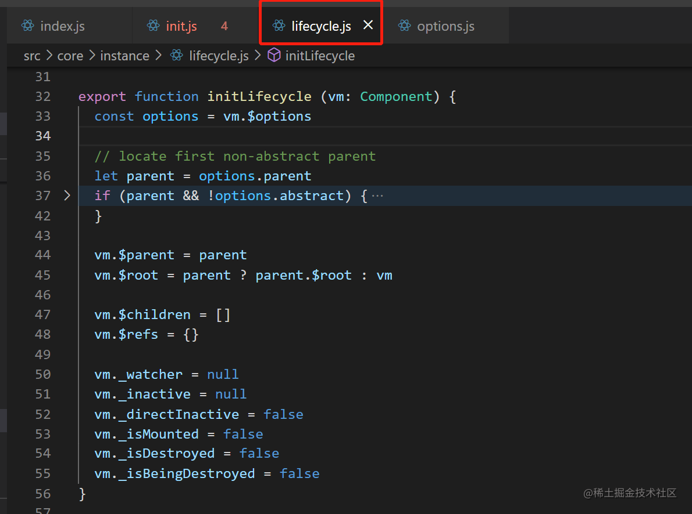

### initEvents() 方法

在 `src>core>instance>init.js` 文件中调用 `initEvents()`方法，方法的具体定义位置为`src>core>instance>events.js`.

**主要作用就是初始化自定义事件**，但是针对这个方法目前先有个简单的了解即可，因为里面涉及到的处理比较多，所以本文中暂时不对其进行展开，但是后面涉及到 `this` 实例上的方法时在具体分析.

**问题**：存在一个组件并且绑定了事件，如 `<comp @myclick="clickHandle" />`，那么我们可以在 `com` 组件中通过 `this.$emit('myClick')` 的方式去触发，那是谁监听了这个事件呢？

**回答**：也许你会认为是 `comp` 的父组件去监听的，但其实是 `com` 组件自己监听的，因为 `@myclick="clickHandle"` 会被编译为 `this.$on('myClick', function clickHandle(){ })` 和 `this.$emit('myClick')` 的形式，而其中的 `this` 指向的就是 **组件本身**.

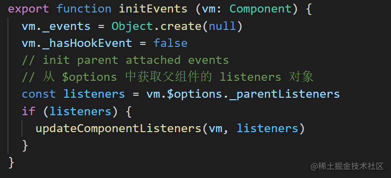

### initRender() 方法

在 `src>core>instance>init.js` 文件中调用 `initRender()`方法，方法的具体定义位置为`src>core>instance>render.js`.

这里具体的内容也不再展开，后面涉及到 `render` 部分在进行深入解读，其实主要就做了三件事：

- 初始化插槽，如：`vm.$slots、vm.$scopedSlots`
- 定义 `_c` 方法，即 `createElement` 方法，也就是 `h` 函数
- 对 `$attrs` 和 `$listeners` 属性进行响应式处理

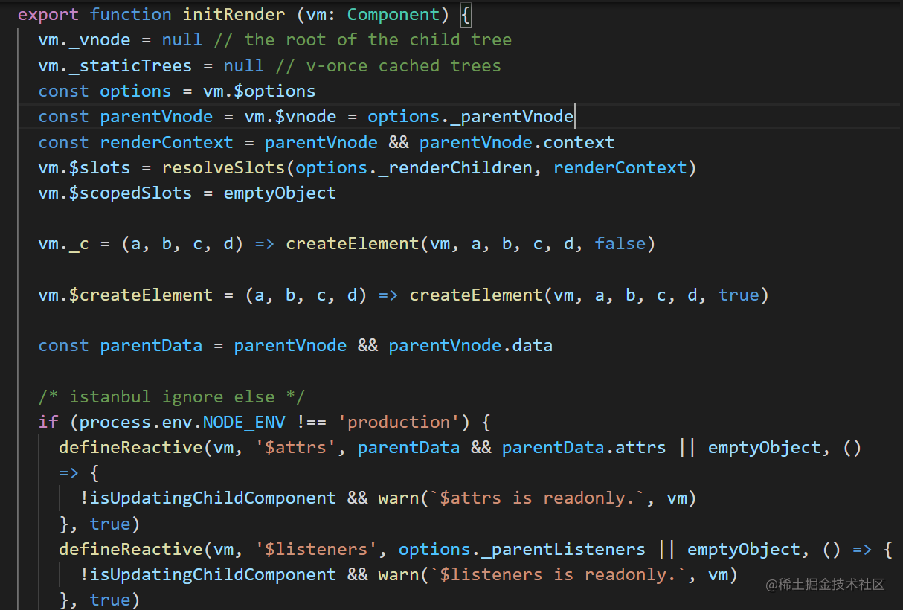

### callHook(vm: Component, hook: string) 方法

在 `src>core>instance>init.js` 文件中有调用 `callHook(vm, 'beforeCreate')` 和 `callHook(vm, 'created')`，这就是平时我们在组件配置项中定义的生命周期函数被调用的形式.

`callHook` 方法的具体定义位置为`src>core>instance>lifecycle.js` 中.

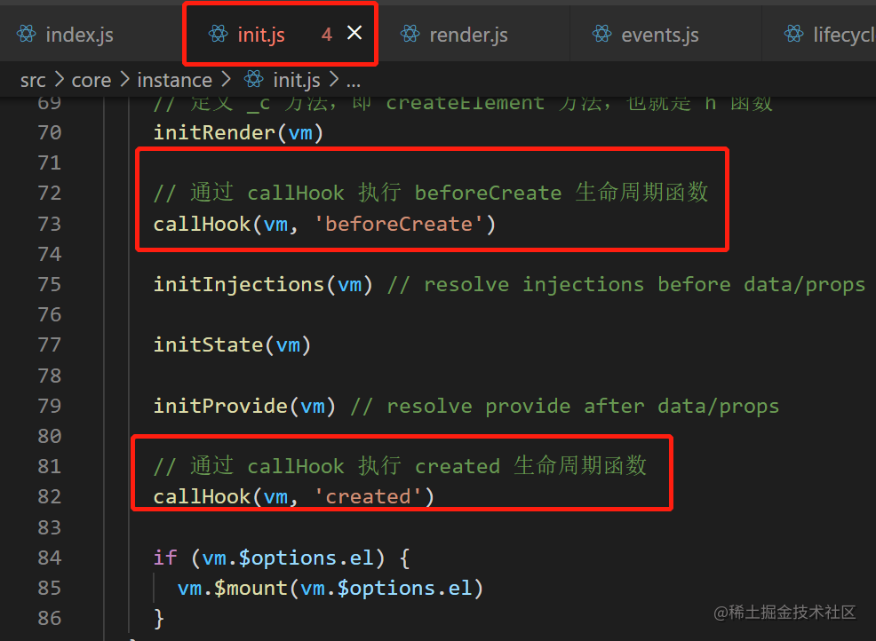

### initInjections() 方法

在 `src>core>instance>init.js` 文件中调用 `initInjections()`方法，方法的具体定义位置为`src>core>instance>inject.js`.

`provide/inject` 的相关介绍和使用方法，可以点此 [vue 文档](https://link.juejin.cn/?target=https%3A%2F%2Fcn.vuejs.org%2Fv2%2Fapi%2F%23provide-inject) 查看.

#### initInjections() 方法

主要做的就是获取解析之后的 `inject` 选项 `result`，然后把 `result` 的每一项都代理到 `vm` 实例上，也可以理解为是进行响应式处理，在组件中实现 `this.key` 的形式直接进行访问

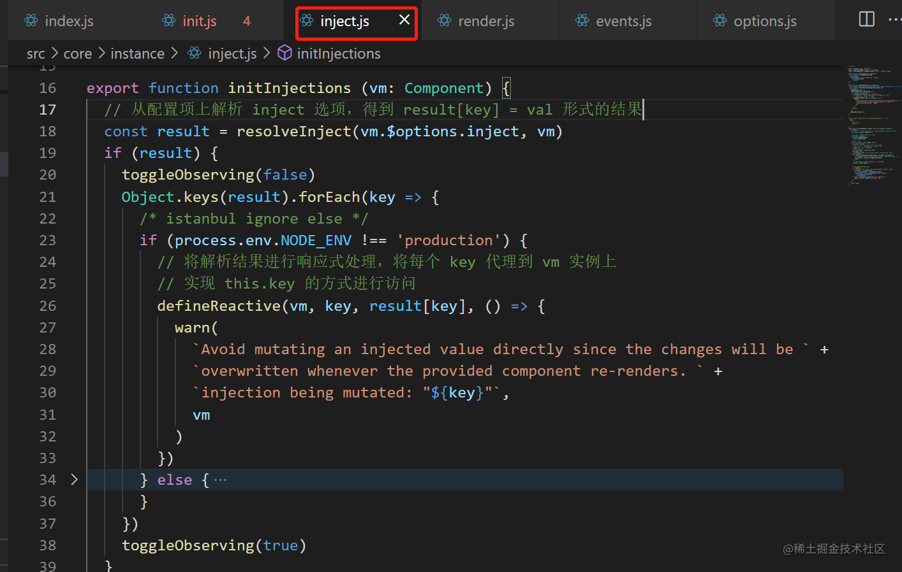

#### resolveInject() 方法

- `resolveInject(inject: any, vm: Component)` 方法中的 `inject` 选项到这之前就已经进行了标准化处理，所以这里的 `inject` 选项的格式一定为:

  ```js
   inject = {
     key: {
        from: xxx,
        default: xxx
      }
   }
  ```

- 遍历 `inject` 配置的所有 `key`，查找到对应 `provide` 中的值

  - 从 `inject` 配置中获取 `from` 属性值

  - 循环在祖代组件中查找 `provide` 选项，如果找到了，就获取对应的值，保存到 `result` 中；如果没有找到，就继续向上查找，一直到根组件

- 如果到了根组件还是没有找到 `inject` 中的 `key` 在对应祖代组件上 `provide` 的值，那么就检查 `inject` 中是否设置了默认值，如果设置了默认值，就将其赋值为默认值

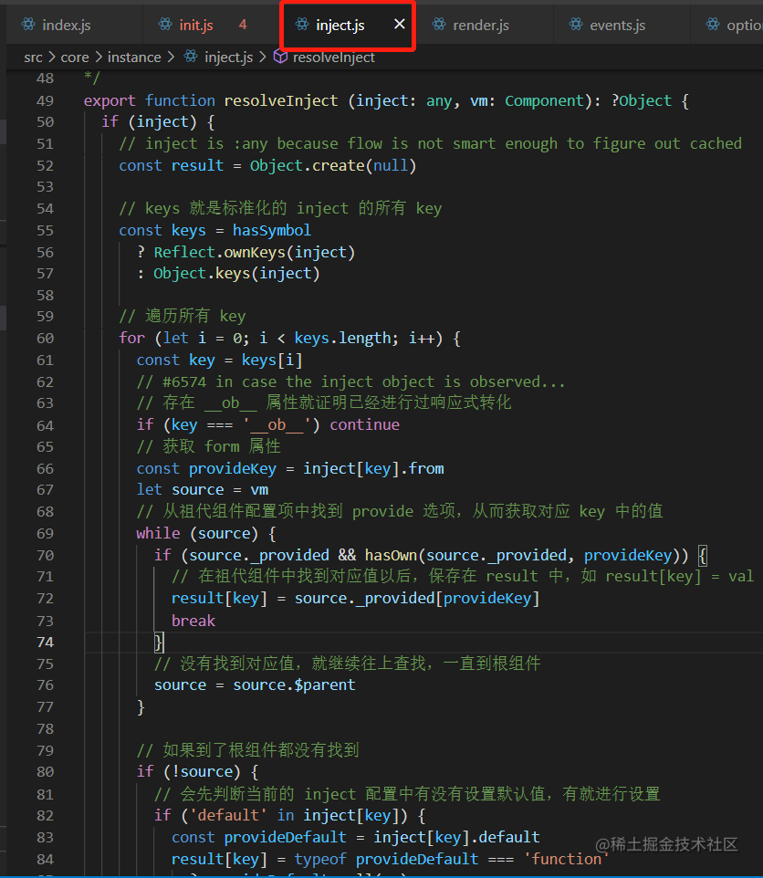

### initState() 方法

在 `src>core>instance>init.js` 文件中调用 `initState()`方法，方法的具体定义位置为`src>core>state.js`.

它是响应式原理的核心，主要处理 `props、data、methods、watch、computed` 等， 因为这一块属于响应式的内容，因此，不在本文里面进行深入探讨，后面针对响应式的内容会进行解读.

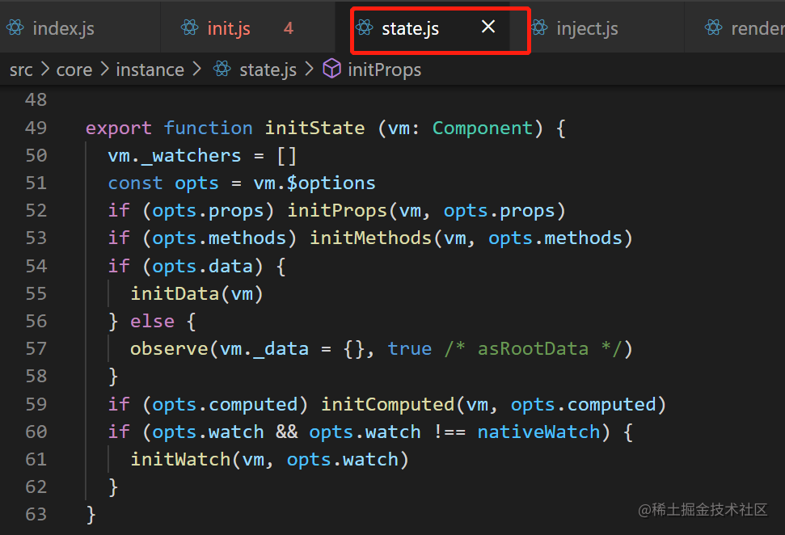

### initProvide() 方法

在 `src>core>instance>init.js` 文件中调用 `initProvide()`方法，方法的具体定义位置为`src>core>instance>inject.js`.

这里面做的事情很简单：

- 从 `$options` 上获取 `provide` 选项
- `provide` 选项存在时，判断它是不是函数，如果是函数就调用然后获取配置对象，如果不是函数就直接使用 `provide` 选项
- 在 `vm` 实例上挂载 `_provide` 属性，值就为上面的 `provide` 的具体内容

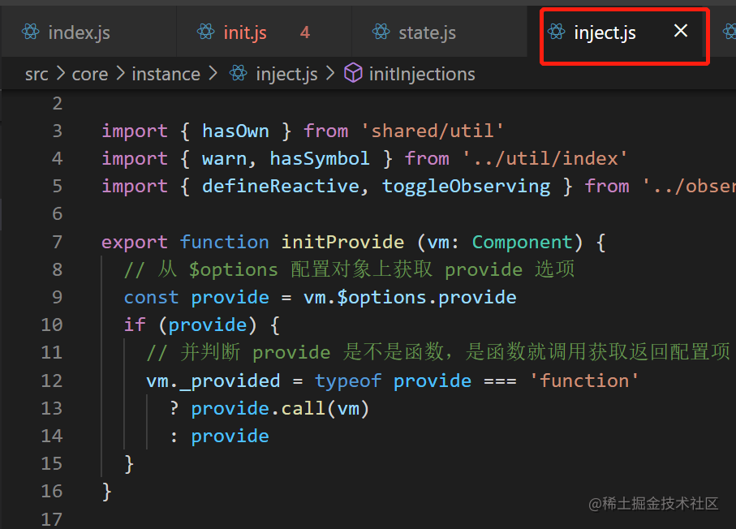

## 总结

面根据 `Vue.prototype._init` 初始化函数中使用的每个方法进行了分析，在这里需要稍微总结一下，顺便配合一些问题进行理解。

### 合并组件配置

- 子组件

  子组件进行合并配置项时，主要是通过打平配置项，减少原型链动态查找，达到性能优化的目的.

- 根组件

  根组件合并配置，就是将全局配置项合并到根组件局部配置项中.

  根组件合并会发生在三个地方：

  - 就是初始化时的这种情况
  - `Vue.component(name, Comp)` 时，将合并 `Vue 内置全局组件` 和 `用户注册的全局组件`，最终都会合并到跟组件上配置上的 `components` 选项中
  - `{ components:{xxx} }` 局部注册，执行编译器生成 `render` 函数时， 会合并全局配置对象到组件局部配置对象上

### 组件关系属性的初始化

如需要初始化 `$root、$parent、$children、$refs` 等.

### 初始化自定义事件

#### 问题：当在组件上使用自定义事件时，父组件和子组件谁负责监听这个事件？

```js
 // 这是一个伪代码 
  <parentComp>
    <comp @myClick="clickHandle" />
  </parentComp>
```

其实 `@myClick="clickHandle"` 会被编译为 `this.$emit('myClick')` 和 `this.$on('myClick', function clickHandle(){})` 的形式，而这个 `this` 就是组件实例，即谁需要触发事件，谁就需要监听事件.

### 初始化插槽 & 定义 _c 方法

- 初始化插槽，如：`vm.$slots、vm.$scopedSlots`
- 定义 `_c` 方法，即 `createElement` 方法，也就是 `h` 函数

### 通过 callHook 执行 beforeCreate 和 created 生命周期函数

#### 问题：beforeCreate 中能获取能访问什么内容，data 可以访问吗？

从源码中很容易看出来，在 `beforeCreate` 之前只初始化了 `组件关系属性`、`自定义事件`、`插槽` 和 `_c 方法`，所以关于可以访问的就是这些内容.

因为 `data、props、methods` 等都没有进行初始化，所以就都不能进行访问，当然如果你在 `beforeCreate` 中通过异步的方式访问，比如 `setTimeout` 其实是可以的，最早能访问数据的地方其实就是 `created` 当中了.

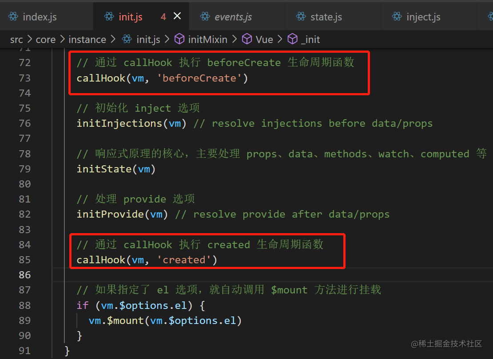

### 初始化 inject 选项

 根据 `inject` 选项从祖代组件配置项中找到对应的 `provide` 选项，从而获取对应 `key` 中的值，得到 `result[key] = val` 形式的结果

如果找到根组件上还不存在，就判断是否有 `default` 选项，有就设置默认值

把得到的 `result` 结果进行响应式处理，代理的 `vm` 实例上

### 初始化 state 数据

响应式原理的核心，主要处理 `props、data、methods、watch、computed` 等

### 处理 provide 选项

从 `vm.$options` 配置对象上获取 `provide` 选项，`provide` 选项存在时，判断 `provide` 是不是函数，是函数就调用获取返回配置项，否则就直接使用 `provide` 选项

### $mount 挂载

根据 `$options` 中是否存在 `el` 选项，决定是否自动调用 `$mount` 方法进入挂载阶段，没有则需要用户手动调用 `$mount` 进行挂载.

## 结合生命周期回答组件渲染流程

以下是 `beforeCreate` 和 `created` 生命周期前后需要处理的详细内容：

- **合并组件选项**，将组件配置项打平，存放到 `vm.$options` 选项上，减少原型链的查找
- **对组件关系属性进行初始化**，比如：`$root、$parent、$children、$refs` 等
- **初始化自定义事件**，比如：`@myclick="clickHandle"` 会被编译为`this.$on('myClick', function clickHandle(){})` 和 `this.$emit('myClick')` 的形式
- **初始化插槽**（`vm.$slots、vm.$scopedSlots`）、定义`_c`方法，即`createElement`（`h`函数）、对`$attrs`和`$listeners`属性进行响应式处理
- **执行 `beforeCreate` 生命周期函数**
- **初始化 `inject ` 选项**，根据`inject`选项从祖代组件配置项中找到对应的`provide`选项，从而获取对应`key`中的值，得到`result[key] = val`形式的结果
- **初始化 state 数据**，如：`props、data、methods、watch、computed` 等
- **处理 provide 选项**，判断 `provide`是不是函数，是函数就调用获取返回配置项，否则就直接使用`provide`选项
- **执行 `created` 生命周期函数**
- 其他部分可以直接按照图示回答

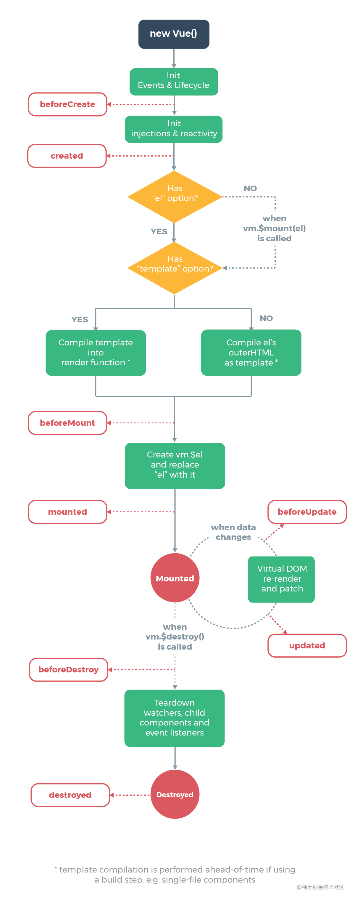

## 最后

看源码的过程中，一定要学会放弃某些内容解读，找准本次你要了解和学习的主线内容，否则就容易在阅读源码时产生各种支线问题，从而阻塞了主线的内容，对应的模块在学习对应内容时深入解读就好，不要一次性解读所有的内容。

**感兴趣可以阅读下一篇：**[**从 vue 源码看问题 —— 如何理解 vue 响应式？**](https://juejin.cn/post/7039345669403836447)

## 来源链接

作者：熊的猫
链接：https://juejin.cn/post/7038058903799595022
来源：稀土掘金
著作权归作者所有。商业转载请联系作者获得授权，非商业转载请注明出处。
