# 如何理解 vue 响应式？ <!-- omit in toc -->

> Author: tinfengyee
> Date: 2022-11-30 02:04:58
> LastEditTime: 2022-11-30 02:05:05
> Description: NO Desc

## 前言

[**上一篇**](https://juejin.cn/post/7038058903799595022) 我们通过 **Vue** 源码了解并总结了，**Vue** 初始化时需要进行哪些处理，其中遇到响应式的相关内容时选择了略读，没有进行深入了解，那么本篇就开始深入解读 **Vue** 响应式.

## 深入源码

### 响应式入口

根据上一篇 [**vue 初始化都做了什么事？**](https://juejin.cn/post/7038058903799595022) 的内容，可以快速定位到初始化时响应式的入口为 **`src > core > instance > init.js`** 中的 **`initState(vm)`** 方法，接下来就具体看看这个方法里面的具体实现.

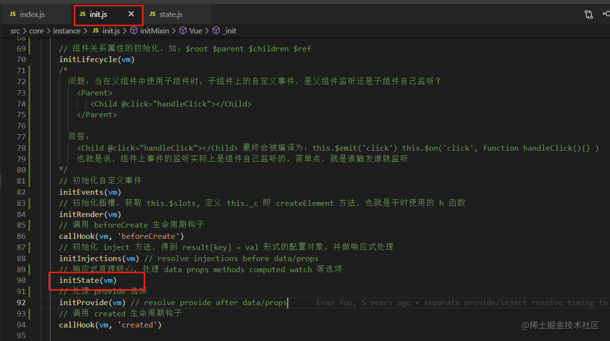

### initState(vm) 方法

这个方法具体定义的位置为 **`src > core > instance > state.js`**.

可以看到这里面需要对 **`props、methods、data、computed、watch`** 等选项进行单独处理，分别对应的是 **`initProps()、initMethods()、initData()、initComputed()、initWatch()`** 这个几个方法，显然想要了解更多，必须要去这些方法中一探究竟了.

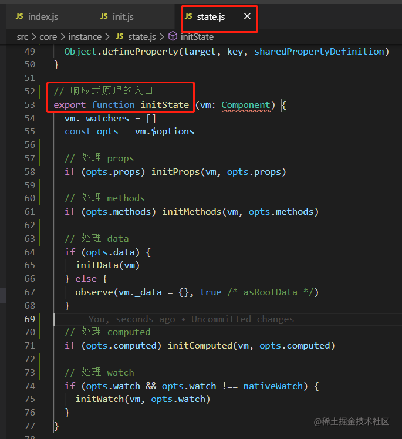

#### initProps() 方法

当存在 `props` 选项时，就会通过这个方法对 `props` 进行处理, 这个方法具体定义的位置为 **`src > core > instance > state.js`**.

**这个方法主要做的事**：

- 遍历 `props` 上的所有 `key`
  - 将遍历到的 `key` 保存到 `vm.$options._propKeys` 上，主要目的就是为了缓存 `prop` 键，以便将来的 `props` 更新可以使用 `Array` 进行迭代，而不是对动态对象进行键枚举
  - 限制 `props` 中的 `key`，不允许使用保留属性 `key`，即判断哪些 `key` 不可以用作 `components` 的 `props` 属性
  - 对 `props` 进行响应式处理，这里后面统一解读 `defineReactive()` 方法
  - 将 `props` 通过 `proxy(vm, _props, key)` 方法，将对应的 `key` 代理到 `vm._props` 属性上，即 `this.propsKey` 等价于 `this._props.propskey`，这里会存在一个优化，只会代理原来不存在的 `key`，即新添加的 `key`

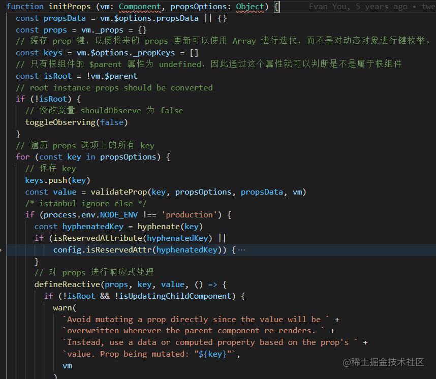

#### initMethods() 方法

当存在 `methods` 选项时，就会通过这个方法对 `methods` 进行处理, 这个方法具体定义的位置为 **`src > core > instance > state.js`**.

**这个方法主要做的事**：

- 获取 `props` 的配置，然后进行判重处理，即 `methods` 中的 `key` 不能和 `props` 中的 `key` 重复
  - 可以很容易看出来 `propsKey` 和 `methodsKey` 的优先级为： `propsKey` > `methodsKey`

- 将 `methods` 中的所有方法赋值到 `vm` 实例上，并将函数内部的 `this` 绑定到 `vm` 上，即可以直接通过 `this.methodsKey` 访问

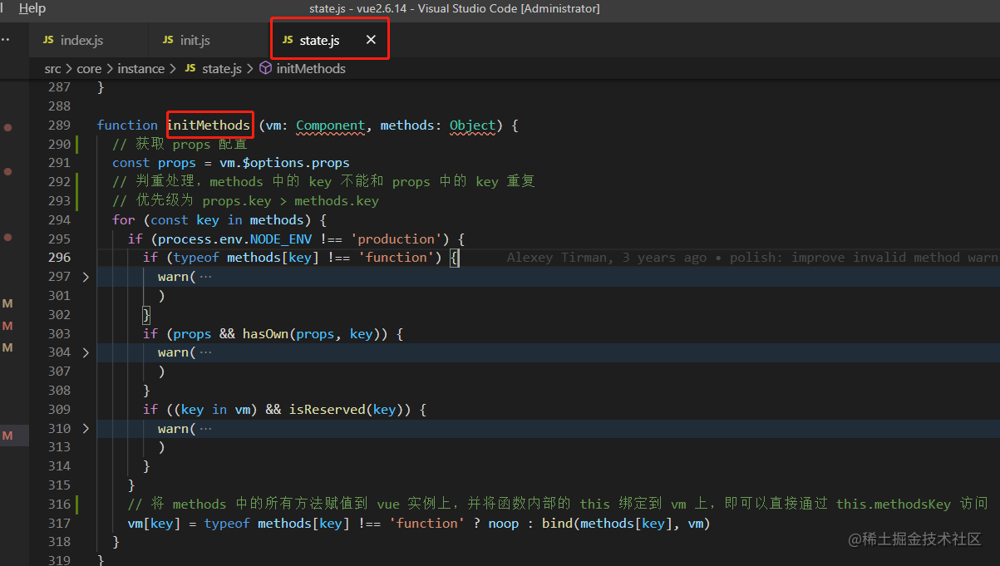

#### initData() 方法

当存在 `data` 选项时，就会通过这个方法对 `data` 进行处理，这个方法具体定义的位置为 **`src > core > instance > state.js`**.

**这个方法主要做的事**：

-  获取 `data` 选项，判断 `data` 是否为函数
  - 如果是函数，绑定内部 `this` 指向 `vm`，并将 `vm` 作为参数传递，通过 `call` 调用函数取得返回值，并且保证 `data` 最终是个对象
  - 不是函数 且 `data` 不存在，就赋值为 `{}`

- 遍历 `data` 选项中的所有 `key`，进行判重处理，`data` 中的属性与 `props` 和 `methods` 中的属性不能重复
  - 优先级为： `propsKey > dataKey > methodsKey`，这一点其实可以从 `warn` 中的提示看出来

- 对 `data` 进行 `observer` 处理

  -  当存在 `__ob__` 属性时，证明已经进行了 `observer` 处理，直接返回 `__ob__` 对象
  - 当不存在 `__ob__` 属性且需要对 `value` 进行 `observer` 处理时，通 `new Observer(value)` 进行处理，后面会对这个 `Observer` 类进行解读

  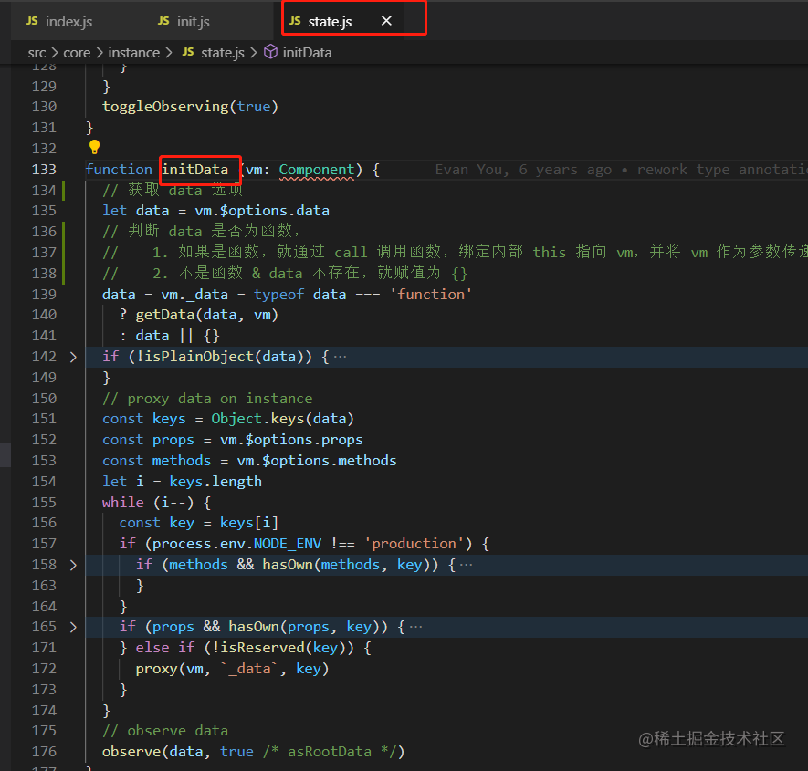

#### initComputed() 方法

当存在 `computed` 选项时，就会通过这个方法对 `computed` 进行处理，这个方法具体定义的位置为 **`src > core > instance > state.js`**.

如果对 `computed` 的用法不够了解，可以参考 [官方文档](https://link.juejin.cn/?target=https%3A%2F%2Fcn.vuejs.org%2Fv2%2Fapi%2F%23computed)

**这个方法主要做的事**：

- 创建一个完全空的对象赋值给 `vm._computedWatchers`，方便后面用于存储每个 `computedKey` 对应的 `watcher` 实例
- 遍历 `computed` 中的所有 `key`
  - 判断当前 `computed` 上对应属性值的类型，目的是为了获取当前 `key` 对应的 `getter` 函数。如果是函数及代表其就是 `getter` 函数；如果不是函数，默认传入的是包含 `get` 函数的配置对象，于是获取 `get` 函数赋值给 `getter`
  - 为每个 `key` 通过 `new Watcher()` 实例化一个 `watcher` 并保存到 `vm._computedWatchers` 中，并且 `computedWatcherOptions` 选项中配置了 `{ lazy: true }` 即懒执行
  - 对 `key` 进行判重处理: `computed` 的属性不能与 `data、 props、 methods` 中的属性重复，优先级为：`prop > data > methods > computed`
  - 如果当前的 `key` 不在 `vm` 实例上，就调用 `defineComputed()` 方法，将 `computed` 中的 `key` 代理到 `vm` 上

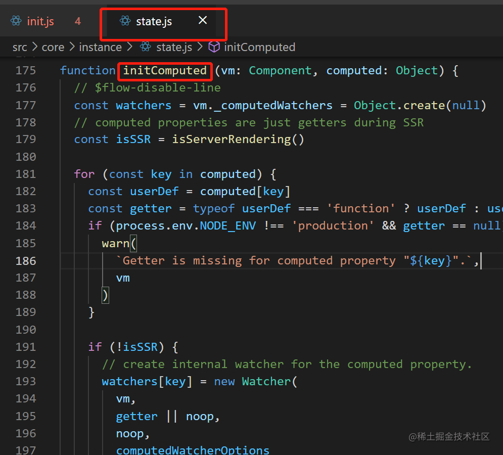

**defineComputed() 方法中的 createComputedGetter() 方法**

- 拿到 `watcher` 实例，当且仅当 `watcher` 存在才需要进行其他处理

- 其中 `watcher.dirty` 为 `true` 表示 `getter` 函数中的依赖发生变化，需要通过执行 `watcher.evaluate()` 计算得到最新的值，执行之后又把 `watcher.dirty` 赋值为 `false`

- 如果 `Dep.target` 存在，需要进行依赖收集

> **computed 和 methods 的区别？** **computed** 在一次渲染当中，只会执行一次，后续访问不会执行，除非 **getter** 函数中的响应式数据发生变更，即此时会调用 **watcher.update** 并把 **watcher.dirty** 变成 **true**，此时就需要重新执行 **getter** 函数返回最新值. 值得注意的是，**computed** 是通过 **watcher** 实现的，它缓存的原理其实是依赖于 **watcher.dirty**.

**methods** 只要调用了函数，函数就会重新执行，不论函数被使用多少次.

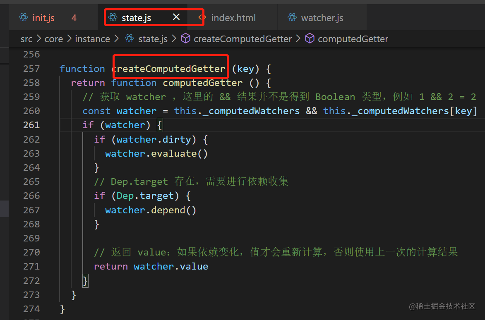

#### initWatch() 方法

当存在 `watch` 选项时，就会通过这个方法对 `watch` 进行处理，这个方法具体定义的位置为 **`src > core > instance > state.js`**.

如果对 `watch` 的用法不够了解，可以参考 [官方文档](https://link.juejin.cn/?target=https%3A%2F%2Fcn.vuejs.org%2Fv2%2Fapi%2F%23watch)

**这个方法主要做的事**：

- 遍历 `watch` 配置项，获取每个 `handler`，这里的 `handler = watch[key]`
  - 判断 `handler` 是否为数组，是数组就循环调用 `createWatcher()` 方法，如果不是数组就直接调用 `createWatcher()` 方法
- `createWatcher()` 方法中也会判断 `handler` 的类型，
  - 如果是普通对象那么就意味着是配置对象，此时把 `handler` 赋值给 `options`，并且从 `handler` 配置中取出名为 `handler` 的函数赋值给 `handler` 配置对象，最后都传给 `createWatcher()`
  - 如果是字符串，则代表此时 `handler` 的值是对应 `vm` 实例上 `methods` 中对应的方法，此时取得 `methods` 上的这个方法，并赋值给 `handler` 本身
  - 
    最后调用 `vm.$watch`，即 `Vue.prototype.$watch`

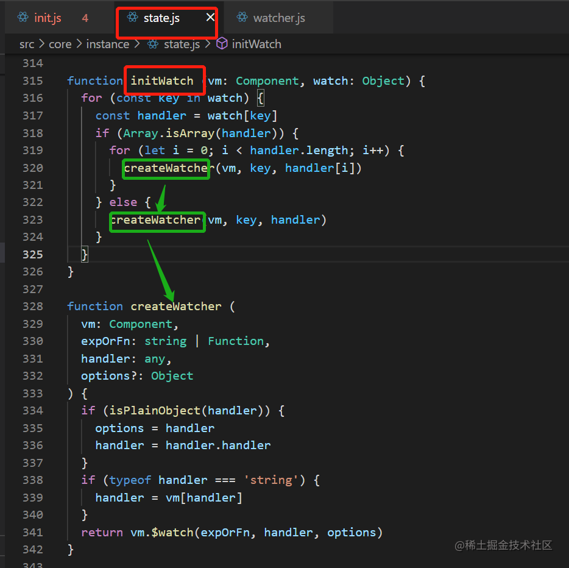

**Vue.prototype.$watch( expOrFn, cb, options?) 方法**

首先要确定一点，定义在原型上的方法，可以在组件中直接通过 `this.$watch()` 的方式直接调用，因此，在这方法里面还是要处理参数问题.

- 判断 `cb` 类型

  - 如果是普通对象，此时代表用户是通过 `this.$watch()` 方式进行配置的，于是就需要通过 `createWatcher()` 方法进行处理，处理之后又会在 `createWatcher()` 中调用 `this.$watch()`，此时，就能保证后续 `cb` 一定是个函数

  - 如果 `cb` 已经是一个班函数，那么就开始处理对应内容. 首先通过 `options.user = true` 标记当前是一个用户 `watcher`，接着实例化一个 `watcher`；然后，判断 `options.immediate` 是否为 `true`，如果是 `true` 则会在 `invokeWithErrorHandling()` 方法中通过 `apply` 或 `call` 调用 `cd`
  - 最后，向外返回 `unwatchFn` 方法，内部通过调用 `watcher.teardown()` 解除监听

  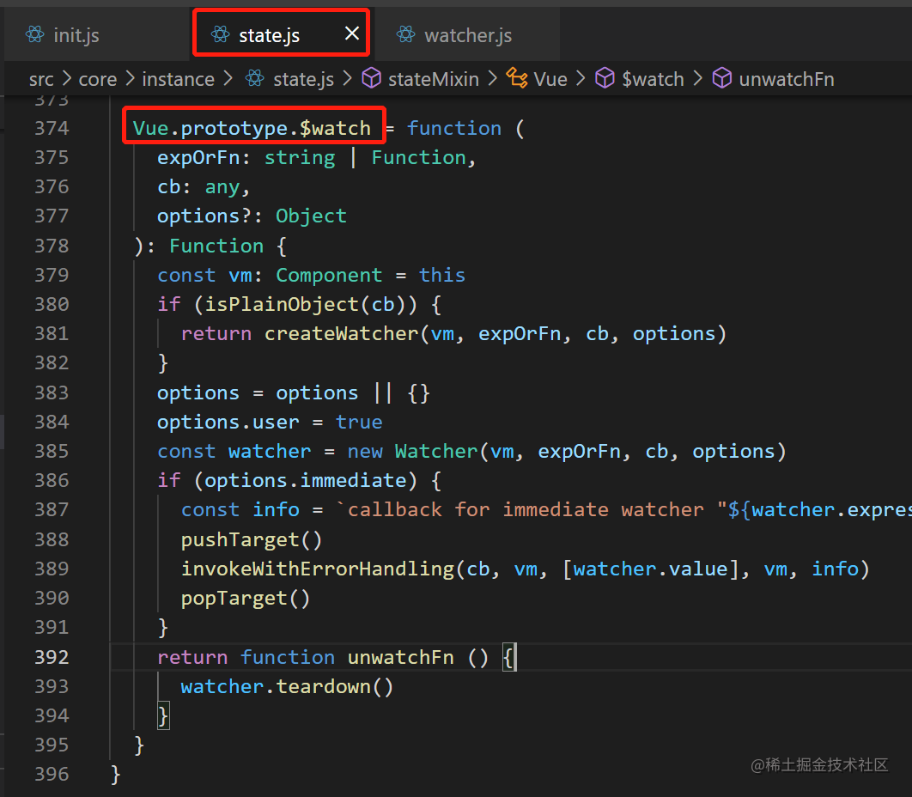

#### computed 和 watch 的异同？

从源码中很容易知道，`computed` 和 `watch` 都是通过 `Watcher` 去实现的，并且都是一个 `key` 对应一个 `watcher` 实例.

**不同点：**

- `computed` 默认懒执行且不可配置的，因为在源码中通过 `computedWatcherOptions = { lazy: true }` 定义的，而 `watch` 可通过配置项中的 `immediate` 的值来执行
- `computed` 中一般执行同步同理，因为要往外实时返回一个计算值，而 `watch` 支持异步处理
- `computed` 中的返回值具有缓存的特性，主要是通过 `watcher.dirty` 来实现的，而 `watch` 没有缓存支持

### observe() 方法

在上面的篇幅中，由于其他的内容点也不少，所以没有在上面对响应式进行深入解读，本质上在上面的所有 `props、data、methods` 等处理完成之后都会进行 `observer` 处理，下面就对其进行解读.

#### 入口位置

具体定义位置为：**`src > core > observer > index.js`**.

**这个方法要做的事很简单：**

- 判断 `value` 是否是对象或者 `value` 为 `VNode` 实例，就不进行处理
- 当 `value` 上存在 `__ob__` 属性时，证明已经进行了`observer` 处理，直接返回 `__ob__` 对象
- 当不存在 `__ob__` 属性且需要对 `value` 进行 `observer`，就通过 `new Observer()` 进行实例化 `__ob__` 并返回

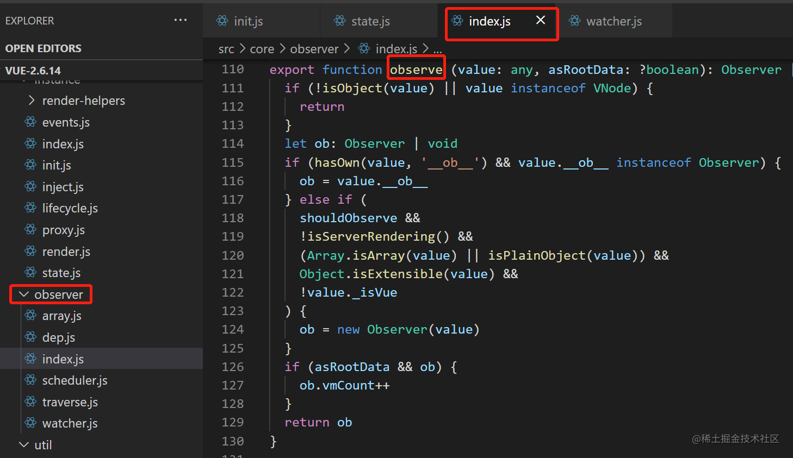

#### Observer 类

类的具体定义位置为：**`src > core > observer > index.js`**.

- 往 `observe` 实例上添加一个 `dep` 属性，其值为 `new Dep()`

- 通过 `def(value, '__ob__', this)` 为当前的 `value` 使用 `Object.defineProperty` 定义 `__ob__` 属性，即标记当前 `value` 已进行过 `observe` 处理

- 判断当前接收的 `value` 类型

  - 如果是数组，处理数组的响应式

  - 如果是对象，通过 `this.walk(value)` 处理对象的响应式，其内部就是遍历每个 `key` 调用 `defineReactive(obj, keys[i])`

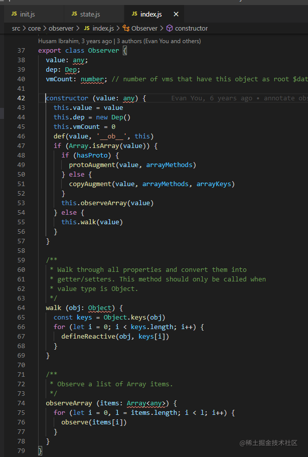

#### defineReactive() 方法

-  实例化一个 `dep` 实例，仍然是一个 `key` 对应一个 `dep`

-  获取 `obj[key]` 的属性描述符 `property`，判断是否支持对 `property` 属性描述符是否可配置，不支持就直接结束

-  通过 `property` 获取 `getter` 和 `setter` 并且，判断入参个数赋予 `val` 值

-  判断是否需要深度监测，如果需要就继续执行 `observe(val)` 方法，然后获取到子 `__ob__` 即获取 `childOb`

-  对 `obj[key]` 的 **get 访问** 和 **set 设置** 进行拦截

  - 在 **get 拦截** 中，如果 `Dep.target` 存在，通过 `dep.depend()` 进行 **依赖双向收集**，将 `dep` 添加到 `watcher` 中，也将 `watcher` 添加到 `dep` 中。如果 `childOb` 存在对其（嵌套对象）也进行依赖收集，此时还会判断当前 `value` 是否为数组，如果是数组需要执行 `dependArray(value)` 方法，使用 **循环 + 递归** 的方式处理 **数组中选项为对象** 的情况，对其进行依赖收集，因为前面的所有处理都没有办法处理这种情况，因为数组不能像通过属性 `getter` 那样进行拦截

  - 在 **set 拦截** 中，首先获取修改之前的旧值，若新值和旧值相等就不进行处理，同时也会判断当前 `value` 是否是只读的，即存在 `getter` 不存在 `setter` 就是只读，此时也不做处理；接着就是设置新值，然后对新值通过 `observe(newVal)` 进行响应式处理；最后，通过 `dep.notify()` 进行依赖更新通知，其实就是调用 `watcher` 上的 `update` 方法，然后就进入 **异步更新阶段**，这个阶段后面章节会介绍.

##### 那为什么watcher也要存放dep呢？依赖双向收集

>  是因为当前正在执行的watcher需要知道此时是哪个dep通知了自己。

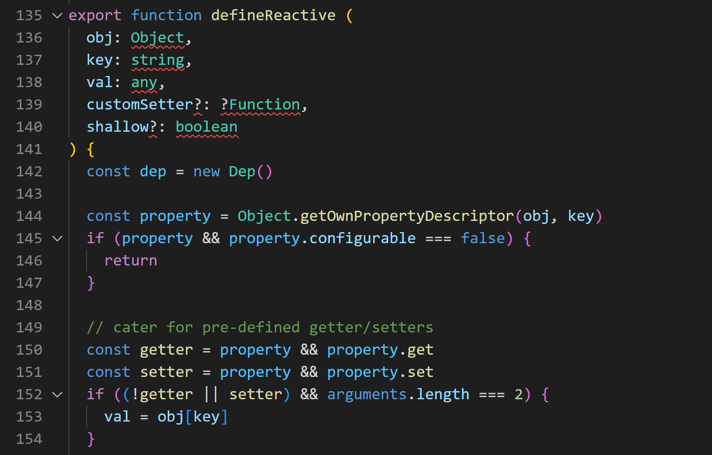

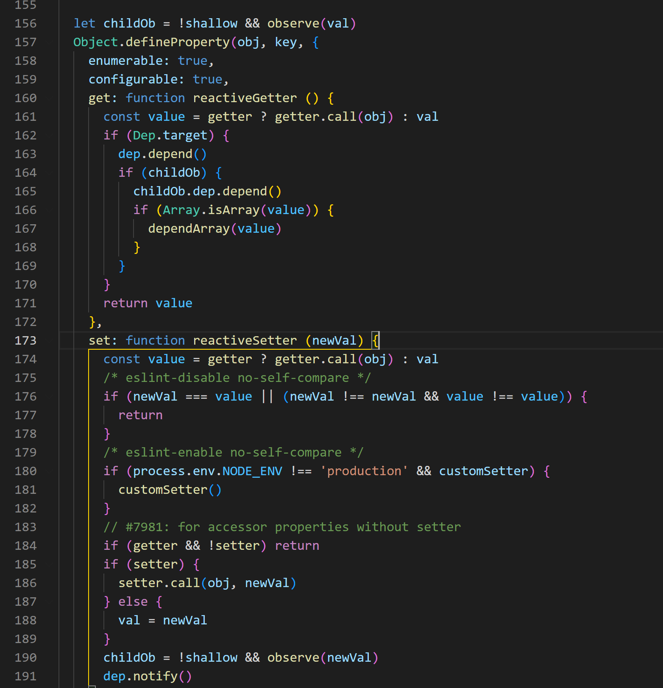

**对数组处理响应式**

这一部分其实也是属于上面的内容，由于上面的内容比较多，这里单独进行解读.

**主要处理内容：**

- 先判断是否有 `obj.__proto__` 属性，因为这个属性是非标准的，所导致某些浏览器版本上会不存在，需要进行判断，可以通过 [**Can I use**](https://link.juejin.cn/?target=https%3A%2F%2Fcaniuse.com%2F%3Fsearch%3D__proto__) 查看.
  - 如果支持 **proto** 属性，就会通过 `protoAugment(value, arrayMethods)` 方法对原型链进行覆盖，即 `target.__proto__ = src`
  - 如果不支持，通过 `copyAugment(value, arrayMethods, arrayKeys)` 方法在这个对象上使用 `def(target, key, src[key])` 直接在数组对象上定义对应的属性

- `arrayMethods` 对象

  - 基于数组原型，创建一个新对象，复写（增强）数组原型上的方法，使其覆盖数组原型方法

  - 定义 `methodsToPatch` 数组，里面保存 7 个数组操作方法的方法名，遍历 `methodsToPatch` 通过 `def()` 方法为 arrayMethods 对象上定义上面的 7 个方法

  - 如果执行的是 push、unshift、splice，代表新增、删除和替换，此时需要对新元素进行响应式处理

  - 通过 `ob.dep.notify()` 进行依赖更新通知，这也是进入异步更新阶段

  - 向外返回处理结果，对应方法的处理结果还是通过 apply 调用对应的原生方法进行返回

- `this.observeArray(value)` 方法遍历数组每一项，对其进行 `observe` 处理，即响应式处理

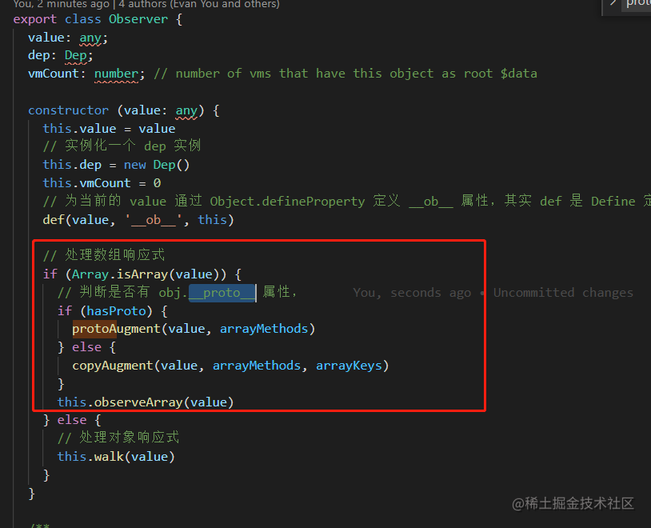

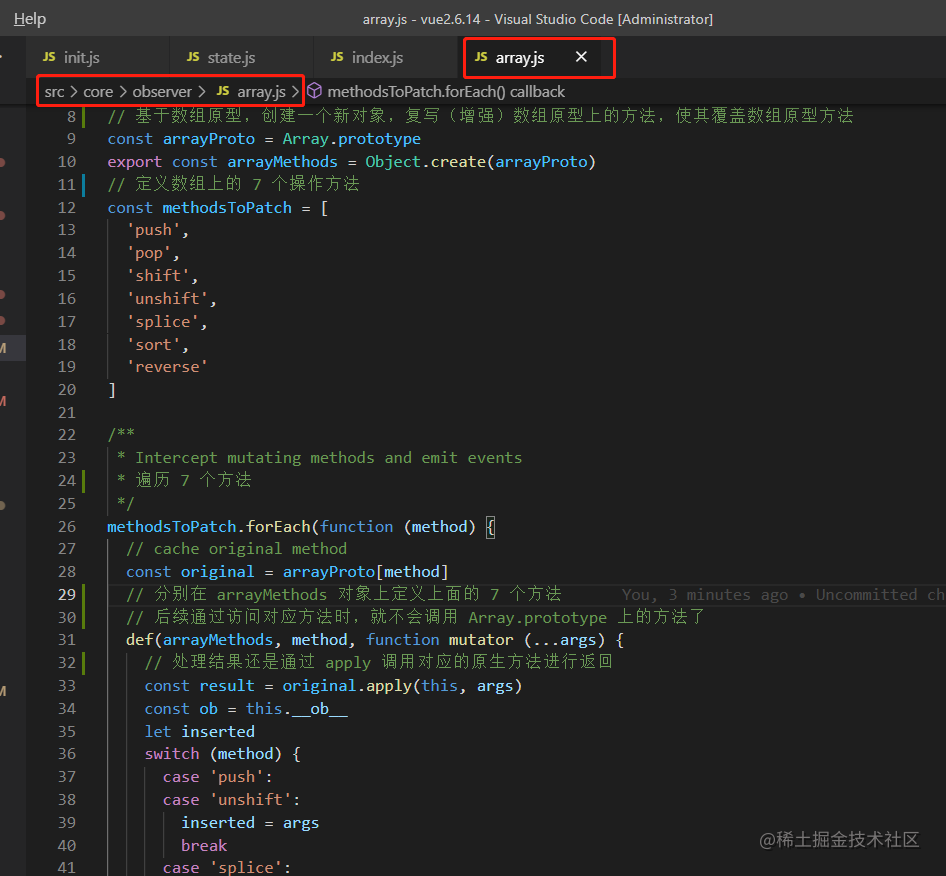

## 总结

### Vue 响应式原理是如何实现的？

> 注意 **data** 配置项在进行 **observe** 处理时一定会是个对象，详细可看 **initData ()** 方法

- 其核心是通过 **`Object.defineProperty`** 对数据的访问和设置进行拦截处理

- 以 **`data`** 配置项为例，通过 **`new Observer()`** 对其进行处理，此时当前响应式目标数据会被分为 **对象** 和 **数组** 两类

  - **对象**：调用 **`this.walk()`** 方法，遍历对象上所有的 `key` 通过 `Object.defineProperty` 设置 `getter` 和 `setter` 实现拦截；如果属性值依旧为 **对象**，则递归为 **嵌套对象** 上的每个 `key` 设置 `getter` 和 `setter`
    - 通过 `key` 访问数据时触发 `getter` ，此时会进行依赖收集，即使用 `dep.depend()` 把相关的 `watcher` 保存在 `dep` 中
    - 通过 `key` 设置数据时触发 `setter`，此时通过 `dep.notify()` 通知相关的 `watcher` 进行更新，即调用 `watcher.update()`

  - **数组**：重新对数组上的 **7** 个方法进行覆盖，实现对数组原型方法的拦截
    - 通过遍历对数组的每一项元素通过 `new Observer()` 进行响应式处理，前提是当前数组项为 **对象** 或 **数组**
    - 当该数组进行调用 `push、unshift、splice` 方法时，认为属于 **插入、替换** 操作，此时需要对当前传入的新数组项进行 `new Observer()` 处理，最终是要触发了这 **7** 个方法之一都会由 `dep.notify()` 通知 `watcher` 进行更新，即调用 `watcher.update()`

### methods、computed、watch 有什么区别？

 **使用场景**

- **methods** —— 包含比较复杂的组件处理逻辑，可包含 **同步逻辑** 和 **异步逻辑**
- **computed** —— 使用于简单的数据处理并返回结果，主要是为了减少在模板上的逻辑处理，因此只适用于 **同步逻辑**
- **watch** —— 主要用于监听组件数据变化时，需要进行复杂的操作，可包含 **同步逻辑** 和 **异步逻辑**

**区别**

- computed 和 methods
  - **methods** —— 多次使用同一个 `methods` ，那么它就会被执行多次
  - **computed** —— 默认是 **懒执行** 的，并且不可进行配置，在一次渲染中多次使用 `computed` 属性只会调用一次，即其计算结果具有 **缓存** 特性，本质上是通过 `watcher.dirty` 属性进行控制实现的
- computed 和 watch
  - 本质上都是通过 `Watcher` 实现的，但 `computed` 是懒执行不可配置，而 `watch` 可以通过 `options.immediate` 进行配置
- watch 和 methods
  - 它们并不适合进行比较，因为属于不同的内容，因此只能从包含关系进行区分，`watch` 中的复复杂逻辑可以抽离成一个个的 `metods` 中

### vue 如何处理 props、data、methods、computed 中的属性 key 重复问题？

`vue` 中对每个配置项中 `key` 的定义都会做 **判重处理**，主要是依赖它们的优先级：

**propsKey > dataKey > methodsKey > computedKey**

## 来源链接

[从 vue 源码看问题 —— 如何理解 vue 响应式？](https://juejin.cn/post/7039345669403836447)
