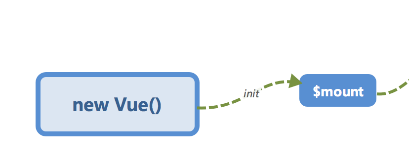

# 响应式系统的基本原理 <!-- omit in toc -->

> Author: tinfengyee
> Date: 2022-12-01 17:51:43
> LastEditTime: 2022-12-01 17:51:46
> Description: NO Desc

## 响应式系统

Vue.js 是一款 MVVM 框架，数据模型仅仅是普通的 JavaScript 对象，但是对这些对象进行操作时，却能影响对应视图，它的核心实现就是「**响应式系统**」。尽管我们在使用 Vue.js 进行开发时不会直接修改「**响应式系统**」，但是理解它的实现有助于避开一些常见的「**坑**」，也有助于在遇见一些琢磨不透的问题时可以深入其原理来解决它。

## `Object.defineProperty`

该方法可以定义或者修改一个属性，首先我们来介绍一下 [`Object.defineProperty`](https://developer.mozilla.org/en-US/docs/Web/JavaScript/Reference/Global_Objects/Object/defineProperty)，Vue.js就是基于它实现「**响应式系统**」的。

首先是使用方法：

```
/*
    obj: 目标对象
    prop: 需要操作的目标对象的属性名
    descriptor: 描述符
    
    return value 传入对象
*/
Object.defineProperty(obj, prop, descriptor)
```

descriptor的一些属性，简单介绍几个属性，具体可以参考 [MDN 文档](https://developer.mozilla.org/en-US/docs/Web/JavaScript/Reference/Global_Objects/Object/defineProperty)。

- `enumerable`，属性是否可枚举，默认 false。
- `configurable`，属性是否可以被修改或者删除，默认 false。
- `get`，获取属性的方法。
- `set`，设置属性的方法。

## 实现 `observer`（可观察的）

知道了 `Object.defineProperty` 以后，我们来用它使对象变成可观察的。

这一部分的内容我们在第二小节中已经初步介绍过，在 `init` 的阶段会进行初始化，对数据进行「**响应式化**」。


