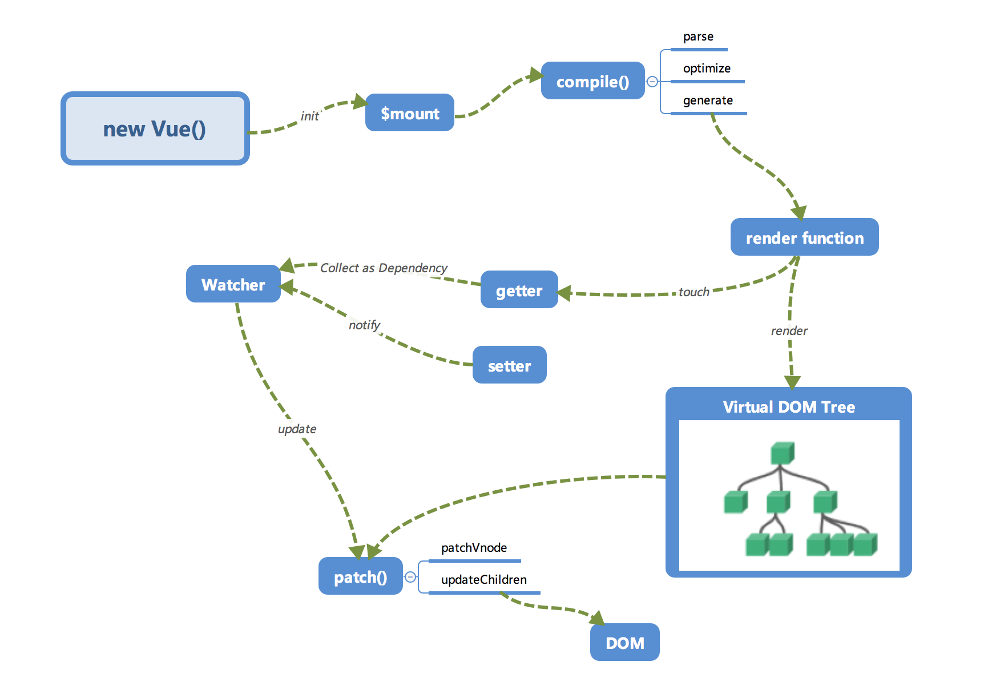

# Vue响应式 <!-- omit in toc -->

> Author: tinfengyee
> Date: 2022-12-02 19:37:54
> LastEditTime: 2022-12-02 19:38:26
> Description: NO Desc

## Vue2 响应式




### 关键类/方法

- **Observer**： `Object.defineProperty` 只会对属性进行监测，而不会对对象进行监测，Observer 类的作用就是把一个对象全部转换成响应式对象，**递归地监听对象上的所有属性** 。(判断数组还是对象，调用defineReactive)。

- **defineReactive**：依赖收集。

- **Dep**：被观察者/目标，依赖收集类，每一个`Observer`对应一个`Dep`，它内部维护一个数组，保存与该`Observer`相关的`Watcher`。

- **Watcher**： 观察者，执行响应的回调函数，触发 update 通知视图更新。

#### Dep

当对data上的对象进行修改值的时候会触发它的setter，那么取值的时候自然就会触发getter事件，所以我们只要在最开始进行一次render，那么所有被渲染所依赖的data中的数据就会被getter收集到Dep的subs中去。在对data中的数据进行修改的时候setter只会触发Dep的subs的函数。

#### Watcher

依赖收集的时候会addSub到sub中，在修改data中数据的时候会触发dep对象的notify，通知所有Watcher对象去修改对应视图。

#### Observer

`Object.defineProperty` 只会对属性进行监测，而不会对对象进行监测，Observer 类的作用就是把一个对象全部转换成响应式对象，**递归地监听对象上的所有属性** 。(判断数组还是对象，调用defineReactive)。

### 小结

- 其核心是通过 **`Object.defineProperty`** 对数据的访问和设置进行拦截处理

- 以 **`data`** 配置项为例，通过 **`new Observer()`** 对其进行处理，此时当前响应式目标数据会被分为 **对象** 和 **数组** 两类

  - **对象**：调用 **`this.walk()`** 方法，遍历对象上所有的 `key` 通过 `Object.defineProperty` 设置 `getter` 和 `setter` 实现拦截；如果属性值依旧为 **对象**，则递归为 **嵌套对象** 上的每个 `key` 设置 `getter` 和 `setter`
    - 通过 `key` 访问数据时触发 `getter` ，此时会进行依赖收集，即使用 `dep.depend()` 把相关的 `watcher` 保存在 `dep` 中
    - 通过 `key` 设置数据时触发 `setter`，此时通过 `dep.notify()` 通知相关的 `watcher` 进行更新，即调用 `watcher.update()`

  - **数组**：重新对数组上的 **7** 个方法进行覆盖，实现对数组原型方法的拦截
    - 通过遍历对数组的每一项元素通过 `new Observer()` 进行响应式处理，前提是当前数组项为 **对象** 或 **数组**
    - 当该数组进行调用 `push、unshift、splice` 方法时，认为属于 **插入、替换** 操作，此时需要对当前传入的新数组项进行 `new Observer()` 处理，最终是要触发了这 **7** 个方法之一都会由 `dep.notify()` 通知 `watcher` 进行更新，即调用 `watcher.update()`

### 实现代码

```js
function defineReactive(obj, key, val) {
  // value 可能是一个对象,要递归劫持，所以数据不能嵌套太深
  observe(value);
  const dep = new Dep();
  Object.defineProperty(obj, key, {
    enumerable: true,
    configurable: true,
    get: function reactiveGetter() {
      // 如果有 watcher，就让 watcher 记住 dep，防止产生重复的 dep, 同时 dep 也收集此 watcher
      if (Dep.target) {
        dep.depend();
      }
      return val;
    },
    set: function reactiveSetter(newVal) {
      // 数据没变动则不处理
      if (val === newVal) return;
      observe(newVal); // 如果新值是个对象，递归拦截
      value = newVal; // 设置新的值
      val = newVal;
    },
  });
}

/**
 * 我们所讲的观察者/依赖其实就是 Watcher，我们要通知用到数据的地方，而使用这个数据的地方有很多，类型也不一样，有* 可能是组件的，有可能是用户写的 watch，我们就需要抽象出一个能集中处理这些情况的类。
 **/
class Watcher {
  constructor(vm, expOrFn, cb, options) {
    this.vm = vm;
    this.deps = [];
    // 用来去重，防止多次取同一数据时存入多个相同dep
    this.depId = new Set();
    // exprOrFn是updateComponent
    this.getter = expOrFn;
    this.cb = cb;
    if (options) {
    } // else this.deep = this.user = this.lazy = this.sync = false
  }
  get() {
    Dep.targer = this; // 取值之前，收集 watcher
    let value = this.getter.call(this.vm, this.vm); // // 调用updateComponent更新页面
    Dep.target = null; // 取值完成后，将 watcher 删除
    return value;
  }
  // dep.depend执行时调用
  addDep(dep) {
    let id = dep.id;
    let has = this.depId.has(id);
    if (!has) {
      this.depId.add(id);
      // watcher存放dep
      this.deps.push(dep);
      // dep存放watcher
      dep.addSub(this);
    }
  }
  // 更新页面方法，dep.notify执行时调用
  update() {
    this.value = this.get();
  }
}

class Dep {
  constructor() {
    this.id = uid++;
    this.subs = [];
  }
  addSub(sub) {
    this.subs.push(sub);
  }
  removeSub(sub) {
    // 省略
  }
  depend() {
    if (Dep.target) {
      // 让正在执行的watcher记录dep，同时dep也会记录watcher
      Dep.target.addDep(this);
    }
  }
  notify() {
    this.subs.forEach((watcher) => watcher.update());
  }
}

class Observer {
  constructor(value) {
    this.value = value;
    // 添加一个对象依赖收集的选项
    this.dep = new Dep();
    // 给响应式对象添加 __ob__ 属性，表明这是一个响应式对象
    def(value, "__ob__", this);
    if (Array.isArray(value)) {
      // 复写 Array 7个方法
    } else {
      this.walk(value);
    }
  }

  walk(value) {
    Object.keys(value).forEach((key) => {
      // 遍历对象的属性进行响应式设置
      defineReactive(value, key, value[key]);
    });
  }
}

function observe(value) {
  if (Object.prototype.toString.call(value).slice(8, -1) !== "Object") return;
  return new Observer(value);
}

// 定义一个属性
function def(obj, key, val, enumerable) {
  Object.defineProperty(obj, key, {
    value: val,
    enumerable: !!enumerable,
    writable: true,
    configurable: true,
  });
}
```

## watcher

## 参考资料

### 相关代码

- [x] [vue-reactive](https://github.com/tinfengyee/vue-reacitve)

### 观察者和发布订阅模式

- [ ] [理解【观察者模式】和【发布订阅】的区别](https://juejin.cn/post/6978728619782701087)

- [ ] [观察者模式与发布订阅模式区别 - JS](https://segmentfault.com/a/1190000041543041)

- [ ] [重学JS（九）—— 观察者模式和发布/订阅模式真不一样](https://www.jianshu.com/p/f0f22398d25d)

### 响应式

[深入理解vue响应式原理 8000字](https://mp.weixin.qq.com/s?__biz=MzkwODIwMDY2OQ==&mid=2247488058&idx=1&sn=4f3fcf191bb00b74d750d061058eb8fb&source=41#wechat_redirect)

[面试官的步步紧逼：Vue2 和 Vue3 的响应式原理比对](https://juejin.cn/post/7124351370521477128)【推荐】

[learnVue-Vue.js依赖收集](https://github.com/tinfengyee/learnVue)

### vue2

- [ ] [响应式系统的基本原理](https://www.kancloud.cn/sllyli/vuejs/1244018)
- [ ] [从 vue 源码看问题 —— 如何理解 vue 响应式？](https://juejin.cn/post/7039345669403836447)
- [ ] [纯干货！图解Vue响应式原理](https://juejin.cn/post/7074422512318152718)
- [ ] [vue中的观察者模式和发布订阅者模式](https://blog.51cto.com/u_15127592/4336598)
- [ ] [面试官: 能不能手写 Vue 响应式？（Vue2 响应式原理【完整版】）](https://juejin.cn/post/7079807948830015502)
- [ ] [深入响应式原理](https://ustbhuangyi.github.io/vue-analysis/v2/reactive/)
- [ ] [重学JS（十）—— 使用观察者模式实现双向绑定](https://www.jianshu.com/p/ced393a49aa7)
- [ ] [Vue双向绑定原理，教你一步一步实现双向绑定 ](https://www.cnblogs.com/beevesnoodles/p/9844854.html)

### vue3

- [ ] [林三心画了8张图，最通俗易懂的Vue3响应式核心原理解析](https://juejin.cn/post/7001999813344493581)
- [ ] [听说你很了解 Vue3 响应式？](https://juejin.cn/post/7147461004954173471)
- [ ] [Vue3 原理解析之响应系统的实现](https://juejin.cn/post/7084915514434306078)

### watcher

- [x] [Vue中的三种Watcher](https://www.cnblogs.com/WindrunnerMax/p/14864214.html)

- [x] [Vue源码分析之Watcher（一）](Vue源码分析之Watcher（一）)
