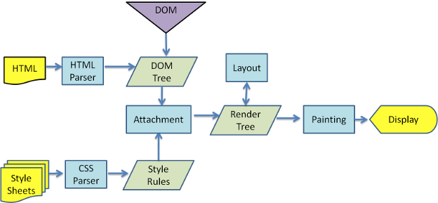
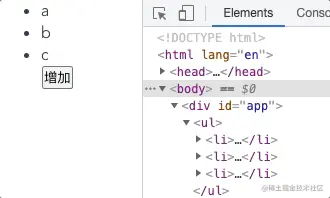
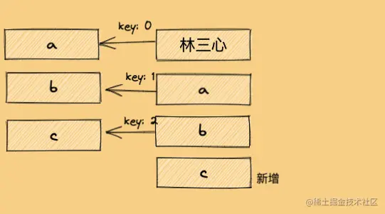

# diff和key的作用 <!-- omit in toc -->

> Author: tinfengyee
> Date: 2022-12-14 00:21:49
> LastEditTime: 2022-12-14 15:40:48
> Description: NO Desc

## 1. 前言

了解浏览器渲染过程，虚拟DOM，diff 和 key 的作用。

## 2. 浏览器渲染过程

> 跳转阅读 [重排和重绘.md](..\..\浏览器\重排和重绘.md)



如上图，浏览器的渲染过程为：

1. 解析 HTML，生成 `DOM` 树
2. 解析 CSS，生成 `CSS 规则树（CSS Rule Tree）`
3. 将 `DOM Tree` 和 `CSS Rule Tree` 相结合，生成 **渲染树**（`Render Tree`）
4. 从根节点开始，计算每一个元素的大小、位置，给出每个节点所应该出现的屏幕精确坐标，从而得到基于渲染树的 **布局渲染树**（`Layout of the render tree`）。
5. 遍历渲染树，将每个节点用 `UI` 渲染引擎来绘制，从而将整棵树绘制到页面上，这个步骤叫 **绘制渲染树**（`Painting the render tree`）

这个过程面试中非常常见。

**注意点：**

**1、`DOM` 树的构建是文档加载完成开始的？** 构建 `DOM` 树是一个渐进过程，为达到更好的用户体验，渲染引擎会尽快将内容显示在屏幕上，它不必等到整个 `HTML` 文档解析完成之后才开始构建 `render` 树和布局。

**2、`Render` 树是 `DOM` 树和 `CSS` 样式表构建完毕后才开始构建的？** 这三个过程在实际进行的时候并不是完全独立的，而是会有交叉，会一边加载，一边解析，以及一边渲染。

**3、`CSS` 的解析注意点？** `CSS` 的解析是从右往左逆向解析的，嵌套标签越多，解析越慢。

**4、`JS` 操作真实 `DOM` 的代价？** 用我们传统的开发模式，原生 `JS` 或 `JQ` 操作 `DOM` 时，浏览器会从构建 DOM 树开始从头到尾执行一遍流程。在一次操作中，我需要更新 10 个 `DOM` 节点，浏览器收到第一个 `DOM` 请求后并不知道还有 9 次更新操作，因此会马上执行流程，最终执行10 次。例如，第一次计算完，紧接着下一个 `DOM` 更新请求，这个节点的坐标值就变了，前一次计算为无用功。计算 `DOM` 节点坐标值等都是白白浪费的性能。即使计算机硬件一直在迭代更新，操作 `DOM` 的代价仍旧是昂贵的，频繁操作还是会出现页面卡顿，影响用户体验

### 2.1. 回流(重排)和重绘

回流和重绘会对性能造成影响。

#### 2.1.1. 重绘

**重绘（repaint）**：当元素样式的改变不影响布局时，浏览器将使用重绘对元素进行更新，此时由于只需要 `UI` 层面的重新像素绘制，因此**损耗较少**。

在浏览器渲染过程中，对应步骤 5，即每次发生重绘，我们都会重新绘制渲染树，然后进行展示。

* 如何触发重绘？

1. 修改背景色、颜色（`background`、`color`）
2. 设置可见度（`visibility`）
3. 设置背景图（`background-image`）
4. ……等

#### 2.1.2. 回流

**回流（reflow）**：又叫重排（`layout`）。当元素的尺寸、结构或者触发某些属性时，浏览器会重新渲染页面，称为回流。

此时，浏览器需要重新经过计算，计算后还需要重新页面布局，然后进行绘制渲染，因此是较重的操作。

* 如何触发回流？

1. 添加删除 DOM 元素
2. 改变边框、边距、宽高（`border`、`margin`、`padding`、`width`、`height`）
3. 浏览器改变窗口（`resize`）
4. ……等

#### 2.1.3. 优化

**一句话：回流必将引起重绘，重绘不一定会引起回流。**

回流动了 `Layout`，触发了 `Render Tree` 进行重新渲染，所以后面还会 `Painting`。而重绘后面直接 `Display`，不会触发回流。

当然，很多浏览器都会优化操作：

浏览器会维护 1 个队列，把所有会引起回流、重绘的操作放入这个队列，等队列中的操作到了一定的数量或者到了一定的时间间隔，浏览器就会处理队列，进行一个批处理。这样就会让多次的回流、重绘变成一次回流重绘。

那么，我们做一道题：

输出下面回流和重绘的次数：

```js
var s = document.body.style;
s.padding = "2px";
s.border = "1px solid red";
s.color = "blue";
s.backgroundColor = "#ccc";
s.fontSize = "14px";

document.body.appendChild(document.createTextNode('abc!'));
```

答案：触发回流 `4` 次，触发重绘 `6` 次。

在这里，我们需要了解的是：

* **JS 是单线程的，JS 解析的时候渲染引擎是停止工作的**。

所以，结合这些内容，我们可以根据此大概说一下：

* 如何减少回流和重绘？

1. 【CSS】使用 `visibility` 替换 `display`
2. 【CSS】避免 `table` 布局。对于 `Render Tree` 的计算通常只需要遍历一次就可以完成，但是 `table` 布局需要计算多次，通常要花 3 倍于等同元素的时间，因此要避免。
3. 【JS】避免频繁做 `width`、`height` 等会触发回流的操作。
4. 【JS】操作 DOM 的时候，如果是添加 DOM 节点，可以将所有节点都在 JS 中操作完毕，再进行渲染（一次性）

## 3. 虚拟DOM

### 3.1. 认识虚拟 DOM

虚拟 DOM 简单说就是 **用JS对象来模拟 DOM 结构**

那它是怎么用 JS 对象模拟 DOM 结构的呢？看个例子

```html
<template>
    <div id="app" class="container">
        <h1>沐华</h1>
    </div>
</template>
```

上面的模板转在虚拟 DOM 就是下面这样的

```js
{
  tag:'div',
  props:{ id:'app', class:'container' },
  children: [
    { tag: 'h1', children:'沐华' }
  ]
}
```

这样的 DOM 结构就称之为 **虚拟 DOM** (`Virtual Node`)，简称 `vnode`。

它的表达方式就是把每一个标签都转为一个对象，这个对象可以有三个属性：`tag`、`props`、`children`

- **tag**：必选。就是标签。也可以是组件，或者函数
- **props**：非必选。就是这个标签上的属性和方法
- **children**：非必选。就是这个标签的内容或者子节点，如果是文本节点就是字符串，如果有子节点就是数组。换句话说 如果判断 children 是字符串的话，就表示一定是文本节点，这个节点肯定没有子元素

**为什么要使用虚拟 DOM 呢？** 看个图


如图可以看出原生 DOM 有非常多的属性和事件，就算是创建一个空div也要付出不小的代价。而使用虚拟 DOM 来提升性能的点在于 DOM 发生变化的时候，通过 diff 算法和数据改变前的 DOM 对比，计算出需要更改的 DOM，然后只对变化的 DOM 进行操作，而不是更新整个视图

在 Vue 中是怎么把 DOM 转成上面这样的虚拟 DOM 的呢，有兴趣的可以关注我另一篇文章详细了解一下 [Vue 中的模板编译过程和原理](https://juejin.cn/post/7011294489335562247)

在 Vue 里虚拟 DOM 的数据更新机制采用的是异步更新队列，就是把变更后的数据变装入一个数据更新的异步队列，就是 `patch`，用它来做新老 vnode 对比

### 3.2. Vnode分类

- EmptyVNode: 没有内容的注释节点
- TextVNode: 文本节点
- ElementVNode: 普通元素节点
- ComponentVNode: 组件节点
- CloneVNode: 克隆节点，可以是以上任意类型的节点，唯一的区别在于isCloned属性为true

### 3.3. 虚拟DOM的优缺点

优点：

- **跨平台**（主要原因）
- **以最小的代价更新变化的视图、保证性能下限**（次要原因）

> 众所周知，浏览器的重排/重绘其实是很低效的一种操作，而在浏览器优化的不够好的情况下，对dom元素的连续修改会导致浏览器连续触发重排/重绘，整棵 DOM 树实现代价太高，严重影响性能。例如向dom树上连续插入1000个列表元素，会触发1000次重排/重绘。
> vdom的引入，会将前述1000次操作集中起来，一次输出到dom上，从而将重排/重绘减少到只有一次，进而获得性能提升(vdom自身的性能消耗，相比于1000次重排/重绘其实不值一提。)
>
> **这才是为什么要有 Virtual DOM：它保证了 不管你的数据变化多少，每次重绘的性能都可以接受**

- **不需要手动操作DOM**，将 DOM 对比(diff 操作)放在 JS 层，提高效率。

缺点：

- 无法进行极致优化： 虽然虚拟 DOM + 合理的优化，足以应对绝大部分应用的性能需求，但在一些性能要求极高的应用中虚拟 DOM 无法进行针对性的极致优化。
- 虽然 Vue 能够保证触发更新的组件最小化，但在单个组件内部依然需要遍历该组件的整个 Virtual DOM 树。
- 在一些组件整个模版内只有少量动态节点的情况下，这些遍历都是性能的浪费。
- 传统 Virtual DOM 的性能跟模版大小正相关，跟动态节点的数量无关。

### 3.4. 虚拟 DOM 实现原理

虚拟 DOM 的实现原理主要包括以下 3 部分：

- 用 JavaScript 对象模拟真实 DOM 树，对真实 DOM 进行抽象；
- diff 算法 — 比较两棵虚拟 DOM 树的差异；
- pach 算法(打补丁) — 将两个虚拟 DOM 对象的差异应用到真正的 DOM 树。

## 4. diff

### 4.1. 什么是diff？

Diff 算法，在 Vue 里面就是叫做 `patch` ，它的核心就是参考 [Snabbdom](https://github.com/snabbdom/snabbdom)，通过新旧虚拟 DOM 对比(即 patch 过程)，找出最小变化的地方转为进行 DOM 操作，因此我们不需要完全的更新整个视图，而是只更新他们差异的部分, 尽可能的减少DOM操作的开销。

### 4.2. 热身算法

1. 将一个排好序的数组A打乱后变成数组B，如何找到数组A中的元素对应在数组B的位置

   - A：`[1, 2, 3, 4, 5, 6]`
   - B：`[2, 5, 1, 3, 6, 4]`
   - 这道题很简单，两个for循环就可以解决：

   ```js
   for(let i = 0; i < A.length; i++){
       for(let j = 0; j < B.length; j++){
           if(A[i] = B[j]) return j
       }
   }
   ```

   - 为什么要讲这道题，因为diff算法的“核心”就是如此，diff其他部分的处理可以认为是在此基础之上的优化

### 4.3. Diff 算法的优化

先看个图


比如有上图这样的 DOM 结构，是怎么计算出变化？简单说就是

- 遍历老的虚拟 DOM
- 遍历新的虚拟 DOM
- 然后根据变化，比如上面的改变和新增，再重新排序

可是这样会有很大问题，假如有1000个节点，就需要计算 1000³ 次，也就是10亿次，时间复杂度喂O(n³) 这样是无法让人接受的，所以 Vue 或者 React 里使用 Diff 算法的时候都遵循深度优先，同层比较的策略做了一些优化，来计算出**最小变化**，让算法优化成 O(n) 的复杂度。

- **深度优先，同层比较**

如图，Diff 过程只会把同颜色框起来的同一层级的 DOM 进行比较，这样来简化比较次数，这是第一个方面


- **比较标签名**，标签名不一样就不再对比子节点

如果同一层级的比较标签名不同，就直接移除老的虚拟 DOM 对应的节点，不继续按这个树状结构做深度比较，这是简化比较次数的第二个方面

- **比较 key**

如果标签名相同，key 也相同，就会认为是相同节点，也不继续按这个树状结构做深度比较，比如我们写 v-for 的时候会比较 key，不写 key 就会报错，这也就是因为 Diff 算法需要比较 key

- **双端 diff** 

有经验法则(启发式算法)，通过首位两两对比 4 种快捷的查找方式，极大减少循环次数，只有当以上 4 种方式都查找不到的时候，再进行循环查找，所以是快速检测出 reverse 操作，加快 Diff 效率

### 4.4. 什么时候触发 patch ？

- 在页面**首次渲染**的时候会调用一次 `patch` 并创建新的 `vnode`，不会进行更深层次的比较。

- 在组件中数据发生变化时：
  1. 先触发 `setter` 然后通过 `Notify` 通知 `Watcher`。
  2. 对应的 `Watcher` 会通知更新并执行更新函数，它会执行 `render` 函数获取新的虚拟 `DOM`。
  3. 执行 `patch` 对比上次渲染结果的老的虚拟 `DOM`，并计算出最小的变化，然后再去根据这个最小的变化去更新真实的 `DOM`，也就是视图`View`


> 注意更新视图的` _update` 方法其实也是响应式的，也需要收集依赖，你可以简单将Vue的视图更新视为一个computed。他与Vue上的Computed和Watcher是分开的，注意computed和watcher的响应式与视图更新没有半毛钱关系。只有视图真正用到了computed和data里的值，且值变化了，视图才会更新。给`_upodate`加上响应式更新是在mountComponent里面做的。

## 5. Diff 算法核心原理——源码

上面说了 Diff  算法，在 Vue 里面就是 patch，铺垫了这么多，下面进入源码里看一下这个神乎其神的 patch 干了啥？

### 5.1. patch

源码地址：`src/core/vdom/patch.js -700行`

其实 patch 就是一个函数，我们先介绍一下源码里的核心流程，再来看一下 patch 的源码，源码里每一行也有注释

它可以接收四个参数，主要还是前两个

- **oldVnode**：老的虚拟 DOM 节点
- **vnode**：新的虚拟 DOM 节点
- **hydrating**：是不是要和真实 DOM 混合，服务端渲染的话会用到，这里不过多说明
- **removeOnly**：transition-group 会用到，这里不过多说明

主要流程是这样的：

- vnode 不存在，oldVnode 存在，就删掉 oldVnode
- vnode 存在，oldVnode 不存在，就创建 vnode
- 两个都存在的话，通过 sameVnode 函数(后面有详解)对比是不是同一节点
  - 如果是同一节点的话，通过 patchVnode 进行后续对比节点文本变化或子节点变化
  - 如果不是同一节点，就把 vnode 挂载到 oldVnode 的父元素下
    - 如果组件的根节点被替换，就遍历更新父节点，然后删掉旧的节点
    - 如果是服务端渲染就用 hydrating 把 oldVnode 和真实 DOM 混合

下面看完整的 patch 函数源码，说明我都写在注释里了

```js
// 两个判断函数
function isUndef (v: any): boolean %checks {
  return v === undefined || v === null
}
function isDef (v: any): boolean %checks {
  return v !== undefined && v !== null
}
return function patch (oldVnode, vnode, hydrating, removeOnly) {
    // 如果新的 vnode 不存在，但是 oldVnode 存在
    if (isUndef(vnode)) {
      // 如果 oldVnode 存在，调用 oldVnode 的组件卸载钩子 destroy
      if (isDef(oldVnode)) invokeDestroyHook(oldVnode)
      return
    }

    let isInitialPatch = false
    const insertedVnodeQueue = []
    
    // 如果 oldVnode 不存在的话，新的 vnode 是肯定存在的，比如首次渲染的时候
    if (isUndef(oldVnode)) {
      isInitialPatch = true
      // 就创建新的 vnode
      createElm(vnode, insertedVnodeQueue)
    } else {
      // 剩下的都是新的 vnode 和 oldVnode 都存在的话
      
      // 是不是元素节点
      const isRealElement = isDef(oldVnode.nodeType)
      // 是元素节点 && 通过 sameVnode 对比是不是同一个节点 (函数后面有详解)
      if (!isRealElement && sameVnode(oldVnode, vnode)) {
        // 如果是 就用 patchVnode 进行后续对比 (函数后面有详解)
        patchVnode(oldVnode, vnode, insertedVnodeQueue, null, null, removeOnly)
      } else {
        // 如果不是同一元素节点的话
        if (isRealElement) {
          // const SSR_ATTR = 'data-server-rendered'
          // 如果是元素节点 并且有 'data-server-rendered' 这个属性
          if (oldVnode.nodeType === 1 && oldVnode.hasAttribute(SSR_ATTR)) {
            // 就是服务端渲染的，删掉这个属性
            oldVnode.removeAttribute(SSR_ATTR)
            hydrating = true
          }
          // 这个判断里是服务端渲染的处理逻辑，就是混合
          if (isTrue(hydrating)) {
            if (hydrate(oldVnode, vnode, insertedVnodeQueue)) {
              invokeInsertHook(vnode, insertedVnodeQueue, true)
              return oldVnode
            } else if (process.env.NODE_ENV !== 'production') {
              warn('这是一段很长的警告信息')
            }
          }
          // function emptyNodeAt (elm) {
          //    return new VNode(nodeOps.tagName(elm).toLowerCase(), {}, [], undefined, elm)
          //  }
          // 如果不是服务端渲染的，或者混合失败，就创建一个空的注释节点替换 oldVnode
          oldVnode = emptyNodeAt(oldVnode)
        }
        
        // 拿到 oldVnode 的父节点
        const oldElm = oldVnode.elm
        const parentElm = nodeOps.parentNode(oldElm)
        
        // 根据新的 vnode 创建一个 DOM 节点，挂载到父节点上
        createElm(
          vnode,
          insertedVnodeQueue,
          oldElm._leaveCb ? null : parentElm,
          nodeOps.nextSibling(oldElm)
        )
        
        // 如果新的 vnode 的根节点存在，就是说根节点被修改了，就需要遍历更新父节点
        if (isDef(vnode.parent)) {
          let ancestor = vnode.parent
          const patchable = isPatchable(vnode)
          // 递归更新父节点下的元素
          while (ancestor) {
            // 卸载老根节点下的全部组件
            for (let i = 0; i < cbs.destroy.length; ++i) {
              cbs.destroy[i](ancestor)
            }
            // 替换现有元素
            ancestor.elm = vnode.elm
            if (patchable) {
              for (let i = 0; i < cbs.create.length; ++i) {
                cbs.create[i](emptyNode, ancestor)
              }
              const insert = ancestor.data.hook.insert
              if (insert.merged) {
                for (let i = 1; i < insert.fns.length; i++) {
                  insert.fns[i]()
                }
              }
            } else {
              registerRef(ancestor)
            }
            // 更新父节点
            ancestor = ancestor.parent
          }
        }
        // 如果旧节点还存在，就删掉旧节点
        if (isDef(parentElm)) {
          removeVnodes([oldVnode], 0, 0)
        } else if (isDef(oldVnode.tag)) {
          // 否则直接卸载 oldVnode
          invokeDestroyHook(oldVnode)
        }
      }
    }
    // 返回更新后的节点
    invokeInsertHook(vnode, insertedVnodeQueue, isInitialPatch)
    return vnode.elm
  }
```

### 5.2. sameVnode

源码地址：`src/core/vdom/patch.js -35行`

**这个是用来判断是不是同一节点的函数**

这个函数不长，直接看源码吧

```js
function sameVnode (a, b) {
  return (
    a.key === b.key &&  // key 是不是一样
    a.asyncFactory === b.asyncFactory && ( // 是不是异步组件
      (
        a.tag === b.tag && // 标签是不是一样
        a.isComment === b.isComment && // 是不是注释节点
        isDef(a.data) === isDef(b.data) && // 内容数据是不是一样
        sameInputType(a, b) // 判断 input 的 type 是不是一样
      ) || (
        isTrue(a.isAsyncPlaceholder) && // 判断区分异步组件的占位符否存在
        isUndef(b.asyncFactory.error)
      )
    )
  )
}
```

### 5.3. patchVnode

源码地址：`src/core/vdom/patch.js -501行`

**这个是在新的 vnode 和 oldVnode 是同一节点的情况下，才会执行的函数，主要是对比节点文本变化或子节点变化**

还是先介绍一下主要流程，再看源码吧，流程是这样的：

- 如果 oldVnode 和 vnode 的引用地址是一样的，就表示节点没有变化，直接返回
- 如果 oldVnode 的 isAsyncPlaceholder 存在，就跳过异步组件的检查，直接返回
- 如果 oldVnode 和 vnode 都是静态节点，并且有一样的 key，并且 vnode 是克隆节点或者 v-once 指令控制的节点时，把 oldVnode.elm 和 oldVnode.child 都复制到 vnode 上，然后返回
- 如果 vnode 不是文本节点也不是注释的情况下
  - 如果 vnode 和 oldVnode 都有子节点，而且子节点不一样的话，就调用 updateChildren 更新子节点
  - 如果只有 vnode 有子节点，就调用 addVnodes 创建子节点
  - 如果只有 oldVnode 有子节点，就调用 removeVnodes 删除该子节点
  - 如果 vnode 文本为 undefined，就删掉 vnode.elm 文本
- 如果 vnode 是文本节点但是和 oldVnode 文本内容不一样，就更新文本

> `const elm = vnode.elm = oldVnode.elm` 复用了之前的节点，这就是为什么不能使用 index 作为 key。

```js
  function patchVnode (
    oldVnode, // 老的虚拟 DOM 节点
    vnode, // 新的虚拟 DOM 节点
    insertedVnodeQueue, // 插入节点的队列
    ownerArray, // 节点数组
    index, // 当前节点的下标
    removeOnly // 只有在
  ) {
    // 新老节点引用地址是一样的，直接返回
    // 比如 props 没有改变的时候，子组件就不做渲染，直接复用
    if (oldVnode === vnode) return
    
    // 新的 vnode 真实的 DOM 元素
    if (isDef(vnode.elm) && isDef(ownerArray)) {
      // clone reused vnode
      vnode = ownerArray[index] = cloneVNode(vnode)
    }
    // 这里就是复用了之前的节点
    const elm = vnode.elm = oldVnode.elm
    // 如果当前节点是注释或 v-if 的，或者是异步函数，就跳过检查异步组件
    if (isTrue(oldVnode.isAsyncPlaceholder)) {
      if (isDef(vnode.asyncFactory.resolved)) {
        hydrate(oldVnode.elm, vnode, insertedVnodeQueue)
      } else {
        vnode.isAsyncPlaceholder = true
      }
      return
    }
    // 当前节点是静态节点的时候，key 也一样，或者有 v-once 的时候，就直接赋值返回
    if (isTrue(vnode.isStatic) &&
      isTrue(oldVnode.isStatic) &&
      vnode.key === oldVnode.key &&
      (isTrue(vnode.isCloned) || isTrue(vnode.isOnce))
    ) {
      vnode.componentInstance = oldVnode.componentInstance
      return
    }
    // hook 相关的不用管
    let i
    const data = vnode.data
    if (isDef(data) && isDef(i = data.hook) && isDef(i = i.prepatch)) {
      i(oldVnode, vnode)
    }
    // 获取子元素列表
    const oldCh = oldVnode.children
    const ch = vnode.children
    
    if (isDef(data) && isPatchable(vnode)) {
      // 遍历调用 update 更新 oldVnode 所有属性，比如 class,style,attrs,domProps,events...
      // 这里的 update 钩子函数是 vnode 本身的钩子函数
      for (i = 0; i < cbs.update.length; ++i) cbs.update[i](oldVnode, vnode)
      // 这里的 update 钩子函数是我们传过来的函数
      if (isDef(i = data.hook) && isDef(i = i.update)) i(oldVnode, vnode)
    }
    // 如果新节点不是文本节点，也就是说有子节点
    if (isUndef(vnode.text)) {
      // 如果新老节点都有子节点
      if (isDef(oldCh) && isDef(ch)) {
        // 如果新老节点的子节点不一样，就执行 updateChildren 函数，对比子节点
        if (oldCh !== ch) updateChildren(elm, oldCh, ch, insertedVnodeQueue, removeOnly)
      } else if (isDef(ch)) {
        // 如果新节点有子节点的话，就是说老节点没有子节点
        
        // 如果老节点文本节点，就是说没有子节点，就清空
        if (isDef(oldVnode.text)) nodeOps.setTextContent(elm, '')
        // 添加子节点
        addVnodes(elm, null, ch, 0, ch.length - 1, insertedVnodeQueue)
      } else if (isDef(oldCh)) {
        // 如果新节点没有子节点，老节点有子节点，就删除
        removeVnodes(oldCh, 0, oldCh.length - 1)
      } else if (isDef(oldVnode.text)) {
        // 如果老节点是文本节点，就清空
        nodeOps.setTextContent(elm, '')
      }
    } else if (oldVnode.text !== vnode.text) {
      // 新老节点都是文本节点，且文本不一样，就更新文本
      nodeOps.setTextContent(elm, vnode.text)
    }
    if (isDef(data)) {
      // 执行 postpatch 钩子
      if (isDef(i = data.hook) && isDef(i = i.postpatch)) i(oldVnode, vnode)
    }
  }
```

### 5.4. updateChildren

源码地址：`src/core/vdom/patch.js -404行`

**这个是新的 vnode 和 oldVnode 都有子节点，且子节点不一样的时候进行对比子节点的函数**

这里很关键，很关键！

比如现在有两个子节点列表对比，对比主要流程如下

循环遍历两个列表，循环停止条件是：其中一个列表的开始指针 startIdx 和 结束指针 endIdx 重合

循环内容是：{

- 新的头和老的头对比
- 新的尾和老的尾对比
- 新的头和老的尾对比
- 新的尾和老的头对比。 这四种对比如图


以上四种只要有一种判断相等，就调用 patchVnode 对比节点文本变化或子节点变化，然后移动对比的下标，继续下一轮循环对比

如果以上四种情况都没有命中，使用 vnode 的 key 去匹配 旧 vnode 的 hash 表(`createKeyToOldIdx` 生成)，匹配不到通过 `sameVnode` 遍历旧 vnode 列表。

- 如果没找到，就创建一个新的节点
- 如果找到了，再对比标签是不是同一个节点
  - 如果是同一个节点，就调用 patchVnode 进行后续对比，然后把这个节点插入到老的开始前面，并且移动新的开始下标，继续下一轮循环对比
  - 如果不是相同节点，就创建一个新的节点 }
- 如果老的 vnode 先遍历完，就添加新的 vnode 没有遍历的节点
- 如果新的 vnode 先遍历完，就删除老的 vnode 没有遍历的节点

>  为什么会有头对尾，尾对头的操作？

有经验法则(启发式算法)，通过首位两两对比 4 种快捷的查找方式，极大减少循环次数，只有当以上 4 种方式都查找不到的时候，再进行循环查找，所以是快速检测出 reverse 操作，加快 Diff 效率

```js
function updateChildren (parentElm, oldCh, newCh, insertedVnodeQueue, removeOnly) {
    let oldStartIdx = 0 // 老 vnode 遍历的下标
    let newStartIdx = 0 // 新 vnode 遍历的下标
    let oldEndIdx = oldCh.length - 1 // 老 vnode 列表长度
    let oldStartVnode = oldCh[0] // 老 vnode 列表第一个子元素
    let oldEndVnode = oldCh[oldEndIdx] // 老 vnode 列表最后一个子元素
    let newEndIdx = newCh.length - 1 // 新 vnode 列表长度
    let newStartVnode = newCh[0] // 新 vnode 列表第一个子元素
    let newEndVnode = newCh[newEndIdx] // 新 vnode 列表最后一个子元素
    let oldKeyToIdx, idxInOld, vnodeToMove, refElm

    const canMove = !removeOnly
    
    // 循环，规则是开始指针向右移动，结束指针向左移动移动
    // 当开始和结束的指针重合的时候就结束循环
    while (oldStartIdx <= oldEndIdx && newStartIdx <= newEndIdx) {
      if (isUndef(oldStartVnode)) {
        oldStartVnode = oldCh[++oldStartIdx] // Vnode has been moved left
      } else if (isUndef(oldEndVnode)) {
        oldEndVnode = oldCh[--oldEndIdx]
        
        // 老开始和新开始对比
      } else if (sameVnode(oldStartVnode, newStartVnode)) {
        // 是同一节点 递归调用 继续对比这两个节点的内容和子节点
        patchVnode(oldStartVnode, newStartVnode, insertedVnodeQueue, newCh, newStartIdx)
        // 然后把指针后移一位，从前往后依次对比
        // 比如第一次对比两个列表的[0]，然后比[1]...，后面同理
        oldStartVnode = oldCh[++oldStartIdx]
        newStartVnode = newCh[++newStartIdx]
        
        // 老结束和新结束对比
      } else if (sameVnode(oldEndVnode, newEndVnode)) {
        patchVnode(oldEndVnode, newEndVnode, insertedVnodeQueue, newCh, newEndIdx)
        // 然后把指针前移一位，从后往前比
        oldEndVnode = oldCh[--oldEndIdx]
        newEndVnode = newCh[--newEndIdx]
        
        // 老开始和新结束对比
      } else if (sameVnode(oldStartVnode, newEndVnode)) { // Vnode moved right
        patchVnode(oldStartVnode, newEndVnode, insertedVnodeQueue, newCh, newEndIdx)
        canMove && nodeOps.insertBefore(parentElm, oldStartVnode.elm, nodeOps.nextSibling(oldEndVnode.elm))
        // 老的列表从前往后取值，新的列表从后往前取值，然后对比
        oldStartVnode = oldCh[++oldStartIdx]
        newEndVnode = newCh[--newEndIdx]
        
        // 老结束和新开始对比
      } else if (sameVnode(oldEndVnode, newStartVnode)) { // Vnode moved left
        patchVnode(oldEndVnode, newStartVnode, insertedVnodeQueue, newCh, newStartIdx)
        canMove && nodeOps.insertBefore(parentElm, oldEndVnode.elm, oldStartVnode.elm)
        // 老的列表从后往前取值，新的列表从前往后取值，然后对比
        oldEndVnode = oldCh[--oldEndIdx]
        newStartVnode = newCh[++newStartIdx]
        
        // 以上四种情况都没有命中的情况
      } else {
        if (isUndef(oldKeyToIdx)) oldKeyToIdx = createKeyToOldIdx(oldCh, oldStartIdx, oldEndIdx)
        // 拿到新开始的 key，在老的 children 里去找有没有某个节点有这个 key
        idxInOld = isDef(newStartVnode.key)
          ? oldKeyToIdx[newStartVnode.key]
          : findIdxInOld(newStartVnode, oldCh, oldStartIdx, oldEndIdx)
          
        // 新的 children 里有，可是没有在老的 children 里找到对应的元素
        if (isUndef(idxInOld)) {
          /// 就创建新的元素
          createElm(newStartVnode, insertedVnodeQueue, parentElm, oldStartVnode.elm, false, newCh, newStartIdx)
        } else {
          // 在老的 children 里找到了对应的元素
          vnodeToMove = oldCh[idxInOld]
          // 判断标签如果是一样的
          if (sameVnode(vnodeToMove, newStartVnode)) {
            // 就把两个相同的节点做一个更新
            patchVnode(vnodeToMove, newStartVnode, insertedVnodeQueue, newCh, newStartIdx)
            oldCh[idxInOld] = undefined
            canMove && nodeOps.insertBefore(parentElm, vnodeToMove.elm, oldStartVnode.elm)
          } else {
            // 如果标签是不一样的，就创建新的元素
            createElm(newStartVnode, insertedVnodeQueue, parentElm, oldStartVnode.elm, false, newCh, newStartIdx)
          }
        }
        newStartVnode = newCh[++newStartIdx]
      }
    }
    // oldStartIdx > oldEndIdx 说明老的 vnode 先遍历完
    if (oldStartIdx > oldEndIdx) {
      // 就添加从 newStartIdx 到 newEndIdx 之间的节点
      refElm = isUndef(newCh[newEndIdx + 1]) ? null : newCh[newEndIdx + 1].elm
      addVnodes(parentElm, refElm, newCh, newStartIdx, newEndIdx, insertedVnodeQueue)
    
    // 否则就说明新的 vnode 先遍历完
    } else if (newStartIdx > newEndIdx) {
      // 就删除掉老的 vnode 里没有遍历的节点
      removeVnodes(oldCh, oldStartIdx, oldEndIdx)
    }
  }
```

至此，整个 Diff 流程的核心逻辑源码到这就结束了，再来看一下 Vue 3 里做了哪些改变吧

## 6. Vue3 的优化

本文源码版本是 Vue2 的，在 Vue3 里整个重写了 Diff 算法这一块东西，所以源码的话可以说基本是完全**不一样**的，但是要做的事还是一样的

关于 Vue3 的 Diff 完整源码解析还在撰稿中，过几天就发布了，这里先介绍一下相比 Vue2 优化的部分，尤大公布的数据就是 `update` 性能提升了 `1.3~2 倍`，`ssr` 性能提升了 `2~3 倍`，来看看都有哪些优化

- 事件缓存：将事件缓存，可以理解为变成静态的了
- 添加静态标记：Vue2 是全量 Diff，Vue3 是静态标记 + 非全量 Diff
- 静态提升：创建静态节点时保存，后续直接复用
- 使用最长递增子序列优化了对比流程：Vue2 里在 updateChildren() 函数里对比变更，在 Vue3 里这一块的逻辑主要在 patchKeyedChildren() 函数里，具体看下面                                                                                                                                      

### 6.1. 事件缓存

比如这样一个有点击事件的按钮

```js
<button @click="handleClick">按钮</button>
```

来看下在 Vue3 被编译后的结果

```js
export function render(_ctx, _cache, $props, $setup, $data, $options) {
  return (_openBlock(), _createElementBlock("button", {
    onClick: _cache[0] || (_cache[0] = (...args) => (_ctx.handleClick && _ctx.handleClick(...args)))
  }, "按钮"))
}
```

注意看，onClick 会先读取缓存，如果缓存没有的话，就把传入的事件存到缓存里，都可以理解为变成静态节点了，优秀吧，而在 Vue2 中就没有缓存，就是动态的

### 6.2. 静态标记

一下静态标记是啥？

源码地址：`packages/shared/src/patchFlags.ts`

```js
export const enum PatchFlags {
  TEXT = 1 ,  // 动态文本节点
  CLASS = 1 << 1,  // 2   动态class
  STYLE = 1 << 2,  // 4   动态style
  PROPS = 1 << 3,  // 8   除去class/style以外的动态属性
  FULL_PROPS = 1 << 4,       // 16  有动态key属性的节点，当key改变时，需进行完整的diff比较
  HYDRATE_EVENTS = 1 << 5,   // 32  有监听事件的节点
  STABLE_FRAGMENT = 1 << 6,  // 64  一个不会改变子节点顺序的fragment (一个组件内多个根元素就会用fragment包裹)
  KEYED_FRAGMENT = 1 << 7,   // 128 带有key属性的fragment或部分子节点有key
  UNKEYEN_FRAGMENT = 1 << 8, // 256  子节点没有key的fragment
  NEED_PATCH = 1 << 9,       // 512  一个节点只会进行非props比较
  DYNAMIC_SLOTS = 1 << 10,   // 1024   动态slot
  HOISTED = -1,  // 静态节点 
  BAIL = -2      // 表示 Diff 过程中不需要优化
}
```

先了解一下静态标记有什么用？看个图

在什么地方用到的呢？比如下面这样的代码

```js
<div id="app">
    <div>沐华</div>
    <p>{{ age }}</p>
</div>
```

在 Vue2 中编译的结果是，有兴趣的可以自行安装 `vue-template-compiler` 自行测试

```js
with(this){
    return _c(
      'div',
      {attrs:{"id":"app"}},
      [ 
        _c('div',[_v("沐华")]),
        _c('p',[_v(_s(age))])
      ]
    )
}
```

在 Vue3 中编译的结果是这样的，有兴趣的可以[点击这里](https://link.juejin.cn/?target=https%3A%2F%2Fvue-next-template-explorer.netlify.app%2F)自行测试

```js
const _hoisted_1 = { id: "app" }
const _hoisted_2 = /*#__PURE__*/_createElementVNode("div", null, "沐华", -1 /* HOISTED */)

export function render(_ctx, _cache, $props, $setup, $data, $options) {
  return (_openBlock(), _createElementBlock("div", _hoisted_1, [
    _hoisted_2,
    _createElementVNode("p", null, _toDisplayString(_ctx.age), 1 /* TEXT */)
  ]))
}
```

看到上面编译结果中的 `-1` 和 `1` 了吗，这就是静态标记，这是在 Vue2 中没有的，patch 过程中就会判断这个标记来 Diff 优化流程，跳过一些静态节点对比

### 6.3. 静态提升

其实还是拿上面 Vue2 和 Vue3 静态标记的例子，在 Vue2 里每当触发更新的时候，不管元素是否参与更新，每次都会全部重新创建，就是下面这一堆

```js
with(this){
    return _c(
      'div',
      {attrs:{"id":"app"}},
      [ 
        _c('div',[_v("沐华")]),
        _c('p',[_v(_s(age))])
      ]
    )
}
```

而在 Vue3 中会把这个不参与更新的元素保存起来，只创建一次，之后在每次渲染的时候不停地复用，比如上面例子中的这个，静态的创建一次保存起来

```js
const _hoisted_1 = { id: "app" }
const _hoisted_2 = /*#__PURE__*/_createElementVNode("div", null, "沐华", -1 /* HOISTED */)
```

然后每次更新 age 的时候，就只创建这个动态的内容，复用上面保存的静态内容

```js
export function render(_ctx, _cache, $props, $setup, $data, $options) {
  return (_openBlock(), _createElementBlock("div", _hoisted_1, [
    _hoisted_2,
    _createElementVNode("p", null, _toDisplayString(_ctx.age), 1 /* TEXT */)
  ]))
}
```

### 6.4. patchKeyedChildren / 最长递增子序列

在 Vue2 里 `updateChildren` 会进行

- 头和头比
- 尾和尾比
- 头和尾比
- 尾和头比
- 都没有命中的对比

在 Vue3 里 `patchKeyedChildren` 为

- 头和头比
- 尾和尾比
- 基于最长递增子序列进行移动/添加/删除

看个例子，比如

- 老的 children：`[ a, b, c, d, e, f, g ]`
- 新的 children：`[ a, b, f, c, d, e, h, g ]`

1. 先进行头和头比，发现不同就结束循环，得到 `[ a, b ]`
2. 再进行尾和尾比，发现不同就结束循环，得到 `[ g ]`
3. 再保存没有比较过的节点 `[ f, c, d, e, h ]`，并通过 newIndexToOldIndexMap 拿到在数组里对应的下标，生成数组 `[ 5, 2, 3, 4, -1 ]`，`-1` 是老数组里没有的就说明是新增
4. 然后再拿取出数组里的最长递增子序列，也就是 `[ 2, 3, 4 ]` 对应的节点 `[ c, d, e ]`
5. 然后只需要把其他剩余的节点，基于 `[ c, d, e ]` 的位置进行移动/新增/删除就可以了

使用最长递增子序列可以最大程度的减少 DOM 的移动，达到最少的 DOM 操作，有兴趣的话去 leet-code 第300题(最长递增子序列) 体验下

## 7. key

[key](https://v2.cn.vuejs.org/v2/api/#key)

> `key` 的特殊 attribute 主要用在 Vue 的虚拟 DOM 算法，在新旧 nodes 对比时辨识 VNodes。如果不使用 key，Vue 会使用一种最大限度减少动态元素并且尽可能的尝试**就地修改/复用**相同类型元素的算法。而使用 key 时，它会基于 key 的变化重新排列元素顺序，并且会移除 key 不存在的元素。

有相同父元素的子元素必须有**独特的 key**。重复的 key 会造成渲染错误。

它也可以用于强制替换元素/组件而不是重复使用它。当你遇到如下**场景**时它可能会很有用：

- 完整地触发组件的生命周期钩子
- 触发过渡

例如：

```vue
<transition>
  <span :key="text">{{ text }}</span>
</transition>
```

当 `text` 发生改变时，`<span>` 总是会被替换而不是被修改，因此会触发过渡。

### 7.1. 就地修改/复用相同类型元素

复用了之前的节点，这就是为什么不能使用 index 作为 key。

```js
patchVnode (oldVnode, vnode) {
    // 这里直接复用了旧节点元素
    const elm = vnode.elm = oldVnode.elm
}
```

### 7.2. Vue 中的 key 有什么作用 / 为什么不能用Index作为key

1. 使用 key 一定程度上能提高 diff 的效率。key 是 vnode 的唯一标记，diff 算法中双端两两比较一共有 4 种比较方式，如果以上 4 种比较都没匹配，如果设置了 key，就会用 key 与 旧 vnode 的 通过 `createKeyToOldIdx` 生成的 key hash 表 进行比较，如果没有设置 key，则会使用 `findIdxInOld` 遍历。
2. 在 patch 过程中 `sameVnode() `判断时更好判断两个vnode到底是不是同一个vnode, **更准确地去 `patchVnode`**，而不是就地复用旧 vnode。

平常v-for循环渲染的时候，为什么不建议用index作为循环项的key呢？我们举个例子，左边是初始数据，然后我在数据前插入一个新数据，变成右边的列表

```html
<ul>                      <ul>
    <li key="0">a</li>        <li key="0">林三心</li>
    <li key="1">b</li>        <li key="1">a</li>
    <li key="2">c</li>        <li key="2">b</li>
                              <li key="3">c</li>
</ul>                     </ul>

```

按理说，最理想的结果是：只插入一个li标签新节点，其他都不动，确保操作DOM效率最高。但是我们这里用了index来当key的话，真的会实现我们的理想结果吗？废话不多说，实践一下：

```js
<ul>
   <li v-for="(item, index) in list" :key="index">{{ item.title }}</li>
</ul>
<button @click="add">增加</button>

list: [
        { title: "a", id: "100" },
        { title: "b", id: "101" },
        { title: "c", id: "102" },
      ]
      
add() {
      this.list.unshift({ title: "林三心", id: "99" });
    }
```

点击按钮我们可以看到，并不是我们预想的结果，而是所有li标签都更新了



为什么会这样呢？还是通过图来解释

按理说，`a，b，c`三个li标签都是复用之前的，因为他们三个根本没改变，改变的只是前面新增了一个`林三心`


但是我们前面说了，在进行子节点的 `diff算法` 过程中，会进行旧首节点和新首节点的`sameNode`对比，这一步命中了逻辑，因为现在`新旧两次首部节点` 的 `key` 都是 `0`了，同理，key为1和2的也是命中了逻辑，导致`相同key的节点`会去进行`patchVnode`更新文本，而原本就有的`c节点`，却因为之前没有key为4的节点，而被当做了新节点，所以很搞笑，使用index做key，最后新增的居然是本来就已有的c节点。所以前三个都进行`patchVnode`更新文本，最后一个进行了`新增`，那就解释了为什么所有li标签都更新了。



那我们可以怎么解决呢？其实我们只要使用一个独一无二的值来当做key就行了

```html
<ul>
   <li v-for="item in list" :key="item.id">{{ item.title }}</li>
</ul>
```

现在再来看看效果


为什么用了id来当做key就实现了我们的理想效果呢，因为这么做的话，`a，b，c节点`的`key`就会是永远不变的，更新前后key都是一样的，并且又由于`a，b，c节点`的内容本来就没变，所以就算是进行了`patchVnode`，也不会执行里面复杂的更新操作，节省了性能，而林三心节点，由于更新前没有他的key所对应的节点，所以他被当做新的节点，增加到真实DOM上去了。


### 7.3. 不带key的速度可能更快

虽然使用 key 一定程度上能提高diff的效率，但是不一定能提高效率。在大数据列表中，不带key被认为是相同节点进入patch流程，后续只要就地复用改变内容文字即可，时间会更快。

而带key进入判断key不同，被认为是不同vnode，暴力插入新的删除旧的，所以时间会更长。

## 8. 参考资料

推荐看这几篇

- [x] [深入浅出虚拟 DOM 和 Diff 算法，及 Vue2 与 Vue3 中的区别](https://juejin.cn/post/7010594233253888013)【推荐】
- [x] [详解vue的diff算法](https://juejin.cn/post/6844903607913938951)【推荐】
- [x] [Vue2、Vue3、React diff 算法对比](https://juejin.cn/post/7116141318853623839)【推荐】

- [x] [【Vue】diff算法](https://juejin.cn/post/6966159729731059725)
- [x] [【Vue面试题】谈谈你对Vue的diff算法的理解 ](https://www.cnblogs.com/PaturNax/p/16637349.html)【推荐】
- [x] [面试官：了解过vue中的diff算法吗？说说看](https://github.com/febobo/web-interview/issues/24)【过程分析】
- [x] [虚拟 DOM 与 Diff 算法](https://jonny-wei.github.io/blog/vue/vue/vue-diff.html#%E8%99%9A%E6%8B%9F-dom)

- [x] [网上都说操作真实 DOM 慢，但测试结果却比 React 更快，为什么？](https://www.zhihu.com/question/31809713)

可选择看

- [ ] [15张图，20分钟吃透Diff算法核心原理](https://juejin.cn/post/6994959998283907102)
- [ ] [Vue2.0 diff](https://juejin.cn/post/6924220727788830727)
- [ ] [深入剖析：Vue核心之虚拟DOM](https://juejin.cn/post/6844903895467032589)
- [ ] [vue的diff算法](https://juejin.cn/post/6966851274700488741)
- [ ] [数据状态更新时的差异 diff 及 patch 机制](https://www.kancloud.cn/sllyli/vuejs/1244022)
- [ ] [Vue 中的 key 有什么作用](https://jonny-wei.github.io/blog/vue/vue/vue-diff.html#%E9%97%AE%E9%A2%98)
- [ ] [vue中的key](https://juejin.cn/post/6844904053344829453)
- [ ] [聊聊 Vue 的双端 Diff 算法](https://www.51cto.com/article/712614.html)

