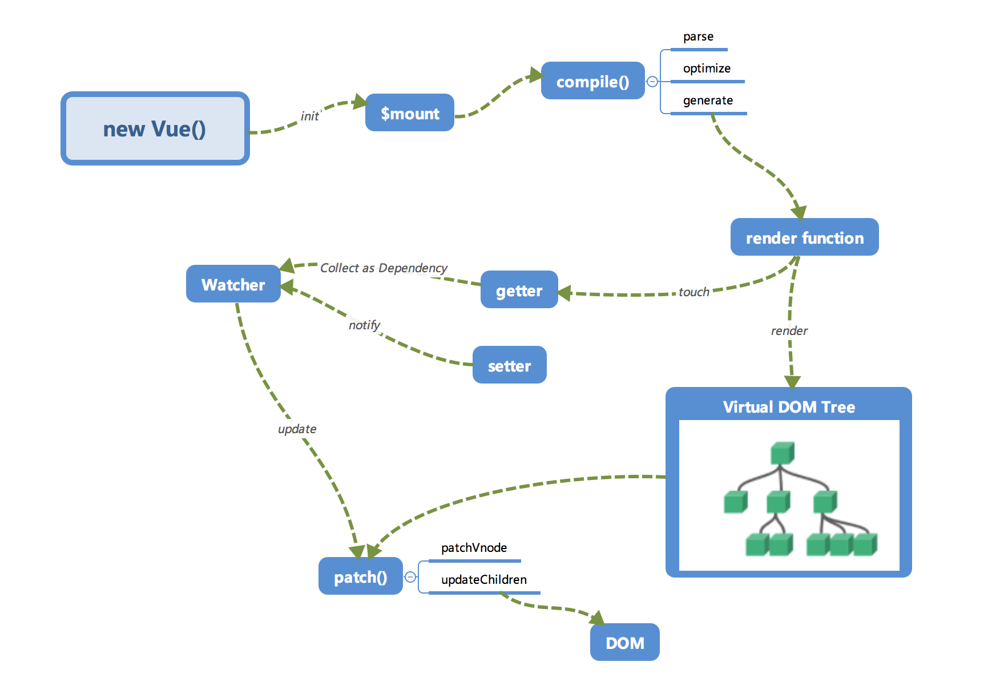
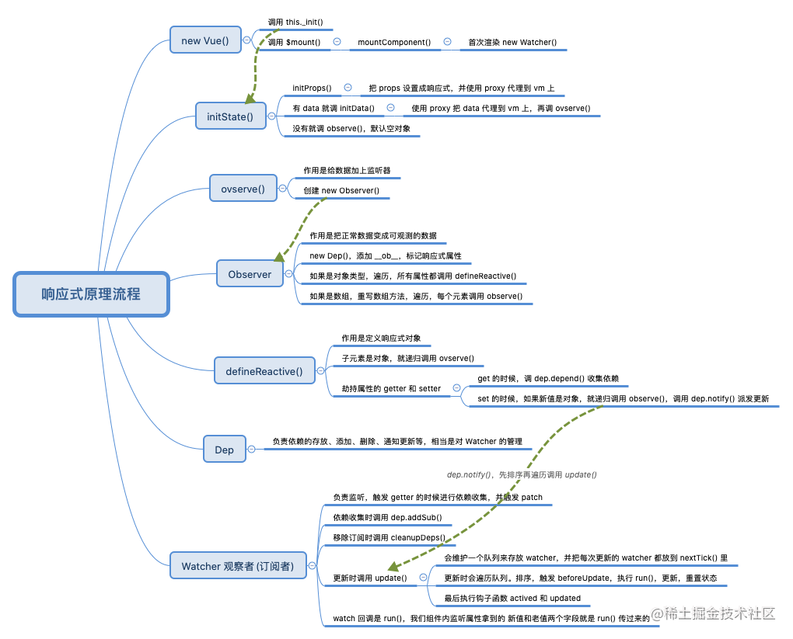

# 响应式原理 <!-- omit in toc -->

> Author: tinfengyee
> Date: 2022-12-14 00:59:59
> LastEditTime: 2022-12-16 23:30:45
> Description: NO Desc

## 概述

先放两张图

### 响应式小结

- 在 new Vue() 后， Vue 会调用 initState 函数进行初始化，在 init 过程 data 通过 Observer 转换成了 getter/setter（在 getter 中收集依赖，在 setter 中通知依赖更新） 的形式，来对数据追踪变化，当被设置的对象被读取的时候会执行 getter 函数，而在当被赋值的时候会执行 setter 函数。
- 当组件渲染的过程中 render function 执行的时候，因为会读取所需对象的值，所以会触发 getter 函数从而将 Watcher 添加到依赖中进行依赖收集。（进行依赖收集，还有computed watcher，user watcher实例）
- 在修改对象的值的时候，会触发对应的 setter， setter 通知之前依赖收集得到的 Dep 中的每一个 Watcher，告诉它们自己的值改变了，需要重新渲染视图。这时候这些 Watcher 就会开始调用 update 来更新视图（派发更新）。

**关键类**

- **Observer**：作用是把正常数组变成可观测的数据。如果是对象遍历所有属性调用 `defineReactive()`，如果是数组，重写数组方法，遍历每个元素调用 `observe()`

  - `observe()`：是 Observer 类的守护，为Observer即将开启前做的一些合规检测。

  >  `Object.defineProperty` 只会对属性进行监测，而不会对对象进行监测，所以需要递归地监听对象上的所有属性

- **defineReactive**：劫持对象属性，getter 进行依赖收集，setter 进行派发更新。

- **Dep**：负责依赖的存放、添加、删除、通知更新等，即对 watcher 的管理。

- **Watcher**： 观察者(订阅者)，负责监听，getter 的时候进行依赖收集，setter 更新时 update 通知视图更新。

### Watcher

三个场景，对应三种`watcher`：

- 负责视图更新的 `render watcher`。
- 执行计算属性更新的 `computed watcher`。
- 用户通过 watcher api 自定义的 `user Watcher`

#### render watcher

在 `render watcher` 中，响应式就意味着，当数据中的值改变时，在视图上的渲染内容也需要跟着改变，在这里就需要一个视图渲染与属性值之间的联系，`Vue` 中的响应式，简单点来说分为以下三个部分：

- `Observer`: 这里的主要工作是递归地监听对象上的所有属性，在属性值改变的时候，触发相应的 `Watcher`。
- `Watcher`: 观察者，当监听的数据值修改时，执行响应的回调函数，在`Vue`里面的更新模板内容。
- `Dep`: 链接 `Observer` 和 `Watcher` 的桥梁，每一个 `Observer`对应一个`Dep`，它内部维护一个数组，保存与该`Observer`相关的`Watcher`。

#### computed watcher

`computed` 函数在自身内部维护的一个`watcher`，配合其内部的属性`dirty`开关来决定`computed`的值是需要重新计算还是直接复用之前的值。

#### user Watcher

在`watch api`中可以定义`deep`与`immediate`属性，分别为深度监听`watch`和最初绑定即执行回调的定义，在`render watch`中定义数组的每一项由于性能与效果的折衷是不会直接被监听的，但是使用`deep`就可以对其进行监听，当然在`Vue3`中使用`Proxy`就不存在这个问题了，这原本是`Js`引擎的内部能力，拦截行为使用了一个能够响应特定操作的函数，即通过`Proxy`去对一个对象进行代理之后，我们将得到一个和被代理对象几乎完全一样的对象，并且可以从底层实现对这个对象进行完全的监控。

## 参考资料

### vue2 响应式

- [x] [深入浅出 Vue 响应式原理源码剖析](https://juejin.cn/post/7017327623307001864)
- [x] [Vue3.2 响应式原理源码剖析，及与 Vue2 .x响应式的区别](https://juejin.cn/post/7021046293627666463)
- [x] [面试官的步步紧逼：Vue2 和 Vue3 的响应式原理比对](https://juejin.cn/post/7124351370521477128)【推荐】
- [x] [响应式原理](https://jonny-wei.github.io/blog/vue/vue/vue-observer.html#%E5%A6%82%E4%BD%95%E4%BE%A6%E6%B5%8B%E6%95%B0%E6%8D%AE%E7%9A%84%E5%8F%98%E5%8C%96)
- [x] [Vue中的三种Watcher](https://www.cnblogs.com/WindrunnerMax/p/14864214.html)
- [ ] [vue源码分析-响应式系统(二)](https://www.cnblogs.com/yyzzabc123/p/16888655.html)
- [ ] [从 vue 源码看问题 —— 如何理解 vue 响应式？](https://juejin.cn/post/7039345669403836447)
- [ ] [纯干货！图解Vue响应式原理](https://juejin.cn/post/7074422512318152718)
- [ ] [深入理解vue响应式原理 8000字](https://mp.weixin.qq.com/s?__biz=MzkwODIwMDY2OQ==&mid=2247488058&idx=1&sn=4f3fcf191bb00b74d750d061058eb8fb&source=41#wechat_redirect)
- [ ] [面试官: 能不能手写 Vue 响应式？（Vue2 响应式原理【完整版】）](https://juejin.cn/post/7079807948830015502)
- [ ] [重学JS（十）—— 使用观察者模式实现双向绑定](https://www.jianshu.com/p/ced393a49aa7)
- [ ] [Vue双向绑定原理，教你一步一步实现双向绑定 ](https://www.cnblogs.com/beevesnoodles/p/9844854.html)

### vue3 响应式

- [ ] [林三心画了8张图，最通俗易懂的Vue3响应式核心原理解析](https://juejin.cn/post/7001999813344493581)
- [ ] [听说你很了解 Vue3 响应式？](https://juejin.cn/post/7147461004954173471)
- [ ] [Vue3 原理解析之响应系统的实现](https://juejin.cn/post/7084915514434306078)

### 观察者和发布订阅模式

- [ ] [理解【观察者模式】和【发布订阅】的区别](https://juejin.cn/post/6978728619782701087)

- [ ] [观察者模式与发布订阅模式区别 - JS](https://segmentfault.com/a/1190000041543041)

- [ ] [重学JS（九）—— 观察者模式和发布/订阅模式真不一样](https://www.jianshu.com/p/f0f22398d25d)

- [ ] [vue中的观察者模式和发布订阅者模式](https://blog.51cto.com/u_15127592/4336598)