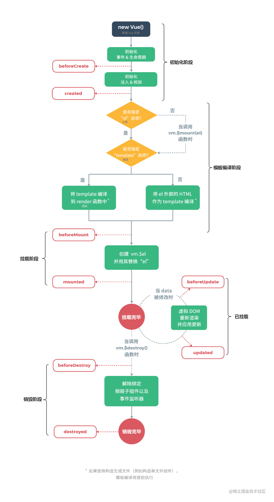

# 生命周期 <!-- omit in toc -->

> Author: tinfengyee
> Date: 2022-12-14 01:05:31
> LastEditTime: 2022-12-15 02:17:31
> Description: NO Desc

## 概述

请说一下 Vue 的生命周期？这种烂大街的问题为什么还在问？

- 考察你的熟练度
- 考察你的深度
- 考察你的知识面

你说是吗，关于 Vue 生命周期有些能说出下面的钩子函数名，有些甚至这些钩子函数名都说不上来，那是真的需要补充一下了，因为这些钩子函数也只是 Vue 完整生命周期中的冰山一角

源码地址：`src/shared/constants.js - 9行`

```js
export const LIFECYCLE_HOOKS = [
  'beforeCreate',
  'created',
  'beforeMount',
  'mounted',
  'beforeUpdate',
  'updated',
  'beforeDestroy',
  'destroyed',
  'activated',
  'deactivated',
  'errorCaptured',
  'serverPrefetch'
]
```

Vue2 完整的生命周期大致可分成四个阶段

- 初始化阶段：为 Vue 实例初始化一些事件、属性和响应式数据等
- 模板编译阶段：把我们写的 `<template></template>` **模板编译**成渲染函数 `render`
- 挂载阶段：把模板渲染到真实的 DOM 节点上，以及数据变更时执行更新操作（**响应式依赖收集**）
- 销毁阶段：把组件实例从父组件中删除，并取消依赖监听和事件监听

这四个阶段分别是怎么划分的，来看一张图（图片来源于Vue中文社区）



## 参考资料

- [x] [Vue 的完整生命周期源码流程详解](https://juejin.cn/post/7017712966485147678)
