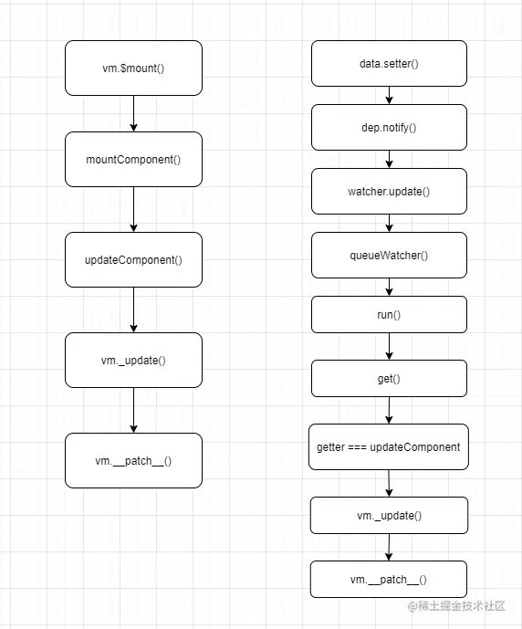

## 你了解vue中的diff算法吗？

### 分析

必问题目，涉及vue更新原理，比较考查理解深度。

### 思路

1. diff算法是干什么的
2. 它的必要性
3. 它何时执行
4. 具体执行方式
5. 拔高：说一下vue3中的优化

## 回答范例

### 什么是diff？

Diff 算法，在 Vue 里面就是叫做 `patch` ，它的核心就是参考 [Snabbdom](https://github.com/snabbdom/snabbdom)，通过新旧虚拟 DOM 对比(即 patch 过程)，找出最小变化的地方转为进行 DOM 操作，因此我们不需要完全的更新整个视图，而是只更新他们差异的部分, 尽可能的减少DOM操作的开销。

### 什么时候触发 patch ？

- 在页面**首次渲染**的时候会调用一次 `patch` 并创建新的 `vnode`，不会进行更深层次的比较。

- 在组件中数据发生变化时：
  1. 先触发 `setter` 然后通过 `Notify` 通知 `Watcher`。
  2. 对应的 `Watcher` 会通知更新并执行更新函数，它会执行 `render` 函数获取新的虚拟 `DOM`。
  3. 执行 `patch` 对比上次渲染结果的老的虚拟 `DOM`，并计算出最小的变化，然后再去根据这个最小的变化去更新真实的 `DOM`，也就是视图`View`

> 注意更新视图的` _update` 方法其实也是响应式的，也需要收集依赖，你可以简单将Vue的视图更新视为一个computed。他与Vue上的Computed和Watcher是分开的，注意computed和watcher的响应式与视图更新没有半毛钱关系。只有视图真正用到了computed和data里的值，且值变化了，视图才会更新。给`_upodate`加上响应式更新是在mountComponent里面做的。

### 过程

patch过程是一个递归过程，**深度优先，同层比较**策略

主要流程是这样的：

- vnode 不存在，oldVnode 存在，就删掉 oldVnode
- vnode 存在，oldVnode 不存在，就创建 vnode
- 两个都存在的话，通过 sameVnode 函数(后面有详解)对比是不是同一节点
  - 如果是同一节点的话，通过 patchVnode 进行后续对比节点文本变化或子节点变化
  - 如果不是同一节点，就把 vnode 挂载到 oldVnode 的父元素下
    - 如果组件的根节点被替换，就遍历更新父节点，然后删掉旧的节点

updateChildren

有经验法则(启发式算法)，通过首尾两两对比 4 种快捷的查找方式，极大减少循环次数，只有当以上 4 种方式都查找不到的时候，再进行循环查找，所以是快速检测出 reverse 操作，加快 Diff 效率

### Vue3 的优化

- 事件缓存：将事件缓存，可以理解为变成静态的了
- 添加静态标记：Vue2 是全量 Diff，Vue3 是静态标记 + 非全量 Diff
- 静态提升：创建静态节点时保存，后续直接复用
- 使用**最长递增子序列**优化了对比流程：Vue2 里在 updateChildren() 函数里对比变更，在 Vue3 里这一块的逻辑主要在 patchKeyedChildren() 函数里，具体看下面                              