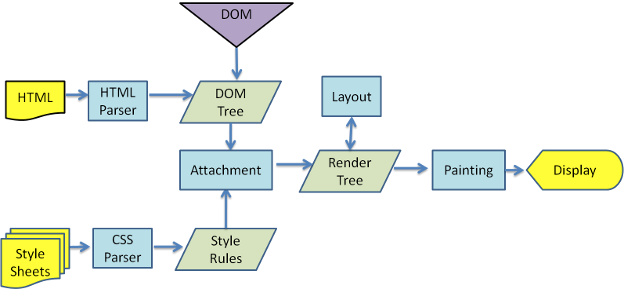

# 从输入 URL 到页面呈现 <!-- omit in toc -->

> Author: tinfengyee
> Date: 2022-11-15 00:58:16
> LastEditTime: 2022-11-15 23:16:46
> Description: NO Desc

## 1. 前言

这是一道经典面试题：

* 从输入 `URL` 到页面呈现发生了什么？

如果你还不懂，那么可以来看看。

## 2. 整体过程

在用户输入 URL，按下回车之后，走过的步骤：

1. `DNS` 解析
2. `TCP` 连接
3. 发送 `HTTP` 请求
4. 服务器响应
5. 浏览器解析渲染页面

当然，这是整体过程，实际面试过程中会进一步详细问，后面会逐步完善，让小伙伴们对这个系列的问题不在纠结。

## 3. DNS 解析

`DNS` 解析过程就是通过网络查找哪台机器有你需要的资源的过程。

浏览器输入 `github.com` 并不是真正意义上的去查找这个，而是查找这个域名解析到的 `IP` 地址。

互联网上每一台计算机的唯一标识是它的 `IP` 地址，但是 `IP` 地址并不方便记忆，所以互联网设计者为了方便，才会搞出 `github.com` 这样的域名。

* **DNS 解析过程**：

1. 查询 `www.baidu.com`
2. 访问客户端 DNS 缓存：**浏览器缓存** -> **系统缓存（host）** -> **路由器缓存**
3. 访问 **ISP DNS 服务器**（ISP，互联网服务提供商，有联通电信移动等。如果你是电信网络，则进入电信的 DNS 缓存服务器，以下简称本地），如果本地服务器有，则直接返回；如果没有，让本地 DNS 服务器去咨询查找。
4. 本地去咨询 **DNS 根服务器**，DNS 根服务器发现是 `.com 区域` 管理的，告诉本地去咨询它。
5. 本地去咨询 **.com 顶级域名服务器**，.com 顶级域名服务器不太清楚，告诉本地去咨询 `baidu.com 主区域` 的服务器。
6. 本地去咨询 **baidu.com 主域名服务器**，baidu.com 域服务器查找到对应的 IP 地址，返回给本地。
7. 本地服务器通知用户，`baidu.com` 对应的 IP 地址，同时缓存这个 IP 地址，下次就直接访问了。

这个过程可以看看，详细的就不一一讲解了，不懂的去看 **jsliang** 的文章：

* [浏览器 - 浏览器缓存](https://github.com/LiangJunrong/document-library/blob/master/%E7%B3%BB%E5%88%97-%E9%9D%A2%E8%AF%95%E8%B5%84%E6%96%99/%E6%B5%8F%E8%A7%88%E5%99%A8/%E6%B5%8F%E8%A7%88%E5%99%A8%E7%BC%93%E5%AD%98.md)
* [计算机网络 - DNS](https://github.com/LiangJunrong/document-library/blob/master/%E7%B3%BB%E5%88%97-%E9%9D%A2%E8%AF%95%E8%B5%84%E6%96%99/%E8%AE%A1%E7%AE%97%E6%9C%BA%E7%BD%91%E7%BB%9C/DNS.md)

## 4. TCP 连接

* 建立连接阶段：3 次握手。建立客户端和服务器之间的连接。
* 传输数据阶段
* 断开连接阶段：4 次挥手。断开客户端和服务器之间的连接。

如果 3 次握手和 4 次挥手你不懂过程，详细可以看 **jsliang** 的文章：

* [计算机网络 - TCP](https://github.com/LiangJunrong/document-library/blob/master/%E7%B3%BB%E5%88%97-%E9%9D%A2%E8%AF%95%E8%B5%84%E6%96%99/%E8%AE%A1%E7%AE%97%E6%9C%BA%E7%BD%91%E7%BB%9C/TCP.md)

## 5. 发送 HTTP 请求

发送 `HTTP` 请求的过程就是构建 `HTTP` 请求报文，并通过 `TCP` 协议发送到服务器指定端口（`HTTP` 协议默认端口 `80/8080`，`HTTPS` 协议默认端口 `443`）。

`HTTP` 请求报文由 3 部分组成：**请求行**、**请求报文** 和 **请求正文**。

* **请求行**：常用方法有：GET、POST、PUT、DELETE、OPTIONS、HEAD。
* **请求报头**：允许客户端向服务器传递请求的附加信息和客户端自身的信息。
* **请求正文**：通过 POST、PUT 等方法时，通常需要客户端向服务器传递数据，这些数据就储存在请求正文中。

当然，`HTTP` 请求需要注意是否跨域，如何解决跨域问题：

* [浏览器 - 跨域](https://github.com/LiangJunrong/document-library/blob/master/%E7%B3%BB%E5%88%97-%E9%9D%A2%E8%AF%95%E8%B5%84%E6%96%99/%E6%B5%8F%E8%A7%88%E5%99%A8/%E8%B7%A8%E5%9F%9F.md)

## 6. 服务器响应

服务器处理请求完毕后，会返回 `HTTP` 报文。

`HTTP` 响应报文也是由 3 部分组成：**状态码**、**响应报头** 和 **响应报文**。

* **状态码**：`1xx` 指示信息-表示请求已接收；`2xx` 请求成功-表示请求成功接收并解析；`3xx` 重定向-表示要完成请求需要更进一步操作；`4xx` 客户端错误-请求有语法错误或者请求无法实现；`5xx`：服务端错误-服务端未能实现合法的请求。**常见状态码**：200（成功）、304（请求内容有缓存，不需要更新）、404（网页或者文件找不到）、500（服务器-后端处理错误）。
* **响应报头**：常见的响应报头字段 `Server`、`Connection` 等。
* **响应报文**：服务器返回给浏览器的文本信息，通常 HTML、CSS、JS、图片等文件就放在这一部分。

综上，`URL` 解析过程的步骤 3 和步骤 4 是 `HTTP` 请求和服务器响应，所以这一块会问到 `HTTP` 状态码、`HTTPS` 等知识点，后续我们会进一步跟进学习，这里先做概念性理解。

## 7. 浏览器解析渲染页面

如上图，浏览器的渲染过程为：

1. 解析 HTML，生成 `DOM` 树
2. 解析 CSS，生成 `CSS 规则树（CSS Rule Tree）`
3. 将 `DOM Tree` 和 `CSS Rule Tree` 相结合，生成 **渲染树**（`Render Tree`）
4. 从根节点开始，计算每一个元素的大小、位置，给出每个节点所应该出现的屏幕精确坐标，从而得到基于渲染树的 **布局渲染树**（`Layout of the render tree`）。
5. 遍历渲染树，将每个节点用 UI 渲染引擎来绘制，从而将整棵树绘制到页面上，这个步骤叫 **绘制渲染树**（`Painting the render tree`）

> 这个渲染过程需要重点记忆，出场概率非常大

在解析渲染过程中，可能会产生 **回流** 和 **重绘**：

* **重绘(repaint)**：当元素样式的改变不影响布局时，浏览器将使用重绘对元素进行更新，此时由于只需要 UI 层面的重新像素绘制，因此**损耗较少**。
* **回流(reflow)**：又叫重排（`layout`）。当元素的尺寸、结构或者触发某些属性时，浏览器会重新渲染页面，称为回流。此时，浏览器需要重新经过计算，计算后还需要重新页面布局，因此是较重的操作。

那么：

1. 什么操作会重绘和回流？
2. 如何优化？

详细可看：

* [浏览器 - 回流和重绘](https://github.com/LiangJunrong/document-library/blob/master/%E7%B3%BB%E5%88%97-%E9%9D%A2%E8%AF%95%E8%B5%84%E6%96%99/%E6%B5%8F%E8%A7%88%E5%99%A8/%E9%87%8D%E6%8E%92%E5%92%8C%E9%87%8D%E7%BB%98.md)

## 8. 其他问题及优化

在上面步骤中，其实可以发掘很多优化点：

* DNS 缓存
* 浏览器缓存
* 减少回流和重绘
* ……

如果你过程都了解了，那么优化基本不是问题。

当然，为了加深印象，可以看 **jsliang** 整理的文章：

* [浏览器 - 性能优化](https://github.com/LiangJunrong/document-library/blob/master/%E7%B3%BB%E5%88%97-%E9%9D%A2%E8%AF%95%E8%B5%84%E6%96%99/%E6%B5%8F%E8%A7%88%E5%99%A8/%E6%80%A7%E8%83%BD%E4%BC%98%E5%8C%96.md)

### 8.1. 渲染过程碰到 JS 文件怎么处理？

JavaScript 的加载、解析和执行会阻塞 DOM 的构建。

也就是说：在构建 `DOM` 的时候，HTML 解析器如果碰到 JavaScript，那么就会停止构建 `DOM`，将控制权交给 JavaScript 引擎，等 JavaScript 运行完毕，浏览器再从中断的地方恢复 `DOM` 构建。

也就是说：首屏渲染越快，就越不应该在首屏的时候加载 JS 文件，这也就是建议将 `script` 标签放到 `body` 标签底部，或者给 `script` 标签添加 `defer/async` 属性的原因。

#### 8.1.1. 普通 script 标签

`JS` 可能会修改 `HTML` 和 `CSS`，因此 JS 的下载执行过程不能和 `HTML / CSS` 并行

`HTML` 解析过程中若碰到外联的 `JS` 会暂时中止 `HTML` 的解析流程，等候脚本下载和解析完成后再继续进行之前中断掉的 `HTML` 解析流程

这样就导致了 `script` 标签外联 `JS` 加载有这样的缺点：**会影响整个页面效率，一旦网速不好整个网站将等待 `JS` 加载而不进行后续渲染，而由于中断了 `HTML` 解析流程，所以导致页面空白等，影响体验**

以前的常用写法是将 `script` 标签写在 `body` 最后面，等 `DOM` 全部解析完成后才加载 `JS`，`HTML5` 标准有另一套异步加载 `JS` 的方法

#### 8.1.2. defer

在 `script` 标签的行间写一个 `defer=“defer”` 或直接写 `defer` 就可以让这个 `script` 外联的 JS 变成异步加载

`HTML` 解析流程中若碰到外联 `JS` 时会开辟新线程来下载脚本，下载完成后不会立即解析，因此不会阻塞 `HTML` 的解析流程，等到 `HTML` 解析完毕后（不包括下载完里面的资源），再进行相应脚本的执行解析

这种方式可以在 `script` 标签里面写代码

注意：

- 该方法只有 `IE` 和一些高版本的 `firefox` 和 `chrome` 可以用
- `IE6` 和 `IE7` 的异步加载最多只能有 `2` 个，超过两个时必须等前两个加载完才会加载第三个
- **所有 `defer` 的 `JS` 代码都保证按照顺序执行**

#### 8.1.3. async

`async` 是 `asynchronous` 的缩写，是 `HTML5` 标准

`HTML` 解析流程中若碰到外联 `JS` 时会开辟新线程来下载脚本，下载完成后立即解析执行，且解析流程会中断 `HTML` 解析流程，等到脚本执行完成后才会继续进行之前中断掉的 `HTML` 解析流程

注意：

- 这种方法除了 `IE6 ～ IE8` 其他的浏览器都好用
- 该方式不能把代码写在 `script` 标签里，只能引用外部脚本（虽然标准是这么写的，但现在随着内核升级 `async` 的 `script` 标签里也可以写代码，在没有 `src` 情况下）
- **`async` 的 `JS` 代码不能保证是顺序执行的，按照 `race` 的方式哪个脚本先下载完就先解析哪个脚本**
- **`defer` 和 `async` 这两个属性不能一起使用**

### 8.2. 为什么操作 DOM 慢

1. 涉及 JS 引擎和渲染引擎两个线程间的通信，损耗性能。
2. 操作 DOM 可能会重复回流，加剧性能损耗。
