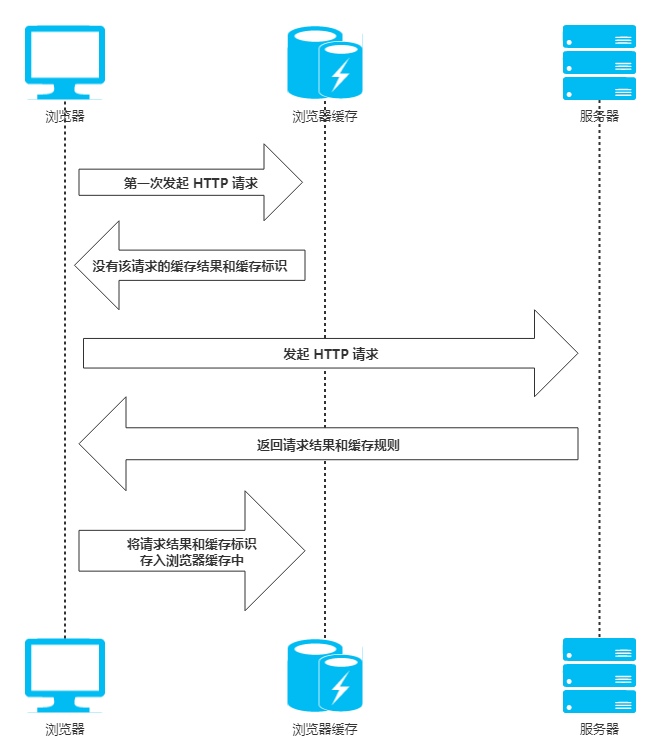
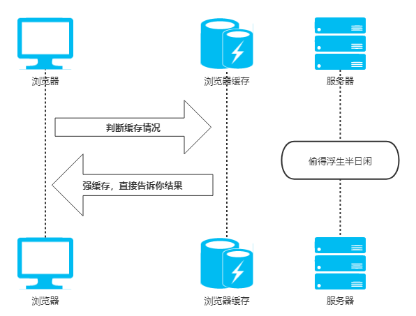
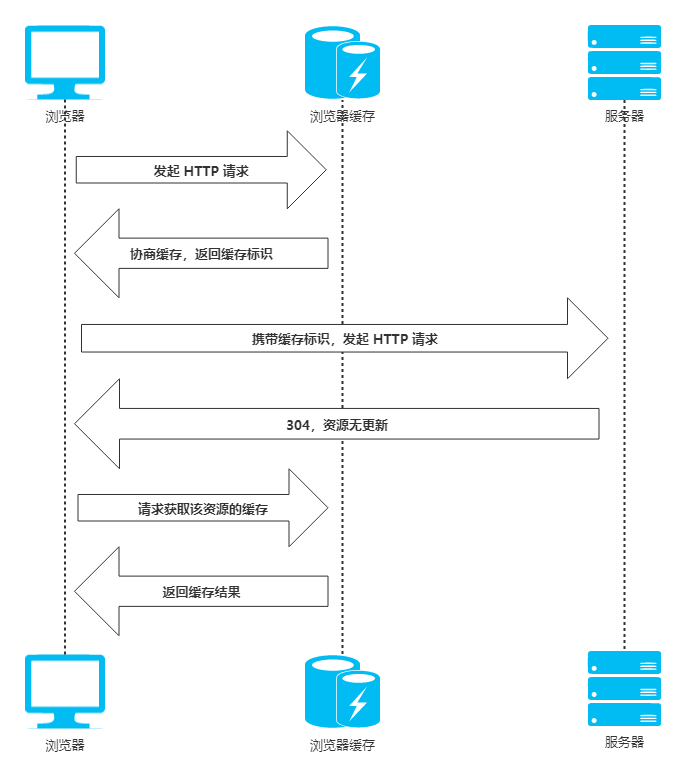
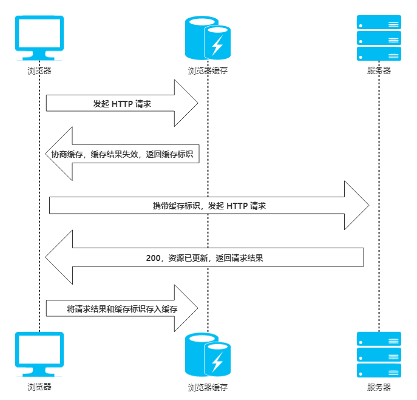

# 浏览器缓存 <!-- omit in toc -->

> Author: tinfengyee
> Date: 2022-11-15 19:44:24
> LastEditTime: 2022-11-15 23:16:57
> Description: NO Desc

## 1. 前言

**知识点**：

* 缓存位置
  * `Service Worker`
  * `Memory Cache`
  * `Disk Cache`
  * `Push Cache`
* 缓存过程
* 缓存机制
  * 强缓存
  * 协商缓存
* 缓存实例
  * 频繁变动的资源
  * 不常变化的资源
* 影响缓存

**前提：为什么需要浏览器缓存**？

对于一个数据请求来说：网络请求、后端处理、浏览器响应。

浏览器缓存可以帮助我们优化第一点和第三点的性能。

## 2. 缓存位置

缓存位置分为 4 点：

* `Service Worker`
* `Memory Cache`
* `Disk Cache`
* `Push Cache`

下面我们一一看看。

### 2.1. Service Worker

`Service Worker` 是运行在浏览器背后的独立线程，一般可以用来实现缓存功能。

注意点：

1. 必须是 `HTTPS`。因为它涉及请求拦截，所以必须使用 `HTTPS` 协议来保障安全。
2. `Service Worker` 缓存不同于其他机制，它可以让我们自由控制缓存哪些文件、如何匹配缓存、如何读取缓存，并且缓存是持续性的。

### 2.2. Memory Cache

`Memory Cache`：内存中的缓存，主要是页面上已经下载的样式、脚本、图片等已经抓取到的资源。

注意点：

1. 读取内存中的数据肯定比磁盘快，读取高效。
2. 缓存持续性很短，会随着进程的释放而释放。关闭页面内存中的缓存也就释放了。

### 2.3. Disk Cache

`Disk Cache` 是存储在硬盘中的缓存，读取速度相对慢点。

注意点：

1. 比起 `Memory Cache` 胜在容量和存储时效性上。

### 2.4. Push Cache

`Push Cache`（推送缓存） 是 `HTTP/2` 中的内容，当以上 3 种缓存都没有命中的时候，它才会被使用。

注意点：

1. 它只在会话（`Session`）中存在，一旦会话结束就被释放，并且缓存也很短暂。

## 3. 缓存过程

如上图，浏览器的缓存过程为：

1. **浏览器** 发起一次 HTTP 请求
2. **浏览器缓存** 告诉浏览器这边没有该请求的缓存结果和缓存标识
3. **浏览器** 向 **服务器** 发起 `HTTP` 请求
4. **服务器** 返回该请求结果和缓存规则
5. **浏览器** 将该请求结果和缓存标识存入浏览器缓存中

## 4. 缓存机制

缓存分为 **强缓存** 和 **协商缓存**。

强缓存优先于协商缓存进行，若强制缓存生效则直接使用缓存，若不生效则进行协商缓存。

协商缓存由服务器决定是否使用缓存，若协商缓存失效，那么该请求的缓存失效，返回 `200`，重新返回资源和缓存标识，再存入浏览器中；生效则返回 `304`，继续使用缓存。

如果强缓存和协商缓存都没有设置，那么浏览器会采用启发式的算法，通常会取响应头中的 `Date` 减去 `Last-Modified` 的值的 `10%` 作为缓存时间。

### 4.1. 强缓存

**强缓存**：不会向服务器发送请求，直接从缓存中读取资源。

**强缓存** 判断是否缓存的依据来自于是否超出某个时间或者某个时间段，而不关心服务器端文件是否已经更新，这可能会导致加载文件不是服务器端最新的内容（如果需要判断，那就要用 **协商缓存**）。

* **表示方式**：在 Chrome 控制台的 Network 选项中可以看到该请求返回 `200` 状态码，并且 `Size` 显示为 `from disk cache` 或者 `from memory cache`。

* **实现方式**：

1. `Expires`
2. `Cache-Control`

#### 4.1.1. Expires

Expires是HTTP/1.0控制网页缓存的字段，其值为服务器返回该请求结果缓存的到期时间，即再次发起该请求时，如果客户端的时间小于Expires的值时，直接使用缓存结果。

> Expires是HTTP/1.0的字段，但是现在浏览器默认使用的是HTTP/1.1，那么在HTTP/1.1中网页缓存还是否由Expires控制？

到了HTTP/1.1，Expire已经被Cache-Control替代，原因在于Expires控制缓存的原理是使用客户端的时间与服务端返回的时间做对比，是一个**绝对的时间** (当前时间+缓存时间)，那么如果客户端与服务端的时间因为某些原因（例如时区不同；客户端和服务端有一方的时间不准确）发生误差，那么强制缓存则会直接失效，这样的话强制缓存的存在则毫无意义，那么Cache-Control又是如何控制的呢？

#### 4.1.2. Cache-Control

在HTTP/1.1中，Cache-Control是最重要的规则，，主要用于控制网页缓存，主要取值为：

- **public**：所有内容都将被缓存（客户端和代理服务器都可缓存）
- **private**：所有内容只有客户端可以缓存，**Cache-Control的默认取值**
- **no-cache**：客户端缓存内容，但是是否使用缓存则需要经过协商缓存来验证决定
- **no-store**：所有内容都不会被缓存，即不使用强制缓存，也不使用协商缓存
- **max-age=xxx (xxx is numeric)**：缓存内容将在xxx秒后失效

#### 4.1.3. 两者对比

`Expires` 是 `HTTP/1.0` 的产物，`Cache-Control` 是 `HTTP/1.1` 的产物。两者同时存在的时候，`Cache-Control` 优先级高于 `Expires`。

- HTTP响应报文中expires的时间值，是一个绝对值

- HTTP响应报文中Cache-Control为max-age=600，是相对值

由于Cache-Control的优先级比expires，那么直接根据Cache-Control的值进行缓存，意思就是说在600秒内再次发起该请求，则会直接使用缓存结果，强制缓存生效。

注：在无法确定客户端的时间是否与服务端的时间同步的情况下，Cache-Control相比于expires是更好的选择，所以同时存在时，只有Cache-Control生效。

### 4.2. 协商缓存

协商缓存就是强制缓存失效后，浏览器携带缓存标识向服务器发起请求，由服务器根据缓存标识决定是否使用缓存的过程。

#### 4.2.1. 协商缓存存在

协商缓存存在，返回 `304` 和 `Not Modified`。

1. **浏览器** 发起 HTTP 请求，先经过 **浏览器缓存**
2. **浏览器缓存** 判断该请求的缓存结果，返回缓存标识
3. **浏览器** 携带该标识，向 **服务器** 发起 `HTTP` 请求
4. **服务器** 返回 `304` 告诉 **浏览器** 资源没有更新
5. **浏览器** 再次请求这个缓存结果
6. **浏览器缓存** 返回该请求的缓存结果

#### 4.2.2. 协商缓存失效

协商缓存失效，返回 `200` 和请求结果。

1. **浏览器** 发起 HTTP 请求，先经过 **浏览器缓存**
2. **浏览器缓存** 判断该请求的缓存结果失效，返回缓存标识
3. **浏览器** 携带该标识，向 **服务器** 发起 HTTP 请求
4. **服务器** 返回 200 告诉 **浏览器** 资源可以更新了
5. **浏览器** 读取并将请求结果和缓存标识存入 **浏览器缓存** 中

#### 4.2.3. 缓存方式

1. `Last-Modified` 和 `If-Modified-Since`
2. `ETag` 和 `If-None-Match`

##### 4.2.3.1. Last-Modified / If-Modified-Since

- Last-Modified 是服务器响应请求时，返回该资源文件在服务器最后被修改的时间，如下。
- If-Modified-Since 则是客户端再次发起该请求时，携带上次请求返回的Last-Modified值，通过此字段值告诉服务器该资源上次请求返回的最后被修改时间。服务器收到该请求，发现请求头含有If-Modified-Since字段，则会根据If-Modified-Since的字段值与该资源在服务器的最后被修改时间做对比，若服务器的资源最后被修改时间大于If-Modified-Since的字段值，则重新返回资源，状态码为200；否则则返回304，代表资源无更新，可继续使用缓存文件，如下。

##### 4.2.3.2. Etag / If-None-Match

- Etag是服务器响应请求时，返回当前资源文件的一个唯一标识(由服务器生成)
- If-None-Match是客户端再次发起该请求时，携带上次请求返回的唯一标识Etag值，通过此字段值告诉服务器该资源上次请求返回的唯一标识值。服务器收到该请求后，发现该请求头中含有If-None-Match，则会根据If-None-Match的字段值与该资源在服务器的Etag值做对比，一致则返回304，代表资源无更新，继续使用缓存文件；不一致则重新返回资源文件，状态码为200

**注**：

Etag / If-None-Match优先级高于Last-Modified / If-Modified-Since，同时存在则只有Etag / If-None-Match生效。

## 5. 缓存实例

* 频繁变动的资源：设置不使用强缓存，配合协商缓存控制是否返回响应数据。
* 不常变化的资源：设置 `Cache-control` 强缓存一年等。例如 `jQuery` 就可以用版本号控制缓存 `jquery-3.3.1.min.js`，如果后面更新了，那就更换引用 URL，让之前缓存失效。

## 6. 影响缓存

1. 打开网页：查找 `disk cache` 中是否有匹配，有则使用没则发送请求。
2. F5：因为网页没有关闭，所以 `memory cache` 是可用的，如果匹配会被优先使用。其次才是 `disk cache`。
3. Ctrl + F5：浏览器不使用缓存，发送请求头部带 `Cache-control`，拿服务器最新内容。

## 7. 小结

强制缓存优先于协商缓存进行，若强制缓存(Expires和Cache-Control)生效则直接使用缓存，若不生效则进行协商缓存(Last-Modified / If-Modified-Since和Etag / If-None-Match)，协商缓存由服务器决定是否使用缓存，若协商缓存失效，那么代表该请求的缓存失效，重新获取请求结果，再存入浏览器缓存中；生效则返回304，继续使用缓存，主要过程如下：

## 8. 参考文献

- [x] [彻底理解浏览器的缓存机制](https://heyingye.github.io/2018/04/16/%E5%BD%BB%E5%BA%95%E7%90%86%E8%A7%A3%E6%B5%8F%E8%A7%88%E5%99%A8%E7%9A%84%E7%BC%93%E5%AD%98%E6%9C%BA%E5%88%B6/)
- [x] [一文读懂前端缓存](https://github.com/easonyq/easonyq.github.io)

* [ ] [深入理解浏览器的缓存机制](https://www.jianshu.com/p/54cc04190252)【阅读建议：1h】
* [ ] [浏览器缓存](https://github.com/xiangxingchen/blog/issues/9)【阅读建议：30min】
* [ ] [前端必须要懂的浏览器缓存机制](https://juejin.im/entry/6844903599537930253)【阅读建议：10min】
* [ ] [关于浏览器缓存你知道多少](https://mp.weixin.qq.com/s/Wvc0lkLpgyEW_u7bbMdvpQ)【阅读建议：10min】
* [ ] [设计一个无懈可击的浏览器缓存方案：关于思路，细节，ServiceWorker，以及HTTP/2](https://zhuanlan.zhihu.com/p/28113197)【阅读建议：20min】
* [ ] [前端缓存最佳实践](https://juejin.im/post/6844903737538920462)【阅读建议：20min】
