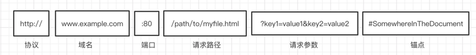
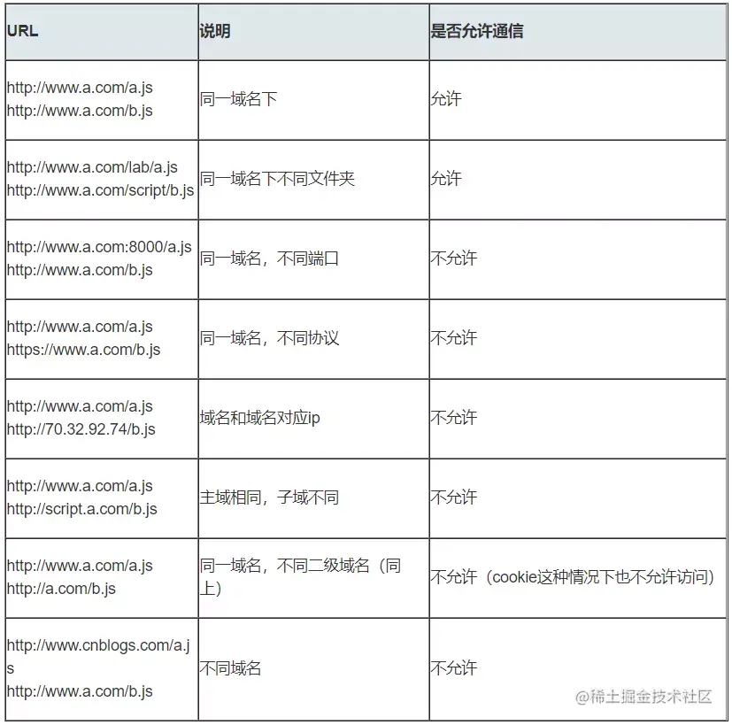
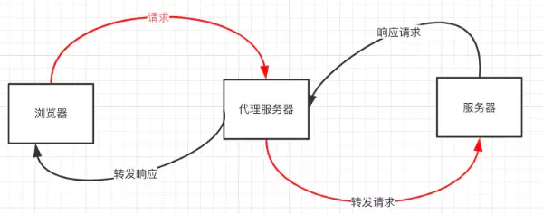

# 跨域 <!-- omit in toc -->

> Author: tinfengyee
> Date: 2022-11-15 19:45:18
> LastEditTime: 2022-11-15 23:16:50
> Description: NO Desc

## 1. 前言

带着问题学习：

* 什么是跨域？
* 为什么要设置跨域？
* 如何解决跨域？

## 2. 同源策略

**【1】什么是同源策略**？

只有当**protocol（协议）、domain（域名）、port（端口）三者一致。**才是同源。

**注：**这里比较容易混淆的就是 abc.com 和 [www.abc.com](https://link.juejin.cn/?target=http%3A%2F%2Fwww.abc.com) ，我们常常把 www作为主域名，但是实际上是不规范的，www其实也只是 abc.com 的一个子域名而已。

在上面，如果两个页面对应的地址不同源，那么浏览器就会判定跨域，从而导致下面问题：

* `Ajax` 请求不能发送
* 无法获取 `DOM` 元素并进行操作
* 无法读取 `Cookie`、`LocalStorage` 和 `IndexDB`

那么，出于怎样的考虑，**【2】浏览器才要设置跨域**？

**首先**，跨域只存在于浏览器端，因为我们知道浏览器的形态是很开放的，所以我们需要对它有所限制。

**其次**，同源策略主要是为了保证用户信息的安全，可分为两种：`Ajax` 同源策略和 `DOM` 同源策略。

`Ajax` 同源策略主要是使得不同源的页面不能获取 `Cookie` 且不能发起 `Ajax` 请求，这样在一定层度上防止了 `CSRF` 攻击。

`DOM` 同源策略也一样，它限制了不同源页面不能获取 `DOM`，这样可以防止一些恶意网站在自己的网站中利用 `iframe` 嵌入正规的网站并迷惑用户，以此来达到窃取用户信息。

**【3】实际开发场景为什么会出现跨域**：

1. 前后端部署的机子，不属于同一台云服务器。
2. 同一台云服务器，但是你在 `https://github.com` 请求的是 `https://github2.com` 上的资源。

那么，**【4】如何解决跨域问题**呢？

1. 使用代理（`proxy`）
2. 设置 `CORS`
3. JSONP
4. ……等

下面我们详细看看解决跨域的几个方案。

## 3. 实现跨域的方式

### 3.1. JSONP

利用 `<script>` 标签没有跨域限制的漏洞，网页可以得到从其他来源动态产生的 `JSON` 数据。`JSONP` 请求一定需要对方的服务器做支持才可以。

优缺点：

1. 【优点】`Ajax` 和 `JSONP` 都是客户端向服务端发送请求，从而获取数据的方式。但是 `Ajax` 属于同源策略，而 `JSONP` 属于非同源策略。
2. 【优点】兼容性好，能解决主流浏览器跨域访问的问题。
3. 【缺点】仅支持 `get` 请求
4. 【缺点】不安全，可能会遭受 `XSS` 攻击。

实现过程：省略，看 JS 手写代码部分。

### 3.2. CORS

跨域资源共享（`CORS`）是一种机制，是 `W3C` 标准。它允许浏览器向跨源服务器，发出 `XMLHttpRequest` 或 `Fetch` 请求。并且整个 `CORS` 通信过程都是浏览器自动完成的，不需要用户参与。

而使用这种跨域资源共享的前提是，浏览器必须支持这个功能，并且服务器端也必须同意这种 "跨域" 请求。因此实现 CORS 的关键是服务器需要服务器。

浏览器会自动进行 `CORS` 通信，实现 `CORS` 通信的关键是后端。只要后端实现了 `CORS`，就实现了跨域。

服务端设置 `Access-Control-Allow-Origin` 就可以开启 `CORS`。

该属性表示哪些域名可以访问资源，如果设置通配符则表示所有网站都可以访问资源。

`CORS` 的请求分为两种：

* 简单请求
* 复杂请求

一个简单请求大致如下。

HTTP 方法是下列之一：

* HEAD
* GET
* POST

HTTP 头信息不超过以下几种字段

* Accept
* Accept-Language
* Content-Language
* Last-Event-ID
* ……等（记不住。。。）

任何不满足上述要求的请求，都是复杂请求。

一个复杂请求不仅包含通讯内容的请求，同时也包含预请求。

**简单请求和复杂请求的区别**：

* **简单请求** 的发送从代码上看起来和普通的 XHR 没太大区别，但是 HTTP 头当中要求总是包含一个域（Origin）的信息。该域包含协议名、地址以及一个可选的端口。
* **复杂请求** 不止发送一个请求。其中最先发送的是一种 “预请求”，而服务端也需要返回 “预回应” 作为相应。预请求实际上是对服务端的一种权限请求，只有当预请求成功返回，实际请求才开始执行。

### 3.3. postMessage

`postMessage` 是 `HTML5 XMLHttpRequest Level 2` 中的 `API`，且是为数不多可以跨域操作的 `window` 属性之一。

它可用于解决以下方面的问题：

* 页面和其打开的新窗口的数据传递
* 多窗口之间消息传递
* 页面与嵌套的 `iframe` 消息传递
* 上面三个场景的跨域数据传递

`postMessage()` 方法允许来自不同源的脚本采用异步方式进行有限的通信，可以实现跨文本档、多窗口、跨域消息传递。

### 3.4. WebSocket

`WebSocket` 是 HTML5 的一个持久化的协议，它实现了浏览器与服务器的全双工通信，同时也是跨域的一种解决方案。

`WebSocket` 是一种双向通信协议，在建立连接之后，`WebSocket` 的 `server` 与 `client` 都能主动向对方发送或接收数据。

`WebSocket` 的使用我们在计算机网络部分有写，后面再进行介绍。

### 3.5. Node

同源策略是浏览器需要遵循的标准，而如果是服务器向服务器请求就无需遵循同源策略。

所以我们可以通过 `Node` 中间件代码（两次跨域）：

* 接受客户端请求
* 将请求转发给服务器
* 拿到服务器响应数据
* 将响应转发给客户端

### 3.6. Nginx

使用 `Nginx` 反向代理实现跨域，是最简单的跨域方式。

只需要修改 `Nginx` 的配置即可解决跨域问题，支持所有浏览器，支持 `Session`，不需要修改任何代码，并且不会影响服务器性能。

### 3.7. 其他方式

其他方式还有：

1. `window.name + iframe`
2. `location.hash + iframe`
3. `document.domain + iframe`
4. ……

但是感觉有生之年 **jsliang** 不会用到，这里看看即可。

## 4. 参考文献

* [ ] [浏览器同源策略与ajax跨域方法汇总](https://www.jianshu.com/p/438183ddcea8)【阅读建议：15min】
* [ ] [九种跨域方式实现原理（完整版）](https://juejin.im/post/5c23993de51d457b8c1f4ee1)【阅读建议：15min】
* [ ] [前端开发如何独立解决跨域问题](https://segmentfault.com/a/1190000010719058)【阅读建议：5min】
* [ ] [CORS 原理及实现](https://www.jianshu.com/p/b2bdf55e1bf5)【阅读建议：30min】
* [ ] [JSONP 原理及实现](https://www.jianshu.com/p/88bb82718517)【阅读建议：30min】
* [ ] [面试题：nginx 有配置过吗?反向代理知道吗?](https://juejin.im/post/6844904148022870023)【阅读建议：10min】
* [ ] [10 种跨域解决方案（附终极大招）](https://juejin.im/post/6844904126246027278)【阅读建议：1h】
* [ ] [CORS跨域请求[简单请求与复杂请求]](https://www.cnblogs.com/qunxiadexiaoxiangjiao/p/9446956.html)【阅读建议：20min】
