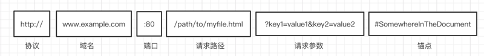
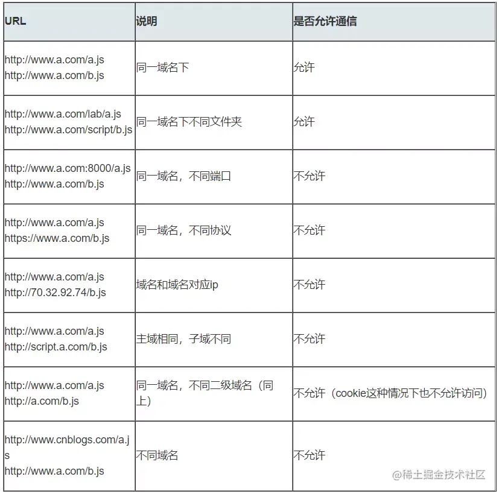
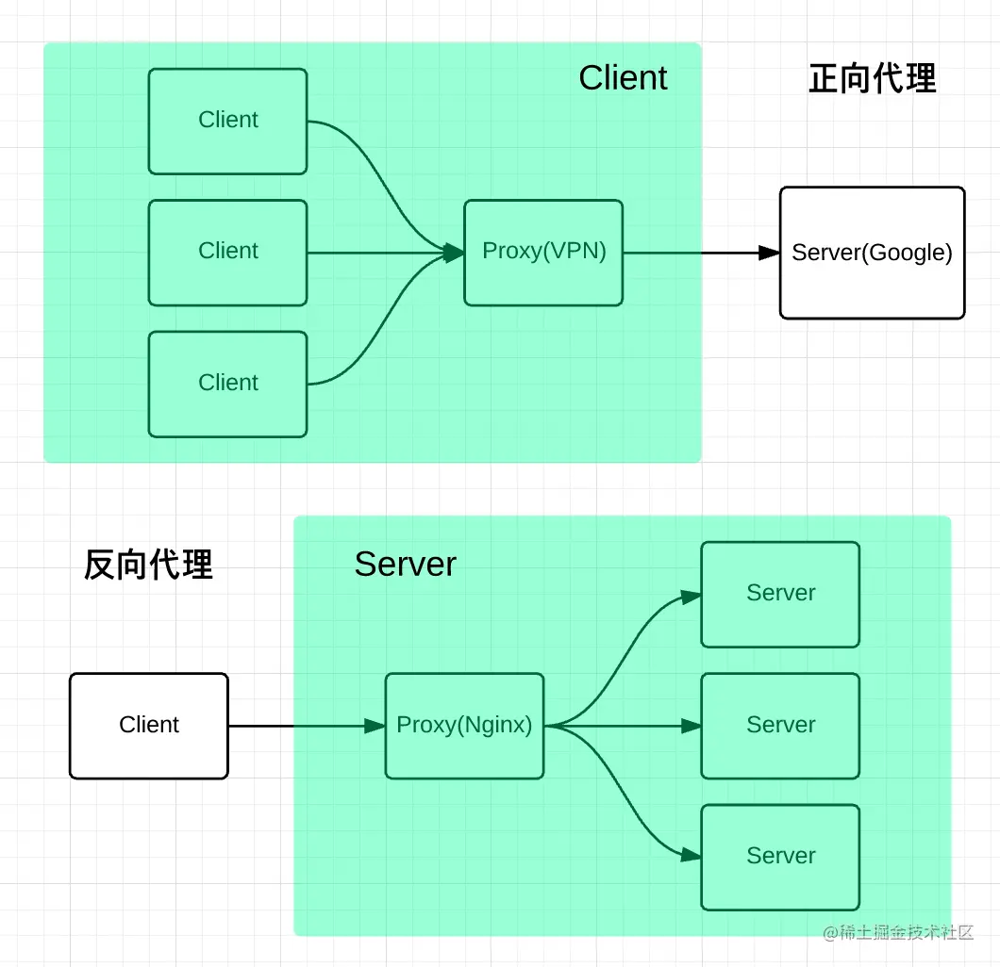
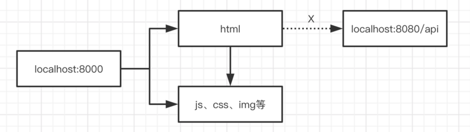
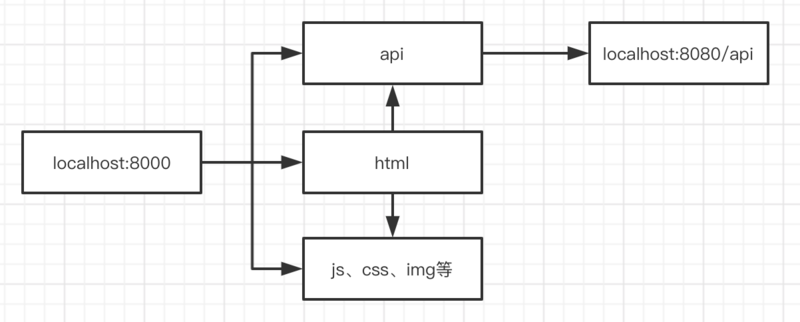

# 计算机网络 <!-- omit in toc -->

> Author: tinfengyee
> Date: 2022-11-13 11:12:42
> LastEditTime: 2022-11-15 00:34:19
> Description: NO Desc

## 1. 前言

浏览器安全可以分为三大块：

* Web 页面安全
* 浏览器网络安全
* 浏览器系统安全

Web 世界是开放的，任何资源都可以接入其中，我们的网站可以加载并执行别人网站的脚本文件、图片、音频、视频等资源，甚至可以下载其他站点的可执行文件。

但是 Web 世界不能绝对自由，例如打开一个银行站点，不小心又打开一个恶意站点：

* 修改银行站点的 DOM、CSSOM 等信息；
* 在银行站点内部插入 JavaScript 脚本；
* 劫持用户登录的用户名和密码；
* 读取银行站点的 `Cookie`、`IndexDB` 等数据；
* 甚至还可以将这些信息上传至自己的服务器，这样就可以在你不知情的情况下伪造一些转账请求等信息。

所以，在没有安全保障的 Web 世界中，我们是没有隐私的，因此需要安全策略来保障我们的隐私和数据的安全。

这就引出了页面中最基础、最核心的安全策略：同源策略（Same-origin policy）。

## 2. 同源策略

### 2.1. 什么是同源策略



只有当**protocol（协议）、domain（域名）、port（端口）三者一致。**才是同源。



**注：**这里比较容易混淆的就是 abc.com 和 [www.abc.com](https://link.juejin.cn/?target=http%3A%2F%2Fwww.abc.com) ，我们常常把 www作为主域名，但是实际上是不规范的，www其实也只是 abc.com 的一个子域名而已。

### 2.2. 为什么需要同源策略

同源策略主要表现在 DOM、Web 数据和网络这三个层面。

* **第一个，DOM 层面**

同源策略限制了来自不同源的 JavaScript 脚本对当前 DOM 对象读和写的操作。

当你在 `A` 页面，通过 `<a href="xxx" target="_blank">` 的形式打开 `B` 页面，经过下面 2 行代码可以将 `A` 页面的内容给隐藏掉：

```js
let pdom = opener.document;
pdom.body.style.display = "none";
```

这就是同源情况下 DOM 的一个操作。

而不同源的是无法操作的。

* **第二个，数据层面**

同源策略限制了不同源的站点读取当前站点的 `Cookie`、`IndexDB`、`LocalStorage` 等数据。

由于同源策略，我们依然无法通过 `B` 页面的 `opener` 来访问 `A` 页面中的 `Cookie`、`IndexDB` 或者 `LocalStorage` 等内容。

* **第三个，网络层面**

同源策略限制了通过 `XMLHttpRequest` 等方式将站点的数据发送给不同源的站点。

### 2.3. 如何解决跨域？

#### 2.3.1. CORS

跨域资源共享([CORS](https://developer.mozilla.org/zh-CN/docs/Glossary/CORS)) 是一种机制，它使用额外的[HTTP](https://developer.mozilla.org/zh-CN/docs/Glossary/HTTP)头来告诉浏览器 让运行在一个 origin (domain) 上的 Web 应用被准许访问来自不同源服务器上的指定的资源。当一个资源从与该资源本身所在的服务器**不同的域、协议或端口**请求一个资源时，资源会发起一个**跨域 HTTP 请求**。

CORS 其实是 W3C 的一个标准，全称是`跨域资源共享`。它需要浏览器和服务器的共同支持，具体来说，非 IE 和 IE10 以上支持CORS，服务器需要附加特定的响应头，后面具体拆解。不过在弄清楚 CORS 的原理之前，我们需要清楚两个概念: **简单请求**和**非简单请求**。

浏览器根据请求方法和请求头的特定字段，将请求做了一下分类，具体来说规则是这样，凡是满足下面条件的属于**简单请求**:

- 请求方法为 GET、POST 或者 HEAD
- 请求头的取值范围: Accept、Accept-Language、Content-Language、Content-Type(只限于三个值`application/x-www-form-urlencoded`、`multipart/form-data`、`text/plain`)

浏览器画了这样一个圈，在这个圈里面的就是**简单请求**, 圈外面的就是**非简单请求**，然后针对这两种不同的请求进行不同的处理。

**简单请求**

请求发出去之前，浏览器做了什么？

它会自动在请求头当中，添加一个`Origin`字段，用来说明请求来自哪个`源`。服务器拿到请求之后，在回应时对应地添加`Access-Control-Allow-Origin`字段，如果`Origin`不在这个字段的范围中，那么浏览器就会将响应拦截。

因此，`Access-Control-Allow-Origin`字段是服务器用来决定浏览器是否拦截这个响应，这是必需的字段。与此同时，其它一些可选的功能性的字段，用来描述如果不会拦截，这些字段将会发挥各自的作用。

**Access-Control-Allow-Credentials**。这个字段是一个布尔值，表示是否允许发送 Cookie，对于跨域请求，浏览器对这个字段默认值设为 false，而如果需要拿到浏览器的 Cookie，需要添加这个响应头并设为`true`, 并且在前端也需要设置`withCredentials`属性:

```ini
let xhr = new XMLHttpRequest();
xhr.withCredentials = true;
```

**Access-Control-Expose-Headers**。这个字段是给 XMLHttpRequest 对象赋能，让它不仅可以拿到基本的 6 个响应头字段（包括`Cache-Control`、`Content-Language`、`Content-Type`、`Expires`、`Last-Modified`和`Pragma`）, 还能拿到这个字段声明的**响应头字段**。比如这样设置:

```makefile
Access-Control-Expose-Headers: aaa
```

那么在前端可以通过 `XMLHttpRequest.getResponseHeader('aaa')` 拿到 `aaa` 这个字段的值。

**非简单请求**

非简单请求相对而言会有些不同，体现在两个方面: **预检请求**和**响应字段**。

我们以 PUT 方法为例。

```ini
var url = 'http://xxx.com';
var xhr = new XMLHttpRequest();
xhr.open('PUT', url, true);
xhr.setRequestHeader('X-Custom-Header', 'xxx');
xhr.send();
```

当这段代码执行后，首先会发送**预检请求**。这个预检请求的请求行和请求体是下面这个格式:

```makefile
OPTIONS / HTTP/1.1
Origin: 当前地址
Host: xxx.com
Access-Control-Request-Method: PUT
Access-Control-Request-Headers: X-Custom-Header
```

预检请求的方法是`OPTIONS`，同时会加上`Origin`源地址和`Host`目标地址，这很简单。同时也会加上两个关键的字段:

- Access-Control-Request-Method, 列出 CORS 请求用到哪个HTTP方法
- Access-Control-Request-Headers，指定 CORS 请求将要加上什么请求头

这是`预检请求`。接下来是**响应字段**，响应字段也分为两部分，一部分是对于**预检请求**的响应，一部分是对于 **CORS 请求**的响应。

**预检请求的响应**。如下面的格式:

```yaml
HTTP/1.1 200 OK
Access-Control-Allow-Origin: *
Access-Control-Allow-Methods: GET, POST, PUT
Access-Control-Allow-Headers: X-Custom-Header
Access-Control-Allow-Credentials: true
Access-Control-Max-Age: 1728000
Content-Type: text/html; charset=utf-8
Content-Encoding: gzip
Content-Length: 0
```

其中有这样几个关键的**响应头字段**:

- Access-Control-Allow-Origin: 表示可以允许请求的源，可以填具体的源名，也可以填`*`表示允许任意源请求。
- Access-Control-Allow-Methods: 表示允许的请求方法列表。
- Access-Control-Allow-Credentials: 简单请求中已经介绍。
- Access-Control-Allow-Headers: 表示允许发送的请求头字段
- Access-Control-Max-Age: 预检请求的有效期，在此期间，不用发出另外一条预检请求。

在预检请求的响应返回后，如果请求不满足响应头的条件，则触发`XMLHttpRequest`的`onerror`方法，当然后面真正的**CORS请求**也不会发出去了。

**CORS 请求的响应**。绕了这么一大转，到了真正的 CORS 请求就容易多了，现在它和**简单请求**的情况是一样的。浏览器自动加上`Origin`字段，服务端响应头返回**Access-Control-Allow-Origin**。可以参考以上简单请求部分的内容。

#### 2.3.2. JSONP

虽然`XMLHttpRequest`对象遵循同源政策，但是`script`标签不一样，它可以通过 src 填上目标地址从而发出 GET 请求，实现跨域请求并拿到响应。这也就是 JSONP 的原理，接下来我们就来封装一个 JSONP:

```javascript
const jsonp = ({ url, params, callbackName }) => {
  const generateURL = () => {
    let dataStr = '';
    for(let key in params) {
      dataStr += `${key}=${params[key]}&`;
    }
    dataStr += `callback=${callbackName}`;
    return `${url}?${dataStr}`;
  };
  return new Promise((resolve, reject) => {
    // 初始化回调函数名称
    callbackName = callbackName || Math.random().toString.replace(',', ''); 
    // 创建 script 元素并加入到当前文档中
    let scriptEle = document.createElement('script');
    scriptEle.src = generateURL();
    document.body.appendChild(scriptEle);
    // 绑定到 window 上，为了后面调用
    window[callbackName] = (data) => {
      resolve(data);
      // script 执行完了，成为无用元素，需要清除
      document.body.removeChild(scriptEle);
    }
  });
}
复制代码
```

当然在服务端也会有响应的操作, 以 express 为例:

```javascript
let express = require('express')
let app = express()
app.get('/', function(req, res) {
  let { a, b, callback } = req.query
  console.log(a); // 1
  console.log(b); // 2
  // 注意哦，返回给script标签，浏览器直接把这部分字符串执行
  res.end(`${callback}('数据包')`);
})
app.listen(3000)
复制代码
```

前端这样简单地调用一下就好了:

```javascript
jsonp({
  url: 'http://localhost:3000',
  params: { 
    a: 1,
    b: 2
  }
}).then(data => {
  // 拿到数据进行处理
  console.log(data); // 数据包
})
```

和`CORS`相比，JSONP 最大的优势在于兼容性好，IE 低版本不能使用 CORS 但可以使用 JSONP，缺点也很明显，请求方法单一，只支持 GET 请求。

#### 2.3.3. Nginx 反向代理

Nginx 是一种高性能的`反向代理`服务器，可以用来轻松解决跨域问题。

what？反向代理？我给你看一张图你就懂了。



正向代理帮助客户端**访问**客户端自己访问不到的服务器，然后将结果返回给客户端。

反向代理拿到客户端的请求，将请求转发给其他的服务器，主要的场景是维持服务器集群的**负载均衡**，换句话说，反向代理帮**其它的服务器**拿到请求，然后选择一个合适的服务器，将请求转交给它。

因此，两者的区别就很明显了，正向代理服务器是帮**客户端**做事情，而反向代理服务器是帮其它的**服务器**做事情。

好了，那 Nginx 是如何来解决跨域的呢？

比如说现在客户端的域名为**client.com**，服务器的域名为**server.com**，客户端向服务器发送 Ajax 请求，当然会跨域了，那这个时候让 Nginx 登场了，通过下面这个配置:

```ini
server {
  listen  80;
  server_name  client.com;
  location /api {
    proxy_pass server.com;
  }
}
```

Nginx 相当于起了一个跳板机，这个跳板机的域名也是`client.com`，让客户端首先访问 `client.com/api`，这当然没有跨域，然后 Nginx 服务器作为反向代理，将请求转发给`server.com`，当响应返回时又将响应给到客户端，这就完成整个跨域请求的过程。

其实还有一些不太常用的方式，大家了解即可，比如`postMessage`，当然`WebSocket`也是一种方式，但是已经不属于 HTTP 的范畴，另外一些奇技淫巧就不建议大家去死记硬背了，一方面从来不用，名字都难得记住，另一方面临时背下来，面试官也不会对你印象加分，因为看得出来是背的。

#### 2.3.4. Node 正向代理

代理的思路为，利用服务端请求不会跨域的特性，让接口和当前站点同域。

**代理前**



**代理后**



这样，所有的资源以及请求都在一个域名下了。

Webpack (4.x)/Vue-cli 3.x

```js
// vue.config.js 如果没有就新建
module.exports = {
  devServer: {
    port: 8000,
    proxy: {
      "/api": {
        target: "http://localhost:8080"
      }
    }
  }
};
```

## 3. XSS

### 3.1. 概览

本章目标：看到下面概览可以大略描述说出 XSS 攻击、XSS 攻击类型以及 XSS 防御措施。

* XSS 攻击类型

1. 存储型
2. 反射型
3. 文档型

* XSS 防范措施

1. 输入检查
2. 利用 CSP
3. 利用 HttpOnly

### 3.2. 介绍

XSS（Cross Site Script）跨站脚本攻击。指的是攻击者向网页注入恶意的客户端代码，通过恶意的脚本对客户端网页进行篡改，从而在用户浏览网页时，对用户浏览器进行控制或者获取用户隐私数据的一种攻击方式。

例如：

* 可以窃取 `Cookie` 信息。恶意 JavaScript 可以通过 `document.cookie` 获取 `Cookie` 信息，然后通过 `XMLHttpRequest` 或者 `Fetch` 加上 `CORS` 功能将数据发送给恶意服务器。恶意服务器拿到用户的 `Cookie` 信息之后，就可以在其他电脑上模拟用户的登录，然后进行转账等操作。
* 可以监听用户行为。恶意 JavaScript 可以使用 `addEventListener` 接口来监听键盘事件，比如可以获取用户输入的信用卡等信息，将其发送到恶意服务器。黑客掌握了这些信息之后，又可以做很多违法的事情。
* 可以通过修改 `DOM` 伪造假的登录窗口，用来欺骗用户输入用户名和密码等信息。
* 可以在页面内生成浮窗广告，这些广告会严重地影响用户体验。

注入恶意脚本分 3 种方式：

* **存储型**：即攻击被存储在服务端，常见的是在评论区插入攻击脚本，如果脚本被储存到服务端，那么所有看见对应评论的用户都会受到攻击。例如 2015 年喜马拉雅的专辑名称允许用户编写 `<script>` 标签。
* **反射型**：攻击者将脚本混在 URL 里，服务端接收到 URL 将恶意代码当做参数取出并拼接在 HTML 里返回，浏览器解析此 HTML 后即执行恶意代码。例如 Q 群或者邮件中发送恶意链接，用户点击恶意链接，然后解析 URL 执行恶意代码。
* **DOM 型**：攻击者通过各种手段将恶意脚本注入用户的页面中。例如通过网络劫持（WiFi 路由器劫持、本地恶意软件劫持等）在页面传输过程中修改 HTML 页面内容。

### 3.3. 防御

防御 XSS 攻击：

* **输入检查**：对输入内容中的 `script` 和 `<iframe>` 等标签进行转义或者过滤
* **设置 httpOnly**：设置此属性可防止 JavaScript 获取 `Cookie`，只能在 HTTP 请求过程中使用 `Cookie`
* **开启 CSP 白名单**：即开启白名单，可阻止白名单以外的资源加载和运行

## 4. CSRF

### 4.1. 概览

本章目标：看到下面概览可以大略描述说出 CSRF 攻击、CSRF 攻击方式以及 CSRF 防御措施。

* CSRF 攻击方式

1. 利用用户的登录状态，并通过第三方的站点来做一些坏事
2. 自动发 GET 请求
3. 自动发 POST 请求
4. 诱导点击发送 GET 请求

* CSRF 防范措施

1. 验证 Token
2. 验证 Referer
3. 验证 Samesite

### 4.2. 介绍

CSRF 攻击（Cross-site request forgery）即跨站请求伪造。

是一种劫持受信任用户向服务器发送非预期请求的攻击方式，通常情况下，它是攻击者借助受害者的 Cookie 骗取服务器的信任，但是它并不能拿到 Cookie，也看不到 Cookie 的内容，它能做的就是给服务器发送请求，然后执行请求中所描述的命令，以此来改变服务器中的数据，也就是并不能窃取服务器中的数据。

CSRF 攻击就是黑客利用用户的登录状态，并通过第三方的站点来做一些坏事。

打开攻击者提供的页面后，攻击者有 3 种方式实施 CSRF 攻击：

* **方法一：自动发起 Get 请求**

```html
<!DOCTYPE html>
<html>
  <body>
    <h1>黑客的站点：CSRF 攻击演示</h1>
    
  </body>
</html>
```

黑客将转账的请求接口隐藏在 `img` 标签内，欺骗浏览器这是一张图片资源。

当该页面被加载时，浏览器会自动发起 `img` 的资源请求，如果服务器没有对该请求做判断的话，那么服务器就会认为该请求是一个转账请求，于是用户账户上的 100 块就被转移到黑客的账户上去了。

* **方法二：自动发起 POST 请求**

```html
<!DOCTYPE html>
<html>
<body>
  <h1>黑客的站点：CSRF 攻击演示</h1>
  <form id='hacker-form' action="https://jsliang.top" method=POST>
    <input type="hidden" name="user" value="hacker" />
    <input type="hidden" name="number" value="100" />
  </form>
  <script>
    document.getElementById('hacker-form').submit();
  </script>
</body>
</html>
```

在页面中构建了一个隐藏的表单，该表单的内容就是极客时间的转账接口。

当用户打开该站点之后，这个表单会被自动执行提交；当表单被提交之后，服务器就会执行转账操作。

因此使用构建自动提交表单这种方式，就可以自动实现跨站点 POST 数据提交。

* **方法三：引诱用户点击链接**

```html
<div>
  
  </div>
<div>
  <a href="https://jsliang.top?user=hacker&number=100" taget="_blank">
    点击下载美女照片
  </a>
</div>
```

传说中的色诱，或者 “点击即送 100w 元” 之类的。

### 4.3. 防御

防御 CSRF 攻击：

* **验证 Token**：浏览器请求服务器时，服务器返回一个 `token`，之后每个请求都需要同时带上 `token` 和 `Cookie` 才会被认为是合法请求
* **验证 Referer**：通过验证请求头的 `Referer` 来验证来源站点，但请求头很容易伪造
* **设置 SameSite**：设置 `Cookie` 的 `SameSite`，可以让 `Cookie` 不随跨站请求发出，但浏览器兼容不一

## 5. SQL 注入

已有代码：

```js
<form action="/login" method="POST">
  <p>Username: <input type="text" name="username" /></p>
  <p>Password: <input type="password" name="password" /></p>
  <p><input type="submit" value="登陆" /></p>
</form>
```

后端的登录语句：

```js
let querySQL = `
  SELECT *
  FROM user
  WHERE username='${username}'
  AND psw='${password}'
`;
// 接下来就是执行 sql 语句...
```

攻击者输入的信息是：

* 用户名：`jsliang' OR 1 = 1 --`
* 密码：随意，例如 `123456`

预想输入和现在输入变成：

```sql
SELECT * FROM user WHERE username='jsliang' AND psw='123456'
SELECT * FROM user WHERE username='jsliang' OR 1 = 1 --' AND psw='xxxx'
```

我们先拆解这条 SQL 语句，避免有些小伙伴看不懂：

* `SELECT`：查找
* `*`：所有信息
* `FROM`：来源于某个表（`From xxx`）
* `user`：用户表
* `username='xxx'`：用户名是 `xxx`
* `AND`：和
* `OR`：或
* `--`：注释，跟我们 JS 的 `//` 一样

所以上面代码的意思是：

* 第一条：查找 `user` 表，其中 `username` 为 `jsliang`，并且密码是 `123456`
* 第二条：查找 `user` 表，其中 `username` 为 `jsliang`，或者 `1 = 1`

这样，第二条的 SQL 查询条件就必定是真的啦，我们就可以登录这个账号了。

这就是 SQL 注入。

怎么预防？这里我们不理会，属于后端需要注意的范畴。

当然后端可能要求前端帮忙防范，比如用户名不能包含 `-`、`_` 等~

## 6. 流量劫持

量劫持基本分两种：`DNS` 劫持 和 `HTTP` 劫持，目的都是一样的，就是当用户访问 `github.com` 的时候，给你展示的并不是或者不完全是 `github.com` 提供的 “内容”

### 6.1. DNS 劫持

`DNS` 劫持，也叫做域名劫持。

当用户通过某一个域名访问一个站点的时候，被篡改的 `DNS` 服务器返回的是一个恶意的钓鱼站点的 `IP`，用户就被劫持到了恶意钓鱼站点，然后继而会被钓鱼输入各种账号密码信息，泄漏隐私。

这类劫持：

* 要不就是网络运营商搞的鬼，一般小的网络运营商与黑产勾结会劫持 DNS
* 要不就是电脑中毒，被恶意篡改了路由器的 DNS 配置，基本上做为开发者或站长却是很难察觉的，除非有用户反馈。

### 6.2. HTTP 劫持

`HTTP` 劫持主要是当用户访问某个站点的时候会经过运营商网络，而不法运营商和黑产勾结能够截获 `HTTP` 请求返回内容，并且能够篡改内容，然后再返回给用户，从而实现劫持页面。

轻则插入小广告，重则直接篡改成钓鱼网站页面骗用户隐私，就好比 **jsliang** 访问某 `XXDN` 网站，会出现 Google 广告，实际上问了其他人的是不会有这个的。

能够实施流量劫持的根本原因，是 `HTTP` 协议没有办法对通信对方的身份进行校验以及对数据完整性进行校验。如果能解决这个问题，则流量劫持将无法轻易发生。

所以防止 `HTTP` 劫持的方法只有将内容加密，让劫持者无法破解篡改，这样就可以防止 `HTTP` 劫持了。

`HTTPS` 是基于 `SSL` 协议的安全加密网络应用层协议，相当于 `HTTP` + `SSL`，可以很好地防止 `HTTP` 劫持。

## 7. 浏览器网络安全

`HTTP` 在传输过程中的每一个环节，数据都有可能被窃取或者篡改，这也意味着你和服务器之间还可能有个中间人，在通信过程中的一切内容都在中间人的掌握中。

使用 `HTTP` 传输的内容很容易被中间人窃取、伪造和篡改，通常我们把这种攻击方式称为中间人攻击。

具体来讲，在将 `HTTP` 数据提交给 `TCP` 层之后，数据会经过用户电脑、`WiFi` 路由器、运营商和目标服务器，在这中间的每个环节中，数据都有可能被窃取或篡改。

比如用户电脑被黑客安装了恶意软件，那么恶意软件就能抓取和篡改所发出的 `HTTP` 请求的内容。

或者用户一不小心连接上了 `WiFi` 钓鱼路由器，那么数据也都能被黑客抓取或篡改。

## 8. 浏览器系统安全

浏览器本身的漏洞是单进程浏览器的一个主要问题，如果浏览器被曝出存在漏洞，那么在这些漏洞没有被及时修复的情况下，黑客就有可能通过恶意的页面向浏览器中注入恶意程序。

其中最常见的攻击方式是利用缓冲区溢出，不过需要注意这种类型的攻击和 `XSS` 注入的脚本是不一样的。

* `XSS` 攻击只是将恶意的 JavaScript 脚本注入到页面中，虽然能窃取一些 `Cookie` 相关的数据，但是 `XSS` 无法对操作系统进行攻击。
* 通过浏览器漏洞进行的攻击是可以入侵到浏览器进程内部的，可以读取和修改浏览器进程内部的任意内容，还可以穿透浏览器，在用户的操作系统上悄悄地安装恶意软件、监听用户键盘输入信息以及读取用户硬盘上的文件内容。

渲染进程需要执行 `DOM` 解析、`CSS` 解析、网络图片解码等操作，如果渲染进程中存在系统级别的漏洞，那么以上操作就有可能让恶意的站点获取到渲染进程的控制权限，进而又获取操作系统的控制权限。

基于此，在渲染进程和操作系统之间建一道墙，即便渲染进程由于存在漏洞被黑客攻击，但由于这道墙，黑客就获取不到渲染进程之外的任何操作权限。

将渲染进程和操作系统隔离的这道墙就是安全沙箱。

## 9. 参考文献

- [x] [10 种跨域解决方案（附终极方案）](https://zhuanlan.zhihu.com/p/132534931)①
- [x] [CORS解决跨域问题](https://segmentfault.com/a/1190000022143487)②

* [ ] [常见 Web 安全攻防总结](https://zoumiaojiang.com/article/common-web-security/)【阅读建议：1hour】
* [ ] [前端安全系列（一）：如何防止XSS攻击？](https://tech.meituan.com/2018/09/27/fe-security.html)【阅读建议：20min】
* [ ] [前端安全系列（二）：如何防止CSRF攻击？](https://tech.meituan.com/2018/10/11/fe-security-csrf.html)【阅读建议：20min】
* [ ] [前端也需要了解的 JSONP 安全](https://juejin.im/post/5b75b497e51d45666276251d)【阅读建议：10min】
* [ ] [【面试篇】寒冬求职之你必须要懂的Web安全](https://juejin.im/post/5cd6ad7a51882568d3670a8e)【阅读建议：20min】
* [ ] [谈谈对 Web 安全的理解](https://zhuanlan.zhihu.com/p/25486768?group_id=820705780520079360)【阅读建议：10min】
* [ ] [程序员必须要了解的web安全](https://juejin.im/post/5b4e0c936fb9a04fcf59cb79)【阅读建议：10min】
* [ ] [可信前端之路：代码保护](https://www.freebuf.com/articles/web/102269.html)【阅读建议：10min】
* [ ] [前端如何给 JavaScript 加密（不是混淆）？](https://www.zhihu.com/question/47047191)【阅读建议：10min】
