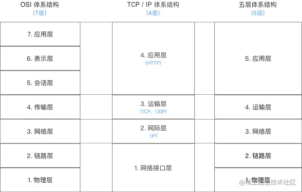
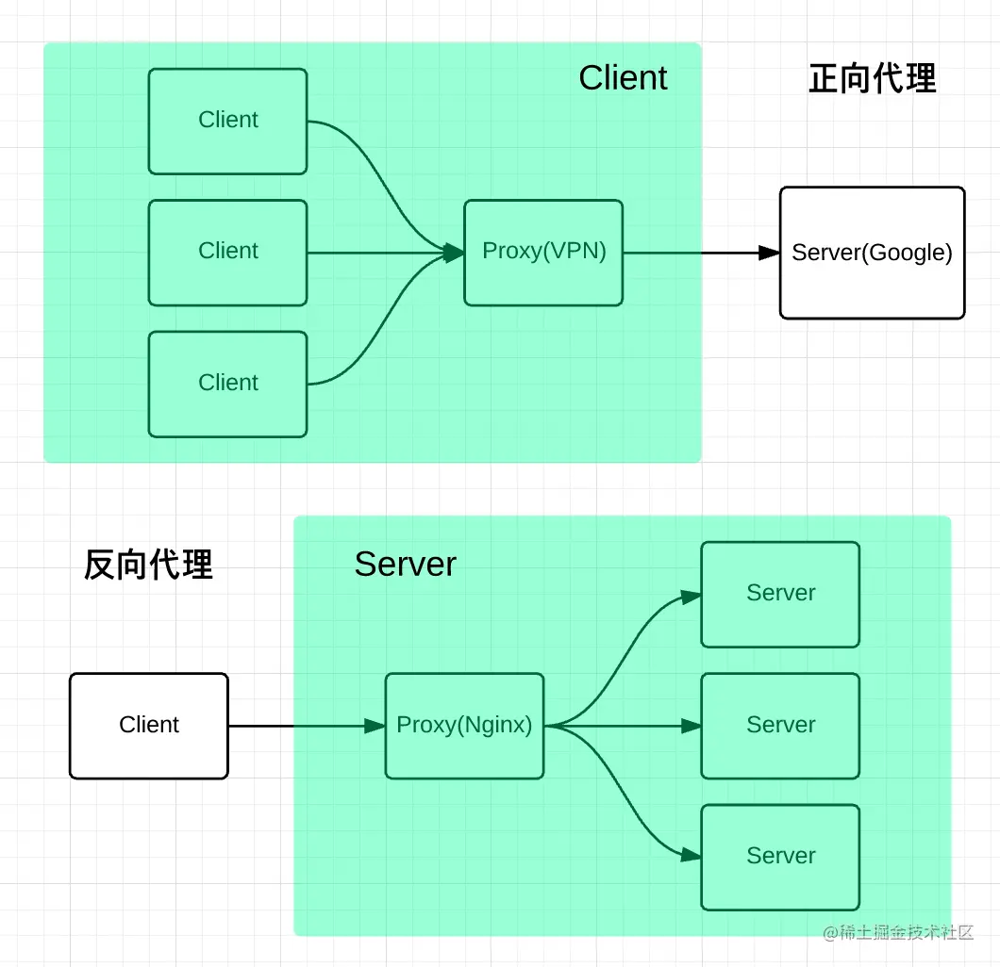

# 计算机网络基础 <!-- omit in toc -->

> Author: tinfengyee
> Date: 2022-11-15 00:30:19
> LastEditTime: 2022-11-15 00:39:47
> Description: NO Desc

## 1. 计算机网络基础

### 1.1. 计算机网络体系结构

计算机网络体系结构分为 3 种：

* OSI 体系结构
* TCP/IP 体系结构
* 五层体系结构



详细就不说了，这个要拓展起来，篇幅能写成一本书。

大学时候学这个，被教授饶得头大，怕了怕了。

## 2. 正向代理和反向代理

### 2.1. 正向代理

一图看懂：



我是一个用户，我访问不了某网站，但是我能访问一个代理服务器。

这个代理服务器呢，他能访问那个我不能访问的网站，于是我先连上代理服务器，告诉他我需要那个无法访问网站的内容，代理服务器去取回来，然后返回给我。

**简单来说**：

正向代理中，用户是知道服务器 IP 地址的，但是自己访问不了，需要别人帮忙访问。

```
用户 1
      \
用户 —— 代理 -> 服务器
      /
用户 3
```

**特点**：

1. 需要通过某个软件（代理服务器）
2. 可以访问原本访问不到的资源（翻墙）
3. 代理服务器可以对外隐藏用户信息（管理上网记录）

### 2.2. 反向代理

反向代理即在客户端和服务器之间推出一个代理服务器，然后所有请求内容都经过代理服务器去管理。

举个例子：淘宝有一个总服务器，服务器里面有很多小服务器。用户访问的时候，就访问总服务器的地址（公网 IP），然后总服务器去分配具体的小服务器（私网 IP）去处理你的请求。

**简单来说**：

反向代理中，用户是不知道具体请求到的服务器的 IP 地址的。

```
用户 1               服务器 1
      \            /
用户 2 ->  总服务器 -> 服务器 2
      /            \
用户 3               服务器 3
```

**特点**：

1. 保证安全。客户端访问公网地址，然后由反向代理服务器（公网 IP）来访问内网的 Web 服务器。
2. 负载均衡。由反向代理服务器来轮询，选择访问哪台内网服务器。

## 3. CDN

`CDN` 全称 `Content Delivery Network`，即内容分发网络。

其基本思路是尽可能避开互联网上有可能影响数据传输速度和稳定性的瓶颈和环节，使内容传输的更快、更稳定。

* **不使用 CDN**

广州的用户 **jsliang** 要请求一个在北京的 IP 地址。

那可能经过是这样的：

广州用户 -> 广州服务器 -> 湖南服务器 -> 湖北服务器 -> 北京服务器

这样子一个一个查找，就很耽搁时间。

* **使用 CDN**

北京服务器指定了一个 CDN 服务商，然后这个服务商有个广州服务器上做了部署，我们直接访问广州服务器就可以找到资料了。

* **简单理解**

某东购物，买个洗发水，外国牌子的，然后某东直接从它家的广州仓库发过来。

如果用户是北京的，那就从北京仓库发出去。

而我们的 CDN 服务商，就是干这个的。

* **举例**

我们在页面中引用了 jQuery。如果这个资源放在自家服务器上，会增加自家服务器的压力；如果请求 jQuery 官网的地址，又可能太远。于是使用了 CDN，让 CDN 服务商判断用户举例它哪个资源库最近，就提供哪个地址给用户。

* **适用情况**

1. 不常更新的静态资源
2. 自家服务器资源较少

## 4. 参考文献

* [ ] [正向代理与反向代理【总结】](https://www.cnblogs.com/Anker/p/6056540.html)【阅读建议：10min】
* [ ] [五分钟了解CDN](https://juejin.im/post/5afa449c51882542ba07e70e)【阅读建议：10min】
* [ ] [漫话：如何给女朋友解释什么是CDN？](https://juejin.im/post/5d478c48e51d453c135c5a5c)【阅读建议：20min】
* [ ] [关于 cdn、回源等问题一网打尽](https://juejin.im/post/5af46498f265da0b8d41f6a3)【阅读建议：10min】
* [ ] [CDN是什么？使用CDN有什么优势？](https://www.zhihu.com/question/36514327?rf=37353035)【阅读建议：10min】
