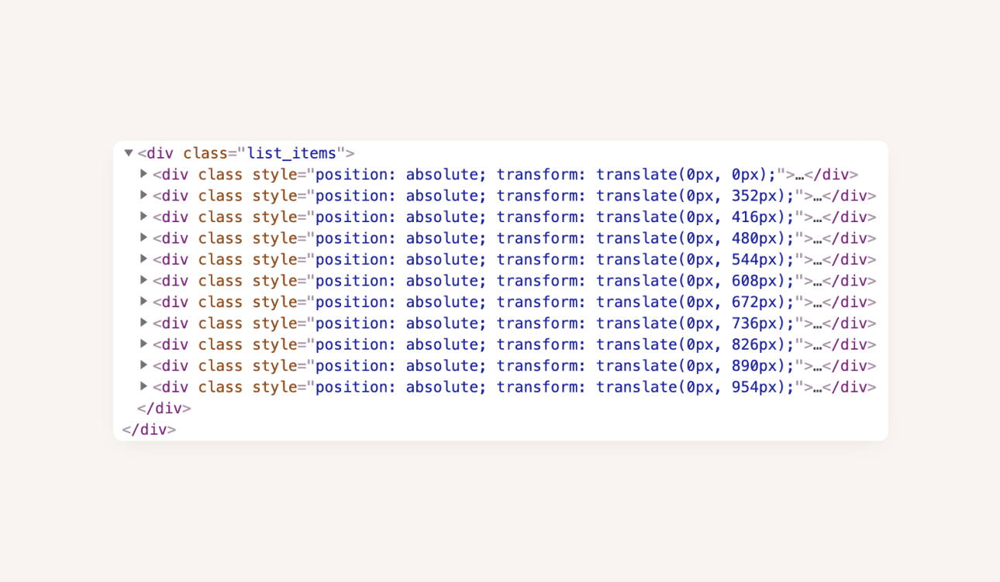
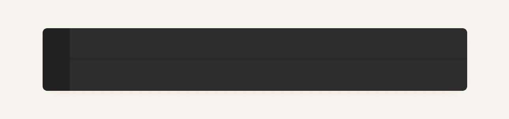
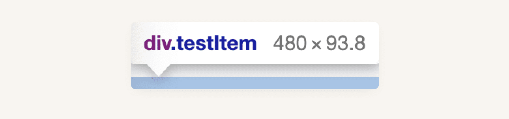
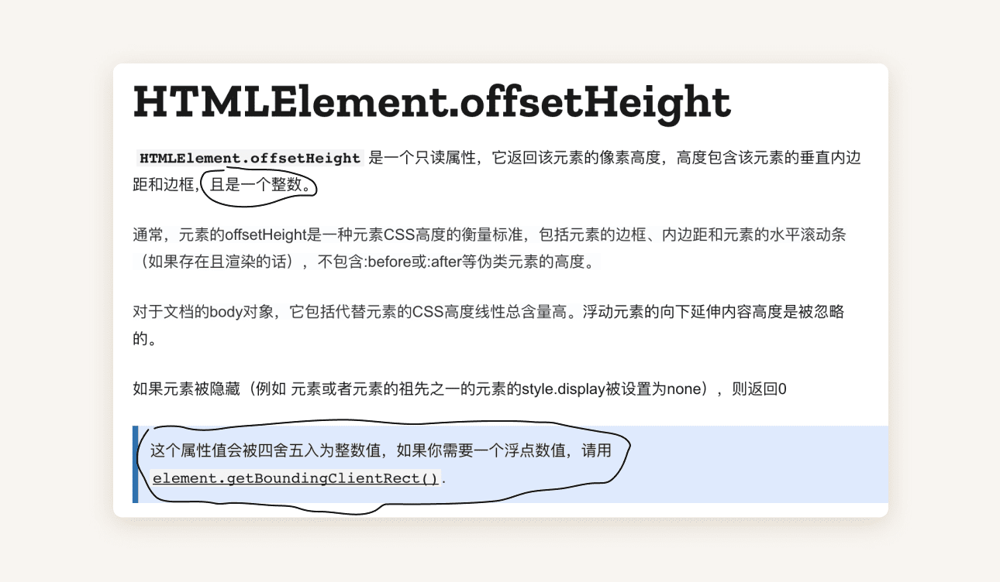

https://fehey.com/offsetheight-and-list/

## 名词

元素：指虚拟列表中的单个项目（Item）。
平移: 指 [CSS translate](https://developer.mozilla.org/zh-CN/docs/Web/CSS/transform-function/translate())。

## 背景

我在项目中有使用一个虚拟列表。简单概括是通过获取元素的 offsetHeight 然后通过 transform: translate 来实现的。



## 问题现象

通常情况下，这没有什么问题。但是当列表元素是变高且元素高度包含小数时，就出现了下面的问题，在 windows 使用了缩放情况下出现了可见缝隙。



## 原因

我在审查了实际的虚拟列表使用的平移值和实际的元素高度后，发现并不一致。这究竟是为什么呢？



（图为实际高度，平移高度是使用的 transform: translate(offsetHeight = 94px))



查阅文档发现，原来 offsetHeight 获取的元素高度只能是一个整数。这就表明，当实际的元素高度为小数时，就可能会计算错误，导致平移产生误差。从而可能会出现小于 1px 但视觉可见的缝隙。

我的元素内容时按照证书设置的样式（font-size、line-height、padding 等），为什么会产生小数呢？
经测试，缩放会对于字体字宽和字高产生微弱的影响，从而导致高度产生小数变化影响，当元素不包含文字内容时，高度没有发生变化。（当然其他情况下也可能会出现小数，例如使用了 vertical-align 等）

## 解决方案

根据前面的 MDN 文档，我们发现 getBoundingClientRect() 可以获取元素的精确高度，但是调用这个方法会造成列表重新布局，从而产生一定的性能损耗，尤其是如果有在列表 resize 事件监听中频繁调用此方法时，影响可能会越大（取决于实际场景）。

最后，我增加了一个 ::before 的 hack 来遮住这个缝隙。

```css
.item::before {
  content: '';
  display: block;
  width: 100%;
  height: 3px;
  background-color: #[tem background color];
  position: absolute;
  top: -2px;
}
```

## 另外一点

offsetHeight 获取的布局高度，getBoundingClientRect 获取的是渲染高度，当涉及到 [CSS scale()](https://developer.mozilla.org/zh-CN/docs/Web/CSS/transform-function/scale()) 时或许应当注意

如有错误，敬请勘正。